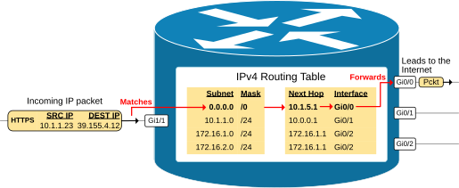
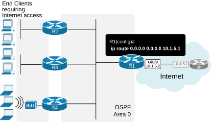
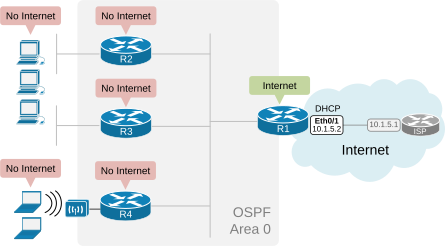
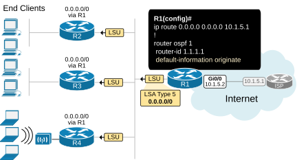
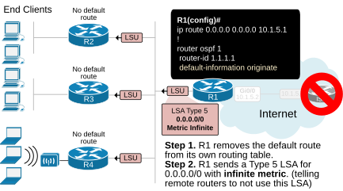
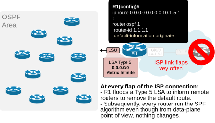

[OSPF Default Route](https://www.networkacademy.io/ccna/ospf/default-route)
==========

# OSPF Default Route

This lesson discusses the topic of originating a default route into the OSPF network. It is a capability of the routing protocol that is very commonly used in real-world deployment and is part of the CCNA exam topics that students must be familiar with.

At the end of the lesson, in the *Download* section, you can find the EVE-NG file we used to create this lesson so you can practice this topic in your home lab.

## What is a Default Route?

When a router receives an IP packet, it matches the destination IP address against its routing table. If the destination IP address matches an entry, the router forwards the traffic to the next hop. What happens **if the router cannot match the destination IP address** to any entry in the routing table - the router silently discards the packet.

Routers typically have a routing entry for every subnet within the organization. However, a router within the enterprise network typically **does not have an entry for every possible IPv4 address on the Internet**. There are approximately 3,723,362,304 publicly routable IPv4 addresses out there on the Internet. So, to be able to match and forward packets destined to every possible public Internet IP address, the router is configured with **a default route (0.0.0.0/0)** that matches every possible IP address. If a packet's destination IP address does not match any specific entry in the routing table, it matches the default route and is forwarded to the default next-hop.

Let's go through the example shown in the diagram below.



Figure 1. What is a Default Route?

The router receives a packet destined to 39.155.4.12. This IPv4 address does not match any routing table entries, so it is matched against the default route 0.0.0.0/0 and forwarded to the next hop 10.1.5.1 out of interface GigabitEthrenet0/0. The default route is a catch-all entry.

In a typical small or medium-sized enterprise network, the default route often points to the ISP's gateway router. In larger networks, it typically directs the traffic towards central firewalls or other security devices for inspection and then out to the Internet.

## Why does the network need a default route?

Let's look at the example shown in the diagram below. On one side, end hosts connect to local routers participating in an OSPF Area 0. On the other side, we have router R1 that connects to an Internet Service Provider (ISP) that provides connectivity to the Internet. R1 has a default route pointing to the ISP's next-hop IP address. We must ensure that end hosts can access the Internet.



Figure 2. Why do we need to advertise a default route?

As of this moment, end hosts cannot access the Internet. When an end host sends a packet destined for the Internet, the local router does not have an entry in the routing table for the destination IP address and discards the packet.

## Originating Default Route into OSPF

To provide Internet access to the OSPF network, a router that connects to the Internet must originate a default route into the OSPF domain. This is accomplished using the **default-information originate** command.

### Lab Initial State

Let's quickly go through the lab's initial state. We have R1 connecting to the Internet Service Provider (ISP). R1 has a static route 0.0.0.0/0 that points to the ISP via interface Eth0/1, as shown in the diagram below.



Figure 3. Lab Initial State

Let's verify that R1 has a default (0.0.0.0/0) and has access to the Internet.

```plaintext
R1# sh ip route static
Codes: L - local, C - connected, S - static, R - RIP, M - mobile, B - BGP
       D - EIGRP, EX - EIGRP external, O - OSPF, IA - OSPF inter area 
       N1 - OSPF NSSA external type 1, N2 - OSPF NSSA external type 2
       E1 - OSPF external type 1, E2 - OSPF external type 2, m - OMP
       n - NAT, Ni - NAT inside, No - NAT outside, Nd - NAT DIA
       i - IS-IS, su - IS-IS summary, L1 - IS-IS level-1, L2 - IS-IS level-2
       ia - IS-IS inter area, * - candidate default, U - per-user static route
       H - NHRP, G - NHRP registered, g - NHRP registration summary
       o - ODR, P - periodic downloaded static route, l - LISP
       a - application route
       + - replicated route, % - next hop override, p - overrides from PfR
       & - replicated local route overrides by connected
Gateway of last resort is 10.1.5.1 to network 0.0.0.0
S*    0.0.0.0/0 [254/0] via 10.1.5.1
```

You can see in the routing table that R1 indeed has a default route, and you can see below that it can ping Google's IP address (hence, there is Internet access).

```plaintext
R1# ping google.com
Type escape sequence to abort.
Sending 5, 100-byte ICMP Echos to 142.250.187.174, timeout is 2 seconds:
!!!!!
Success rate is 100 percent (5/5), round-trip min/avg/max = 1/1/2 ms
```

Now, let's verify that the other routers don't have an entry in the routing table for 0.0.0.0/0. If we check the routing table of R2, we can see that the "Gateway of last resort is not set."

```plaintext
R2# sh ip route ospf
Codes: L - local, C - connected, S - static, R - RIP, M - mobile, B - BGP
       D - EIGRP, EX - EIGRP external, O - OSPF, IA - OSPF inter area 
       N1 - OSPF NSSA external type 1, N2 - OSPF NSSA external type 2
       E1 - OSPF external type 1, E2 - OSPF external type 2, m - OMP
       n - NAT, Ni - NAT inside, No - NAT outside, Nd - NAT DIA
       i - IS-IS, su - IS-IS summary, L1 - IS-IS level-1, L2 - IS-IS level-2
       ia - IS-IS inter area, * - candidate default, U - per-user static route
       H - NHRP, G - NHRP registered, g - NHRP registration summary
       o - ODR, P - periodic downloaded static route, l - LISP
       a - application route
       + - replicated route, % - next hop override, p - overrides from PfR
       & - replicated local route overrides by connected
Gateway of last resort is not set
      10.0.0.0/8 is variably subnetted, 6 subnets, 2 masks
O        10.3.0.0/24 [110/11] via 10.1.1.3, 00:01:13, Ethernet0/0
O        10.4.0.0/24 [110/11] via 10.1.1.4, 00:01:00, Ethernet0/0
```

Also, we can see that R2 cannot resolve Google's IP address and cannot ping Google's DNS server. Hence, no Internet access.

```plaintext
R2# ping google.com
% Unrecognized host or address, or protocol not running.
R2# ping 8.8.8.8
Type escape sequence to abort.
Sending 5, 100-byte ICMP Echos to 8.8.8.8, timeout is 2 seconds:
.....
Success rate is 0 percent (0/5)
```

Now, let's see how we can advertise a default route into the network so that all routers are able to access the Internet.

### OSPF Default-Information Originate

First, remember that even if an OSPF router has a default route (0.0.0.0/0), it does not, by default, advertise it into the OSPF domain. For example, R1 has a static default toward the ISP but does not advertise it to the other routers - R2, R3, and R4.

For the OSPF router to advertise the default route into the network, a network administrator must explicitly configure the **default-information originate** command under the routing process, as shown in the diagram below.



Figure 4. OSPF Default Information Originate

When the **default-information originate** command is configured, the router immediately sends a Type 5 LSA advertising that it provides connectivity to network 0.0.0.0 mask 0.0.0.0. Simply put, R1 tells other routers - "If you don't have a more specific route to a destination IP address, send the packet to me." When sending a Type 5 LSA, R1 becomes an ASBR (Autonomous System Boundary Router). ASBR is a router that connects an OSPF autonomous system (AS) to other external networks. In our example, R1 connects to the Internet Service Provider. Hence, R1 connects to an external network.

We will discuss the different types of LSAs and router roles further in the course. However, for now just remember that Type 5 is "AS External LSA", used to advertise external routes, including default routes.

Let's verify that the other routers receive the Type 5 LSA. We can check this by looking at the LSDB database of R2, for example, using the following command. Notice that the advertising router is 1.1.1.1 (R1), the link ID is 0.0.0.0, and the network mask is /0 (hence 0.0.0.0/0).

```plaintext
R2# sh ip ospf database external 
            OSPF Router with ID (2.2.2.2) (Process ID 1)
                Type-5 AS External Link States
  LS age: 9
  Options: (No TOS-capability, DC, Upward)
  LS Type: AS External Link
  Link State ID: 0.0.0.0 (External Network Number )
  Advertising Router: 1.1.1.1
  LS Seq Number: 80000007
  Checksum: 0x1197
  Length: 36
  Network Mask: /0
        Metric Type: 2 (Larger than any link state path)
        MTID: 0 
        Metric: 1 
        Forward Address: 0.0.0.0
        External Route Tag: 1
```

Now, if we check the routing table of R2, we see that it has a default route that points to router R1.

```plaintext
R2# sh ip route ospf
Codes: L - local, C - connected, S - static, R - RIP, M - mobile, B - BGP
       D - EIGRP, EX - EIGRP external, O - OSPF, IA - OSPF inter area 
       N1 - OSPF NSSA external type 1, N2 - OSPF NSSA external type 2
       E1 - OSPF external type 1, E2 - OSPF external type 2, m - OMP
       n - NAT, Ni - NAT inside, No - NAT outside, Nd - NAT DIA
       i - IS-IS, su - IS-IS summary, L1 - IS-IS level-1, L2 - IS-IS level-2
       ia - IS-IS inter area, * - candidate default, U - per-user static route
       H - NHRP, G - NHRP registered, g - NHRP registration summary
       o - ODR, P - periodic downloaded static route, l - LISP
       a - application route
       + - replicated route, % - next hop override, p - overrides from PfR
       & - replicated local route overrides by connected
Gateway of last resort is 10.1.1.1 to network 0.0.0.0
O*E2  0.0.0.0/0 [110/1] via 10.1.1.1, 03:20:32, Ethernet0/0
      10.0.0.0/8 is variably subnetted, 6 subnets, 2 masks
O        10.3.0.0/24 [110/11] via 10.1.1.3, 03:22:53, Ethernet0/0
O        10.4.0.0/24 [110/11] via 10.1.1.4, 03:22:53, Ethernet0/0
```

And the ultimate test is to verify that R2 has a connection to the Internet by pinging Google.

```plaintext
R2# ping google.com
Type escape sequence to abort.
Sending 5, 100-byte ICMP Echos to 142.250.187.174, timeout is 2 seconds:
!!!!!
Success rate is 100 percent (5/5), round-trip min/avg/max = 2/2/3 ms
```

### What happens when R1 loses connection to the ISP?

Now, let's quickly see what happens when R1's connection to the ISP goes down. The following diagram shows the two steps that R1 takes when the connectivity to the Internet Service Provider goes down.



Figure 5. R1's link to the ISP goes down.

- First, the router removes the default route from its own routing table.
- Then, it sends out an LSA update to the remote router. The update is a Type 5 LSA for 0.0.0.0 with the metric value set to infinity (16,777,215). This tells remote routers to not use this LSA.
    - Subsequently, the remote routers remove the 0.0.0.0/0 entries from their routing tables.

However, this behavior can be changed using a keyword argument "always" in the **default-information originate** command.

### Default-Information Originate Always

Using the **default-information originate** command makes the ASBR router (in our case, R1) advertise a default conditionally.

- If it has a default on its own, it advertises the 0.0.0.0/0 in the network.
- If it doesn't have a default on its own, it doesn't advertise the 0.0.0.0 route into the network.

In some scenarios, this conditional advertisement may not be beneficial. That's why the protocol has an additional keyword, **"always,"** which makes the originating unconditional. Using the **default-information originate always** command makes the ASBR advertise a default route into the OSPF domain regardless of whether there is an existing default in its routing table. The advertisement is unconditional.

There are two common scenarios when you want to do this:

- Routing stability.
- Pulling traffic to a centralized point of the network.

Let's discuss each one of them.

#### Scenario 1: Routing stability

Imagine that R1 is the only router that connects to the Internet Service Provider. R1 originates a default into the network, and 100+ remote routers use R1 as the next hop to the Internet, as shown in the following diagram.



Figure 6. Default-Information Originate Always - Scenario 1

When you use the **default-information originate** command without the **always** keyword, the entire area of 100+ routers must run the SPF algorithm every time the link to the ISP flaps. The diagram explains why. If the ISP link is unstable and often flaps, routing instabilities in the entire area may occur. If the ISP link starts flapping very aggressively, it may even bring down the entire area. Especially back in the old days when routers had one very slow CPU and a few MB of RAM. (have in mind the routing protocol is 30+ years old)

So, in short, **you don't want to be in one fault domain with the ISP**. You want problems in the ISP network to not affect your internal network by any means. That's why in such scenarios, it may be beneficial to use the **always** keyword under the **default-information originate** command.

#### Scenario 2: ISP redundancy

Now let's consider another scenario. You have two routers, R1 and R2, both connected to two different ISPs for redundancy. Both routers originate a default route into the OSPF domain.

Without the **always** keyword, if R1 loses its connection to ISP-A, it stops originating the default route into OSPF. All routers in the network then use R2's default route to ISP-B. This is the expected behavior.

However, if you use the **always** keyword on both R1 and R2, they will both keep advertising a default route even if their ISP links go down. Traffic would then be forwarded to a router that has no working Internet connection, causing a black hole. In this scenario, you should NOT use the **always** keyword.

Let's visualize both scenarios side by side.

| Scenario | always keyword | ISP link flaps | Effect |
|----------|---------------|----------------|--------|
| Single ISP connection | Use **always** | Link flaps don't trigger SPF in the internal network | Better stability |
| Dual ISP for redundancy | Do **not** use always | Only the router with the working link originates the default | Proper failover |

## Configuring a static default route

Before you can propagate a default route into OSPF, you need a default route in the router's routing table. This is typically a static route pointing to the ISP's next-hop IP.

```plaintext
R1(config)# ip route 0.0.0.0 0.0.0.0 203.0.113.1
```

This creates a static default route that sends all traffic to the ISP router at 203.0.113.1.

## Verifying the default route

After configuring the default route and OSPF redistribution, verify it.

**Check the routing table:**

```plaintext
R1# show ip route
Gateway of last resort is 203.0.113.1 to network 0.0.0.0

O*E2 0.0.0.0/0 [110/1] via 10.1.1.2, 00:12:34, GigabitEthernet0/0
```

Notice the `O*E2` code:
- **O** — OSPF
- **\*** — Candidate default route
- **E2** — External Type 2 route (default metric type)

**Check the OSPF database for Type 5 LSA:**

```plaintext
R1# show ip ospf database external

            OSPF Router with ID 10.0.0.1 (Process ID 1)

                Type-5 AS External Link States

Link ID         ADV Router      Age         Seq#       Checksum Tag
0.0.0.0         10.0.0.2        45          0x80000001 0x005E12 0
```

The Link ID 0.0.0.0 indicates this is a default route (0.0.0.0/0).

## Metric and Metric Type

When originating a default route into OSPF, you can control its metric.

```plaintext
R1(config)# router ospf 1
R1(config-router)# default-information originate always metric 10 metric-type 1
```

- **metric** — Sets the cost of the default route. Default is 1 for Type 2 and 20 for Type 1.
- **metric-type** — Can be 1 (E1) or 2 (E2). Type 2 (default) does not add internal OSPF costs to the external metric. Type 1 adds the internal cost, so routers farther from the originator will see a higher metric.

For most designs, the default metric-type 2 is sufficient.

## Summary

- A **default route** (0.0.0.0/0) is used by routers when no specific route matches the destination.
- Use **default-information originate** in OSPF to propagate a default route from an ASBR into the OSPF domain.
- The **always** keyword forces OSPF to advertise the default even if the router doesn't have one in its routing table.
- Use the **always** keyword for **single-homed** connections (one ISP) to prevent SPF instability when the ISP link flaps.
- Do **not** use the **always** keyword in **dual-homed** designs, or traffic may be black-holed.
- The default route appears in the routing table as `O*E2` (OSPF external Type 2).
