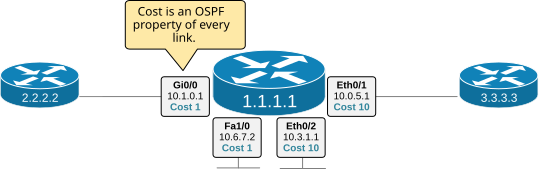
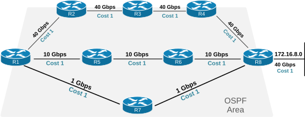
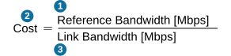
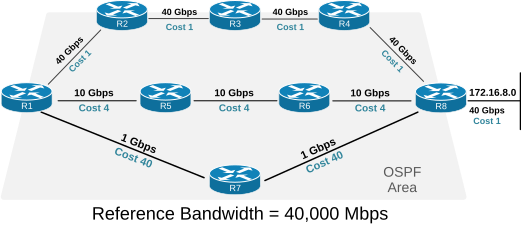

[OSPF Metric - Cost](https://www.networkacademy.io/ccna/ospf/ospf-metric-cost)
==========

# OSPF Metric - Cost

This lesson discusses how OSPF determines the best paths to destinations using its metric called "OSPF Cost". It is a fundamental concept of the operation of the link-state routing protocol that is important for CCNA candidates to understand well.

In the Download section at the end of the lesson, you can find the EVE-NG file, which you can use to practice OSPF traffic engineering by manipulating the Cost of different paths.

## What is OSPF Cost?

Every dynamic routing protocol, such as OSPF, has a way to compare different paths to a destination and determine which one is best. Every protocol uses different methods of comparison based on different metric systems. **OSPF uses a metric called OSPF Cost** based on each hop's outgoing interface bandwidth.

Every router calculates the Cost of every OSPF-enabled link using a formula we will see later. The cost is a property of every link, as shown in the diagram below.



Figure 1. What is OSPF Cost?

Every router then advertises the Cost of each link as part of the LSA Type 1 advertisement to neighbors. Since all routers within an area have all LSAs - in the end, **all routers know the cost of all links in the area**.

For example, let's look at the LSA Type 1 advertisement for the router shown in Figure 1. Notice that in the LSA advertisement, the router describes its four links. The IP address, Subnet Mask, and Cost are properties of each link (highlighted in blue). Notice that the cost is called "Metric" in this output, but in the next output, it is called "Cost." Both terms are interchangeable and mean the same thing. The most commonly used term is Cost.

```plaintext
R1# sh ip ospf database router 1.1.1.1
            OSPF Router with ID (1.1.1.1) (Process ID 1)
                Router Link States (Area 0)
  LS age: 277
  Options: (No TOS-capability, DC)
  LS Type: Router Links
  Link State ID: 1.1.1.1
  Advertising Router: 1.1.1.1
  LS Seq Number: 80000021
  Checksum: 0xB6A0
  Length: 72
  Number of Links: 4
    Link connected to: a Stub Network
     (Link ID) Network/subnet number: 10.6.7.0
     (Link Data) Network Mask: 255.255.255.0
      Number of MTID metrics: 0
       TOS 0 Metrics: 1
    Link connected to: a Stub Network
     (Link ID) Network/subnet number: 10.3.1.0
     (Link Data) Network Mask: 255.255.255.0
      Number of MTID metrics: 0
       TOS 0 Metrics: 10
    Link connected to: a Transit Network
     (Link ID) Designated Router address: 10.1.0.1
     (Link Data) Router Interface address: 10.1.0.1
      Number of MTID metrics: 0
       TOS 0 Metrics: 1
    Link connected to: a Transit Network
     (Link ID) Designated Router address: 10.0.5.1
     (Link Data) Router Interface address: 10.0.5.1
      Number of MTID metrics: 0
       TOS 0 Metrics: 10
```

The cost of each interface can also be revealed using the **show ip ospf interface brief** command, as shown in the output below.

```plaintext
R1# sh ip ospf interface brief
Interface    PID   Area            IP Address/Mask    Cost  State Nbrs F/C
Lo0          1     0               172.16.1.1/24      1     P2P   0/0
Gi0/0        1     0               10.1.3.1/24        1     DR    1/1
Fa1/0        1     0               10.1.2.1/24        1     P2P   0/0
Et0/1        1     0               10.1.1.1/24        10    DR    1/1
Et0/2        1     0               10.1.1.1/24        10    P2P   0/0
```

Notice that the cost is an OSPF property of every interface participating in the routing process. Now, let's see how the cost is calculated.

## OSPF Cost Formula

The OSPF cost is calculated based on the bandwidth of the interface using the formula:


Figure 2. OSPF Cost Formula

By default, the **Reference Bandwidth is 100 Mbps**. The Link Bandwidth is the actual bandwidth of the interface (in bits per second). Using the default Reference Bandwidth, we can calculate the cost of the following interface types:

**Interface** | **Formula [Mbps]** | **Cost**
--- | --- | ---
DSL (768 Kbps) | 100/0.768 | 133
DS1 (1.544 Mbps) | 100/1.544 | 64
Ethernet (10 Mbps) | 100/10 | 10
FastEthernet (100 Mbps) | 100/100 | 1
GigabitEthernet (1 Gbps) | 100/1000 | 1
TenGigabitEthernet (10 Gbps) | 100/10000 | 1
40-GigabitEthernet (40 Gbps) | 100/40000 | 1
100-GigabitEthernet (100 Gbps) | 100/100000 | 1

Notice that when the interface bandwidth is greater than the reference bandwidth, the value is rounded to 1. For example, in the case of a 1Gbps interface - the cost is calculated as 100/1000, which is 0.1, but it is rounded to Cost 1.

From the table, it is obvious that **every high-speed interface has the same Cost of 1**. That's because the default Reference Bandwidth value of 100Mbps was set back in a time when interface speeds rarely surpassed 10 Mbps. However, even 100Mbps is considered slow by today's network standards.

## How does OSPF Cost work?

OSPF calculates the sum of the costs for all outgoing interfaces in a path to a destination. Then, it compares the sum of each available path to the destination and **chooses the route with the lowest total cost**.

Let's take the following diagram as an example. There are three possible paths from R1 to subnet 172.16.8.0/24.


Figure 3. Initial Topology

The following table compares the sum of the cost of the outgoing interfaces of each path.

**Route** | **Total Cost** [lower is better]
--- | ---
R1-R2-R3-R4-R5-R8 | 50
R1-R5-R6-R8 | 40
R1-R7-R8 | 30 (best)

As a result, R1 adds the route via R7 to its routing table as best for destination 172.16.8.0/24.

```plaintext
R1# sh ip route 172.16.8.0
Routing entry for 172.16.8.0/24
  Known via "ospf 1", distance 110, metric 30, type intra area
  Last update from 10.1.3.2 on Ethernet0/2, 00:00:03 ago
  Routing Descriptor Blocks:
  * 10.1.3.2, from 8.8.8.8, 00:00:03 ago, via Ethernet0/2
      Route metric is 30, traffic share count is 1
```

Using this technique, the link state protocol chooses the best routes to every destination in the network. It worked well in the old days when the typical interface speed was less than 100Mbps. However, since the default Reference Bandwidth value is 100Mbps, **all high-speed links have the same cost of 1**. This creates the following issue in today's high-speed networks.

Look at the diagram below. Which path to destination 172.16.8.0/24 will R1 choose as best? Which one do you think is actually the best path?



Figure 4. The issue with high-speed interfaces.

Let's compare the three available routes to 172.16.8.0/24 in the context of the link state protocol.

**Path** | **Total Cost** [lower is better]
--- | ---
R1-R2-R3-R4-R5-R8 | 5
R1-R5-R6-R8 | 4
R1-R7-R8 | 3 (best)

According to the default OSPF best-path algorithm, the path R1-R7-R8 is the best to 172.16.8.0/24. However, is it really?

If you look at the diagram again, you can easily figure out that you can send 40 Gbps over the path via R2-R3-R4-R8. Also, you can transmit 10 Gbps via R5-R6-R8. However, over the path via R7-R8, you can only transfer 1Gbps, so the path that OSPF has chosen as best **is actually the slowest of the three**.

The problem is that because of the default reference bandwidth of 100Mbps, the calculated cost of every link is 1. Fortunately, the protocol was designed to account for that and allow us to change the reference bandwidth. Let's see how.

## Manipulating the OSPF Cost

Since the metric formula has three components, there are three ways to manipulate the OSPF cost of links, as shown in the diagram below.



Figure 5. Three ways to manipulate the OSPF Cost

1. You can change the Reference Bandwidth value of a router.
2. You can directly change the OSPF cost of a particular link.
3. You can change the Link Bandwidth of a particular link.

Generally, each method is used to achieve different objectives. Let's walk through each one and see when and how to use it.

### Method 1. The Reference Bandwidth

Cisco **set the Reference Bandwidth to 100Mbps decades ago** when interface speeds barely surpassed 10 Mbps. Back then, the cost formula worked great. However, nowadays, if OSPF uses the default value, it treats a 100Mbps interface as having the same cost as a 40 Gbps interface, which is obviously not right from the best-path algorithm perspective. To account for that, Cisco IOS routers allow us to change the Reference Bandwidth value, as shown in the output below.

```plaintext
R1# conf t
Enter configuration commands, one per line.  End with CNTL/Z
R1(config)# router ospf 1
R1(config-router)# auto-cost reference-bandwidth ?
  <1-4294967>  The reference bandwidth in terms of Mbits per second
R1(config-router)# auto-cost reference-bandwidth 40000
% OSPF: Reference bandwidth is changed.
        Please ensure reference bandwidth is consistent across all routers.
R1(config-router)# end
R1#
```

The configuration change is made per device and takes effect immediately. Once we configure the Reference Bandwidth to 40,000 Mbps (40Gbps), the formula changes, as shown in the diagram below.


Figure 6. Reference Bandwidth set to 40 Gbps.

The result of this change is shown in the following table. The routing protocol can now differentiate that a 100Mbps link is slower than a 10 Gbps link, which leads to a more optimal best-path selection.

**Interface** | **Formula [Mbps]** | **Cost**
--- | --- | ---
DSL (768 Kbps) | 40000/0.768 | 52084
DS1 (1.544 Mbps) | 40000/1.544 | 25907
Ethernet (10 Mbps) | 40000/10 | 4000
FastEthernet (100 Mbps) | 40000/100 | 400
GigabitEthernet (1 Gbps) | 40000/1000 | 40
TenGigabitEthernet (10 Gbps) | 40000/10000 | 4
40-GigabitEthernet (40 Gbps) | 40000/40000 | 1
100-GigabitEthernet (100 Gbps) | 40000/100000 | 1

Now, let's see what happens when configuring this on every router in the topology (the change is performed per device).

```plaintext
! We apply this to every router - R1 through R8
router ospf 1
 auto-cost reference-bandwidth 40000
```

The following diagram reflects the new link metric when the Reference Bandwidth value is set to 40,000 Mbps on every router in the topology.



Figure 7. Best path selection with reference bandwidth set to 40Gbps

Now, the routing protocol calculates the following values for each of the three available paths from R1 to 172.16.8.0/24.

**Path** | **Total Cost** [lower is better]
--- | ---
R1-R2-R3-R4-R5-R8 | 5 (best)
R1-R5-R6-R8 | 13
R1-R7-R8 | 81

You can see that now the best route is via R2-R3-R4-R8, which is indeed the fastest possible path to the destination because it allows end-to-end data transmission at a 40 Gbps rate.

There are two very important recommendations when it comes to the OSPF Reference Bandwidth:

- Set the Reference Bandwidth to a value **equal to the fastest link** in the network.
    - For example, if the fastest link in the domain is 40 Gbps, you set the Reference Bandwidth to 40 Gbps.
- Ensure that all routers in the network are configured with the same **auto-cost reference-bandwidth** value.
    - Since the auto-cost reference-bandwidth value is configured on each device separately, changing it across the entire network is susceptible to misconfiguration. For example, you can forget to reconfigure one of the devices, which stays with the default value of 100Mbps. This can lead to suboptimal routing. Always ensure that every device is configured with the same reference bandwidth.

### Method 2. The interface subcommand

There is another more granular and direct way to manipulate the cost of a link. We can directly configure it under the interface configuration level, as shown in the output below:

```plaintext
R1(config)# interface GigabitEthernet0/0
R1(config-if)# ip ospf cost 10
```

This command manually sets the OSPF cost of this interface to 10, regardless of the interface bandwidth. This is the most direct way to control OSPF cost and overrides the auto-cost calculation.

**When to use this method:**
- When you want a specific interface to have a specific cost regardless of speed.
- When link speed doesn't reflect the actual path preference you want.
- For traffic engineering — making certain paths more or less preferred.

### Method 3. Changing the interface bandwidth

OSPF derives the default cost from the interface's configured bandwidth. You can change the bandwidth value, and OSPF will adjust the cost accordingly.

```plaintext
R1(config)# interface GigabitEthernet0/0
R1(config-if)# bandwidth 1000000
```

This sets the bandwidth to 1,000,000 kbps (1 Gbps). OSPF recalculates the cost as 100,000,000 / 1,000,000 = 100.

**Warning:** The `bandwidth` command does not change the actual speed of the interface — it only affects how OSPF (and other protocols like EIGRP) calculates metrics. Changing it may confuse other network engineers and is generally not recommended. Use `ip ospf cost` instead for clarity.

### Comparing the methods

| Method | Command | Scope | Override |
|--------|---------|-------|----------|
| 1. Reference bandwidth | `auto-cost reference-bandwidth 10000` | Global (all interfaces) | Default calculation |
| 2. Interface cost | `ip ospf cost 10` | Per interface | Methods 1 and 3 |
| 3. Interface bandwidth | `bandwidth 1000000` | Per interface | Method 1 only |

Method 2 (ip ospf cost) has the highest priority. If you set it on an interface, it overrides all other cost calculations.

## Verifying OSPF Cost

**Show cost for a specific interface:**

```plaintext
R1# show ip ospf interface GigabitEthernet0/0
GigabitEthernet0/0 is up, line protocol is up
  Internet Address 10.1.1.1/24, Area 0
  Process ID 1, Router ID 10.0.0.1, Network Type BROADCAST, Cost: 10
```

The Cost field shows the OSPF cost for this interface.

**Show the OSPF routing table with costs:**

```plaintext
R1# show ip route ospf
O    10.0.1.0/24 [110/20] via 10.1.1.2, 00:12:34, GigabitEthernet0/0
```

The `[110/20]` shows the administrative distance (110) followed by the total OSPF cost (20) to reach the destination.

**Show all interfaces with their OSPF costs:**

```plaintext
R1# show ip ospf interface brief
Interface    PID   Area            IP Address/Mask    Cost  State Nbrs F/C
Gi0/0        1     0               10.1.1.1/24        10    DR    2/2
Gi0/1        1     0               10.1.2.1/24        1     DR    1/1
Se0/0/0      1     0               10.1.3.1/30        64    P2P   1/1
```

## Summary

- **OSPF cost** is the metric used to determine the best path. Lower cost = better path.
- The default formula is **Cost = Reference Bandwidth (100 Mbps) / Interface Bandwidth**.
- Because the default reference bandwidth is 100 Mbps, links faster than 100 Mbps (like Gigabit Ethernet) all get a cost of 1 by default, making them appear equal.
- To fix this, change the **Reference Bandwidth** globally with `auto-cost reference-bandwidth`.
- You can also set the cost **per interface** with `ip ospf cost`, which overrides all other methods.
- The `bandwidth` command changes the interface bandwidth, which indirectly changes the OSPF cost, but this method is not recommended.
- Verify costs with `show ip ospf interface`, `show ip route ospf`, and `show ip ospf interface brief`.
