[LSA Types 1 2 and 3](https://www.networkacademy.io/ccna/ospf/lsa-types-1-2-3)
==========

# LSA Types 1,2 and 3

OSPF learns the topology by exchanging link-state advertisements (LSAs). Engineers preparing for the CCNA exam are often intimidated by the LSA concept and either do not invest enough time to understand it fully or skip it altogether. However, understanding the different types of LSAs leads to a better understanding of the protocol operation. In this lesson, we explain LSA Types 1, 2, and 3 in an easily understandable way.

At the end of the lesson, in the *Download* section, you can find the EVE-NG file, which you can use to practice the concepts on your own.

## What are the main building blocks of an OSPF area?

Let's look at the basic topology shown in the diagram below, which we are going to use as a context in the upcoming LSA examples. What are the two building blocks of the topology that you can clearly distinguish?

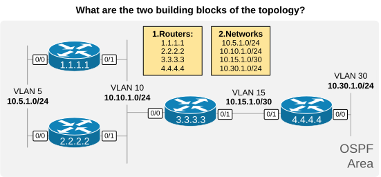

Figure 1. Main building blocks of an OSPF Area

In the context of a routing protocol, the topology includes two main components: **routers with links** and **networks** between the routers. Well, these are the first two LSA types that OSPF uses to build the topology inside an area:

- **LSA Type 1** (called Router LSA) for each device in the area.
- **LSA Type 2** (called Network LSA) for each network with an elected DR and at least one neighbor.

Let's walk through each link-state advertisement type in more detail and see how it fits in the bigger picture.

### LSA Type 1 - Router LSA

Every OSPF device creates a Router LSA for itself and sends it to all neighbors inside the area, as shown in the diagram below. The LSA is flooded until every device in the area has a copy.

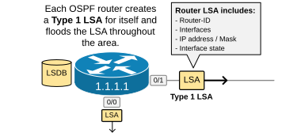

Figure 2. LSA Type 1 - Router LSA

The Router LSA is uniquely identified by the RID of the originating device and includes the following information:

- The RID.
- The router's own interfaces.
- IP addresses / Mask.
- Cost of the interface.
- Current interface status.

Every OSPF device creates and floods its own Router LSA inside the area, ensuring that all devices know the same LSAs. In other words, the process ensures that everyone inside an area knows about every OSPF device and its links, as shown in the diagram below.

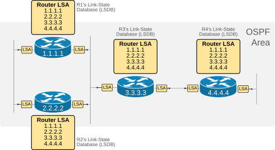

Figure 3. All routers inside an area have all Router LSAs

Notice that the link-state database (LSDB) of every device in the area contains one Router LSA per device.

### Router LSA - Show Commands

Now, to fully understand the Router LSA concept, let's reconstruct the topology only by looking at one of the router's link-state databases (LSDB). Since all devices are in the same area, they have identical LSDB databases, so it doesn't matter which one we are looking at.

Let's assume that we know nothing about the topology.

First, using the **show ip ospf database** command, we can see a summary of all router LSAs. It shows us that there are four devices in the area, which is actually Area 0, as highlighted in blue.

```plaintext
R1# sh ip ospf database 

            OSPF Router with ID (1.1.1.1) (Process ID 1)
            
                Router Link States (Area 0)
Link ID         ADV Router      Age         Seq#       Checksum Link count
1.1.1.1         1.1.1.1         1567        0x80000016 0x005052 2         
2.2.2.2         2.2.2.2         1560        0x80000018 0x00286E 2         
3.3.3.3         3.3.3.3         580         0x8000001B 0x00EE64 3         
4.4.4.4         4.4.4.4         581         0x80000010 0x0087D7 3    
     
                Net Link States (Area 0)
Link ID         ADV Router      Age         Seq#       Checksum
10.5.1.2        2.2.2.2         1576        0x80000001 0x00FB18
10.10.1.3       3.3.3.3         1573        0x80000002 0x0044B4
```

So, we first learn that Area 0 has 4 routers. Okay, now let's look at each router LSA in detail.

Using the following command, we check the content of R1's router LSA. Let's see what information it can give us.

```plaintext
R1# show ip ospf database router 1.1.1.1

            OSPF Router with ID (1.1.1.1) (Process ID 1)
            
                Router Link States (Area 0)
                
  LS age: 1771
  Options: (No TOS-capability, DC)
  LS Type: Router Links
  Link State ID: 1.1.1.1
  Advertising Router: 1.1.1.1
  LS Seq Number: 80000016
  Checksum: 0x5052
  Length: 48
  Number of Links: 2
    Link connected to: a Transit Network
     (Link ID) Designated Router address: 10.10.1.3
     (Link Data) Router Interface address: 10.10.1.1
      Number of MTID metrics: 0
       TOS 0 Metrics: 10
    Link connected to: a Transit Network
     (Link ID) Designated Router address: 10.5.1.2
     (Link Data) Router Interface address: 10.5.1.1
      Number of MTID metrics: 0
       TOS 0 Metrics: 10
```

We can learn that R1 has two interfaces that connect to two "Transit Networks." We can also see the IP addresses of each interface and the OSPF cost. Therefore, we can reconstruct the following topology from the information we have just learned.

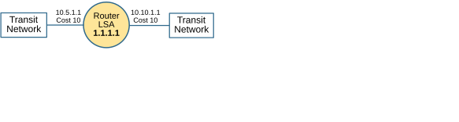

Figure 4. R1's Type1 LSA

Now, moving on, let's check the context of R2's router LSA using the following command.

```plaintext
R1# show ip ospf database router 2.2.2.2

            OSPF Router with ID (1.1.1.1) (Process ID 1)
            
                Router Link States (Area 0)
  LS age: 354
  Options: (No TOS-capability, DC)
  LS Type: Router Links
  Link State ID: 2.2.2.2
  Advertising Router: 2.2.2.2
  LS Seq Number: 8000001F
  Checksum: 0x1A75
  Length: 48
  Number of Links: 2
  
    Link connected to: a Transit Network
     (Link ID) Designated Router address: 10.10.1.3
     (Link Data) Router Interface address: 10.10.1.2
      Number of MTID metrics: 0
       TOS 0 Metrics: 10
    Link connected to: a Transit Network
     (Link ID) Designated Router address: 10.5.1.2
     (Link Data) Router Interface address: 10.5.1.2
      Number of MTID metrics: 0
       TOS 0 Metrics: 10
```

We learned that R2 also has two interfaces connected to the same two transit networks. We learned the IP addresses and cost of each interface. Therefore, we can draw the following diagram from the information we've got so far.

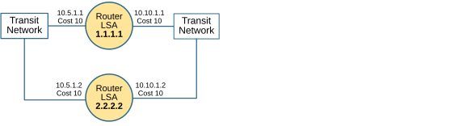

Figure 5. R1 and R2's Type 1 LSAs

Moving on, let's check the R3 database.

```plaintext
R1# show ip ospf database router 3.3.3.3

            OSPF Router with ID (1.1.1.1) (Process ID 1)
            
                Router Link States (Area 0)
  LS age: 1193
  Options: (No TOS-capability, DC)
  LS Type: Router Links
  Link State ID: 3.3.3.3
  Advertising Router: 3.3.3.3
  LS Seq Number: 80000021
  Checksum: 0xE26A
  Length: 60
  Number of Links: 3
  
    Link connected to: another Router (point-to-point)
     (Link ID) Neighboring Router ID: 4.4.4.4
     (Link Data) Router Interface address: 10.15.1.1
      Number of MTID metrics: 0
       TOS 0 Metrics: 10
    Link connected to: a Stub Network
     (Link ID) Network/subnet number: 10.15.1.0
     (Link Data) Network Mask: 255.255.255.252
      Number of MTID metrics: 0
       TOS 0 Metrics: 10
    Link connected to: a Transit Network
     (Link ID) Designated Router address: 10.10.1.3
     (Link Data) Router Interface address: 10.10.1.3
      Number of MTID metrics: 0
       TOS 0 Metrics: 10
```

The first two links represent the point-to-point connection to R4. Since the interface is configured with the **ip ospf network point-to-point** command, it is not a multiaccess interface, and that's why the output is different.

From the first link section, we can learn that this is a point-to-point connection that connects to neighbor 4.4.4.4. From the second link section, we learn the IP address / Mask of the P2P link. The third link section shows that R3 also connects to the transit network that R1 and R2 connect to.

Therefore, we can draw the following diagram from the information we have collected so far.

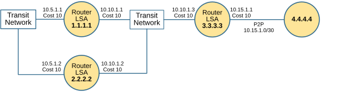

Figure 6. R1, R2 and R3's Type 1 LSAs

Lastly, let's check the link-state information of R4.

```plaintext
R1# show ip ospf database router 4.4.4.4

            OSPF Router with ID (1.1.1.1) (Process ID 1)
            
                Router Link States (Area 0)
  LS age: 1397
  Options: (No TOS-capability, DC)
  LS Type: Router Links
  Link State ID: 4.4.4.4
  Advertising Router: 4.4.4.4
  LS Seq Number: 80000016
  Checksum: 0x7BDD
  Length: 60
  Number of Links: 3
  
    Link connected to: another Router (point-to-point)
     (Link ID) Neighboring Router ID: 3.3.3.3
     (Link Data) Router Interface address: 10.15.1.2
      Number of MTID metrics: 0
       TOS 0 Metrics: 10
    Link connected to: a Stub Network
     (Link ID) Network/subnet number: 10.15.1.0
     (Link Data) Network Mask: 255.255.255.252
      Number of MTID metrics: 0
       TOS 0 Metrics: 10
    Link connected to: a Stub Network
     (Link ID) Network/subnet number: 10.30.1.0
     (Link Data) Network Mask: 255.255.255.0
      Number of MTID metrics: 0
       TOS 0 Metrics: 10
```

Notice that R4 has a point-to-point link connecting to R3. The second link represents the P2P subnet, and the third link is a different connection to a "Stub Network" 10.30.1.0/24.

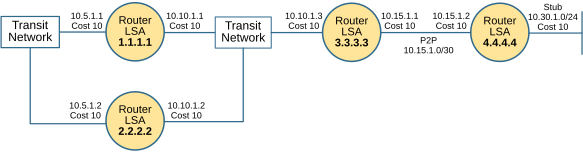

Figure 7. R1, R2, R3 and R4's Type 1 LSAs

We were able to reconstruct the entire topology by **only using the information from the Type 1 LSAs** in the link-state database of R1. If we compare the diagram above with the one in Figure 1, we can see they are pretty much the same. However, why then do we need to have LSA Type 2? - Because there is a problem we need to discuss.

## LSA Type 2 - Network LSA

OSPF uses an additional Link-state Advertisement Type 2 (called Network LSA) to construct multiaccess network segments like Ethernet VLAN.

```plaintext
R1# sh ip ospf database 

            OSPF Router with ID (1.1.1.1) (Process ID 1)
            
                Router Link States (Area 0)
Link ID         ADV Router      Age         Seq#       Checksum Link count
1.1.1.1         1.1.1.1         832         0x8000001D 0x004259 2         
2.2.2.2         2.2.2.2         941         0x8000001F 0x001A75 2         
3.3.3.3         3.3.3.3         1709        0x80000021 0x00E26A 3         
4.4.4.4         4.4.4.4         1816        0x80000016 0x007BDD 3     
    
                Net Link States (Area 0)
Link ID         ADV Router      Age         Seq#       Checksum
10.5.1.2        2.2.2.2         941         0x80000008 0x00ED1F
10.10.1.3       3.3.3.3         698         0x80000009 0x0036BB
```

In Type 1 Link-State Advertisement, there are two types of multiaccess networks - a "Transit Network" and a "Stub Network":

- A **Transit network** in OSPF is a network that can carry data between different OSPF routers. Essentially, it's a network segment that has a DR and at least one more OSPF neighbor. For example, transit networks in our topology are 10.5.1.0/24 and 10.10.1.0/24.
- A **Stub network** in OSPF does not forward traffic between OSPF routers. It only hosts endpoints directly connected to a single OSPF device, meaning it's a dead-end from the perspective of OSPF routing. For example, a stub network in our topology is 10.30.1.0/24.

When a multi-access segment is represented as a Transit Network, **it means that an LSA Type 2 exists** that lists all OSPF routers that connect to that segment. Let's see why.

### But why does OSPF need LSA Type 2?

Using the Router LSAs, we figured out that R1, R2, and R3 connect to a "Transit Network", as shown in the diagram below. But **how can we be 100% sure that the three routers really connect to the same multiaccess segment** - for example, to the same VLAN? Looking at the information available in the Router LSAs, can you be 100% sure? No, you can't be.

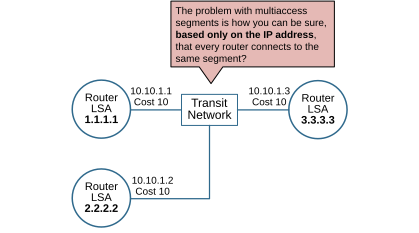

Figure 8. Why does OSPF need a Network LSA?

We concluded that all three routers connect to the same segment because they have IP addresses from the same network - R1 has 10.10.1.1, R2 has 10.10.1.2, and R3 has 10.10.1.3. But is this undeniable proof that they connect to the same VLAN?

No, it is not. The routers may be connected, as shown in the diagram below. Purely based on the IP addresses, you can't be sure whether they connect to the same multi-access network.

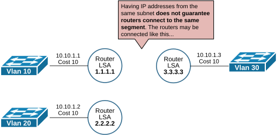

Figure 9. The routers may connect to different segments

That's why OSPF needs an additional link-state type that proves whether routers connect to the same multiaccess network. Otherwise, the routing process could create traffic black holes.

### How does the Network LSA solve the problem?

First, recall that on multiaccess networks such as a traditional Ethernet VLAN, OSPF routers elect a Designated Router (DR) and a Backup Designated Router (BDR) and **establish full adjacency only with the DR and the BDR**. If you don't know or recall what DR/BDR is, check out our [OSPF DR and BDR](https://www.networkacademy.io/ccna/ospf/dr-and-bdr) lesson.

The DR on any multiaccess segment **can undeniably tell which routers connect to that segment** because it establishes a full OSPF adjacency with them (which implies they have connectivity and exchange packets). Using this logic, the DR advertises an LSA Type 2, which lists all connected routers, as shown in the diagram below.

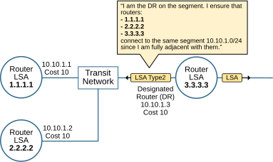

Figure 10. How does the Network LSA solve the problem?

This technique ensures that the topology reconstructed from the information in the Link-state Database is accurate and represents the actual physical connectivity.

In our example topology, there are two Transit Networks - 10.5.1.0/24 and 10.10.1.0/24. R3's interface 10.10.1.3 is the DR for network 10.10.1.0/24. If we look at the **Network LSA** that R3 creates and floods for that network, we can see the three routers that connect to the segment (highlighted in blue).

```plaintext
R1# sh ip ospf database network 10.10.1.3

            OSPF Router with ID (1.1.1.1) (Process ID 1)
            
                Net Link States (Area 0)
  LS age: 800
  Options: (No TOS-capability, DC)
  LS Type: Network Links
  Link State ID: 10.10.1.3 (address of Designated Router)
  Advertising Router: 3.3.3.3
  LS Seq Number: 80000009
  Checksum: 0x36BB
  Length: 36
  Network Mask: /24
        Attached Router: 3.3.3.3
        Attached Router: 1.1.1.1
        Attached Router: 2.2.2.2
```

R3 knows for sure that the three routers actually connect to the same network because it maintains full OSPF adjacency with them over the VLAN.

```plaintext
R3# sh ip ospf neighbor 

Neighbor ID     Pri   State           Dead Time   Address         Interface
4.4.4.4           0   FULL/  -        00:00:36    10.15.1.2       Ethernet0/1
1.1.1.1           1   FULL/DROTHER    00:00:37    10.10.1.1       Ethernet0/0
2.2.2.2           1   FULL/BDR        00:00:39    10.10.1.2       Ethernet0/0
```

We can make the same check for the other transit network, 10.5.1.0/24, using the link-state database of any of the devices. In the end, we can construct the actual topology as shown in the diagram below.

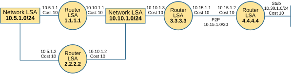

Figure 11. Reconstructed topology using the link-state database

Notice the following aspects of the process of creating and advertising a LSA Type 2:

- If a multiaccess interface **has no neighbors**, it is listed as "Stub Network" in the LSA Type 1 and does not require LSA Type 2. For example, this is the case for 10.30.1.0/24 connected to R4.
- If a multiaccess interface **has at least one neighbor**, it is listed as "Transit Network" in the LSA Type 1, which means a Type 2 LSA exists that further describes that network.
    - Only the DR floods a Network LSA for the network because it has a full adjacency with all other OSPF devices on that multiaccess segment.

LSA Types 1 and 2 are enough to describe the topology inside a single OSPF Area. However, if the network has multiple areas, the routing process needs an additional link-state advertisement type to describe the networks in remote areas. Let's see how it works.

## LSA Type 3 - Summary LSA

You have seen by now that OSPF uses the area concept to break down a large network into smaller portions, **reducing the size of the LSDB database**. A smaller LSDB requires less RAM and CPU, making the network more efficient and scale better.

**But how exactly does the concept of areas reduce the size of the LSDB?**

LSAs Type 1 and 2 are local to an OSPF area. Area Border Routers (ABRs) do not forward LSAs Type 1 and 2 between areas, as shown in the diagram below.

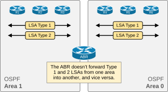

Figure 12. How Areas reduce the size of the LSDB

This results in a smaller link-state database per area, which optimizes the memory and CPU consumption of the OSPF process. However, routers still need to be able to reach networks in other areas.

This results in a smaller link-state database per area, which optimizes the memory and CPU consumption of the OSPF process. However, routers still need to be able to reach networks in other areas.

This is where **LSA Type 3** (Summary LSA) comes in. ABRs generate Type 3 LSAs to advertise networks from one area into another.

### How Type 3 LSAs work

Let's say Area 1 has network 10.1.0.0/16. The ABR (connected to both Area 0 and Area 1) will:

1. Take the Type 1 and Type 2 LSAs from Area 1 and calculate the routes.
2. Create Type 3 LSAs summarizing those networks.
3. Flood the Type 3 LSAs into Area 0 (and other connected areas).

Routers in Area 0 receive the Type 3 LSAs and install routes to 10.1.0.0/16 with the ABR as the next hop. These routers don't know the internal topology of Area 1 — they only know that the network exists behind the ABR.

### Type 3 LSA example

Looking at Figure 12, the ABR (R2) receives Type 1 and Type 2 LSAs from Area 1. It learns that network 10.1.0.0/16 exists in Area 1. R2 creates a Type 3 LSA with:
- Link State ID: 10.1.0.0 (the network address)
- Network Mask: 255.255.0.0
- Advertising Router: R2's Router ID
- Metric: The cost from R2 to the network

R2 floods this Type 3 LSA into Area 0. Routers in Area 0 now have a route to 10.1.0.0/16 via R2.

### Key characteristics of Type 3 LSAs

- Generated by **ABRs** only.
- Describe **networks in other areas** (not topology).
- Are **flooded between areas**, but not within the originating area (Type 1 and 2 stay within the area).
- By default, ABRs advertise **all** networks between areas. You can control this with **route summarization** on the ABR.

## Verifying LSA Types

**View all LSAs in the database:**

```plaintext
R1# show ip ospf database

            OSPF Router with ID (10.0.0.1) (Process ID 1)

                Router Link States (Area 0)

Link ID         ADV Router      Age         Seq#       Checksum
10.0.0.1        10.0.0.1        123         0x80000004 0x00A5B5
10.0.0.2        10.0.0.2        98          0x80000003 0x00B2C1

                Net Link States (Area 0)

Link ID         ADV Router      Age         Seq#       Checksum
10.1.1.2        10.0.0.2        102         0x80000001 0x00D4E2

                Summary Net Link States (Area 0)

Link ID         ADV Router      Age         Seq#       Checksum
10.2.0.0        10.0.0.2        87          0x80000001 0x00A1B2
```

Notice how the Type 3 (Summary) LSAs are listed separately from Type 1 (Router) and Type 2 (Network) LSAs.

**View only Type 3 LSAs:**

```plaintext
R1# show ip ospf database summary

                OSPF Router with ID (10.0.0.1) (Process ID 1)

                Summary Net Link States (Area 0)

Link ID         ADV Router      Age         Seq#       Checksum
10.2.0.0        10.0.0.2        87          0x80000001 0x00A1B2
10.3.0.0        10.0.0.2        92          0x80000001 0x00B3C4
```

**View Type 1 LSAs:**

```plaintext
R1# show ip ospf database router

                OSPF Router with ID (10.0.0.1) (Process ID 1)

                Router Link States (Area 0)

  LS age: 123
  Options: (No TOS-capability, DC)
  LS Type: Router Links
  Link State ID: 10.0.0.1
  Advertising Router: 10.0.0.1
  LS Seq Number: 80000004
  Checksum: 0xA5B5
  Length: 48
  Number of Links: 2

    Link connected to: a Transit Network
     (Link ID) Designated Router address: 10.1.1.2
     (Link Data) Router Interface address: 10.1.1.1
      Number of MTU metrics: 0
       TOS 0 metrics: 1

    Link connected to: a Stub Network
     (Link ID) Network/subnet number: 10.0.1.0
     (Link Data) Network Mask: 255.255.255.0
      Number of MTU metrics: 0
       TOS 0 metrics: 1
```

**View Type 2 LSAs:**

```plaintext
R1# show ip ospf database network

                OSPF Router with ID (10.0.0.1) (Process ID 1)

                Net Link States (Area 0)

  LS age: 102
  Options: (No TOS-capability, DC)
  LS Type: Network Links
  Link State ID: 10.1.1.2 (address of Designated Router)
  Advertising Router: 10.0.0.2
  LS Seq Number: 80000001
  Checksum: 0xD4E2
  Length: 32
  Network Mask: /24
    Attached Router: 10.0.0.2
    Attached Router: 10.0.0.1
    Attached Router: 10.0.0.3
```

## Route types in the routing table

The type of LSA that installed a route determines its route type in the routing table.

- **O** — Intra-area route (from Type 1 and Type 2 LSAs within the same area).
- **O IA** — Inter-area route (from Type 3 LSAs originated by an ABR).

```plaintext
R1# show ip route ospf
      10.0.0.0/8 is variably subnetted, 4 subnets, 2 masks
O       10.1.1.0/24 [110/2] via 10.0.1.2, 00:12:34, GigabitEthernet0/0
O IA    10.2.0.0/16 [110/3] via 10.0.1.2, 00:08:21, GigabitEthernet0/0
```

- `O` = intra-area (Type 1/2 LSA)
- `O IA` = inter-area (Type 3 LSA)

## Summary

- **LSA Type 1 (Router LSA)** — Describes a router's directly connected links. Generated by every router and flooded within its area only.
- **LSA Type 2 (Network LSA)** — Generated by the DR on multiaccess networks. Lists all routers attached to the segment. Flooded within the area only.
- **LSA Type 3 (Summary LSA)** — Generated by ABRs. Describes networks from one area to another. Enables inter-area routing while keeping the LSDB smaller.
- Type 1 and 2 LSAs stay within their area. Only Type 3 LSAs are sent between areas.
- Intra-area routes appear as `O` in the routing table; inter-area routes appear as `O IA`.
- Use `show ip ospf database` and its variants to inspect each LSA type in detail.
