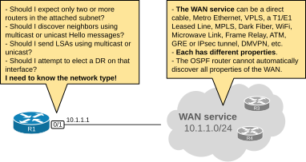
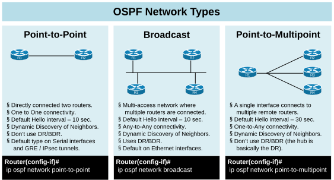
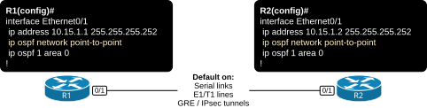
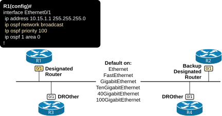
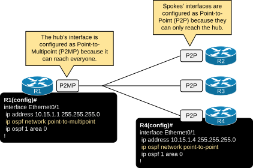
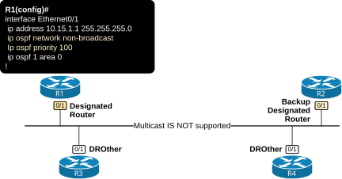

[OSPF Network Types](https://www.networkacademy.io/ccna/ospf/ospf-network-types)
==========

# OSPF Network Types

This lesson discusses the different OSPF network types. It focuses on understanding the concept through examples and diagrams. At the end of the lesson, you will find a detailed comparison between the different types and their underlying properties.

## Why does OSPF need network types?

Routers can be connected via various types of WAN services. Many old and new WAN technologies can provide IP connectivity between devices. To establish adjacency and calculate the best path, the OSPF process must know the essential properties of the network between the routers. However, different WAN services have different properties. For example:

- Some WAN services support **full-mesh** communication, some support only **hub-and-spoke**, and some only **point-to-point**.
    - For example, services like Ethernet, Metro Ethernet, VPLS, VxLAN, and WiFi support multi-access any-to-any communication between nodes.
    - Direct cables between routers (copper or fiber), E1/T1, leased lines, and overlay tunnels such as GRE and IPsec support only point-to-point communication.
    - WAN services such as Frame Relay, mGRE, and DMVPN support only hub-and-spoke communication.
- Some WAN services support **multicast/broadcast** communication, while others support only **unicast**.
    - For example, most modern WAN services support multicast/broadcast, while some old technologies, such as Frame Relay, ATM, X.25, and VSAT, do not inherently support broadcasting/multicasting.

In that context, when an OSPF router connects to a WAN link, how can it determine the WAN service's properties?



Figure 1. Why does OSPF need different network types?

That's where the OSPF Network types come into play. It is explicitly configured per interface and informs the routers of the essential properties of the WAN transport.

## OSPF Network Types

OSPF defines five different network types to account for the different WAN technologies and their underlying properties. The network type is a configurable per-interface setting that tells the OSPF process how to establish and maintain neighborship over the given interface.

```plaintext
Router(config)# interface eth0/1
Router(config-if)# ip ospf network ?
  broadcast            Specify OSPF broadcast multi-access network
  non-broadcast        Specify OSPF NBMA network
  point-to-multipoint  Specify OSPF point-to-multipoint network
  point-to-point       Specify OSPF point-to-point network
```

Let's start with the three main types, which are used 99% of the time and are within the scope of the CCNA exam.



Figure 2. Main OSPF Network Types

The diagram above shows a summary of the most common ones. Let's dive into each one.

### Network Type: Point-to-Point

When an OSPF interface is configured as Point-to-Point (explicitly or by default), it assumes the following truths:

- I can connect to only one remote router via this interface.
- Connectivity is one-to-one.
- Multicast is allowed. I can discover neighbors dynamically using multicast Hellos to 224.0.0.5.
- Since only two routers sit on the same link, a DR/BDR election IS NOT required to optimize the LSA flooding.

The point-to-point type is the most simple and straightforward one. It is used on WAN links that support only one-to-one communication. Routers automatically set the network type to point-to-point on Serial links, E1/T1 leased lines, GRE, and IPsec tunnels.



Figure 3. Point-to-Point

If we want to configure an Ethernet interface as an OSPF point-to-point link, we use the following command (in blue).

```plaintext
R3# conf t
Enter configuration commands, one per line.  End with CNTL/Z.
R3(config)# int eth0/1
R3(config-if)# ip ospf network point-to-point 
R3(config-if)# end
R3#
```

We can verify the OSPF type of an interface using the following command.

```plaintext
R3# sh ip ospf interface eth0/1
Ethernet0/1 is up, line protocol is up
  Internet Address 10.15.1.1/30, Interface ID 3, Area 0
  Attached via Network Statement
  Process ID 1, Router ID 3.3.3.3, Network Type POINT_TO_POINT, Cost: 10
  Topology-MTID    Cost    Disabled    Shutdown      Topology Name
        0           10        no          no            Base
  Transmit Delay is 1 sec, State POINT_TO_POINT
  Timer intervals configured, Hello 10, Dead 40, Wait 40, Retransmit 5
    oob-resync timeout 40
    Hello due in 00:00:07
  Supports Link-local Signaling (LLS)
  Cisco NSF helper support enabled
  IETF NSF helper support enabled
  Can be protected by per-prefix Loop-Free FastReroute
  Can be used for per-prefix Loop-Free FastReroute repair paths
  Not Protected by per-prefix TI-LFA
  Index 1/2/2, flood queue length 0
  Next 0x0(0)/0x0(0)/0x0(0)
  Last flood scan length is 1, maximum is 1
  Last flood scan time is 0 msec, maximum is 0 msec
  Neighbor Count is 1, Adjacent neighbor count is 1
    Adjacent with neighbor 4.4.4.4
  Suppress hello for 0 neighbor(s)
```

Point-to-point links do not use the concept of Designated (DR) and Backup Designated Router (BDR) because the maximum number of routers is two. Hence, it doesn't make sense to have a DR hat optimizes the LSA flooding. That's why when we are looking at the output of the **show ip ospf neighbor** command, there is a dash alongside the state of the neighbor (highlighted in blue). This means that no DR/BDR election takes place on this interface.

```plaintext
R3# sh ip ospf neighbor
Neighbor ID     Pri   State           Dead Time   Address         Interface
4.4.4.4           0   FULL/  -        00:00:32    10.15.1.2       Ethernet0/1
```

An essential aspect of the point-to-point type is that it is represented as two links in the LSA Type 1 that the router creates and floods, as shown in blue in the output below.

```plaintext
R3# sh ip ospf database router 3.3.3.3

            OSPF Router with ID (3.3.3.3) (Process ID 1)
            
                Router Link States (Area 0)
  LS age: 4
  Options: (No TOS-capability, DC)
  LS Type: Router Links
  Link State ID: 3.3.3.3
  Advertising Router: 3.3.3.3
  LS Seq Number: 80000005
  Checksum: 0x1B4E
  Length: 60
  Number of Links: 3
  
    Link connected to: another Router (point-to-point)
     (Link ID) Neighboring Router ID: 4.4.4.4
     (Link Data) Router Interface address: 10.15.1.1
      Number of MTID metrics: 0
       TOS 0 Metrics: 10
       
    Link connected to: a Stub Network
     (Link ID) Network/subnet number: 10.15.1.0
     (Link Data) Network Mask: 255.255.255.252
      Number of MTID metrics: 0
       TOS 0 Metrics: 10
       
    Link connected to: a Transit Network
     (Link ID) Designated Router address: 10.10.1.3
     (Link Data) Router Interface address: 10.10.1.3
      Number of MTID metrics: 0
       TOS 0 Metrics: 10
```

The first highlighted section represents the point-to-point link and the neighboring router. The second Stub Network section represents the subnet on the point-to-point link. OSPF uses this approach to facilitate using unnumbered IP addresses on p2p links.

For example, you can configure the p2p interface as IP Unnumbered and use an IP address of another interface. In that case, the p2p link will be represented only with "another Router (point-to-point)" link in the Type 1 LSA and won't have a "Stub Network" link that advertises the p2p subnet. However, this is out of the scope of the CCNA exam.

### Network Type: Broadcast

When an OSPF interface is configured as Broadcast (explicitly or by default), it assumes the following truths:

- I can connect to an unlimited number of routers via this interface.
- Connectivity is any-to-any.
- Multicast is allowed. I can discover neighbors dynamically using multicast Hellos to 224.0.0.5.
- Since many routers sit on the same segments, a DR/BDR election is required to optimize the LSA flooding.

Broadcast is the most used network type because it is the default one on Ethernet interfaces. Hence, when you enable OSPF on an Ethernet, FastEthernet, GigabitEthernet, TenGigabitEthrnet, 40GigabitEthernet or 100GigabitEthernet port, it defaults to OSPF network type Broadcast.

The Broadcast type assumes that **the interface is connected to a multi-access segment** (meaning every node can communicate with any other) **and that broadcasting/multicasting is allowed**. In the LAN, both those capabilities are always true. However, one of these requirements may not be true for certain WAN services.



Figure 4. Broadcast.

The number of connected OSPF nodes on multiaccess segments such as an Ethernet VLAN is unlimited. That's why routers elect DR and BDR **to optimize the LSA flooding process**. If you don't feel confident with the DR/BDR concept, check out [this lesson](https://www.networkacademy.io/ccna/ospf/dr-and-bdr).

We can verify an interface's type by checking the output of the **show ip ospf interface** command, as shown below.

```plaintext
R1# show ip ospf interface eth0/1
Ethernet0/1 is up, line protocol is up
  Internet Address 10.10.1.1/24, Interface ID 3, Area 0
  Attached via Network Statement
  Process ID 1, Router ID 1.1.1.1, Network Type BROADCAST, Cost: 10
  Topology-MTID    Cost    Disabled    Shutdown      Topology Name
        0           10        no          no            Base
  Transmit Delay is 1 sec, State DROTHER, Priority 1
  Designated Router (ID) 3.3.3.3, Interface address 10.10.1.3
  Backup Designated router (ID) 2.2.2.2, Interface address 10.10.1.2
  Timer intervals configured, Hello 10, Dead 40, Wait 40, Retransmit 5
    oob-resync timeout 40
    Hello due in 00:00:08
  Supports Link-local Signaling (LLS)
  Cisco NSF helper support enabled
  IETF NSF helper support enabled
  Can be protected by per-prefix Loop-Free FastReroute
  Can be used for per-prefix Loop-Free FastReroute repair paths
  Not Protected by per-prefix TI-LFA
  Index 1/2/2, flood queue length 0
  Next 0x0(0)/0x0(0)/0x0(0)
  Last flood scan length is 0, maximum is 1
  Last flood scan time is 0 msec, maximum is 0 msec
  Neighbor Count is 2, Adjacent neighbor count is 2
    Adjacent with neighbor 2.2.2.2  (Backup Designated Router)
    Adjacent with neighbor 3.3.3.3  (Designated Router)
  Suppress hello for 0 neighbor(s)
```

Notice the Hello and Dead intervals and the DR and BDR addresses.

Recall that interfaces that elect DR/BDR and have at least one neighbor are represented as a "Transit Network" in the LSA Type 1, as shown in blue in the output below. This means that the elected DR generates an LSA Type 2 to describe the multiaccess network further.

```plaintext
R1# sh ip ospf database router 1.1.1.1

            OSPF Router with ID (1.1.1.1) (Process ID 1)
            
                Router Link States (Area 0)
  LS age: 1586
  Options: (No TOS-capability, DC)
  LS Type: Router Links
  Link State ID: 1.1.1.1
  Advertising Router: 1.1.1.1
  LS Seq Number: 80000009
  Checksum: 0x6A45
  Length: 48
  Number of Links: 2
  
    Link connected to: a Transit Network
     (Link ID) Designated Router address: 10.10.1.3
     (Link Data) Router Interface address: 10.10.1.1
      Number of MTID metrics: 0
       TOS 0 Metrics: 10
       
    Link connected to: a Stub Network
     (Link ID) Designated Router address: 10.5.1.2
     (Link Data) Router Interface address: 10.5.1.1
      Number of MTID metrics: 0
       TOS 0 Metrics: 10
```

We can check the LSA Type 2 using the following command. Notice the LSA ID is the interface IP address of the DR, as highlighted in green.

```plaintext
R1# sh ip ospf database network 10.10.1.3
            OSPF Router with ID (1.1.1.1) (Process ID 1)
                Net Link States (Area 0)
  LS age: 1668
  Options: (No TOS-capability, DC)
  LS Type: Network Links
  Link State ID: 10.10.1.3 (address of Designated Router)
  Advertising Router: 3.3.3.3
  LS Seq Number: 80000002
  Checksum: 0x44B4
  Length: 36
  Network Mask: /24
        Attached Router: 3.3.3.3
        Attached Router: 1.1.1.1
        Attached Router: 2.2.2.2
```

If you don't feel comfortable with the different LSA types, check out [this lesson](https://www.networkacademy.io/ccna/ospf/lsa-types-1-2-3).

### Network Type - Point-to-Multipoint

When an OSPF interface is configured as P2MP (explicitly), it assumes the following truths:

- I can connect to an unlimited number of routers via this interface.
- Connectivity is hub-and-spoke. I am the hub.
- Multicast is allowed. I can discover neighbors dynamically using multicast Hellos to 224.0.0.5.
- Since I am the hub, I optimize the LSA flooding. Hence, a DR/BDR election IS NOT required.

The P2MP network type is used only on hub-and-spoke WAN services such as Frame Relay and DMVPN. It is not configured by default on any interface. A network administrator must explicitly configure it, as shown in the diagram below.



Figure 5. Point-to-Multipoint.

Notice that generally, only the hub is configured as a P2MP interface. This is something that is often misunderstood at the CCNA level. The spokes' interfaces are configured as P2P because they can only reach the hub (hence, one-to-one communication).

## Advanced Network Types - NBMA and P2MP Non-Broadcast

Let's quickly go through the other two types, which are outside the scope of the CCNA exam but are useful for building a solid foundation on the topic.

### Non-Broadcast Multi-access (NBMA)

When an OSPF interface is configured as NBMA (explicitly), it assumes the following truths:

- I can connect to an unlimited number of routers via this interface.
- Connectivity is any-to-any.
- Multicast IS NOT allowed. I CANNOT discover neighbors dynamically. Neighbors must be pre-defined by an administrator.
- Since many routers sit on the same segments, a DR/BDR election is required to optimize the LSA flooding.

The NBMA type is basically **the same as the Broadcast one.** The only difference is that the multiaccess network does not support multicast/broadcast (hence the name NBMA). NBMA is not configured by default on any interface. A network administrator must explicitly configure it, as shown in the diagram below.



Figure 6. Non-Broadcast (NBMA).

It shares the same properties as the Broadcast type. However, since multicast is not supported, dynamic discovery of neighbors is impossible, and an administrator must manually configure each neighbor. Then, **the control-plane communication between neighbors happens via unicast**.

In modern WAN networks, the use of NBMA is less common due to the decline of legacy non-broadcast technologies and the rise of modern WAN environments that support multicast and broadcast traffic. However, in legacy environments (and in exams) where non-broadcast characteristics are present, NBMA might still be used.

### Point-to-Multipoint Non-Broadcast

When an OSPF interface is configured as P2MP Non-Broadcast (explicitly), it assumes the following truths:

- I can connect to an unlimited number of routers via this interface.
- Connectivity is hub-and-spoke. I am the hub.
- Multicast IS NOT allowed. I CANNOT discover neighbors dynamically. Neighbors must be pre-defined by an administrator.
- Since I am the hub, I optimize the LSA flooding. Hence, a DR/BDR election is not required.

The P2MP Non-Broadcast type is basically the same as the P2MP one. The only difference is that the P2MP segment does not support multicast/broadcast. It is not configured by default on any interface. A network administrator must explicitly configure it, as shown in the output below.

```plaintext
R1# conf t
Enter configuration commands, one per line.  End with CNTL/Z.
R1(config)# int eth0/1
R1(config-if)# ip ospf network point-to-multipoint non-broadcast
R1(config-if)# end
R1#
```

This interface type is also less commonly used in modern WAN services and is out of the scope of the CCNA exam. However, it is used in the CCNP/CCIE exams.

## How to choose which network type to use?

In modern networks, there is little need to change the default network type setting. Most modern LAN and WAN services provide full-mesh connectivity with multicast support. Therefore, on most of the interfaces, you stick with the default Broadcast type. On tunnel interfaces, you use the default Point-to-Point type.

However, in exam environments and more custom WAN deployment, you must be able to determine which network type to use based on the WAN properties.

Choosing the correct OSPF network type depends on the characteristics of your Layer 2 technology.

**When to use Broadcast:**
- Default for Ethernet interfaces.
- Good for LAN environments where all devices can communicate directly.
- Supports DR/BDR election, which reduces adjacencies on multiaccess segments.

**When to use Point-to-Point:**
- Default for serial interfaces with HDLC or PPP encapsulation.
- Good for direct WAN links between two routers.
- No DR/BDR election needed (only two routers).
- Faster convergence (no wait timer).

**When to use Non-Broadcast:**
- For legacy Frame Relay or ATM networks that don't support multicast.
- Requires manual neighbor configuration.
- Rare in modern networks.

**When to use Point-to-Multipoint:**
- For hub-and-spoke WAN topologies where spokes cannot communicate directly.
- Does not require DR/BDR election.
- Supports multicast (for the broadcast variant).

### Decision flowchart

```
Is the link point-to-point (only 2 routers)?
├── Yes → Use Point-to-Point (or Point-to-Point Non-Broadcast)
└── No → Is the link broadcast-capable?
         ├── Yes → Use Broadcast
         └── No → Is it hub-and-spoke?
                  ├── Yes → Use Point-to-Multipoint
                  └── No → Use Non-Broadcast
```

### Comparison table

| Network Type | DR/BDR Election | Hello Timer | Requires Manual Neighbors | Default Interface |
|-------------|----------------|-------------|--------------------------|-------------------|
| Broadcast | Yes | 10 sec | No | Ethernet |
| Point-to-Point | No | 10 sec | No | Serial (HDLC/PPP) |
| Non-Broadcast | Yes | 30 sec | Yes | Legacy Frame Relay |
| Point-to-Multipoint | No | 30 sec | No | Rarely default |
| P2MP Non-Broadcast | No | 30 sec | Yes | Rarely default |

## Verifying Network Types

```plaintext
R1# show ip ospf interface GigabitEthernet0/0
GigabitEthernet0/0 is up, line protocol is up
  Internet Address 10.1.1.1/24, Area 0
  Process ID 1, Router ID 10.0.0.1, Network Type BROADCAST, Cost: 1
```

```plaintext
R1# show ip ospf interface Serial0/0/0
Serial0/0/0 is up, line protocol is up
  Internet Address 10.2.1.1/30, Area 0
  Process ID 1, Router ID 10.0.0.1, Network Type POINT_TO_POINT, Cost: 64
```

The network type is displayed in the interface output.

```plaintext
R1# show ip ospf interface brief
Interface    PID   Area            IP Address/Mask    Cost  State Nbrs F/C
Gi0/0        1     0               10.1.1.1/24        1     DR    2/2
Se0/0/0      1     0               10.2.1.1/30        64    P2P   1/1
```

## Summary

- OSPF network types determine how OSPF operates on a particular interface.
- **Broadcast** — Default on Ethernet. Uses DR/BDR. Neighbors discovered via multicast (224.0.0.5 and 224.0.0.6).
- **Point-to-Point** — Default on serial links. No DR/BDR. Automatic neighbor discovery.
- **Non-Broadcast** — Manual neighbor configuration. Uses DR/BDR. Legacy WAN technology.
- **Point-to-Multipoint** — For hub-and-spoke topologies. No DR/BDR. Spokes see each other as directly connected.
- Use `ip ospf network {type}` on the interface to change the network type.
- Choose the network type based on the Layer 2 technology's capabilities (multicast support, connectivity pattern).
