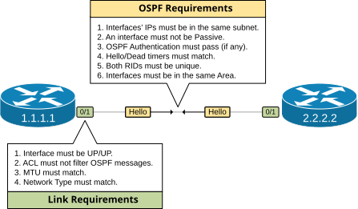
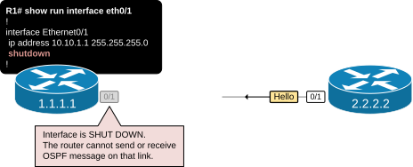
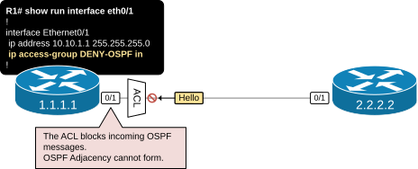
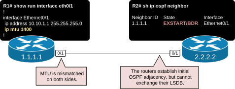
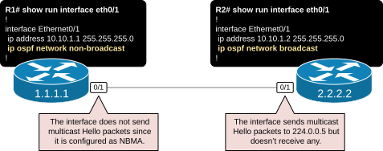
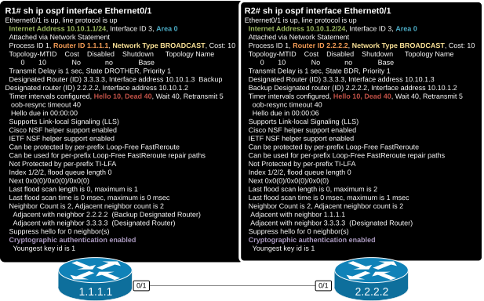

[Neighbor Adjacencies](https://www.networkacademy.io/ccna/ospf/troubleshooting-ospf-adjacencies)
==========

# Neighbor Adjacencies

This lesson discusses the requirements to be met before two OSPF devices become neighbors. It is a significant topic in the context of the CCNA exam and interviews for network engineering positions.

## OSPF Neighbor Requirements

When OSPF is configured on a router, it activates the routing on specific interfaces. The router then tries to find other neighboring devices on those interfaces by sending and receiving Hello messages. However, even after a neighbor is detected, the two routers might not establish a neighbor adjacency unless they have compatible settings.

When a router receives a Hello packet, it examines the information in the received Hello message with the locally configured OSPF settings. Specific settings must match to become fully adjacent to the remote device. Figure 1 below shows which requirements must be met before routers become neighbors and exchange their link-state databases.



Figure 1. OSPF Neighbor Requirements.

We can divide the requirements into two general groups:

- Link Requirements
- OSPF Requirments

The **link requirements** are more general and affect the IP connectivity between the devices. For example, if an interface is down because the cable is unplugged from the port, there is no IP connectivity at all. Without IP connectivity, neighbor adjacency cannot be formed. Although not directly related to OSPF, such issues are thrown into the mix in exam environments, so people must get used to troubleshooting more broadly, even though the issue is listed as "OSPF adjacency doesn't form."

The **OSPF requirements** are the ones directly related to the routing process configuration. They are directly related to parameters in the Hello messages that must match before the routers can become neighbors and exchange link-state information. For example:

- One side is configured with Hello/Dead intervals of 10/40, while the other is configured with 30/120.
- One side is configured in Area 10, while the other is configured with Area 0.
- One side is configured as passive-interface (it doesn't send or receive Hello messages).

CCNA candidates must be able to troubleshoot such problems without much effort. Let's walk through the process of troubleshooting such issues and see which commands we can use.

### Link Requirements

Let's start with the link requirements. They are not directly related to the routing process and often are more challenging to troubleshoot in exam environments. When an issue is defined as "OSPF adjacency doesn't form," people focus too much on the routing process and forget to look more broadly for general connectivity issues.

#### Req.1 - Interface must be UP/UP

Obviously, this requirement needs little discussion. An interface must be in UP/UP so the OSPF process can send and receive any messages. If a physical issue prevents the interface from going up or a protocol issue prevents it from going UP/UP, routing adjacency won't be able to form.



Figure 2. The interface is shut down.

In my experience, people often forget to enable a port in exam environments. They then panic, wondering why routing adjacency didn't form on this interface, and proceed with complex troubleshooting.

In the exam environment, I always start with the **show run interface** command, as shown in the output below. It immediately gives you an idea about every link requirement, as shown in Figure 1. You can immediately see if the interface is shut down, if an ACL is applied, if the default MTU is changed, and what the OSPF Network Type is.

```plaintext
R1# sh run int e0/1
interface Ethernet0/1
 ip address 10.10.1.1 255.255.255.0
 shutdown
end
```

However, sometimes, in an exam environment, show run is not allowed or simply disabled. In such cases, you must be able to find the information you are looking for using the alternative show command. The easiest way to see if a port shuts down is by using the **show ip interface brief** command.

```plaintext
R1# sh ip int brief 
Interface              IP-Address      OK? Method Status                Protocol
Ethernet0/0            10.5.1.1        YES NVRAM  up                    up      
Ethernet0/1            10.10.1.1       YES NVRAM  administratively down down    
Ethernet0/2            unassigned      YES NVRAM  administratively down down    
Ethernet0/3            unassigned      YES NVRAM  administratively down down  
```

The interface could also be unshut but simply down because the cable is unplugged or there is another physical layer problem

#### Req.2 - ACL must not filter OSPF messages

This is another requirement that needs little discussion. Logically, if an interface has an applied Access Control List (ACL) that filters out OSPF messages, routing adjacency cannot form over this interface.



Figure 3. ACL blocks incoming OSPF messages.

The easiest way to find of an ACL is applied on a link is using the **show run interface** command.

```plaintext
R1# sh run int e0/1
interface Ethernet0/1
 ip address 10.10.1.1 255.255.255.0
 ip access-group DENY-OSPF in
end
```

If show run is not allowed, you can use the following command to check if an ACL is applied.

```plaintext
R1# sh ip int e0/1 | in access list
  Outgoing Common access list is not set
  Outgoing access list is not set
  Inbound Common access list is not set
  Inbound  access list is DENY-OSPF
```

Depending on the exam requirements, you can either remove the ACL completely or add an additional entry to resolve the issue.

#### Req.3 - MTU must match

An interface's maximum transmission unit (MTU) defines the largest IP packet the router can forward through that port. When a router encounters a packet larger than the MTU of the outgoing interface, it either fragments the packet or discards it if the Do Not Fragment (DF) bit is set.

Generally, all devices attached to the same data link must have the same IP MTU. However, routers do not have a mechanism to verify mismatched MTU automatically.



Figure 4. MTU is mismatched

In the context of OSPF, when there is an MTU mismatch between two neighbors, **they become OSPF adjacent but are not able to exchange the LSDB database**.

```plaintext
R1# sh run int e0/1
interface Ethernet0/1
 ip address 10.10.1.1 255.255.255.0
 ip mtu 1400
end
```

You can see that R1 lists R2 as a neighbor but it is stuck in the EXSTART state, meaning the exchange of link-state information is going to start.

```plaintext
R1# sh ip ospf neighbor
Neighbor ID     Pri   State           Dead Time   Address         Interface
2.2.2.2           1   EXSTART/DR     00:00:39    10.10.1.2       Ethernet0/1
```

However, the LSDB exchange never completes, and after multiple retries, the router brings the adjacency down, as shown in the log below.

```plaintext
R1#
*Aug 19 11:02:39.895: %OSPF-5-ADJCHG: Process 1, Nbr 2.2.2.2 on Ethernet0/1 from EXSTART to DOWN, Neighbor Down: Too many retransmissions
```

This kind of problem is easier to find because the neighbor appears under the show ip ospf neighbor output but is stuck in an EXCHANGE state, which immediately indicates a problem with the MTU (if you are familiar with this behavior).

#### Req.4 - Network Type must match

If you are not following our lessons in order, you may not be familiar with the network-type concept. Check out [this lesson](https://www.networkacademy.io/ccna/ospf/ospf-network-types), and then you can return to this part.

Typically, in LAN environments, the network type is always set to the default Broadcast type. However, in WAN or exam environments, you can encounter a situation where one side is configured with one network type while the other is set to a different type. Logically, in such situations, the neighbor adjacency doesn't form.



Figure 5. Network Type is mismatched

You can troubleshoot such problems using the **show run interface** command or the show ip ospf interface one. You must compare the network type at each end and make sure that it matches and is adapted to the kind of physical medium.

### OSPF Requirements

The OSPF requirements are the ones that routers exchange in the Hello packets. When a router receives a Hello message from a remote device, it contains the Hello with its local OSPF settings. If all requirements shown in the following table are met, the rotuer responds back. If not, it rejects the Hello packet, and OSPF neighborship does not form.

**Requirement** | **Adjacency form?** | **Command to use for troubleshooting**
--- | --- | ---
Interfaces' IPs must be in the same subnet | No | show ip ospf interface
Both interfaces must not be Passive-interface | No | show ip ospf interface
OSPF Authentication must pass (if any) | No | show ip ospf interface
Hello/Dead intervals must match | No | show ip ospf interface
Router IDs must be unique | No | show ip ospf interface
Interfaces must be in the same Area | No | show ip ospf interface

We can troubleshoot almost any OSPF configuration mismatch using the **show ip ospf interface** command. It is the most used command for adjacency troubleshooting.

For example, you log into two routers that are connected and must become neighbors. You execute the command on both and compare the highlighted values, as shown in the diagram below. This can immediately show you the problem 99% of the time.



Figure 6. Output of show ip ospf interface.

Notice that the "Process ID" is not highlighted. Recall that **the process ID is a local value** that devices use to differentiate between different routing processes. It does not need to match to become adjacent to another device. One device can use Process ID 1 and the other one Process ID 2, and they become neighbors without a problem (if all other required settings match). Oftentimes, in exams, the Process IDs intentionally don't match, and people think that is an issue. However, it is not.
