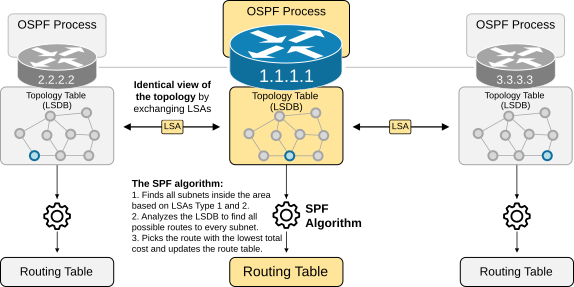
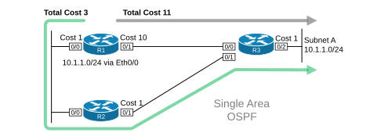
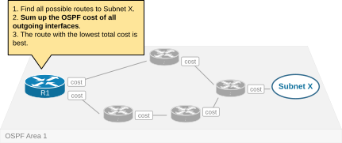
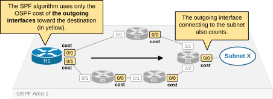
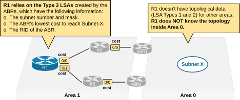
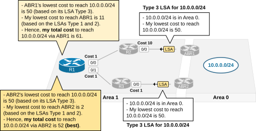
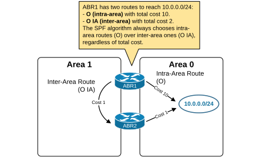

[OSPF Best-Path Selection](https://www.networkacademy.io/ccna/ospf/ospf-best-path-selection)
==========

# OSPF Best-Path Selection

This lesson walks through the process of selecting the best OSPF routes from a router to each destination in the network. It is divided into four parts:

- Intra-area routes. (the best route to a subnet in the same area)
- Inter-area routes. (the best route to a subnet in another area)
- What happens when both intra-area and inter-area routes exist for the same subnet?
- Manipulating the SPF best-route selection.

## Intra-Area Routes (O)

Let's start with the process of finding the best loop-free paths for all known subnets inside a single OSPF area.

First, for proper context, recall that all routers within an area achieve an identical topology view (identical LSDB) by flooding LSAs Type 1 and 2. These two LSA types are enough for all routers inside the area to construct the area's topology, find all known subnets, and calculate the best path to each subnet.



Figure 1. The SPF algorithm.

The process of finding and selecting the best route to a subnet inside an area can be broken down into three main steps:

1. The SPF algorithm **finds all subnets** inside the area based on the "Stub Networks" listed in LSAs Type 1 and "Transit Networks" in LSAs Type 2.
2. The SPF algorithm then analyzes the area's topology **to find all potential routes** from the local router to each subnet. For each route, the SPF adds the OSPF cost of all outgoing interfaces.
3. When the SPF calculation is complete, the algorithm selects the routes with the lowest total cost as the best ones and **updates the device's routing table**.

For example, the following diagram shows a small area with three routers, their interface numbers, and the OSPF cost. Let's walk through the steps R1's SPF algorithm takes to determine the best path to reach subnet 10.1.1.0/24.



Figure 2. OSPF IA Route.

1. First, the SPF algorithm understands that subnet 10.1.1.0/24 exists in the network because R3 floods a Type 1 LSA that lists 10.1.1.0/24 as a Stub Network.
2. The algorithm then determines two possible paths to the subnet and sums the costs of the outgoing interfaces along each path.
    1. Path 1 via interface Eth0/1 **with a total cost of 11**. (R1's Eth0/1 with cost 10 plus R3's Eth0/2 with 1)
    2. Path 2 via interface Eth0/0 **with a total cost of 3**. (R1's Eth0/0 with cost 1 plus R2's Eth0/1 with 1 plus R3's Eth0/2 with 1)
3. The SPF determines that the path via Eth0/0 is best because it has the lowest total cost 3 (the green line). The OSPF process updates R1's routing table with the route **10.1.1.0/24 via Eth0/0**.

The following diagram summarizes the process of determining the best route to a subnet inside an area. The process is fairly simple, even from a human perspective. If you know the costs of each interface along the path, you can easily figure out which route is the best.



Figure 3. Intra-Area Best Route Calculation.

Notice something important that is confusing for CCNA candidates - the SPF algorithm uses the cost of **the outgoing interfaces** toward the destination subnet, including the cost of the interface that connects to the subnet. The logic is illustrated in the following diagram.



Figure 4. Adding cost logic.

When R1 calculates the total cost of every path to subnet X, it adds up the cost of the outgoing interfaces highlighted in yellow. Understanding and remembering this is essential because you must know which interfaces to re-configure to manipulate a router's best path selection.

For example, suppose you change the cost of R2's interface 0/1 to any value. It won't influence R1's best path selection because R1's SPF algorithm uses only the cost of R2's interface 0/0 (which is the outgoing interface toward subnet X). Also, remember that the interface directly connecting to the subnet counts in the total cost (e.g., R5's interface 0/0). If multiple routers connect to the same subnet, changing the cost of one's interface connecting to the subnet can make the other routers more preferred.

Now let's see what is the process of selecting the best path to a subnet that is in another OSPF area.

## Inter-Area Routes (O IA)

Recall two essential properties of the multi-area design that we are going to use as a context:

- A router that connects to two areas is called **an ABR (area border router)**.
- The LSA types that describe the topology - LSA Type 1 and 2 - **are only flooded inside an area**.

The routers in Area 1 don't have any topology information about other areas because the ABRs do not flood LSAs Type 1 and 2 from one area into another, as shown in the diagram below.



Figure 5. Inter-Area Best Route Calculation.

Instead, **the Area Border Routers (ABRs) flood Type 3 LSAs** (called Summary LSA) that advertise subnets in another area but don't include other topology information such as routers and links.

The process of **calculating the total OSPF cost to a subnet in another area** is based on the Type 3 LSAs that ABRs flood into the area. The process can be broken into three steps from the point of view of a local router:

- **Step 1**. The router receives Type 3 LSAs for subnet X in another area from multiple ABRs. The LSA Type 3 lists the subnet/mask, cost, and ABR's Router ID.
- **Step 2.** The router calculates the intra-area cost to each ABR originating the Type 3 LSA and adds the cost listed in the Type 3 LSA.
- **Step 3**. It compares the total cost to reach subnet X via each ABR. The route with the lowest cost is considered best and inserted into the routing table as the OSPF IA route. (Inter-area route)

Let's review an example to fully understand this process. The following diagram shows that subnet 10.0.0.0/24 is in Area 0. Let's see how router R1 applies the process of selecting the best path to 10.0.0.0/24.



Figure 6. Inter-Area Cost Calculation Logic.

The diagram is pretty self-explanatory, but let's walk through each step:

- Since ABR1 and ABR2 connect to Areas 0 and 1, they act as area-border routers originating Type 3 LSAs. Both ABRs originate a Type 3 LSA for subnet 10.0.0.0/24 inside Area 1. Each LSA includes the lowest cost for the ABR to reach the subnet 10.0.0.0/24 inside Area 0.
- R1 receives both LSA Type 3 from the ABRs and understands that subnet 10.0.0.0/24 exists in Area 0. Since it gets two LSAs Type 3, it knows it can reach 10.0.0.0/24 via two routes (via ABR1 and ABR2). It must calculate which one is best.
- To calculate the best route to 10.0.0.0/24:
    - R1 calculates the lowest intra-area cost to reach ABR1 (total 11) and adds the cost listed inside ABR1's LSA Type 3 (50). Hence, it calculates the total cost to reach 10.0.0.0/24 via ABR1 as 61.
    - Then, it calculates the lowest intra-area cost to reach ABR2 (total 2) and adds the cost listed inside ABR2's LSA Type 3 (50). It calculates the total cost to reach 10.0.0.0/24 via ABR2 as 52. This is the route with the lowest total cost.
- R1 inserts the route to 10.0.0.0/24 via ABR2 as an OSPF IA route in the routing table.

Let's look at the example from the CLI point of view as well. The following output shows the LSDB database of R1. Notice the LSAs Type 3 highlighted in blue. The first comes from ABR1 (4.4.4.4), and the second comes from ABR2 (5.5.5.5).

```plaintext
R1# sh ip ospf database 

            Router with ID (1.1.1.1) (Process ID 1)
            
                Router Link States (Area 1)
Link ID         ADV Router      Age         Seq#       Checksum Link count
1.1.1.1         1.1.1.1         67          0x80000009 0x00E81A 2         
2.2.2.2         2.2.2.2         50          0x80000008 0x00E610 2         
3.3.3.3         3.3.3.3         21          0x80000008 0x00FAED 2         
4.4.4.4         4.4.4.4         41          0x80000005 0x004C33 1         
5.5.5.5         5.5.5.5         13          0x80000005 0x002E45 1 
        
                Net Link States (Area 1)
Link ID         ADV Router      Age         Seq#       Checksum
172.16.1.2      2.2.2.2         85          0x80000001 0x003531
172.16.2.1      1.1.1.1         67          0x80000001 0x0094D1
172.16.3.2      2.2.2.2         50          0x80000001 0x00B5A2
172.16.4.3      3.3.3.3         22          0x80000001 0x00D673

                Summary Net Link States (Area 1)
Link ID         ADV Router      Age         Seq#       Checksum
10.0.0.0        4.4.4.4         43          0x80000001 0x00F226
10.0.0.0        5.5.5.5         25          0x80000001 0x00D440
```

If we check the LSAs Type 3 in more detail, we can see that both routers advertise that their lowest cost to reach 10.0.0.0/24 is 50.

```plaintext
R1# sh ip ospf database summary 
 
            Router with ID (1.1.1.1) (Process ID 1)
            
                Summary Net Link States (Area 1)
                
  LS age: 105
  Options: (No TOS-capability, DC, Upward)
  LS Type: Summary Links(Network)
  Link State ID: 10.0.0.0 (summary Network Number)
  Advertising Router: 4.4.4.4
  LS Seq Number: 80000001
  Checksum: 0xF226
  Length: 28
  Network Mask: /24
  
        MTID: 0         Metric: 50 
  LS age: 86
  Options: (No TOS-capability, DC, Upward)
  LS Type: Summary Links(Network)
  Link State ID: 10.0.0.0 (summary Network Number)
  Advertising Router: 5.5.5.5
  LS Seq Number: 80000001
  Checksum: 0xD440
  Length: 28
  Network Mask: /24
        MTID: 0         Metric: 50 
```

However, since inside Area 1, R1 has a lower total cost to reach ABR2 (2) than ABR1 (11), R1 calculates that the route 10.0.0.0/24 via ABR1 has a total cost of 61 while the one via ABR2 has 52. Hence, R1 chooses the route via ABR2 as best.

Notice that the route is marked as "O IA," which means inter-area route. Also, notice that the total cost is the entry's route metric.

```plaintext
R1# sh ip route 

Codes: L - local, C - connected, S - static, R - RIP, M - mobile, B - BGP
       D - EIGRP, EX - EIGRP external, O - OSPF, IA - OSPF inter area 
       N1 - OSPF NSSA external type 1, N2 - OSPF NSSA external type 2
       E1 - OSPF external type 1, E2 - OSPF external type 2, m - OMP
       n - NAT, Ni - NAT inside, No - NAT outside, Nd - NAT DIA
       i - IS-IS, su - IS-IS summary, L1 - IS-IS level-1, L2 - IS-IS level-2
       ia - IS-IS inter area, * - candidate default, U - per-user static route
       H - NHRP, G - NHRP registered, g - NHRP registration summary
       o - ODR, P - periodic downloaded static route, l - LISP
       a - application route
       + - replicated route, % - next hop override, p - overrides from PfR
       & - replicated local route overrides by connected
       
Gateway of last resort is not set

      10.0.0.0/24 is subnetted, 1 subnets
O IA     10.0.0.0 [110/52] via 172.16.2.3, 00:00:04, Ethernet0/1
      172.16.0.0/16 is variably subnetted, 6 subnets, 2 masks
C        172.16.1.0/24 is directly connected, Ethernet0/0
L        172.16.1.1/32 is directly connected, Ethernet0/0
C        172.16.2.0/24 is directly connected, Ethernet0/1
L        172.16.2.1/32 is directly connected, Ethernet0/1
O        172.16.3.0/24 [110/11] via 172.16.1.2, 00:00:20, Ethernet0/0
O        172.16.4.0/24 [110/2] via 172.16.2.3, 00:00:04, Ethernet0/1
```

Now, let's examine the use case when both intra-area (O) and inter-area (O IA) routes exist for the same subnet.

## What happens when both intra-area (O) and inter-area (O IA) routes exist for the same subnet?

When a router has both O and O IA routes for the same destination subnet, **a special rule takes precedence over the total cost comparison** that it usually does when choosing the best path. Let's examine the following example.



Figure 7. ABR1 has both O and O IA routes to 10.0.0.0/24.

ABR1 calculates the two routes to reach subnet 10.0.0.0/24, as shown in the diagram above:

ABR1 calculates the two routes to reach subnet 10.0.0.0/24, as shown in Figure 7:

- **Route A (O):** Directly connected to Area 1. Cost = 10.
- **Route B (O IA):** Via Area 0 through ABR2. Cost = 5 (1 + 4).

Even though Route B has a lower cost (5 < 10), OSPF will choose **Route A** because **intra-area routes (O) are always preferred over inter-area routes (O IA)**, regardless of cost.

This is known as the **OSPF route preference order**:

1. **O** — Intra-area routes (Type 1 and 2 LSAs) — Most preferred.
2. **O IA** — Inter-area routes (Type 3 LSAs) — Second preference.
3. **O E1/E2** — External routes (Type 5 LSAs) — Least preferred.

Within the same route type, the lowest cost wins. But a route of a higher type is always preferred over a lower type, even if the cost is higher.

### Why does OSPF do this?

The reason is trust and loop prevention. Intra-area routes are calculated from the complete link-state database of the area. The router has full visibility of the topology within its area. Inter-area routes, on the other hand, are based on Type 3 LSAs generated by ABRs, which are summaries. The router cannot verify the accuracy of the path behind the ABR.

By always preferring intra-area routes, OSPF ensures that traffic takes the most direct and trustworthy path.

## OSPF path selection for external routes

When a router receives multiple external routes (Type 5 LSAs) for the same destination, it uses this preference:

1. **O E1** (External Type 1) — Preferred over E2. The metric includes the cost to reach the ASBR plus the external cost.
2. **O E2** (External Type 2) — The metric is just the external cost. Internal OSPF cost to reach the ASBR is not added.

If the router has a Type 1 and a Type 2 route for the same destination, **E1 is always preferred**, regardless of metric.

## Path selection summary

The full OSPF path selection logic is:

```
1. Intra-area (O) — Always preferred over all other types.
2. Inter-area (O IA) — Preferred over external routes.
3. External Type 1 (O E1) — Preferred over Type 2.
4. External Type 2 (O E2) — Least preferred.
```

Within the same category, the path with the **lowest metric (cost)** is chosen. If costs are equal, OSPF **load-balances** across up to 4 equal-cost paths (configurable with `maximum-paths`).

## Verification examples

**Check route types in the routing table:**

```plaintext
R1# show ip route ospf
O       10.1.0.0/16 [110/2] via 10.0.1.2, 00:12:34, Gi0/0
O IA    10.2.0.0/16 [110/5] via 10.0.1.2, 00:08:21, Gi0/0
O E2    0.0.0.0/0 [110/1] via 10.0.2.2, 00:05:12, Gi0/1
```

**Check OSPF database for external routes:**

```plaintext
R1# show ip ospf database external
```

## Load Balancing

When equal-cost paths exist, OSPF load-balances across them.

```plaintext
R1# show ip route 10.1.1.0
Routing entry for 10.1.1.0/24
  Known via "ospf 1", distance 110, metric 20, type intra area
  Last update from 10.0.1.2 on Gi0/0, 00:12:34 ago
  Last update from 10.0.2.2 on Gi0/1, 00:12:34 ago
  Routing Descriptor Blocks:
  * 10.0.1.2, from 10.0.0.2, 00:12:34 ago, via Gi0/0
      Route metric is 20
  * 10.0.2.2, from 10.0.0.2, 00:12:34 ago, via Gi0/1
      Route metric is 20
```

The `*` indicates active routes. Both paths are installed and traffic is load-balanced.

## Summary

- OSPF path selection follows a strict hierarchy: **O > O IA > O E1 > O E2**.
- **Intra-area routes are always preferred over inter-area routes**, even if the inter-area route has a lower cost.
- **E1 routes are preferred over E2 routes**, regardless of metric.
- Within the same route type, the path with the **lowest cost** wins.
- **Equal-cost paths** result in load balancing (up to 4 by default).
