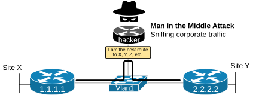
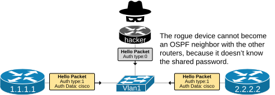
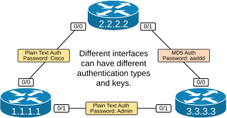
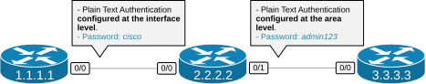

[OSPF Plain Text Authentication](https://www.networkacademy.io/ccna/ospf/ospf-plain-text-authentication)
==========

# OSPF Plain Text Authentication

Nowadays, security is a top priority of every large organization. In that context, OSPF authentication provides several security benefits, particularly in environments where network integrity and data confidentiality are essential.

OSPFv2 supports three different types of authentication - None (Type 0), Plain Text (Type 1), and MD5 (Type 2). Additionally, Cisco has introduced more sophisticated cryptographic authentication (HMAC-SHA) in the newest software releases.

You can download the EVE-NG file used in this lab at the end of the lesson to practice the topic yourself.

## Why do we need OSPF Authentication?

By default, **all OSPF-enabled interfaces are set to authentication type 0 (None)**, meaning no authentication at all. From a security standpoint, this implies that, with the default settings, nothing stops a rogue device from potentially joining your OSPF routing domain and injecting false routing information, as shown in the diagram below.


Figure 1. Why do we need OSPF Authentication?

An unauthenticated OSPF network is vulnerable to various routing attacks, such as:

- **Route Injection -** In the control plane, a rogue device can introduce fake routes with better cost or shorter masks, causing misrouting of traffic or complete denial of service.
- **Man-in-the-Midlle (MiM)** - In the data plane, this leads to intercepting and snooping on corporate traffic, as shown in the diagram below.
- **Denial of Service (DoS)** - The rouge device can also flood the network with an excessive number of LSAs, overwhelming all other devices in the area.



Figure 2. Man in the middle Attack.

OSPF authentication ensures only authorized routers can become neighbors and exchange routing information. This prevents unauthorized devices from participating in your OSPF network and sending incorrect routes that could cause network disruptions.

It is important to understand that OSPF authentication does not protect the traffic flowing across the network. It only protects the integrity of the routing information that routers exchange.

## What is Plain Text Authentication work?

Let's start with the most basic form of authentication that the protocol supports - Plain Text Authentication.

It is the most basic OSPF security mechanism, protecting routers from accepting OSPF messages from malicious devices, as shown in the diagram below.



Figure 3. OSPF Plain Text Password.

Routers on the same data link should use the same authentication type and password over that link; otherwise, they cannot form neighbor relationships.

Plain Text Authentication means the password goes in clear text over the OSPF messages. It is the most basic form of security because everybody that has access to the packets can see the password. However, it is obviously more secure than not having a password at all.

### How does Plain Text Authentication work?

OSPF authentication is enabled per interface. When enabled, the router verifies the authentication key of each routing update packet it receives on that interface. Each neighbor on the link must share the same authenticating key. The key is often called the "password" and is set at each interface during configuration. You can configure different authentication types and keys on a router, as shown in the diagram below.



Figure 4. Per-interface Auth Type and Key.

The following traffic capture shows an OSPF hello packet with plain-text authentication enabled. Notice that the Auth Type is 1 (meaning clear text), and the Auth Data (the password) is clearly visible. Hence, the security level that this Auth Type provides is minimal because every malicious person with access to a traffic-capturing tool can see the password.

```plaintext
# Traffic capture of a Hello Packet with Plain Text Auth
Open Shortest Path First
    OSPF Header
        Version: 2
        Message Type: Hello Packet (1)
        Packet Length: 48
        Source OSPF Router: 1.1.1.1
        Area ID: 0.0.0.0 (Backbone)
        Checksum: 0xd08e [correct]
        Auth Type: Simple password (1)
        Auth Data (Simple): Cisco
    OSPF Hello Packet
        Network Mask: 255.255.255.0
        Hello Interval [sec]: 10
        Options: 0x12, (L) LLS Data block, (E) External Routing
        Router Priority: 1
        Router Dead Interval [sec]: 40
        Designated Router: 10.1.1.2
        Backup Designated Router: 10.1.1.1
        Active Neighbor: 2.2.2.2
    OSPF LLS Data Block
        Checksum: 0x7fc6
        LLS Data Length: 32 bytes
        Extended options TLV
        Unknown LLS TLV
        Unknown LLS TLV
```

Because the password is clear and easily findable, this authentication type is not recommended for use in the organization's security strategy. It can be used as a tool to avoid accidental neighborships due to misconfiguration and other human errors, but not against malicious routing attacks.

### Configuring Plain Text Authentication

Cisco IOS-XE gives us two options to enable clear text authentication on a router.

- On the **interface level**, use the following two steps:
    - Step 1. Under the interface configuration mode, enable the ospf authentication using the **ip ospf authentication** command.
    - Step 2. Set the password using the **ip ospf authentication-key [password]** command.
- On an **Area level**, use the following two steps:
    - Step 1. Under the routing process configuration mode, enable the ospf authentication using the **area [area-id] authentication** command
    - Step 2. Under each interface in that area, set the password using the **ip ospf authentication-key [password]** command.

Using the area-level method provides some scaling from a configuration point of view. If the router has multiple interfaces in the same area (for example, it is an internal router with 5 interfaces in Area 34), you can enable Auth Type 1 (Clear Text) for all interfaces in Area 34. Then, you can set the password of each interface under the interface configuration mode. However, at the end of the day, both methods enable clear-text authentication on router interfaces.

### Configuration Example

Let's now walk through the following configuration example, which will show the differences between the interface-level and the area-level configuration methods. We use the following lab topology.



Figure 5. Configuration Topology.

There are three routers that are directly connected, as shown in the diagram, and run a single area 0.

Let's configure OSPF plain text authentication using both methods.

### Interface-level configuration

On each router, configure authentication and the password directly on the interface.

**R1 configuration:**

```plaintext
R1(config)# interface GigabitEthernet0/0
R1(config-if)# ip ospf authentication
R1(config-if)# ip ospf authentication-key cisco
```

**R2 configuration:**

```plaintext
R2(config)# interface GigabitEthernet0/0
R2(config-if)# ip ospf authentication
R2(config-if)# ip ospf authentication-key cisco
```

That's it. With these commands, OSPF packets between R1 and R2 will include a plain text password "cisco" in the OSPF header.

### Area-level configuration

Using the area-level method, you enable authentication once for the entire area and then set the key per interface.

**R1 configuration:**

```plaintext
R1(config)# router ospf 1
R1(config-router)# area 0 authentication
R1(config)# interface GigabitEthernet0/0
R1(config-if)# ip ospf authentication-key cisco
```

**R2 configuration:**

```plaintext
R2(config)# router ospf 1
R2(config-router)# area 0 authentication
R2(config)# interface GigabitEthernet0/0
R2(config-if)# ip ospf authentication-key cisco
```

Notice that the `area 0 authentication` command is under the OSPF router process, while the key is still configured per interface.

### Verifying OSPF authentication

**Check OSPF neighbor state:**

If authentication is successful, the neighbor relationship will reach the FULL state normally.

```plaintext
R1# show ip ospf neighbor

Neighbor ID     Pri   State           Dead Time   Address         Interface
10.0.0.2          1   FULL/DR         00:00:35    10.1.1.2        GigabitEthernet0/0
```

If authentication fails, the neighbor will be stuck in INIT or EXSTART state, and you'll see error messages like:

```plaintext
%OSPF-4-AUTH_ERROR: Invalid auth type or auth key mismatch
%OSPF-4-AUTH_ERROR: OSPF: Neighbor 10.0.0.2 dropped due to auth failure
```

**Check authentication on an interface:**

```plaintext
R1# show ip ospf interface GigabitEthernet0/0
GigabitEthernet0/0 is up, line protocol is up
  Internet Address 10.1.1.1/24, Area 0
  Process ID 1, Router ID 10.0.0.1, Network Type BROADCAST, Cost: 1
  Transmit Delay is 1 sec, State DR, Priority 1
  Neighbor Count is 1, Adjacent neighbor count is 1
  Crypto Authentication: None -> Plain text authentication
```

### Limitations of plain text authentication

- The password is sent **unencrypted** over the network. Anyone with a packet sniffer (like Wireshark) can read it.
- The password is stored **in plain text** in the running configuration (unless you use type 7 encryption which is easily reversible).
- It provides only basic protection against accidental misconfigurations, not against malicious attacks.

For better security, use **OSPF MD5 Authentication** instead.

## Summary

- **OSPF plain text authentication** adds a password to OSPF packets to verify that neighboring routers are authorized.
- Can be configured at the **interface level** (`ip ospf authentication`) or the **area level** (`area 0 authentication`).
- The password is configured with `ip ospf authentication-key {password}`.
- If authentication fails, the neighbor relationship stays in INIT or EXSTART and never reaches FULL.
- Plain text authentication is **not secure** — the password is visible in the packet and in the configuration. Use MD5 authentication for real security.
