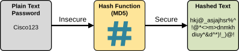
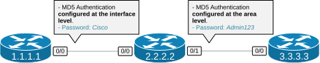
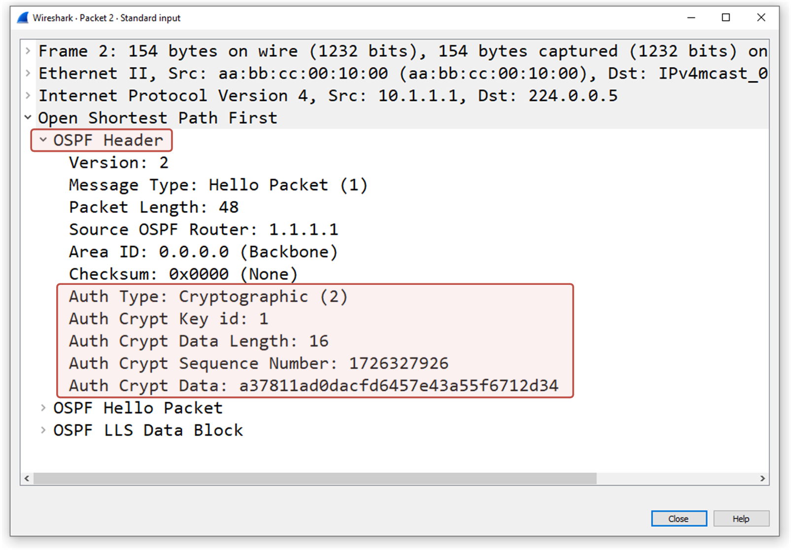

[OSPF MD5 Authentication](https://www.networkacademy.io/ccna/ospf/ospf-md5-authentication)
==========

# OSPF MD5 Authentication

The Open Shortest Path First (OSPF) routing protocol supports four different authentication types:

- **Type 0:** No authentication (default).
- **Type 1:** Plain-text authentication.
- **Type 2:** MD5 authentication.
- **Type 3:** HMAC-SHA authentication (HMAC-SHA-1, HMAC-SHA-256, etc.).

The previous lesson showed how Plain Text Authentication (Type 1) works and how to configure it on Cisco IOS-XE routers. This lesson shows the next OSPF authentication type: MD5 (Type 2).

## OSPF MD5 Authentication

The MD5 authentication is more secure than the clear text one that we saw in the last lesson. With MD5, routers do not send the configured password in clear text but only send the MD5 hash of it. If a malicious person captures the OSPF packet in transit, it won't be able to see the password, which is a considerable improvement over the clear-text method.


Figure 1. MD5 Authentication.

### What is MD5?

MD5 (Message Digest Algorithm 5) is a widely used cryptographic hash function that produces a 128-bit hash value, often represented as a 32-character hexadecimal number. It was introduced in 1991 as a way to verify data integrity by generating a "fingerprint" of a message or file, as shown in the diagram below.



Figure 2. What is MD5?

A key characteristic of the has function is that regardless of the size of the input, MD5 always generates a 128-bit hash value, which makes it very deterministic. For example, the password Cisco results in the hash "7b1d1185b835814de783483f686e9825".

However, MD5 is nowadays considered **cryptographically insecure** and is not used for sensitive services such as banking and fintech.

## Configuring MD5 Authentication

We can configure MD5 authentication on a Cisco IOS router using two different approaches - per-interface and per-area.

### Configuring MD5 Auth Per-Interface

Generally, the MD5 authentication is configured per interface using the following two steps:

- **Step 1.** Enable Authentication on the interface using the **ip ospf authentication message-digest** command under the interface configuration mode. The keyword message-digest means we want to use the message-digest algorithm (MD5).
- **Step 2.** Set the password using the **ip ospf message-digest-key [key] md5 [pwd]** command where the key is an integer between 1 and 255 and the pwd is the password string.

Notice that the password must not exceed 16 characters. Larger passwords are truncated. Characters can be any ASCII symbol, including the question mark **?** and space at the end, which can be tricky in exam environments. (hint: to enter a question mark via the CLI, press ctr-V to disable contextual help)

### Configuring MD5 Auth Per-Area

To configure the same auth type per area, we follow these two steps:

- **Step 1**. Under the routing process, we configure the **area [area-id] authentication message-digest** command for the area on which we want to enable authentication.
- **Step 2**. We configure the **ip ospf message-digest-key [key] md5 [pwd]** command under the interface configuration mode for every interface in the area.

### Configuration Example

Now, let's walk through a configuration example using the following simple topology.



Figure 3. Initial Topology.

We have three directly connected routers that run a single-area OSPF.

#### Per-Interface Configuration

Let's first configure the authentication between R1 and R2 using the per-interface approach.

```plaintext
R1# conf t
Enter configuration commands, one per line.  End with CNTL/Z.
R1(config)# interface e0/0
R1(config-if)# ip ospf authentication message-digest 
R1(config-if)# ip ospf message-digest-key 1 md5 Cisco
R1(config-if)# end
R1#
```

```plaintext
R2# conf t
Enter configuration commands, one per line.  End with CNTL/Z.
R2(config)# interface e0/0
R2(config-if)# ip ospf authentication message-digest 
R2(config-if)# ip ospf message-digest-key 1 md5 Cisco
R2(config-if)# end
R2#
```

Notice that the key number must match on both ends. Otherwise, the neighborship won't come up. Once the configuration is complete, we can make a traffic capture and see the results.

The following screenshot shows an OSPF Hello packet that R1 sends over interface Eth0/0. Notice the highlighted portion of the header:

- The Auth Type is 2, meaning MD5.
- The Key number is part of the header. Both ends must agree on the key ID.
- The password is no longer a clear text. Instead, the cryptographic hash is sent in the packet.



Figure 4. Hello Packet with MD5 Authentication.

You can see the improvement over the plain-text security we saw in the previous lesson.

#### Per-Area Configuration

Now, let's configure the authentication between R2 and R3 using the per-area approach.

```plaintext
R2# conf t
Enter configuration commands, one per line.  End with CNTL/Z.
R2(config)# router ospf 1
R2(config-router)# area 0 authentication message-digest 
R2(config-router)# exit
!
R2(config)# int e0/1
R2(config-if)# ip ospf message-digest-key 1 md5 Admin123
R2(config-if)# exit
!
```

```plaintext
R3# conf t
Enter configuration commands, one per line.  End with CNTL/Z.
R3(config)# router ospf 1
R3(config-router)# area 0 authentication message-digest 
R3(config-router)# exit
!
R3(config)# int e0/1
R3(config-if)# ip ospf message-digest-key 1 md5 Admin123
R3(config-if)# exit
!
```

Remember that we can additionally enable the password-encryption feature on every router so that password are not visible in the running configuration, as shown in the output below.

```plaintext
R2# conf t
Enter configuration commands, one per line.  End with CNTL/Z.
R2(config)# service password-encryption 
R2(config)# end
R2#
R2# show run interface e0/1
!
interface Ethernet0/1
 ip address 10.1.2.2 255.255.255.0
 ip ospf message-digest-key 1 md5 7 072E25414707485744
end
```

### Verifications

The verification and troubleshooting steps are the same as with the plain-text security we saw in the previous lesson.

Using the following command, we can see if an authentication type is configured on an area level. In our example, it is, as you can see, highlighted in blue.

```plaintext
R2# sh ip ospf 
 Routing Process "ospf 1" with ID 2.2.2.2
 Start time: 00:00:02.892, Time elapsed: 01:05:52.046
 Supports only single TOS(TOS0) routes
 Supports opaque LSA
 Supports Link-local Signaling (LLS)
 Supports area transit capability
 Supports NSSA (compatible with RFC 3101)
 Supports Database Exchange Summary List Optimization (RFC 5243)
 Maximum number of non self-generated LSA allowed 50000
    Current number of non self-generated LSA 3
    Threshold for warning message 75%
    Ignore-time 5 minutes, reset-time 10 minutes
    Ignore-count allowed 5, current ignore-count 0
 Event-log enabled, Maximum number of events: 1000, Mode: cyclic
 Router is not originating router-LSAs with maximum metric
 Initial SPF schedule delay 50 msecs
 Minimum hold time between two consecutive SPFs 200 msecs
 Maximum wait time between two consecutive SPFs 5000 msecs
 Incremental-SPF disabled
 Initial LSA throttle delay 50 msecs
 Minimum hold time for LSA throttle 200 msecs
 Maximum wait time for LSA throttle 5000 msecs
 Minimum LSA arrival 100 msecs
 LSA group pacing timer 240 secs
 Interface flood pacing timer 33 msecs
 Retransmission pacing timer 66 msecs
 EXCHANGE/LOADING adjacency limit: initial 300, process maximum 300
 Number of external LSA 0. Checksum Sum 0x000000
 Number of opaque AS LSA 0. Checksum Sum 0x000000
 Number of DCbitless external and opaque AS LSA 0
 Number of DoNotAge external and opaque AS LSA 0
 Number of areas in this router is 1. 1 normal 0 stub 0 nssa
 Number of areas transit capable is 0
 External flood list length 0
 IETF NSF helper support enabled
 Cisco NSF helper support enabled
 Reference bandwidth unit is 100 mbps
    Area BACKBONE(0)
        Number of interfaces in this area is 2
        Area has message digest authentication
        SPF algorithm last executed 00:01:13.031 ago
        SPF algorithm executed 14 times
        Area ranges are
        Number of LSA 5. Checksum Sum 0x02794C
        Number of opaque link LSA 0. Checksum Sum 0x000000
        Number of DCbitless LSA 0
        Number of indication LSA 0
        Number of DoNotAge LSA 0
        Flood list length 0
 Maintenance Mode ID:     140695246863152
 Maintenance Mode:        disabled
 Maintenance Mode Timer:  stopped (0)
  Graceful Reload FSU Global status : None (global: None)
```

Using the following command, we can check whether authentication is enabled on a particular interface and the key-id that is being used.

```plaintext
R1# sh ip ospf interface e0/0
Ethernet0/0 is up, line protocol is up 
  Internet Address 10.1.1.1/24, Interface ID 2, Area 0
  Attached via Network Statement
  Process ID 1, Router ID 1.1.1.1, Network Type BROADCAST, Cost: 10
  Topology-MTID    Cost    Disabled    Shutdown      Topology Name
        0           10        no          no            Base
  Transmit Delay is 1 sec, State BDR, Priority 1
  Designated Router (ID) 2.2.2.2, Interface address 10.1.1.2
  Backup Designated router (ID) 1.1.1.1, Interface address 10.1.1.1
  Timer intervals configured, Hello 10, Dead 40, Wait 40, Retransmit 5
    oob-resync timeout 40
    Hello due in 00:00:08
  Supports Link-local Signaling (LLS)
  Cisco NSF helper support enabled
  IETF NSF helper support enabled
  Can be protected by per-prefix Loop-Free FastReroute
  Can be used for per-prefix Loop-Free FastReroute repair paths
  Not Protected by per-prefix TI-LFA
  Index 1/1/1, flood queue length 0
  Next 0x0(0)/0x0(0)/0x0(0)
  Last flood scan length is 2, maximum is 2
  Last flood scan time is 0 msec, maximum is 0 msec
  Neighbor Count is 1, Adjacent neighbor count is 1 
    Adjacent with neighbor 2.2.2.2  (Designated Router)
  Suppress hello for 0 neighbor(s)
  Cryptographic authentication enabled
    Youngest key id is 1
```

However, the best approach to troubleshooting is to check the running configuration. It is the only viable way to actually see the password (if service password encryption is not used).

```plaintext
R2# sh run | section router
router ospf 1
 router-id 2.2.2.2
 area 0 authentication message-digest
 network 10.0.0.0 0.255.255.255 area 0
```

```plaintext
R2# sh run interface e0/0
Building configuration...
Current configuration : 143 bytes
!
interface Ethernet0/0
 ip address 10.1.1.2 255.255.255.0
 ip ospf authentication message-digest
 ip ospf message-digest-key 1 md5 Cisco
end
```

Remember that the MD5 hashing is considered **cryptographically insecure** these days and can be cracked. Therefore, implementing it in production does not guarantee that the network domain is secured from routing attacks. That's why Cisco has introduced another authentication type - HMAC-SHA, which is considered more secure.
