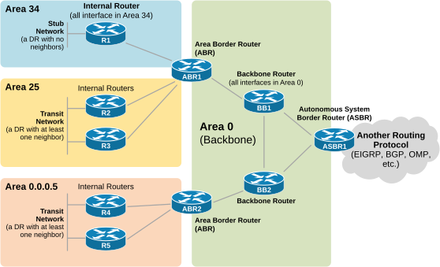
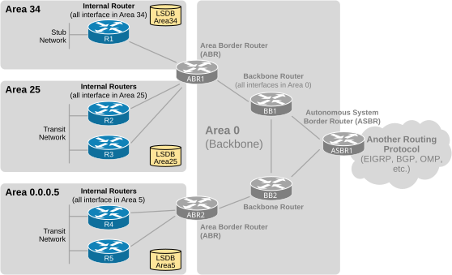
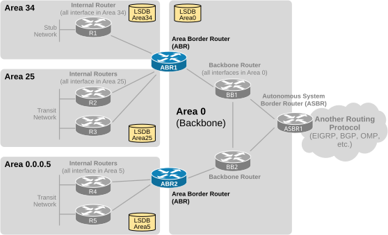
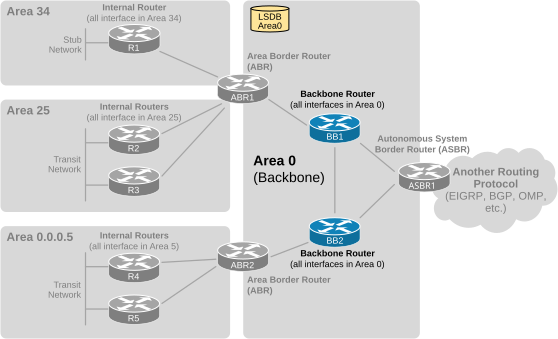
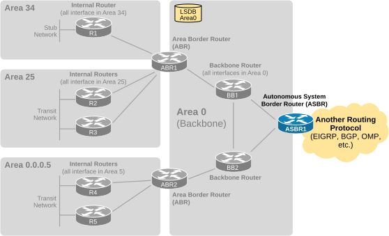
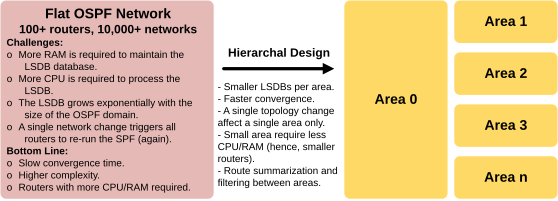
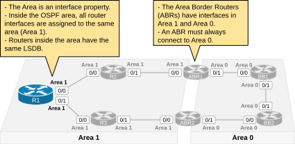
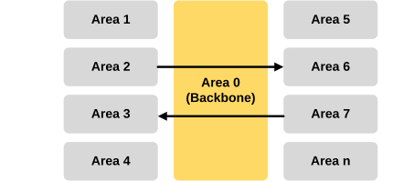
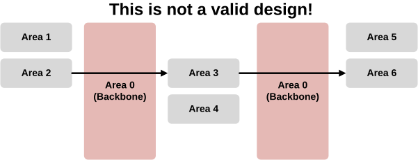

[Multi-Area OSPF - Design Terms](https://www.networkacademy.io/ccna/ospf/multi-area-ospf-design-terms)
==========

# Multi-Area OSPF - Design Terms

Open Shortest Path First is a very scalable routing protocol. Its design supports scalability by using a concept called **OSPF Area**. By dividing a large monolith network into multiple smaller areas, the protocol reduces complexity, limits routing table size, and minimizes the impact of network changes. But what exactly is an Area?

It is very important to understand from the beginning that **the OSPF Area is an interface property**. Every interface that participates in the routing process exists in an area.

## OSPF Design Terminology

The area assignment is made at the interface level. When configuring the routing process, you specify the area to which an interface belongs. This means that different interfaces on the same router can belong to a single area or different areas.



Figure 1. OSPF Design Terminology.

Based on whether all router interfaces connect to the same area or multiple different areas, we classify it as one of the following: internal router, backbone router, ABR, or ASBR. Let's see what each one means.

### Internal Routers

An internal router is one whose directly connected interfaces are all assigned to the same non-backbone area. For example, routers R1 through R5 are all internal routers.

- R1 is internal to area 34.
- R2 and R3 are internal routers to area 25.
- R4 and R5 are internal to area 5.



Figure 2. Internal Routers.

Internal routers have a single link-state database (LSDB) because they belong to only one area. For example, R1 has only one LSDB where it stores all LSAs flooded in Area 34.

```plaintext
R1# sh ip ospf database   
  
            OSPF Router with ID (10.34.2.1) (Process ID 1)
            
                Router Link States (Area_34)
Link ID         ADV Router      Age         Seq#       Checksum Link count
10.34.2.1       10.34.2.1       40          0x80000004 0x003CE1 2         
10.34.2.6       10.34.2.6       33          0x80000006 0x0097BB 1  
       
                Net Link States (Area_34)
Link ID         ADV Router      Age         Seq#       Checksum
10.34.2.6       10.34.2.6       45          0x80000001 0x006905

                Summary Net Link States (Area_34)
Link ID         ADV Router      Age         Seq#       Checksum
10.0.1.0        10.34.2.6       89          0x80000001 0x00C231
10.0.2.0        10.34.2.6       44          0x80000002 0x007E5F
10.0.3.0        10.34.2.6       44          0x80000001 0x0011D6
10.0.4.0        10.34.2.6       44          0x80000001 0x0006E0
10.0.5.0        10.34.2.6       44          0x80000001 0x005F7C
10.5.1.0        10.34.2.6       43          0x80000001 0x0018AE
10.5.2.0        10.34.2.6       43          0x80000001 0x00A827
10.5.3.0        10.34.2.6       43          0x80000001 0x009D31
10.25.1.0       10.34.2.6       44          0x80000001 0x00F9D6
10.25.2.0       10.34.2.6       89          0x80000001 0x008A4F
10.25.3.0       10.34.2.6       89          0x80000001 0x007F59
```

Notice that all LSAs (Types 1, 2, and 3) are in Area\_34. This implies that the device is internal to Area\_34.

### Area Border Routers (ABR)

When a router has interfaces in one or more areas and at least one interface connected to the backbone area, it is called **an Area Border Router (ABR)**. For example,

- ABR1 is an ABR with interfaces in Area 0, Area 34, and Area 25.
- ABR2 is also an ABR with interfaces in Area 0 and Area 0.0.0.5.

Area Border Routers have multiple instances of the LSDB database. For example,

- ABR1 has three LSDB instances - Areas 0, 25, and 34.
- ABR2 has two LSDB instances - Areas 0 and Area 0.0.0.5.



Figure 3. Area Border Routers (ABR).

**It is essential to remember that a router must be connected to Area 0 (the backbone) to be considered an ABR.** For example, if ABR1 loses connection to the backbone area, it won't provide connectivity between Areas 25 and 34 even though its interfaces are up/up in both areas.

The following CLI output shows that ABR1 has three instances of the link-state database (LSDB).

```plaintext
ABR1# sh ip ospf database 

            OSPF Router with ID (10.34.2.6) (Process ID 1)
            
                Router Link States (Area_0)
Link ID         ADV Router      Age         Seq#       Checksum Link count
10.0.4.8        10.0.4.8        186         0x80000008 0x00F254 3         
10.0.5.9        10.0.5.9        187         0x80000007 0x009F9C 3         
10.5.3.7        10.5.3.7        179         0x80000006 0x0029A2 1         
10.34.2.6       10.34.2.6       185         0x80000005 0x00D8C1 1         
172.16.0.1      172.16.0.1      178         0x80000005 0x003AF2 2   
      
                Net Link States (Area_0)
Link ID         ADV Router      Age         Seq#       Checksum
10.0.1.6        10.34.2.6       188         0x80000001 0x00F0B9
10.0.2.7        10.5.3.7        192         0x80000001 0x00FCDF
10.0.3.9        10.0.5.9        190         0x80000001 0x00CE0F
10.0.4.10       172.16.0.1      194         0x80000001 0x004A46
10.0.5.10       172.16.0.1      194         0x80000001 0x005A33

                Summary Net Link States (Area_0)
Link ID         ADV Router      Age         Seq#       Checksum
10.5.1.0        10.5.3.7        196         0x80000001 0x00C639
10.5.2.0        10.5.3.7        236         0x80000001 0x0057B1
10.5.3.0        10.5.3.7        236         0x80000001 0x004CBB
10.25.1.0       10.24.2.6       188         0x80000001 0x00F9D6
10.25.2.0       10.24.2.6       233         0x80000001 0x008A4F
10.25.3.0       10.24.2.6       233         0x80000001 0x007F59
10.34.1.0       10.24.2.6       188         0x80000001 0x008D3A
10.34.2.0       10.24.2.6       233         0x80000001 0x001EB2

                Router Link States (Area_25)
Link ID         ADV Router      Age         Seq#       Checksum Link count
10.25.2.2       10.25.2.2       186         0x80000006 0x00F429 2         
10.25.3.3       10.25.3.3       186         0x80000006 0x0029EC 2         
10.34.2.6       10.34.2.6       184         0x80000007 0x00EB07 2   
      
                Net Link States (Area_25)
Link ID         ADV Router      Age         Seq#       Checksum
10.25.1.3       10.25.3.3       190         0x80000001 0x009603
10.25.2.6       10.34.2.6       188         0x80000001 0x007708
10.25.3.6       10.34.2.6       188         0x80000001 0x0087F4
          
                Summary Net Link States (Area_25)
Link ID         ADV Router      Age         Seq#       Checksum
10.0.1.0        10.34.2.6       233         0x80000001 0x00C231
10.0.2.0        10.34.2.6       187         0x80000002 0x007E5F
10.0.3.0        10.34.2.6       188         0x80000001 0x0011D6
10.0.4.0        10.34.2.6       188         0x80000001 0x0006E0
10.0.5.0        10.34.2.6       188         0x80000001 0x005F7C
10.5.1.0        10.34.2.6       186         0x80000001 0x0018AE
10.5.2.0        10.34.2.6       186         0x80000001 0x00A827
10.5.3.0        10.34.2.6       186         0x80000001 0x009D31
10.34.1.0       10.34.2.6       188         0x80000001 0x008D3A
10.34.2.0       10.34.2.6       233         0x80000001 0x001EB2

                Router Link States (Area_34)
Link ID         ADV Router      Age         Seq#       Checksum Link count
10.34.2.1       10.34.2.1       185         0x80000004 0x003CE1 2         
10.34.2.6       10.34.2.6       176         0x80000006 0x0097BB 1 
        
                Net Link States (Area_34)
Link ID         ADV Router      Age         Seq#       Checksum
10.34.2.6       10.34.2.6       188         0x80000001 0x006905

                Summary Net Link States (Area_34)
Link ID         ADV Router      Age         Seq#       Checksum
10.0.1.0        10.24.2.6       233         0x80000001 0x00C231
10.0.2.0        10.24.2.6       187         0x80000002 0x007E5F
10.0.3.0        10.24.2.6       188         0x80000001 0x0011D6
10.0.4.0        10.24.2.6       188         0x80000001 0x0006E0
10.0.5.0        10.24.2.6       188         0x80000001 0x005F7C
10.5.1.0        10.24.2.6       186         0x80000001 0x0018AE
10.5.2.0        10.24.2.6       186         0x80000001 0x00A827
10.5.3.0        10.24.2.6       186         0x80000001 0x009D31
10.25.1.0       10.24.2.6       188         0x80000001 0x00F9D6
10.25.2.0       10.24.2.6       233         0x80000001 0x008A4F
10.25.3.0       10.24.2.6       233         0x80000001 0x007F59
```

Notice that ABR1 has LSAs Type 1,2, and 3 for all the areas it connects to - 0, 25, and 34.

This can also be checked using the following command.

```plaintext
ABR1#  sh ip ospf database database-summary 

            OSPF Router with ID (10.34.2.6) (Process ID 1)
            
Area_0 database summary
  LSA Type      Count    Delete   Maxage
  Router        5        0        0       
  Network       5        0        0       
. . .       
Area_25 database summary
  LSA Type      Count    Delete   Maxage
  Router        3        0        0       
  Network       3        0        0       
. . .    
Area_34 database summary
  LSA Type      Count    Delete   Maxage
  Router        2        0        0       
  Network       1        0        0           
. . .   
```

It clearly shows that the ABR has three LSDB databases and the number of LSAs inside each database.

### Internal Backbone Routers

A router that is internal to Area 0 is considered **an internal backbone router.** Notice the following semantic terms:

- **An internal** router has all its OSPF interfaces in the same area.
- **A backbone** router has at least one interface in Area 0.

All interfaces of an internal backbone device are assigned to area 0 only, as shown in the diagram below.



Figure 4. Backbone Routers.

For example, devices BB1 and BB2 are considered internal backbone routers. They have only a single link-state database (LSDB).

### Autonomous System Border Routers (ASBR)

When a router redistributes another routing protocol into the OSPF domain, it is called **an Autonomous System Border Router (ASBR)**.

An ASBR connects to multiple Autonomous Systems and exchanges routing information between them. Hence, the ASBR runs OSPF and another routing protocol or routing process of the same protocol.



Figure 5. Autonomous System Border Router (ASBR).

For example, ASBR1 redistributes BGP into OSPF. Every router within the network knows how to reach the ASBR, which runs BGP and knows how to reach external networks.

## Why are these design terms important?

When engineers discuss the Open Shortest Path First protocol, everybody assumes you know the terms and what they imply. For example, nobody says, "The device that connects Area 34 to the backbone". Everybody says, "Area 34's ABR".

The ABRs are probably the most important devices inside the OSPF network. They connect different areas to the backbone and implement most network logic, such as **route summarization and LSA filtering**.

It is important to remember that a router must connect to Area\_0 to be considered an ABR.

## Why do we need to divide the network into OSPF Areas?

The OSPF protocol uses **a very CPU-intensive algorithm** called the SPF. It performs a number of calculations depending on the size of the link-state database (the LSDB). For given N LSAs in the LSDB, the algorithm performs computations proportional to N\*logN. As a result, the larger the link-state database, the greater the risk of performance-related issues due to frequent protocol recalculations. This was especially prominent back in the old days when routers had a few MB of RAM and less powerful single-core CPUs.

Establishing a logical hierarchy is key to building large-scale networks. Dividing the network into multiple areas reduces the size of each area's LSDB database. Hence, reducing the CPU and RAM required to store the LSDB and run the SPF calculations, leading to a more stable network and faster network convergence.



Figure 6. Why do we need OSPF Areas?

OSPF was the first major routing protocol to support hierarchical networking within a single routing domain (an autonomous system). It supports two levels of hierarchy:

- a backbone area (Area\_0)
- additional areas connected to the backbone Area\_0.

This hierarchical design allowed the network to scale without sacrificing convergence speed and effectiveness. However, the hierarchical area design has some special characteristics, so a proper network design is required.

## What is an OSPF Area?

The area is a property of each interface that is OSPF-enabled, as you can see in the output below.

```plaintext
R1# sh ip ospf interface brief 
Interface    PID   Area            IP Address/Mask    Cost  State Nbrs F/C
Et0/3        1     34              10.34.3.1/24       10    DR    1/1
Et0/2        1     34              10.34.2.1/24       10    DR    1/1
Et0/1        1     34              10.34.1.1/24       10    DR    0/0
Et0/0        1     34              10.34.0.1/24       10    BDR   1/1
```

Essentially, an area is a contiguous part of the network achieved by configuring all router interfaces of all devices with the same Area\_ID. It hides the area's topology from routers outside of it, eliminating the need to run the SPF algorithm by outside devices when the topology changes.



Figure 7. Characteristics of OSPF Areas.

Each area maintains a separate link-state database (LSDB), which reduces the required RAM and CPU.

### The Backbone Area 0

Area\_0 is a special case - it is the first level of the two-level hierarchy of the routing protocol. It is responsible for connecting and distributing routing information between all non-backbone areas, as shown in the diagram below.



Figure 8. The Backbone.

Something very important to remember is that you cannot configure Area 0 on some routers somewhere in the network and Area 0 on another part of the network. **Area 0 must be contiguous**. It must be one part. It cannot be divided into multiple parts that are not connected, as shown in the diagram below.



Figure 9. The backbone area - Invalid design.

For example, if you have two non-contiguous segments of Area 0 separated by another area (e.g., Area\_3), as shown in the diagram above, **the OSPF design would be invalid** because the backbone is not contiguous. Certain parts of the network simply won't have connectivity, while others may only have partial connectivity.

### Full Content Access is for Subscribed Users Only...

- **Learn any CCNA, CCIE or Network Automation topic** with animated explanation.
- **We focus on simplicity.** Networking tutorials and examples written in simple, understandable language.

[Sign up for free ►](https://networkacademy.io/user/register)
