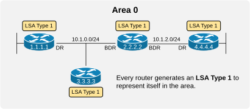
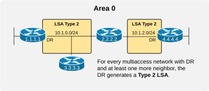
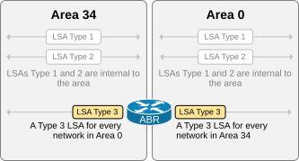
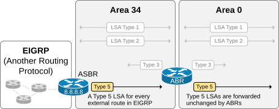
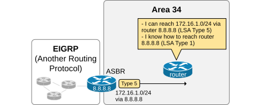
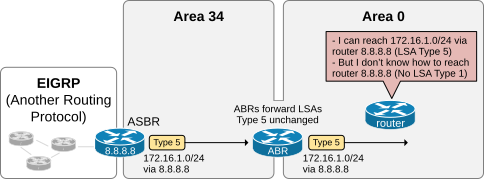

[LSA Types 4 and 5](https://www.networkacademy.io/ccna/ospf/lsa-types-4-and-5)
==========

# LSA Types 4 and 5

In the previous lesson, we learned what OSPF Multi-Area is and the terminology related to the multi-area design.

This lesson goes further and explains how external routing protocol is redistributed into the OSPF domain and what are the roles of LSAs Type 4 and 5.

## Link-State Advertisments

Let's quickly review the three basic LSA types and their functions in the OSPF operation. We won't go into great detail about each one as we already had a lesson that explains each LSA in depth. You can find it [here](https://www.networkacademy.io/ccna/ospf/lsa-types-1-2-3).

### Type 1 - Router LSA

LSAs Type 1 and 2 are the topological LSAs. The SPF algorithm uses them to build the area's topology and to calculate the best paths to every destination inside the area. The following diagram shows an example of an area and the Router LSAs that are present.



Figure 1. Router LSA.

**Every router in the area generates one Router LSA (Type 1)** that represents itself in the area. It includes the following information:

- The RID of the originating device.
- Information about every interface (IP address/Mask/Cost/etc.)
- Current interface status.

Let's look at the example shown in Figure 1. There are four routers in the area. Therefore, the LSDB of each OSPF node will have four Router LSAs uniquely identified by the RID of the originating device.

### Type 2 - Network LSA

For every multiaccess segment with **a Designated Router and at least one more neighbor**, the DR generates a Type 2 LSA that describes the network.



Figure 2. Network LSA.

For example, router 1.1.1.1 is the DR on segment 10.1.0.0/24. It generates a Type 2 LSA for the network and floods it inside the area. Similarly, for network 10.1.2.0/24, router 4.4.4.4 is the DR, so it generates a Type 2 link-state advertisement and floods it.

It is important to understand that **a single-area OSPF network only needs LSAs type 1 and 2 to function**. All other link-state advertisement types are required in multi-area OSPF networks. It is also important to remember that only these two LSA types hold topological information. A change in one of the two types triggers the entire area to run the SPF algorithm.

### Type 3 - Summary LSA

The OSPF area is a property of each interface. When a router configures multiple interfaces with different area IDs, it becomes an Area Border Router (ABR). ABRs connect areas together by generating Type 3 LSAs for each network that exists in one area into the other, as shown below.



Figure 3. Summary LSA.

For example, the ABR in the diagram above generates a Type 3 LSA into Area 34 for every network in Area 0 and vice versa. Type 3 is called a Summary LSA because **it does not contain any topological information** but only the subnet, the mask, and the ABR's lowest cost to reach it. Hence, it is a high-level summary of an external network that exists in another area. That's why it is called the Summary LSA.

### Types 1, 2, and 3 round-up

The following table summarizes the key aspects of LSAs types 1, 2, and 3 that we have briefly discussed as a context for the next part of the lesson.

**LSA Type** | **Common Name** | **Represents** | **Created By** | **LSID** | **Description**
--- | --- | --- | --- | --- | ---
1 | Router LSA | A router inside the area | Each router in the area | LSID is the RID | - Each router creates a LSA Type 1 to represent itself in the area. - The LSA describes the router's own interfaces, their states, IP addresses/Mask, and costs.
2 | Network LSA | A subnet with a DR and at least one neighbor | The DR on that subnet | LSID is the DR address | - The DR establishes full OSPF adjacency with every router on the multiaccess segment, so it knows which router really connects to the segment. - For a network that has a DR and at least one more neighbor, the DR creates and floods a Network LSA to list all routers connected to the multiaccess segment. - For a network where no other router is present except for the DR, no Network LSA is generated. The network is considered a "Stub Network". - For a network where no DR is present at all (for example, all routers have IP ospf priority 0), no network LSA is generated.
3 | Summary LSA | A subnet in another area | The ABR of the area | LSID is the subnet address | - The Area Border Router (ABR) connects to two areas. It generates a Summary LSA to provide summary information about networks in one area to the other area. - One LSA Type 3 per inter-area network.

## LSAs Type 4 and 5

One OSPF multi-area network only needs LSAs types 1, 2, and 3 to function. The other two types, 4 and 5, are only required when **information from another routing protocol needs to be advertised into the OSPF network**.

### Type 5 - External LSA

When a router is connected to the OSPF domain and another routing protocol, it is called the Autonomous System Border Router (ASBR). The ASBR redistributes an external routing protocol into the OSPF domain by generating a Type 5 LSA (called External LSA) for every external route in the external routing protocol.

For example, if the ASBR redistributes 20 EIGRP routes into the OSPF network, it generates 20 Type 5 LSAs and floods them into the OSPF area it connects to, as shown in the diagram below.



Figure 4. Redistributing external routing protocol into OSPF.

The Type 5 LSAs are then forwarded unchanged by the Area Border Routers (ABRs) to all other normal areas.

The following output shows the content of one Type 5 LSA that ASBR 8.8.8.8 floods into Area 34 to represent the external EIGRP route 172.16.1.0/24. Notice that the LSID is the subnet address of the external route, and the Advertising Router is the RID of the Autonomous System Boundary Router (ASBR), which redistributes the link-state advertisement.

```plaintext
ASBR# sh ip ospf database external 
            OSPF Router with ID (8.8.8.8) (Process ID 5)
                Type-5 AS External Link States
  LS age: 8
  Options: (No TOS-capability, DC, Upward)
  LS Type: AS External Link
  Link State ID: 172.16.1.0 (External Network Number )
  Advertising Router: 8.8.8.8
  LS Seq Number: 80000001
  Checksum: 0x8442
  Length: 36
  Network Mask: /24
        Metric Type: 2 (Larger than any link state path)
        MTID: 0 
        Metric: 20 
        Forward Address: 0.0.0.0
        External Route Tag: 0
```

Now, let's see how routers inside the OSPF domain can reach external routes. When an internal router inside the area where the ASBR connects receives an LSA Type 5, it goes through the following steps, illustrated in the diagram below.



Figure 5. Connectivity to external routes.

- The router understands it can reach the external network (172.16.1.0/24) via the advertising ASBR (8.8.8.8).
- The router knows how to reach the ASBR (8.8.8.8). All routers inside the area have the ASBR's Router LSA and can reach it over the shortest available path.

This is how the redistribution of external routes works at a high level in OSPF. However, this is not the entire story. Let's see how internal routers in other areas (which the ASBR does not directly connect to) reach the external networks. Consider the following example from the point of view of a router inside area 0. When it receives the LSA Type 5 from the ABR, it goes through the following steps, illustrated in the diagram below.



Figure 6. Connectivity to external routes from other areas.

- The router understands it can reach the external network (172.16.1.0/24) via the advertising ASBR (8.8.8.8).
- The router doesn't know how to reach the ASBR (8.8.8.8) and doesn't have the ASBR's Router LSA (8.8.8.8). Recall that LSAs type 1 and 2 are local for an area and are not re-advertised between areas by ABRs.

The bottom line is that routers inside Area 0 cannot reach the redistributed external routes even though they receive the Type 5 LSAs. So what is the solution? - Here comes the role of the LSA Type 4 (ASBR Summary LSA).

### Type 4 - ASBR Summary LSA

When an Area Border Router (ABR) is connected to an area where ASBR is present, it generates one additional link-state advertisement called ABR Summary into the other areas it connects to.

### Type 4 — ASBR Summary LSA

When an Area Border Router (ABR) is connected to an area where an ASBR is present, it generates one additional link-state advertisement called an ASBR Summary LSA into the other areas it connects to.

**What does a Type 4 LSA contain?**

- **Link State ID** — The Router ID of the ASBR.
- **Advertising Router** — The Router ID of the ABR that generated the LSA.
- **Metric** — The cost from the ABR to the ASBR.

The Type 4 LSA essentially tells routers in other areas: "The ASBR with Router ID X.X.X.X is reachable through me (the ABR), and it costs Y to get there."

**Example scenario (Figure 6):**

1. R3 is an ASBR in Area 1. It redistributes external network 172.16.1.0/24 into OSPF and generates a Type 5 LSA.
2. ABR R2 (connecting Area 0 and Area 1) receives R3's Type 5 LSA.
3. R2 forwards the Type 5 LSA into Area 0.
4. R2 also generates a Type 4 LSA with Link State ID = 8.8.8.8 (ASBR's Router ID) and floods it into Area 0.
5. Routers in Area 0 now know: 
   - The external network 172.16.1.0/24 exists (from Type 5 LSA).
   - The ASBR 8.8.8.8 is reachable via ABR R2 (from Type 4 LSA).
   - They calculate the complete path to 172.16.1.0/24.

**Without the Type 4 LSA**, routers in Area 0 would receive the Type 5 LSAs but wouldn't know how to reach the ASBR, making the external routes unreachable.

### Type 5 — AS-External LSA

Type 5 LSAs carry information about networks that are external to the OSPF domain. They are generated by ASBRs.

**Key characteristics of Type 5 LSAs:**

- Originated by **ASBRs** only.
- Flooded throughout the entire OSPF domain (all areas), except stub areas and NSSAs.
- Describe **external routes** (networks learned from other routing protocols or static routes).
- Are **not associated with any specific area** (they are domain-wide).
- Two metric types: **E1** (Type 1) and **E2** (Type 2).

### E1 vs E2 External Routes

When an ASBR redistributes an external route, it can advertise it with one of two metric types.

**E2 (External Type 2)** — Default type. The metric in the LSA is the external cost only. Internal OSPF costs are not added. Example: If the external route has a metric of 20, every router in the OSPF domain sees the cost as 20, regardless of how far they are from the ASBR.

**E1 (External Type 1)** — The metric includes both the external cost and the internal OSPF cost to reach the ASBR. Example: If the external route has a metric of 20, and a router is 10 cost units away from the ASBR, the total cost is 30.

Use E1 when you want routers closer to a different ASBR to prefer that ASBR for certain external destinations (typically in dual-homed designs).

### Verifying Type 4 and Type 5 LSAs

**View Type 5 LSAs:**

```plaintext
R1# show ip ospf database external

            OSPF Router with ID (10.0.0.1) (Process ID 1)

                Type-5 AS External Link States

Link ID         ADV Router      Age         Seq#       Checksum Tag
172.16.1.0      10.0.0.3        45          0x80000001 0x005E12 100
0.0.0.0         10.0.0.2        120         0x80000003 0x00A1B2 0
```

**View Type 4 LSAs:**

```plaintext
R1# show ip ospf database asbr-summary

            OSPF Router with ID (10.0.0.1) (Process ID 1)

                Type-4 ASBR Summary Link States

Link ID         ADV Router      Age         Seq#       Checksum
10.0.0.3        10.0.0.2        67          0x80000001 0x00C3D4
```

This shows that ASBR 10.0.0.3 is reachable via ABR 10.0.0.2.

**Show external routes in routing table:**

```plaintext
R1# show ip route ospf
O E2 172.16.1.0/24 [110/20] via 10.1.1.2, 00:12:34, Gi0/0
```

## Summary

- **LSA Type 4 (ASBR Summary)** — Generated by ABRs to advertise the location of an ASBR to other areas. Tells routers outside the ASBR's area how to reach it.
- **LSA Type 5 (AS-External)** — Generated by ASBRs. Describes networks that are external to the OSPF domain (redistributed routes). Flooded throughout all areas (except stub/NSSA).
- **E1** routes include both external and internal OSPF cost. **E2** routes include only the external cost.
- Type 4 and 5 LSAs are blocked in **stub areas** and **NSSAs** to reduce the LSDB size.
