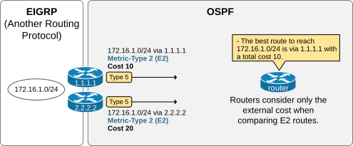
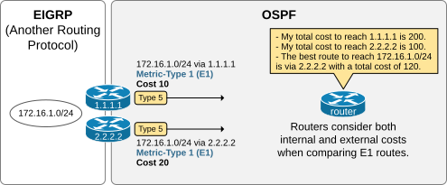
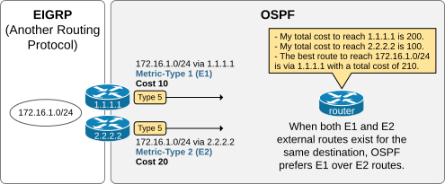
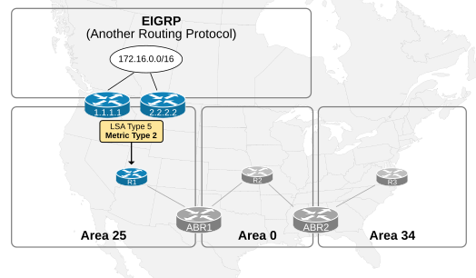
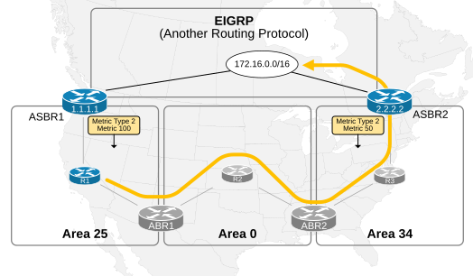
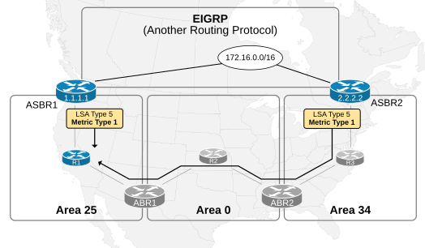

[External Route Types E1 and E2](https://www.networkacademy.io/ccna/ospf/external-route-types-e1-and-e2)
==========

# External Route Types E1 and E2

When an autonomous system border router (ASBR) redistributes an external route into the OSPF domain, **it creates and floods a Type 5 LSA** into the area it connects to. The LSA is forwarded unchanged by area border routers and reaches all routers in normal OSPF areas.


Figure 1. LSA Type 5.

As shown in the diagram above, the LSA has one of the two metric types depending on how the redistribution has been configured:

- External Metric Type 1 (E1)
- External Metric Type 2 (E2) - Default Metric Type

The metric type determines how the SPF algorithm of every OSPF router in the domain calculates the best path to the external network. The following output shows the context of an LSA Type 5 that an ASBR redistributed for network 172.16.0.0/16. Notice the metric type and the metric value.

```plaintext
R1#  sh ip ospf database external 

            OSPF Router with ID (10.0.25.1) (Process ID 1)
            
                Type-5 AS External Link States
                
  LS age: 950
  Options: (No TOS-capability, DC, Upward)
  LS Type: AS External Link
  Link State ID: 172.16.0.0 (External Network Number )
  Advertising Router: 1.1.1.1
  LS Seq Number: 80000008
  Checksum: 0x2BAC
  Length: 36
  Network Mask: /16
        Metric Type: 2 (Larger than any link state path)
        MTID: 0 
        Metric: 20 
        Forward Address: 0.0.0.0
        External Route Tag: 0
```

The metric type and the value are set during the configuration of the redistribution parameters under the ospf process, as shown in the output below.

```plaintext
ABR1(config)# router ospf 1
ABR1(config-router)# redistribute eigrp 1 ?
  metric       Metric for redistributed routes
  metric-type  OSPF/IS-IS exterior metric type for redistributed routes
  nssa-only    Limit redistributed routes to NSSA areas
  route-map    Route map reference
  subnets      Consider subnets for redistribution into OSPF
  tag          Set tag for redistributed routes
  <cr>         <cr>
  
ABR1(config-router)# redistribute eigrp 1 metric-type ?
  1  Set OSPF External Type 1 metrics
  2  Set OSPF External Type 2 metrics
ABR1(config-router)# redistribute eigrp 1 metric-type 1
ABR1(config-router)# end
ABR1#
```

The default metric type is 2 (E2) on all Cisco IOS and IOS-XE routers, when redistribution is configured with explictly setting up the metric-type.

## Metric-Type 2 (E2)

When a router compares multiple LSAs Type 5 for the same destination and the metric type inside the LSA is set to 2, the router compares ONLY the metric value in the LSA. It does not consider the OSPF cost to reach the ASBR that advertised the LSA. For example, both ASBRs 1.1.1.1 and 2.2.2.2 redistribute external subnet 172.16.1.0/24 into the OSPF domain. The metric type is, by default, type 2. Every router in the OSPF domain compares ONLY the metric in the LSAs and selects the path via ASBR 1.1.1.1 as best because it has a lower metric (10) than ASBR 2.2.2.2 (20). The router does not consider the total OSPF cost to reach each of the ASBRs.



Figure 2. External Metric Type 2 (E2).

If multiple paths to reach the same E2 external subnet exist with the same lowest E2 metric, routers choose the route via the closest ASBR. If multiple paths exist with the same lowest E2 metric and the same cost to reach the ASBR, the router does ECMP over every path.

## Metric-Type 1 (E1)

When an LSA Type 5 contains the E1 metric, routers calculate the total cost of reaching the external network as:

the E1 cost in the LSA Type 5 + the cost of reaching the ASBR

In other words, the total cost to reach the external network is the sum of the E1 metric plus the cost to reach the ASBR. Let's consider the following example. Both ASBRs 1.1.1.1 and 2.2.2.2 redistribute external subnet 172.16.1.0/24 into the OSPF domain. The metric type is set to type 1. The router in the OSPF domain calculates the best path to 172.16.1.0/24 based on its cost to reach the ASBR plus the cost inside the LSA Type 5. Hence, the best path to the external network is via ASBR 2.2.2.2.



Figure 3. External Metric Type 1 (E1).

Notice that if you change the metric type to E2, the best path will be via ASBR 1.1.1.1 because the router won't consider the OSPF cost to reach each ASBR.

## What if both E1 and E2 metric types exist for the same destination?

When both E1 and E2 routes to the same destination exist, the E1 route is preferred over the E2 route, regardless of the cost (metric) of the E2 route. That's because E1 external routes provide a more comprehensive metric by considering internal and external costs, while E2 only considers external costs.



Figure 4. Both E1 and E2 routes exist for the same destination.

If we look at the example shown above. ASBR 1.1.1.1 redistributes the external network 172.16.1.0/24 as a metric type E1, while ASBR2 is metric type E2. The result is that all routers inside the OSPF domain will select the path via ASBR1 as best regardless of the metric of the path via ASBR2.

E1 routes are always prefered over E2

Let's discuss a few design examples to help us better understand the difference between the two types and when to use each one.

## Use cases

From an OSPF design perspective, choosing between E1 and E2 routes depends on the nature of the network and the way the organization wants to manage traffic to external destinations. However, most of the time, the decision revolves around the following two questions:

- Are there multiple exit points to external networks?
- Are the exit points at the same location (from OSPF's point of view) or not?
- Do you want to explicitly fix which ASBR is the best exit point for an external destination?

### When to use E2 routes?

Consider the following example. It can be slightly exaggerated, but it is designed to emphasize the decision point. Two ASBR routers (1.1.1.1 and 2.2.2.2) redistribute the external network 172.16.0.0/16 from EIGRP into the OSPF domain using the E2 metric type. **The two ASBR routes are at the exact location in the network**— in the same data center, the same cabinet.



Figure 5. Metric Type 2 (E2) Usecase.

In such scenarios, using the E2 matric type makes sense because the OSPF cost to reach each of the ASBRs is relatively the same for most parts of the OSPF network. For example, the path for R3 to reach any of the ASBRs is the same. It must go through Area 34, the backbone, and Area 25. It is the same story for routers R2 and R1.

Therefore, using E1 will make no significant difference because internal paths will not significantly affect the routing decision. So, using E2 is simpler and more efficient in this case because there is less overhead.

### The problem with E2 routes

However, let's look at the same example, with the only difference being that **the ASBRs are no longer at the same location** but at the opposite ends of the network, as shown in the diagram below.



Figure 6. E2 inefficiency.

Since the metric type is E2, routers still only consider the external cost in the LSA Type 5. Hence, every OSPF router selects the ASBR2's route as best because it has a lower external metric (50) than ASBR1's 100.

Now, if we analyze the traffic paths from different network parts, we can see many suboptimal routes. For example, router R1 must cross the entire network (as highlighted in yellow) to reach ASBR2 and then the external network.

### When to use E1 routes?

In scenarios with multiple ASBR routers located at different places in the OSPF network, it is much more optimal from a traffic path point of view to use the metric-type E1. E1 is beneficial because it lets OSPF account for the full cost across different internal paths. The total cost (internal+external) is evaluated, which ensures the most efficient exit point is chosen.



Figure 7. Metric Type 1 (E1) Usecase.

For example, routers in Area 25 can reach the 172.16.0.0/16 network via ASBR1. Routers in Area 34 can reach the external network via ASBR2, while routers in the backbone can ECMP across both paths or select the most optimal one.

In general, E1 is more suitable for complex networks where internal costs matter, while E2 is better for simple networks or cases where only the external cost is relevant.
