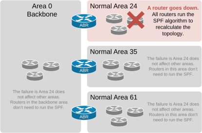
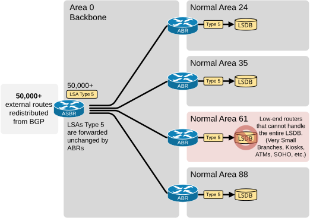
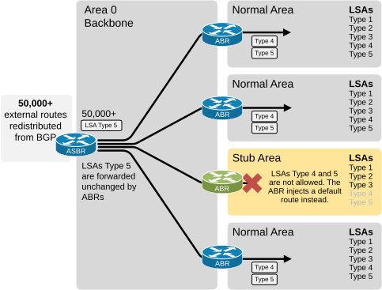
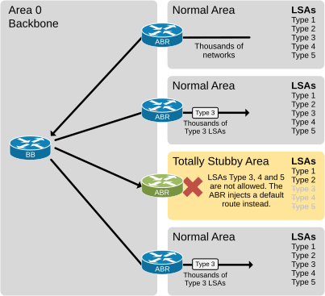
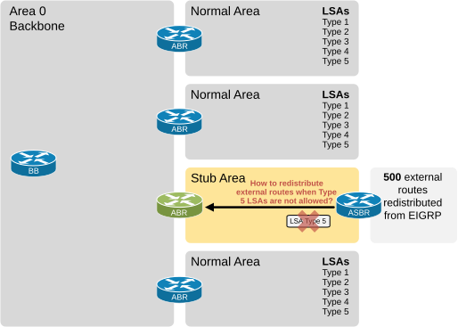
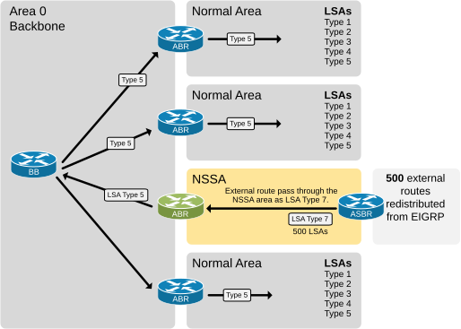

[OSPF Area Types](https://www.networkacademy.io/ccna/ospf/ospf-area-types)
==========

# OSPF Area Types

The OSPF protocol uses a very CPU-intensive algorithm called the SPF. It performs a number of calculations depending on the size of the link-state database (the LSDB). For given N LSAs in the LSDB, the algorithm performs computations proportional to N\*logN. As a result, the larger the link-state database, the greater the risk of performance-related issues due to frequent protocol recalculations. This was especially prominent back in the old days when routers had a few MB of RAM and less powerful single-core CPUs.

In short, a larger LSDB means more SPF calculation, which requires more RAM and CPU. To account for that and allow the network to scale, the protocol introduced four area types that limit the size of the link-state database by limiting some of the LSA types.

## Normal Area

An OSPF area is a collection of router interfaces configured with the same area ID. Its main benefit is that **it isolates the routers inside from external changes**. It contains the topological LSAs Type 1 and 2, which are not advertised by ABRs. Hence, any topological changes within one OSPF area do not trigger the execution of the SPF algorithm in another one, as shown in the diagram below. This makes the network more efficient, stable, and scalable.

Figure 1. Advantages of using Areas.

If you don't explicitly configure an OSPF area as any of the special types (Stub, Totally Stubby, NSSA, Totally NSSA), it is, by default, **a Normal/Regular area**, which allows all LSA Types (1 through 5). Dividing the network into areas decreases the number of times the SPF algorithm must be executed. However, it does not reduce the size of the link-state database.

## OSPF Area Types

OSPF supports four special area types designed to reduce the size of the link-state database (LSDB) of the routers inside.

- Stub
- Totally Stubby
- Not-So-Stubby-Area (NSSA)
- Totally NSSA

Each type reduces the size of the routers' LSDBs **by limiting the scope of LSAs allowed inside**. Routers within the same area have a complete picture of the topology but only get summarized or limited information from outside. This hierarchy helps OSPF scale to larger networks.

### Stub Area

Let's start with the first special type. A stub area **does not receive external route information** (such as routes from other autonomous systems), reducing the link-state database's size. Instead of external routes, a default route is used to reach destinations outside the OSPF domain.

#### Why do we need a stub area?

Consider the following example. We have an OSPFv2 network divided into several areas. We have an ASBR that redistributes 50,000 external EIGRP routes into the OSPF domain. This means **the ASBR generates 50,000 LSAs Type 5** and floods them into the area it connects to. Since LSAs Type 5 are forwarded unchanged by the ABRs, every router inside every area receives those external LSAs. Therefore, every OSPF router inside every area stores the 50,000 LSAs in its LSDB database and runs them through the SPF algorithm (which roughly makes n log n number of calculations where n is the number of LSAs).

Figure 2. Why do we need stub areas?

However, Area 61 is segmented for connectivity to tiny branches, Kiosks, and ATMs. The routers inside it are low-end devices with insufficient memory and CPU to store the entire LSDB with 50,000 external LSAs and execute the SPF of such a large database. So, how does OSPF handle such situations?

To account for such scenarios, the protocol introduces the concept of Stub Areas.

#### What is the OSPF Stub area?

A Stub Area reduces the amount of routing information (LSAs) that must be propagated within the area by not allowing external routes (LSAs Type 5), as shown in the diagram below.

Figure 3. What are Stub areas?

The area border router (ABR) that connects the stub area to the backbone filters out LSAs Type 4 and 5. Instead, **the ABR injects a default route (0.0.0.0/0)** into the area, directing all traffic to external destinations through this default path.

So, in summary, in a stub area:

- Type 4 LSA (ASBR Summary LSA) is not allowed.
- Type 5 LSA (External LSA) is also not allowed.

This restriction helps reduce the size of the LSDB database and improves efficiency in environments where detailed external routing information is unnecessary.

### Totally Stubby Area (TSA)

TSA is an extension of the stub area. It blocks both external routes (LSA Type 5) and inter-area routes (LSA Type 3), further reducing the LSDB size. It only uses a default route to reach all destinations outside.

Figure 4. What is a TSA?

For example, suppose there are thousands of interarea routes in the OSPF domain. The routers inside some of the areas may not have enough memory to store all Type 3 LSAs in their LSDB databases.

When an area is configured as totally stubby, the ABR that connects it to the backbone does not allow Type 3, 4, and 5 LSAs inside the TSA. Instead, the ABR injects a default route (0.0.0.0/0), directing all traffic to external and interarea destinations through this default path.

### Not-So-Stubby-Area (NSSA)

Recall that a Stub area does not allow external routes by filtering out Type 5 LSAs. This means it could not normally have an ASBR router that redistributes external routes. However, what if an organization suddenly has to redistribute some external routes inside the OSPF domain, **but the ASBR can only be connected to the stub area**, as shown in the diagram below? For example, the organization must interconnect with another corporation, and the only physical way to connect is by using routers inside the stub area.

Figure 5. Why do we need NSSA?

To account for such scenarios, the protocol introduced the Not-So-Stubby-Area (NSSA) and a new RFC that defined a newer LSA type (Type 7). An NSSA is similar to a stub area but allows the import of external routes into OSPF from an Autonomous System Boundary Router (ASBR) connected inside. These external routes **are advertised as Type 7 LSAs within the NSSA** and are converted to Type 5 LSAs when they reach the ABR that connects to the backbone, as shown in the diagram below.

Figure 6. What is NSSA?

In essence, Type 7 LSAs are adaptations of Type 5 LSAs that allow external routing information within an NSSA where Type 5 LSAs are not allowed. The only purpose of the Type 7 LSAs is to transport the external routing information through the NSSA. The Area Border Router (ABR) then converts them back to Type 5 LSAs and advertises them into the backbone.

### Totally Not-So-Stubby-Area

The total NSSA is the same as the NSSA, with the only difference being that it further limits the LSDB **by not allowing Type 3 LSAs** inside.
