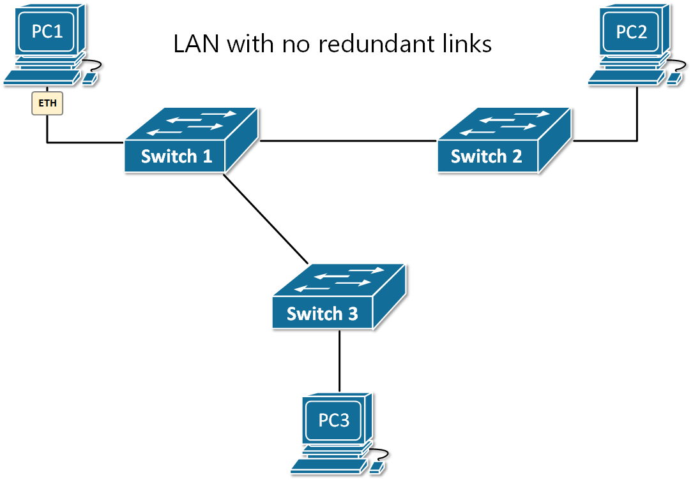
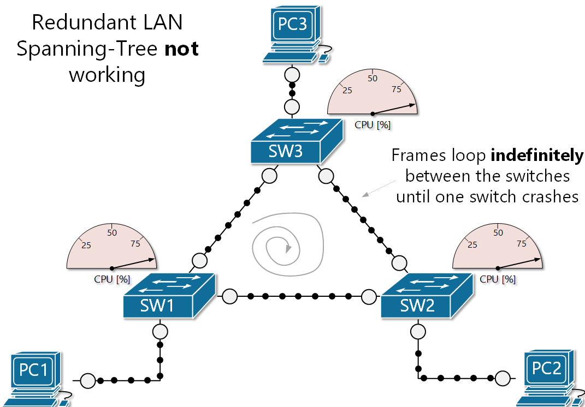

[Why do we need Spanning-Tree?](https://www.networkacademy.io/ccna/spanning-tree/why-do-we-need-stp)
==========

The short answer to this question is - **Ethernet does not work in redundant topologies** because of Ethernet loops also called layer-2 loops or broadcast storms. Without a technology that breaks the LAN with redundant links into a loop-free topology, BUM (broadcast, unknown-unicast, and multicast) frames would **loop around indefinitely** until a link or a device just fails. This happens because of the way switches flood BUM frames. Let's dive into this problem in the next chapters.

**IMPORTANT**  Ethernet does not work in looped switched topologies such as a triangle of interconnected switches. A technique that breaks the topology into a loop-free one must be used (such as Spanning-Tree).

## Switches and BUM frames

When a switch receives a frame, it checks the destination MAC address against its MAC table and if there is no matching entry, it forwards the frame out all interfaces except the incoming one. This process is called ***flooding*** and the frame whose destination MAC is unknown is called an ***unknown unicast***.

The main idea here is that - if you don't know where exactly to deliver a frame, **send it out everywhere**, and the recipient will eventually get it. And it is also likely that the receiver will reply, therefore the switch will learn both nodes' MAC addresses and continue the future forwarding process as ***known-unicast*** (not flooding the frames).

Switches also flood two other types of frames:

- **broadcast** - ones destined to the Ethernet broadcast address FF-FF-FF-FF-FF-FF;
- **multicast** - ones destined to MAC address which starts with bits '1110'.

Figure 1 shows an example in which PC1 sends out a single broadcast frame. Based on the destination MAC address, switch 1 knows that this is broadcast and therefore, sends a copy out all its ports except the incoming one. So a copy of the frame goes to SW2 and SW3, which perform the same logic. Ultimately, every node in this broadcast domain gets a copy of this packet.



Figure 1. LAN with no redundant links

Everything works fine in the above LAN topology except that there is no redundancy in case of a failure. Let's see what will happen if we introduce a redundant link between SW2 and S3.

## Ethernet loops (Broadcast storms)

If there is a looped switching topology like the one shown in figure 2 and there is no Spanning-Tree running, three main problems occur:

#### Problem 1 - Even one looping frame causes a *broadcast storm*.

This happens when a BUM (broadcast, unknown-unicast, and multicast) frame loops around the switches **indefinitely**. A broadcast storm keeps going until a link is oversaturated and fails or a switch crashes because of a high CPU usage. To help you visualize this concept, we have created the animation shown in figure 2. Note that all port LEDs are blinking very rapidly, typically simultaneously and the switches are running at a very high CPU. The process will go on until something fails and break the loop. Let's look at why this happens?



Figure 2. Redundant LAN without Spanning-Tree

Ethernet logic tells switches to flood BUM frames on all ports except the incoming interface. If we apply this logic to our example shown in figure 2, let's see what happens:

- SW1 receives a broadcast frame on the link SW1-SW2, it sends a copy out all its ports (to SW3 and to PC1) except the incoming interface (link SW1-SW2);
- SW3 gets the broadcast frame and applies the same logic. It sends a copy out all its ports except the one the frame came in. So it sends the broadcast to SW2 and PC3.
- SW2 gets the frame, it sends a copy out all its ports except the incoming link SW3-SW2. So it sends the broadcast to SW1 and PC2.
- And the process repeats and goes on indefinitely.

Also, note that the same loop happens in the opposite direction.

#### Problem 2 - The storm causes another problem called *MAC table instability*.

If we recall the MAC learning process, when a switch receives a frame, it creates an entry in the MAC address table for the source address and the incoming port. But in case of a broadcast storm, multiple copies of the same frame loop around and the switch receives it on multiple interfaces. But a single MAC address can be tied to one interface only. Therefore the switch is constantly rewriting the entry for the source MAC address with a different interface and hence the instability.

In the output below, you can see that while a loop is present, every time we check the MAC address table of a switch, the highlighted MAC address is tied to a different port.

```ini
SW1#show mac address-table 
          Mac Address Table
-------------------------------------------

Vlan    Mac Address       Type        Ports
----    -----------       --------    -----

   1    0002.171d.6702    DYNAMIC     Fa0/2
   1    000b.be01.b603    DYNAMIC     Fa0/3
   1    00d0.979a.eb83    DYNAMIC     Fa0/3


SW1#show mac address-table 
          Mac Address Table
-------------------------------------------

Vlan    Mac Address       Type        Ports
----    -----------       --------    -----

   1    0002.171d.6702    DYNAMIC     Fa0/2
   1    000b.be01.b603    DYNAMIC     Fa0/3
   1    00d0.979a.eb83    DYNAMIC     Fa0/2


SW1#show mac address-table 
          Mac Address Table
-------------------------------------------

Vlan    Mac Address       Type        Ports
----    -----------       --------    -----

   1    0002.171d.6702    DYNAMIC     Fa0/2
   1    000b.be01.b603    DYNAMIC     Fa0/3
   1    00d0.979a.eb83    DYNAMIC     Fa0/3
```

#### Problem 3 - End devices receive multiple copies of the same frame.

The last issue that occurs in a case of a loop is that end clients receive multiple copies of the looping frames over and over again while the broadcast storm is active. As a result, end clients may experience high CPU, and critical applications may starve of resources and fail.

If you look at PC1 for example, you can see that it receives multiple copies of the same frame (the black dot representing a single broadcast frame). If this is an ARP frame, for example, PC1 would decapsulate each one of them and process it, which can lead to high CPU.

## Summary

It is important for network engineers to understand that Ethernet just does not work in looped switched topologies. That's is why we need a protocol that can break the loop topology into a loop-free one.

Table 1. Three problems caused by Ethernet loops (Broadcast Storms)

| Problem | Description |
|---------|-------------|
| Broadcast Storm | Broadcast Frames loop around the LAN indefinitely until a link or switch fails or is shut down by a network administrator. |
| MAC address table instability | Switches update their MAC address tables with incorrect entries over and over, resulting in frames being sent to wrong destinations and high CPU and memory usage. |
| End clients receive multiple copies of the same frame | End clients receive a high volume of duplicated frames that can cause high CPU resulting in application failures. |

In the next lesson, we are going to see how Spanning-Tree solves these problems and allow Ethernet switches to be interconnected in a redundant topology.