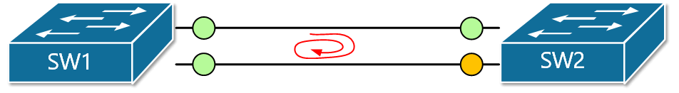
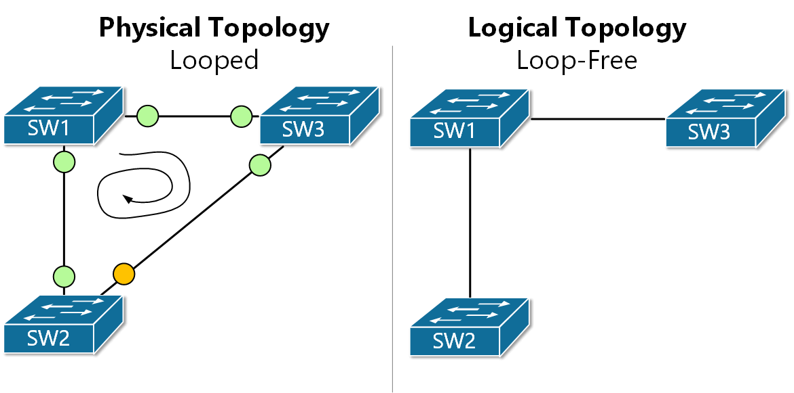
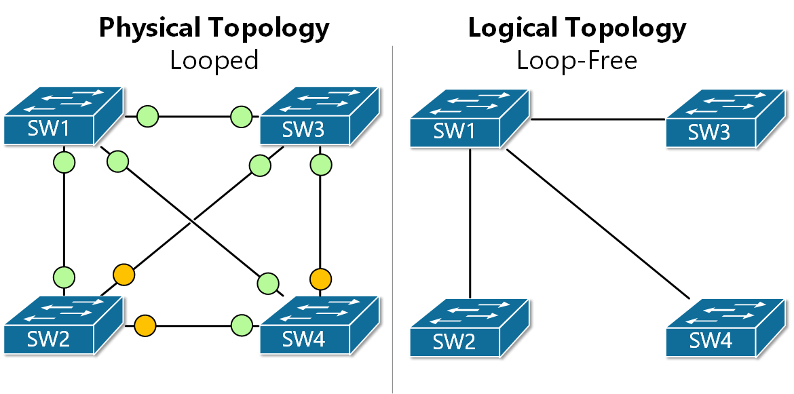
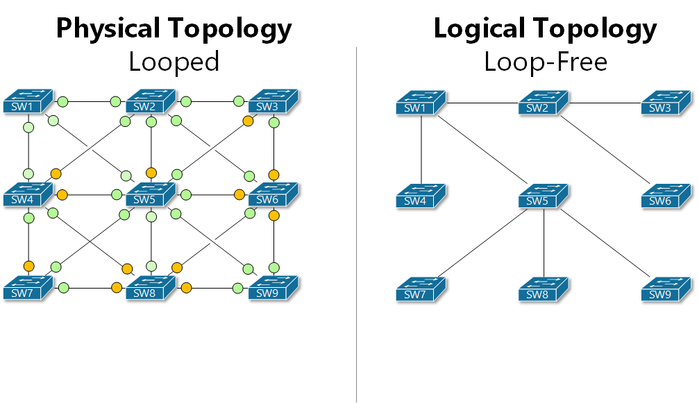

[What Spanning-Tree does?](https://www.networkacademy.io/ccna/spanning-tree/what-stp-does)
==========

In our previous lesson, we have seen why redundant LAN topologies require Spanning-Tree to work. Now we are going to answer the question - What STP does?

The short answer is that Spanning-Tree prevents loops by **breaking the redundant physical topology into a logical loop-free one**. Now let's look at this in more detail.

## Creating a logical topology

High availability is paramount in networking so we always want to have redundancy at all layers in our network. Let's look at the simplest of LAN topologies as an example. In figure 1 we can see two interconnected Ethernet switches. If we have clients connected to SW1 and clients connected to SW2 we would like to have a redundant connection between the switches. Otherwise, if the link between them fails, clients on SW1 lose connection to clients on SW2.

Figure 1. Looped topology with two Ethernet switches

But what happens when we introduce a second link between SW1 and SW2 - we have a looped topology. Remember what we have learned in our previous lesson - Ethernet does not work in looped topologies.

When Spanning-Tree is enabled on a switch (it is by default on all Cisco switches), it controls the state of every switch port and places each one in either a forwarding or a blocking state where:

- Ports in **forwarding state** send and receive frames and act as normal switch interface. In our examples, these ports are shown in green.
- Ports in **blocking state** do not process any frames except for Spanning-Tree messages and do not learn MAC addresses. In the examples, these ports are shown in orange.

Using this logic, Spanning-Tree breaks the looped physical topology into a loop-free logic topology. Let's visualize this with the example shown in figure 2. We have a triangle of interconnected switches. This creates a looped topology and Spanning-Tree detects that by exchanging messages over each link. In the end, STP places ports highlighted in green in forwarding state and the one in orange in blocking state. This results in the logical topology presented on the right. You can see that logically there is a loop-free topology.

Figure 2. Redundant LAN with Spanning-Tree

The same logic applies to larger topologies with many redundant links. If we look at figure 3 for example, we can that there are multiple looped topologies. Hence the STP protocol must block a few ports in order to achieve the loop-free topology shown on the right.

Figure 3. Redundant LAN with Spanning-Tree

Let's look at one more example with a higher number of switches. Note how many ports must be placed in a blocking state by Spanning-Tree in order to achieve a loop-free topology. It is important to understand that Spanning-Tree is controlling the topology by placing blocking individual ports and not links.

Figure 4. Redundant LAN with Spanning-Tree

## Summary

Spanning-Tree prevents loops by **breaking the redundant physical topology into a logical loop-free one**. At the same time, it tracks the status of all inter-switch links and upon link failure, a new loop-free topology is calculated.

In the next lesson, we are going to look, how STP does all that.