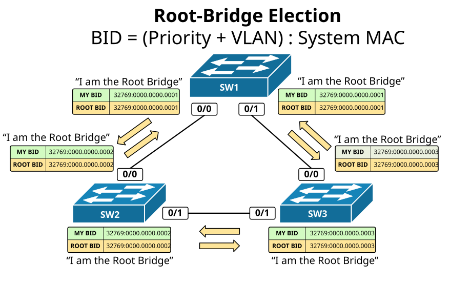
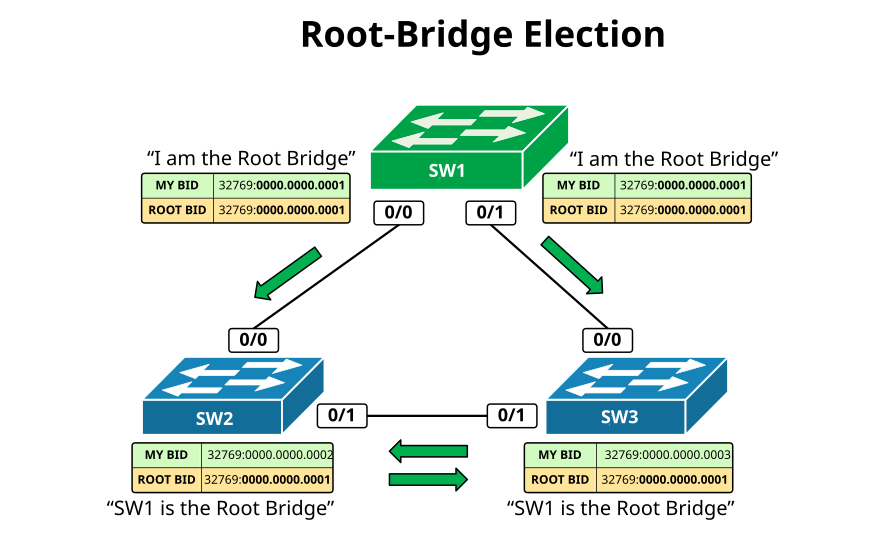
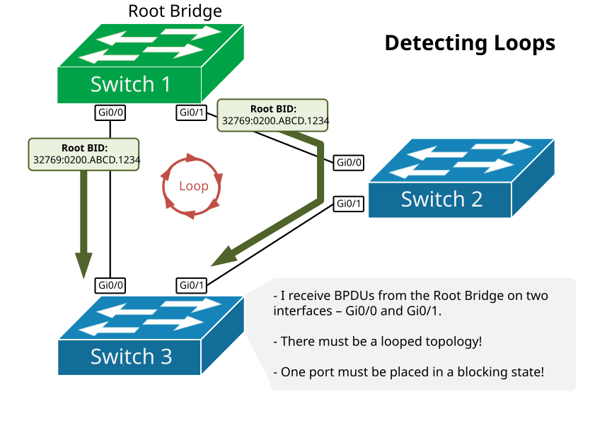
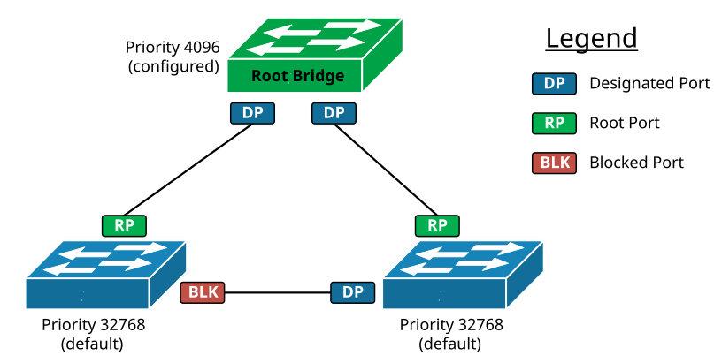

[How Spanning-Tree works?](https://www.networkacademy.io/ccna/spanning-tree/how-stp-works)
==========

Spanning-Tree is based on an algorithm invented by Radia Perlman in 1985 and was published in a paper called "An Algorithm for Distributed Computation of a Spanning Tree in an Extended LAN".  The algorithm creates a loop-free topology by selecting a single root bridge and then all other switches calculate a single least-cost path to the root.

I think that I shall never see

A graph more lovely than a tree.

A tree whose crucial property

Is loop-free connectivity.

A tree which must be sure to span

So packets can reach every LAN.

First the root must be selected.

By ID it is elected.

Least cost paths from root are traced.

In the tree these paths are placed.

A mesh is made by folks like me

Then bridges find a spanning tree.

From the paper "An Algorithm for Distributed Computation of a Spanning Tree in an Extended LAN"

## The STP Algorithm

The Spanning-Tree algorithm performs a couple of steps to make sure that the topology is loop-free and Ethernet is going to work correctly:

- **Electing a Root Bridge** - The very first thing that STP does is to elect a Root Bridge. This is the most important switch in the topology. It will be the root of the loop-free tree. 
- **Finding looped topologies** - Once the Root Bridge is elected, it starts sending Spanning-Tree messages called BPDU. Based on these messages the switches find the looped parts of the topology. 
- **Setup port roles** - After the looped part of the topology is identified, each switch places as many switch ports as needed in order to ensure that the topology is loop-free.
- **Re-converge around failures** - The switches continue to exchange messages in order to keep track of links and adjacent switches' availability. If a link or a switch goes down, the switches execute step 2 and step 3 again to make sure the new topology is loop-free.

**NOTE  **The term **Bridge **appears a lot in the context of Spanning-Tree because the protocol was created in times when switches had not even existed and local networks were using devices called bridges. That is why most protocol terms like **Bridge-Priority** and **Bridge-ID** are not **Switch-Priority** and **Switch-ID**. However, in the context of STP, both terms are really synonymous and interchangeable.

This is a simplified summary of the STP algorithm. Let's now look at each step in more detail. 

### Root Bridge Election

Switches elect a Root Bridge based on a value called Bridge ID. The switch that has the lowest BID value is elected the Root Bridge of the topology. BID is not a single value, but it is composed of two different value types.

BID = (Priority + VLAN number) : (System MAC address)

The first portion of the BID value is configurable and is used by network administrators to set up a particular switch as a Root Bridge.

The second part of the BID value is only used when there is a tie, meaning when there are at least two switches that have the same priority value. This typically happens when all switches are left with their default values, therefore all switches have a priority of 32768. In this case, the election process is decided by choosing the switch with the lowest Systems MAC address. 

When a switch boots up, it does not know the BID values of all other switches in the topology. Thus it elects itself as the Root Bridge of the topology. Once it receives a BPDU with a Root BID value lower than its own, it immediately stops advertising itself as root and starts forwarding the superior Root Bridge value. 

*Figure 1. Root-Bridge Election process step 1*

Let's look at the example in figure 1. It shows three switches with default configurations that have been connected in a triangle and just powered on. The Spanning-Tree process starts with all switches electing and advertising themselves as Root Bridge of the topology.  In the BPDU messages, they put their own BID value and the BID of the root bridge known to them at the moment. Each switch is basically saying "I am the Root".

*Figure 2. Root-Bridge Election process step 2*

Let's now look at the example in figure 2 and see what happens when they exchange the first BPDU messages. SW2 receives two BPDU messages, one from SW1 and one from SW3.

- The BPDU from SW1 says that the Root Bridge has a value of 32769:0000.0000.0001.  When SW2 compares this value to the Root Bridge value known to him at the moment 32769:0000.0000.0002 - it is obviously lower. A BPDU message that has a lower Root BID value than your own is called a **Superior BPDU**. Once SW2 gets this superior message, it stops advertising itself as root and starts forward this Superior BPDU downstream to all other switches. Downstream means that it stops sending BPDUs toward the Root but only to other bridges.
- The BPDU received from SW3 has a Root-BID value of 32769:0000.0000.0003.  When SW2 compares this to the Root Bridge value known to him at the moment 32769:0000.0000.0002 - it is obviously higher. A BPDU message that has the same or higher Root BID value than your own is called an **Inferior BPDU**. Once SW2 gets this inferior message, it discards it.

At the end of this process, all switches within the topology must agree that there is only one Root Bridge and it is the same from the perspective of each bridge.

### Detecting Loops

Once the Root election is completed, the switches start identifying loops. A switch understands that there is a loop when it receives BPDUs from the Root-Bridge on more than one interface.  

If a switch receives Superior BPDUs on more than one port, there must be a loop and that port must be placed in Blocking State.

A key to correctly understand how this works is to understand what Superior BPDU is. A Superior BPDU has one of the following properties in that order:

- Lower cost to the Root Bridge.
- Lower neighbor bridge ID.
- Lower neighbor port priority.
- Lower neighbor internal port number.

Let's leave this process here and not dive into more details for now. In the next section, we are going to deep dive into this process and will do many labs and examples.

*Figure 3. Detecting Loops between three switches*

Setting up the port roles

Once the topology is converged and each switch has placed its ports in the correct roles, BPDUs are still exchanged in order to track the link availability. If any switch detects a topology change, all switches re-calculate their port roles in order to create another loop-free topology.

*Figure 4. Spanning-Tree Port Roles*

There are three main port roles as shown in the example in figure 4.

Table 1. Spanning-Tree port roles
| **Port Roles**
| **Description**
| Root Port 
| 
The root port represents the best path towards the Root Bridge. The switch must be receiving BPDUs with the lowest cost to the root on this port.

The switch does not send BPDUs via this port.

The switch learns MAC addresses on this port.

| Designated Port 
| 
A port that points away from the root (downstream port).

BPDUs are being sent out this port.

The switch learns MAC addresses on this port.

| Blocked Port 
| The switch does not learn MAC addresses on this port. The port does not forward any Ethernet traffic. 

Let's leave this here as well. We are going to be talking a lot more about each of the roles in the next lessons.
