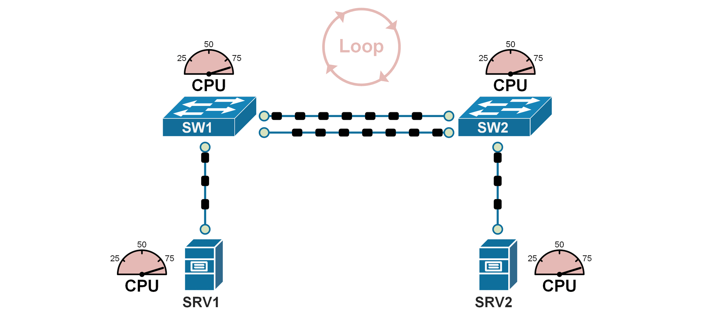
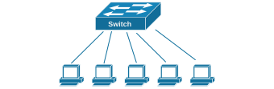
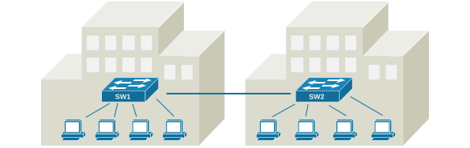
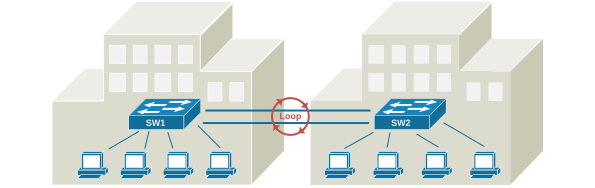
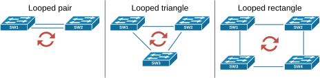
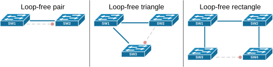
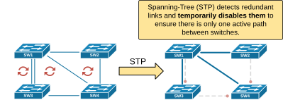

[Introduction to Common STP (CST)](https://www.networkacademy.io/ccna/spanning-tree/introduction-to-common-stp-cst)
==========

In this lesson, we begin our exploration of the original Spanning Tree Protocol (STP), also known as the Common Spanning Tree (CST). Introduced in the 1990s, it allowed Ethernet LANs to have backup links without causing loops. It was a groundbreaking development that allowed networks to keep running even if a link or switch failed.

## Why was Spanning-Tree (STP) invented?

Let's quickly recap two statements about Ethernet switching that we discussed in the previous section of the course:

- A broadcast frame (such as ARP) is intended for all devices in the same network segment (hence, the name broadcast). That's why Ethernet switches forward a copy of the broadcast frame to all the ports in a VLAN except the one from which the frame was received. Therefore, one frame **is replicated multiple times** to reach all possible hosts in the segment.
- Ethernet frames don't have a built-in mechanism to limit their lifespan and "expire" like the Time-to-Live (TTL) field in IP packets.

Because of these two specifics of the Ethernet standard, if two switches are connected in a looped topology, even a single broadcast frame **can be replicated indefinitely and circulate endlessly within the loop**, consuming all available bandwidth and CPU, as shown in the diagram below.

*Figure 1. Why do we need Common STP?*

Such a situation is called *a Broadcast storm*, meaning a broadcast frame loops around and is replicated indefinitely. Ethernet frames do not have a built-in expiration mechanism (e.g., TTL). The only way that a broadcast storm can stop is when a device in the loop crashes and the loop topology breaks. 

It is important to remember the fact that **Ethernet networks cannot function in looped topology**. An Ethernet network must always be loop-free. 

Keep in mind that Ethernet was invented back in the 1970s-80s (yes, it is that old!). Back then, people didn't need to have redundant networks. They simply needed to have *any network*. Without redundancy, switched networks are loop-free, as shown in the simple diagram below.

*Figure 2. Ethernet networks in the 1970s.*

Then, over time, the number of connected devices started to grow. Interconnections between buildings emerged. People started accessing resources over the network. Organizations started relying on the network to be up and running all the time. But there was one big problem: the network didn't have redundancy. For example, the switched network shown in the diagram below may work fine most of the time, but it has only a single link between the buildings, which is a big problem. 

*Figure 3. Switched network between buildings.*

If the single link fails, the connection between the two buildings would be completely lost, disrupting communication and access to resources. In this scenario, the organization would want to install a second link between SW1 and SW2 to provide redundancy and fault tolerance. A second link would be a backup, maintaining network connectivity even if one link goes down.

*Figure 4. Network between buildings with redundant links.*

However, adding redundant links to a switched network creates looped topology, as shown in the diagram above. So, engineers started to work on a solution to this problem, which is how the concept of the spanning tree protocol emerged.

## What is Spanning-tree protocol (STP)?

The original Spanning Tree Protocol (STP) was developed to address the challenges of redundant paths in Ethernet networks. In 1990, it was standardized as **IEEE 802.1D,** a groundbreaking development that led to large-scale redundant networks. 

Let's now quickly see how STP solves the redundancy problem. The following diagram shows the most common looped topologies that occur when we add redundancy to a switched network. Notice something important: Many engineers wrongly assume that a loop can only occur in a triangle or rectangular topology. However, take a look at the diagram below, and you will see that even **two links between a pair of switches** create a looped topology.

*Figure 5. Common Looped Topologies.*

More complex looped topologies often stem from the basic ones shown in the diagram above. For instance, you can have four switches connected in a rectangular configuration but with additional redundant links, as shown in the diagram below.

*Figure 6. More complex loop topology.*

However, you can break down the structure into simpler topologies like pairs, triangles, or rectangles of switches.

Now, let's see how the spanning tree solves this problem. It is pretty simple. It detects redundant links and temporarily blocks them to create a loop-free topology. That's it! When the topology is not looped, a broadcast frame cannot loop around indefinitely. For example, the following diagram shows what happens when we enable spanning-tree in the topologies that are illustrated. STP blocks one link, and the topologies are now loop-free.

*Figure 7. STP making loop-free topologies.*

For instance, the pair of switches shown on the left now have only one operational cable between them. The redundant one will only be used if the primary operational cable goes down.

Let's also look at the more complex topology shown in Figure 6. When the spanning-tree protocol is enabled on the switches, it detects that there are multiple redundant links and temporarily disables them so that the switched network is completely loop-free, as shown on the right side of the diagram below.

*Figure 8. STP example.*

So, this is how the original spanning-tree protocol (IEEE 802.1d) works at a very high level. In the next lesson, we will start deep diving into the protocol's algorithm. 

But before we move on, let's clear up something important. Why is the original STP protocol called Common Spanning Tree (CST)? That's because it creates** a single loop-free topology for the entire network**, regardless of how many VLANs exist. This means all VLANs share the same physical topology, which can lead to inefficiencies in larger networks. The common spanning tree is considered legacy now and is replaced by improved versions like Per-VLAN Spanning Tree (PVST) and Rapid PVST (RPVST). However, it is the foundation of the modern STP protocols, so let's jump into the protocol's algorithm.

## Book traversal links for 44

