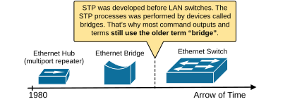
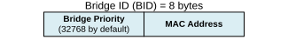
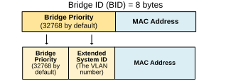
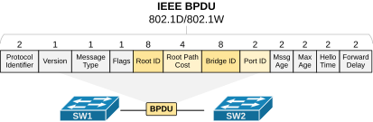
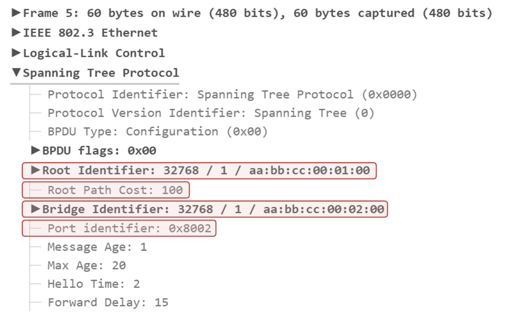
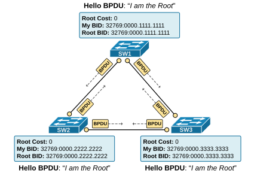
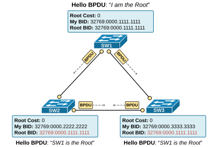

[The Spanning-Tree Algorithm](https://www.networkacademy.io/ccna/spanning-tree/the-spanning-tree-algorithm)
==========

In this lesson, we begin our discussion of the Common Spanning Tree algorithm. We walk through the process of how the protocol works and what kind of messages it uses to exchange information between switches. Let's get started.


## Introducing the term "Bridge"


Before we begin our detailed discussion on the spanning-tree algorithm, let's first clear something that might confuse some people. You will very often find the term "Bridge" when you read about the Spanning Tree Protocol (STP). That's because the protocol was created before Ethernet switches existed. Back then, networks used bridges instead of switches. That’s why terms like Bridge-Priority and Bridge-ID are used instead of Switch-Priority and Switch-ID. In the context of STP, Bridge and Switch mean the same thing and can be used interchangeably.




*Figure 1. STP and the term bridge.*


Since bridges are long gone from modern networks, every time you see the term bridge in the context of the spanning-tree protocol, think of a switch.


## The Spanning-Tree Algorithm


Let's start with the very basic question that will provide us with context on how the protocol works: Why has the protocol been named "Spanning Tree"? Why wasn't it called "Ethernet redundancy protocol" or "Ethernet loop-free protocol"?


The name basically explains the protocol's logic. A tree's branches naturally grow in a way that they do not form loops; **each branch extends outward from the root** and then further divides into smaller branches, creating a clear, hierarchical structure. This loop-free nature ensures that water flows efficiently from the roots to the leaves without looping backward.


*Figure 2. STP and a Tree.*


The Spanning Tree Protocol (STP) uses similar logic. It elects one switch to be the Root Bridge. Then, **it extends outward from the root**, temporarily disabling redundant paths, creating a single, loop-free path for frames to travel. This prevents frames from endlessly circulating in the network, much like how a tree's branches prevent the water flow from looping back on itself. Both systems rely on a hierarchical structure to function efficiently.


Now, let's zoom in and see how the protocol constructs the loop-free network tree. We can break down the STP process into five steps as follows:


- **Step 1. Elect the Root Bridge** – All switches compare their Bridge IDs. The switch with the lowest Bridge ID becomes the Root Bridge (the root of the tree).
- **Step 2. Select Root Ports (RPs)** – Each non-root switch selects one port with the lowest path cost to the Root Bridge. This port is called the Root Port (RP) and remains active.
- **Step 3. Select Designated Ports (DPs) **– For each network segment, the switch with the lowest path cost to the Root Bridge designates one active port as the Designated Port (DP) to forward traffic.
- **Step 4. Block Non-Designated Ports** – Any port that is neither a Root Port nor a Designated Port is blocked to prevent loops.
- **Step 5. Monitor for failures **– If a failure occurs, STP recalculates the topology and activates a previously blocked port if needed.

### Step 1. BPDUs and electing the Root Bridge


The STP algorithm starts by electing a Root Bridge—the switch that will be the root of the loop-free tree, as shown in the diagram above. As with any other network protocol, the switches exchange messages to convey important information and uniquely identify each switch. 

The Bridge ID (BID)
To understand the STP election process, you must first understand the STP messages and the information being exchanged. Within the STP process, each switch has a unique **Bridge ID** (BID), which is an 8-byte value. The BID is made of a 2-byte priority value, which is 32768 by default, and the switch's MAC address, as shown in the diagram below. 




*Figure 3. Spanning-Tree Bridge ID.*


The bridge priority value is a configurable parameter. It is 32768 by default and can be changed, as shown in the output below. Notice that the value must be a multiple of 4096. The lowest possible value is 0.


```
`SW1(config)# **spanning-tree vlan 1 priority ?**
<0-61440>  bridge priority in increments of 4096`
```

The MAC address is taken from the switch hardware. It is typically the lowest burn-in physical address. 


The Bridge ID is the most important parameter in the spanning tree process because switches use it to elect the root bridge. The switch with the lowest BID becomes the root.  


But what does the lowest mean? The BID is made up of two components: Priority and MAC address (as you can see in the diagram above). First, the priority value is compared. Consider the example shown below. Which switch has a lower BID?


```
`Switch A has BID: **32768:0011.1111.1111**
Switch B has BID:  **4096:0022.2222.2222**`
```

It is switch B because it has lower priority value 4096 compared to switch A's 32768. But what if both switches has the same priority?


```
`Switch A has BID: **32768:0011.1111.1111**
Switch B has BID: **32768:0022.2222.2222**`
```

When two switches have the same bridge priority, the one with the lower MAC address wins. Hence, in this example, switch A has a lower BID.


Before we move on, let's clear up something important. In this part of the STP course, we discuss the original IEEE 802.1d spanning-tree protocol that was developed back in the 1990s, referred to as the Common Spanning Tree (CST). However, modern Cisco switches don't support CST anymore. If you check the BID of a switch now, the BID will look slightly different. Modern Cisco switches support only Per-VLAN STP (PVST). That's why when you log on a modern switch, the BID is made up of three components: **Priority Value + Extended System ID + MAC address**, as shown in the diagram below.




*Figure 4. The BID component of PVST.*


Since the STP process is per-VLAN, the VLAN ID is part of the Bridge ID. For example, a switch will have a different BID in each VLAN, as shown in the output below:


```
`Switch A has BID in VLAN 1:   **32769**:0011.1111.1111
Switch A has BID in VLAN 2:   **32770**:0011.1111.1111
Switch A has BID in VLAN 5:   **32773**:0011.1111.1111
Switch A has BID in VLAN 100: **32868**:0011.1111.1111`
```

Notice that the VLAN number is added to the configured priority value: VLAN 1 (32768+1), VLAN 5 (32768+5), VLAN 100 (32768+100), etc. We will talk more about PVST in the next section of the course. Now let's focus on the original protocol, which is the foundation for all other versions.

BPDUs: The STP messages
The STP process uses special messages called **bridge protocol data units (BPDUs)** to share information between switches. The most common type is the "Hello" BPDU, which contains important details, including the BID of the switch that was sent. Technically, the BPDU type is Configuration, but since switches send it to discover each other, it is referred to as "Hello." This helps switches identify the sender and determine the network's structure.




*Figure 5. STP IEEE BPDU.*


The BPDU includes essential information used in the Root Bridge election process (highlighted in yellow), such as:


- The Bridge ID (BID) of the switch sending the BPDU.
- The Root ID of the switch is currently considered the Root Bridge.
- The cost to reach the root switch.
- The port ID of the interface used to reach the Root Bridge.

The following screenshot shows a traffic capture of a BPDU sent between two Cisco switches in Vlan 1. Notice the information highlighted in red and compare it to the diagram above.




*Figure 6. BPDU example.*


Now, let's see how this information is used by the switches to elect which one will act as the Root Bridge for the switched network.

The Root Bridge Election Process
When a switch is first powered on, **it assumes that it is the root bridge **and sets its own BID as the Root BID. It sends Hello BPDUs advertising itself as the root bridge, as shown in the diagram below. 




*Figure 7. Root Bridge Election.*


These Hello BPDUs are sent every two seconds by default and contain the following information, as shown in the diagram:


- The switch's own Bridge ID (BID)
- The current known root ID (Root's BID)
- The cost to reach the root bridge (initially 0)

As switches receive BPDUs from other switches, they compare the root ID in the BPDUs with their own stored root ID.


- If the received Root ID **is lower**, it means a better root bridge exists. Such a BPDU packet is called "*superior BPDU*". The switch updates its root ID to this new lower value and forwards the updated BPDU to its neighbors. 
- If the received Root ID **is higher, the BPDU is ignored **because the switch already knows a better root bridge. Such a BPDU packet is called "inferior *BPDU*".

Notice that once a switch updates its Root BID to reflect a new root bridge, **all BPDU frames it sends will include the new root BID**. This allows downstream switches to learn the Root Bridge ID. For instance, our example topology has only three switches. But if more switches were connected to SW2 or SW3, they would have learned the Root BID from the BPDUs of SW2 and SW3.




*Figure 8. Root Bridge Election, step 2.*


This process continues until all switches agree on the lowest BID, which is the root bridge of the topology. The switch with the lowest BID value becomes the root bridge. If two switches have the same priority, the one with the lowest MAC address wins. In our example, this is SW1 because it has the lowest BID of the three switches, as shown in the diagram above.


```
`SW1# **show spanning-tree**

VLAN0001
Spanning tree enabled protocol ieee
Root ID    Priority    32769
Address     0000.1111.1111
This bridge is the root
Hello Time   2 sec  Max Age 20 sec  Forward Delay 15 sec
Bridge ID  Priority    32769 (priority 32768 sys-id-ext 1)
Address     0000.1111.1111
Hello Time   2 sec  Max Age 20 sec  Forward Delay 15 sec
Aging Time  300 sec
Interface           Role Sts Cost      Prio.Nbr Type
------------------- ---- --- --------- -------- --------------------------------
Et0/0               Desg FWD 100       128.1    P2p
Et0/1               Desg FWD 100       128.2    P2p`
```

Once the election is complete, each switch determines the best way to reach the root bridge and updates its forwarding rules. The spanning-tree process ensures a loop-free network by blocking unnecessary paths while keeping the best route active.


Notice that all other topology switches agree on who the Root is. If we check it on SW2, we can see it agrees that SW1 is the root.


```
`SW2# **show spanning-tree**

VLAN0001
Spanning tree enabled protocol ieee
Root ID    Priority    32769
Address     0000.1111.1111
Cost        100
Port        2 (Ethernet0/1)
Hello Time   2 sec  Max Age 20 sec  Forward Delay 15 sec
Bridge ID  Priority    32769  (priority 32768 sys-id-ext 1)
Address     0000.2222.2222
Hello Time   2 sec  Max Age 20 sec  Forward Delay 15 sec
Aging Time  300 sec
Interface           Role Sts Cost      Prio.Nbr Type
------------------- ---- --- --------- -------- --------------------------------
Et0/0               Desg FWD 100       128.1    P2p
Et0/1               Root FWD 100       128.2    P2p`
```

If we make the same check on SW3, we can see that it also knows who the root is.


```
`SW3# **show spanning-tree**

VLAN0001
Spanning tree enabled protocol ieee
Root ID    Priority    32769
Address     0000.1111.1111
Cost        100
Port        1 (Ethernet0/0)
Hello Time   2 sec  Max Age 20 sec  Forward Delay 15 sec
Bridge ID  Priority    32769  (priority 32768 sys-id-ext 1)
Address     0000.3333.3333
Hello Time   2 sec  Max Age 20 sec  Forward Delay 15 sec
Aging Time  300 sec
Interface           Role Sts Cost      Prio.Nbr Type
------------------- ---- --- --------- -------- --------------------------------
Et0/0               Root FWD 100       128.1    P2p
Et0/1               Desg FWD 100       128.2    P2p`
```

Okay, let's stop here because the lesson is becoming a bit long. Let's continue with the port roles in the next lesson.


## Book traversal links for 44

