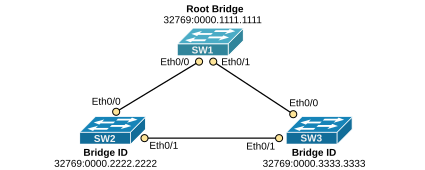
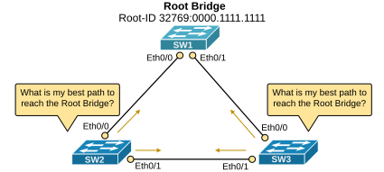
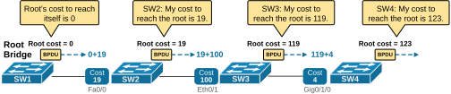
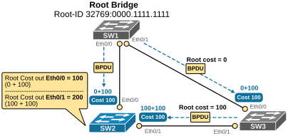
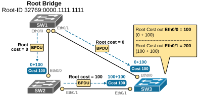
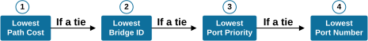
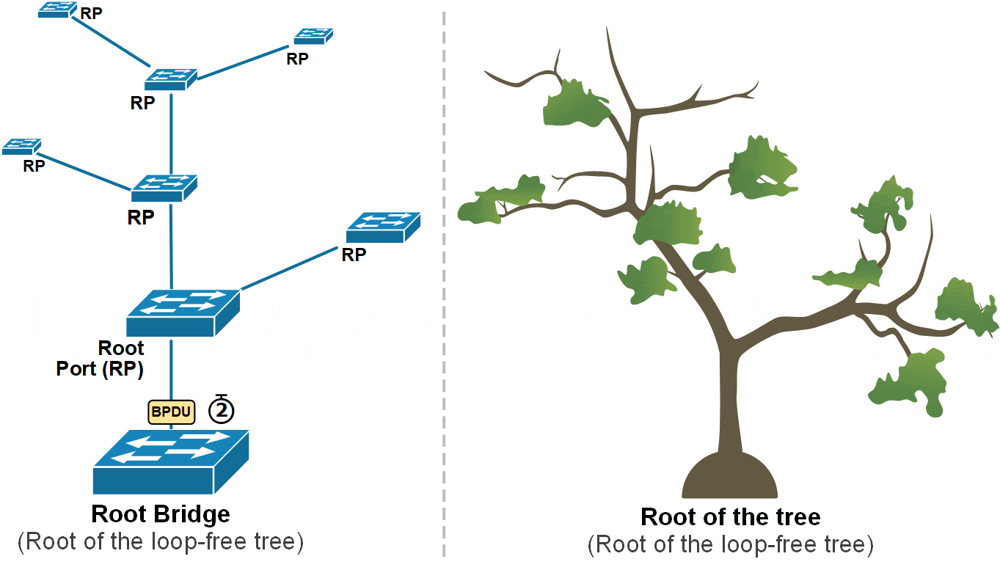
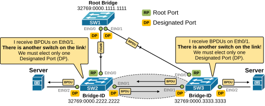
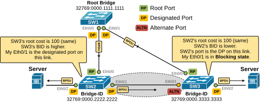
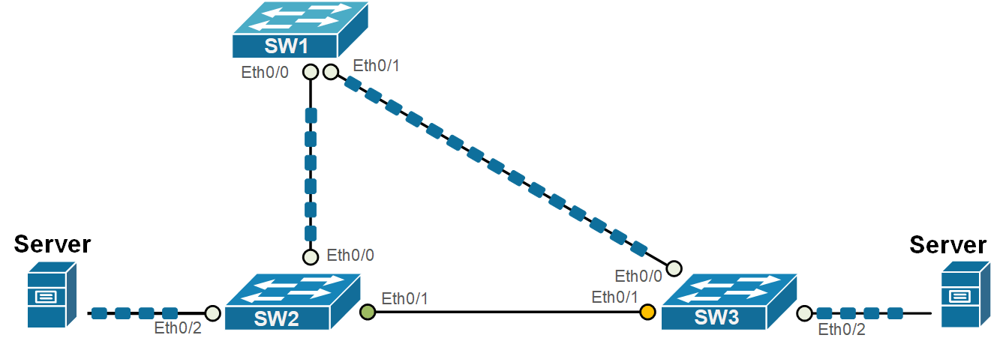

[Spanning-Tree Port Roles](https://www.networkacademy.io/ccna/spanning-tree/spanning-tree-port-roles)
==========

In the previous lesson, we started discussing how the spanning-tree protocol constructs the loop-free network topology. We can break down the process into five steps as follows:


- Step 1. Elect the Root Bridge.
- **Step 2.** Select Root Ports (RPs).
- **Step 3.** Select Designated Ports (DPs).
- **Step 4.** Block Non-Designated Ports.
- Step 5. Monitor for failures.

We have already discussed the first step. In this lesson, we are going to zoom into steps 2 through 4. Let's jump in.


## Step 1. The Root Bridge


In step 1, switches elect the root bridge. In our instance, this was SW1, as shown in the diagram below. Something important to remember about this step is that after the root bridge is elected, **only the root bridge continues to generate configuration BPDUs** every 2 seconds by default.




*Figure 1. Example switching topology.*


**Non-root switches only forward the BPDUs** they receive from the root bridge. They do not create new BPDUs themselves.


## Step 2. Selecting a Root Port


The second step in the STP process happens immediately after the Root Bridge has been elected. Every switch that is not the Root Bridge must figure out which port is best for reaching the root, as shown in the diagram below.




*Figure 2. Selecting best path to the Root Bridge.*


Each switch must choose only one root port (RP), which has the lowest cost path to reach the root bridge. But what is cost in the context of STP, and what if two paths have equal cost?


### Root Path Cost


Once the root bridge is selected, the STP algorithm starts calculating the best paths from every switch to the root bridge.


Switches exchange BPDUs, which include a value called the **root path cost**. This value shows how far the switch is from the root bridge, based on the cost of each port in the path. When a switch receives a BPDU, it adds the cost of the port where the BPDU arrived. This helps the switch calculate its own total cost to reach the root. Then, it sends out BPDUs with the new total cost downstream to its neighboring switches. The process is illustrated in the diagram below.




*Figure 3. Root cost calculation.*


Notice two important facts: The root bridge's cost to reach itself is always zero (logically). Hence, he sends BPDUs with root path cost set to 0. Then, each switch adds the cost of the interface where the BPDU arrived. 


Port cost depends on the speed of the port. **Faster ports have lower costs**. For example, 10 Gbps ports have a cost of 2, 1 Gbps ports have a cost of 4, 100 Mbps ports have a cost of 19, and 10 Mbps ports have a cost of 100. The table below lists the most common port speeds and their cost.


Table 1. IEEE 802.1d Port Costs
| **Port Speed** | **STP Cost** 
| 4 Mbps | 250 
| 10 Mbps | 100 
| 100 Mbps | 19 
| 1 Gbps | 4 
| 10 Gbps | 2 
| 40 Gbps | 1 

Using this process, each switch calculates the cost to reach the root bridge via each available interface. To understand the process, let's walk through a real-world example. Let's take the topology shown in the diagram below. SW1 is the root switch. Let's see how SW2 can reach the root.




*Figure 4. Root Path Cost Calculation of SW2.*


SW2 can reach SW1 in two ways: directly through Ethernet 0/0 or indirectly through SW3. The cost from SW2 to SW1 directly is 100, and the cost through SW3 is 200, then SW2 picks the direct path, because 100 is lower than 200. Therefore, Ethernet0/0 becomes the Root Port (RP). We can further verify this by looking at the output below.


```
`SW2# **show spanning-tree**
VLAN0001
Spanning tree enabled protocol ieee
Root ID    Priority    32769
Address     0000.1111.1111
Cost        100
Port        1 (Ethernet0/0)
Hello Time   2 sec  Max Age 20 sec  Forward Delay 15 sec
Bridge ID  Priority    32769  (priority 32768 sys-id-ext 1)
Address     0000.2222.2222
Hello Time   2 sec  Max Age 20 sec  Forward Delay 15 sec
Aging Time  15  sec
Interface           Role Sts Cost      Prio.Nbr Type
------------------- ---- --- --------- -------- --------------------------------
Et0/0               Root FWD 100       128.1    P2p
Et0/1               Desg FWD 100       128.2    P2p`
```

Let's now see which port SW3 chooses as its root port. SW3 can also reach SW1 in two ways: directly through Ethernet 0/0 or indirectly through SW2, as shown in the diagram below. 




*Figure 5. Root Path Cost Calculation of SW3.*


The cost from SW3 to SW1 directly is 100, and the cost through SW2 is 200, then SW3 chooses the direct path via Eth0/0, because it has lower total cost (100). Therefore, Ethernet0/0 becomes the Root Port (RP). Let's verify this via the CLI.


```
`SW3# **show spanning-tree**

VLAN0001
Spanning tree enabled protocol ieee
Root ID    Priority    32769
Address     0000.1111.1111
Cost        100
Port        1 (Ethernet0/0)
Hello Time   2 sec  Max Age 20 sec  Forward Delay 15 sec
Bridge ID  Priority    32769  (priority 32768 sys-id-ext 1)
Address     0000.3333.3333
Hello Time   2 sec  Max Age 20 sec  Forward Delay 15 sec
Aging Time  300 sec
Interface           Role Sts Cost      Prio.Nbr Type
------------------- ---- --- --------- -------- --------------------------------
Et0/0               Root FWD 100       128.1    P2p
Et0/1               Altn BLK 100       128.2    P2p`
```

Sometimes, two or more paths have the same lowest cost. In that case, the switch uses extra rules to decide which path to pick. 

Root Port Selection Logic
The root bridge keeps sending configuration BPDUs on all its interfaces. Each switch receives these BPDUs and uses them to decide which interface is the best path to the root bridge. The switch picks its RP using this order (used in case of a tie):


- Choose the port with **the lowest path cost**.
- If the cost is the same, choose the port that received the BPDU from a switch with **the lowest BID**.
- If multiple ports go to the same switch, choose the one with **the lowest port priority**.
- If the port priority is also the same, pick the one with **the lowest port number**.




*Figure 6. Root Port Selection Logic.*


Remember that every switch uses only the RP interface to reach the root. The RP can be checked using the following command.


```
`SW2# **show spanning-tree root**
Root    Hello Max Fwd
Vlan                   Root ID          Cost    Time  Age Dly  **Root Port**
---------------- -------------------- --------- ----- --- ---  ------------
VLAN0001         32769 aabb.cc00.1000       100    2   20  15  Et0/0`
```

## Step 3. Selecting Designated Ports (DPs)


Okay, let's summarize what we have discussed so far and how the Spanning Tree Protocol (STP) works:


- First, STP finds a starting point called **the root bridge**. This is the switch with the lowest BID and the root of the loop-free tree.
- Then, each switch selects **a root port (RP)** with the lowest cost to reach the root bridge. 

At this point, the process has built the tree-like structure. Now, the Root Bridge starts sending configuration BPDUs every two seconds. Each switch receives those BPDUs on its root port and forwards them out all other ports, as shown in the diagram below.




*Figure 7. STP Root Port Animation.*


However, other ports in the topology are still active, and loops can occur. To avoid these loops, STP takes one more step. It picks **one designated port on each network segment.** A network segment is a shared connection between two or more switches. In modern networks, a network segment in the STP context is simply a link between two switches because layer 1 hubs are no longer used, and one link cannot be shared between more than two layer 2 devices. 


**What is a Designated Port (DP)?**


A designated port (DP) is a port that **is allowed to send and receive traffic and forward BPDUs**. All ports of the Root Bridge are Designated Ports (DPs) because it generates configuration BPDUs, as shown in the diagram above. 


Every other non-root switch initially assumes that all its ports that are not the Root Port (RP) are designated ports (DPs). A switch doesn't know what kind of device is connected on each interface, whether it is an end device (server, PC, phone, etc.) or another switch that can cause a loop. However, **if the switch receives a BPDU on a designated port**, it means it comes from another switch, and it is not coming from the loop-free path, as shown on the highlighted link in the diagram below.




*Figure 8. Selecting one designated port per link.*


Every switch must receive the root's configuration BPDUs over its root port (RP) because the RP is the lowest-cost path to the root. For example, SW2 receives the root's BPDUs on Eth0/0 (the RP). SW3 receives the BPDUs on Eth0/0 (the RP). 


If the switch receives configuration BPDUs on a designated port (DP), it means the port is connected** to another switch via a redundant link**, and there is a loop condition, as shown in the highlighted link on the diagram above. That's why STP allows only one port on the redundant link to be a designated port (to forward BPDUs).


### How is a Designated Port (DP) elected on a shared segment?


Every switch knows its own path cost to the root and includes it in its BPDUs (Bridge Protocol Data Units). If a switch receives a BPDU from a neighbor with a lower cost, that neighbor becomes the designated port. The receiving switch knows that its own port is not the designated port. But if it hears only higher costs from other switches, it knows its port is the designated one.


Sometimes, two or more switches have the same path cost. STP uses a tiebreaker system with four rules, in this order, as shown in the diagram below:


- Lowest root path cost
- Lowest sender bridge ID
- Lowest sender port priority
- Lowest sender port ID


*Figure 9. Root Port Selection Logic.*


Let’s look at our example again. SW2 and SW3 receive BPDUs on non-root ports (Eth0/1). They understand that this is a redundant link between them and that this link is not part of the loop-free path. They must select a designated port for that link and block the other port to prevent loops. Using the selection algorithm shown above, they select SW2's port as the DP port and SW3's port as the alternate port, which is in a blocking state. The following diagram visualizes the end result. 




*Figure 10. Selecting Blocking ports.*


An Alternative port is a port that **could be used** to reach the root bridge but is not currently being used because another port already provides a better (lower-cost) path. The alternate port is in a blocking state, meaning it doesn’t forward traffic or BPDUs. However, if the main path (usually the root port) fails, the alternate port can quickly take over and start forwarding frames.


```
`SW3#** show spanning-tree**
VLAN0001
Spanning tree enabled protocol ieee
Root ID    Priority    32769
Address     0000.1111.1111
Cost        100
Port        1 (Ethernet0/0)
Hello Time   2 sec  Max Age 20 sec  Forward Delay 15 sec
Bridge ID  Priority    32769  (priority 32768 sys-id-ext 1)
Address     0000.2222.2222
Hello Time   2 sec  Max Age 20 sec  Forward Delay 15 sec
Aging Time  300 sec
Interface           Role Sts Cost      Prio.Nbr Type
------------------- ---- --- --------- -------- --------------------------------
Et0/0               Root FWD 100       128.1    P2p
Et0/1               Altn BLK 100       128.2    P2p
Et0/2               Desg FWD 100       128.3    P2p
`
```

Note that in the end result, even though all three switches are still physically connected in a triangle, STP has temporarily blocked the link between SW2 and SW3. This prevents a loop while keeping the network fully connected. Switches 2 and 3 can still send traffic to each other, but only through Switch A. For example, the two servers communicate with each other over the SW1, as shown in the diagram below.




*Figure 11.Converged STP topology.*


Notice the LEDs on the switches. If those are real hardware devices, the LED on SW2's Eth0/1 port would be green but wouldn't be blinking because no real traffic is passing through. The LED on SW3's Eth0/1 port will be yellow and won't be blinking either because it is in STP blocking mode. Also, notice how the blocking port is breaking the loop and the topology is loop-free.


## Putting it all together


Now, let's put it all together and summarize what we have discussed so far in the diagram shown below.

Now, let's put it all together and summarize what we have discussed so far in the diagram shown below.

### The three-step STP decision process

When STP determines the state of each port, it follows a strict three-step logic:

1. **Root Bridge Election** — All switches in the network elect a single Root Bridge. The switch with the lowest Bridge ID (Bridge Priority + MAC Address) wins.
2. **Root Port Selection** — Every non-root switch selects exactly one Root Port (the port with the lowest path cost to the Root Bridge).
3. **Designated Port Selection** — On each segment (link), one switch becomes the Designated Port for that segment. The switch with the lowest path cost to the Root Bridge wins the Designated Port role.

All other ports become **Blocking ports** (or Alternate ports).

### Port role summary

| Port Role | Description | Per switch | Per segment |
|-----------|-------------|------------|-------------|
| **Root Port (RP)** | The port closest to the Root Bridge | One per non-root switch | One |
| **Designated Port (DP)** | The port with the best path to the Root Bridge on a segment | Zero or more per switch | Exactly one |
| **Alternate/Blocking Port** | A port that is not a Root or Designated Port. It blocks traffic to prevent loops. | Zero or more per switch | Zero or more |

### What each switch sees

**On the Root Bridge:**
- All ports are Designated Ports (DP).
- No Root Port exists because the Root Bridge has no path to itself.
- All ports are in Forwarding state.

**On non-root switches:**
- Exactly one Root Port (RP) — the port with the lowest cost to the Root Bridge.
- Zero or more Designated Ports (DP) — for segments where this switch has the best path.
- All remaining ports become Alternate/Blocking ports.

### Example: Putting it together

Let's trace through a complete example with three switches.

1. **Root Bridge election:** SW1 has the lowest Bridge ID → SW1 is the Root Bridge.
2. **SW2's Root Port:** SW2 has two paths to SW1. The direct link costs 4 (Eth0/0), while the path through SW3 costs 4+4=8. So Eth0/0 on SW2 becomes the Root Port.
3. **SW3's Root Port:** SW3's direct path to SW1 costs 4 (Eth0/1), and the path through SW2 costs 4+4=8. So Eth0/1 on SW3 becomes the Root Port.
4. **Designated Ports on the SW2-SW3 link:** Both SW2 and SW3 have the same cost to the Root Bridge (4 each). The tie goes to the switch with the lowest Bridge ID. SW2 has a lower Bridge ID, so SW2's port on that link becomes the Designated Port. SW3's port on that link becomes the Blocking port.

**Final port states:**
- SW1: Eth0/0 = DP (Forwarding), Eth0/1 = DP (Forwarding)
- SW2: Eth0/0 = RP (Forwarding), Eth0/1 = DP (Forwarding)
- SW3: Eth0/0 = DP (Forwarding), Eth0/1 = RP (Forwarding), Eth0/2 = Alt (Blocking)

The loop is eliminated, and traffic flows through the active topology without any loops.

### Why does STP do all this?

Without STP, a loop in a Layer 2 network would cause:

- **Broadcast storms** — Broadcast frames circulate endlessly, consuming all available bandwidth.
- **MAC address table instability** — Switches see the same source MAC address on different ports, constantly updating their tables.
- **Multiple frame copies** — A device receives the same frame multiple times, potentially crashing upper-layer protocols.

STP prevents all of these by ensuring there is exactly one active path between any two devices in the network.

## Summary

- STP uses three port roles: **Root Port (RP)**, **Designated Port (DP)**, and **Alternate (Blocking) Port**.
- The election follows a three-step process: elect the Root Bridge, select the Root Port on each non-root switch, and select the Designated Port on each segment.
- The **Root Bridge** has all Designated Ports.
- **Non-root switches** have exactly one Root Port and may have Designated and Blocking ports.
- The goal of STP is to prevent loops by blocking redundant paths while maintaining connectivity.
