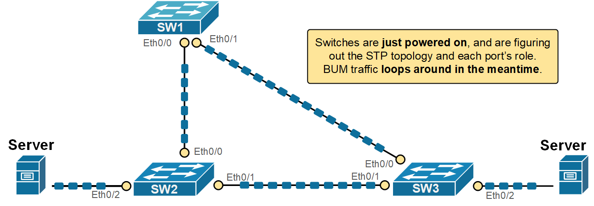
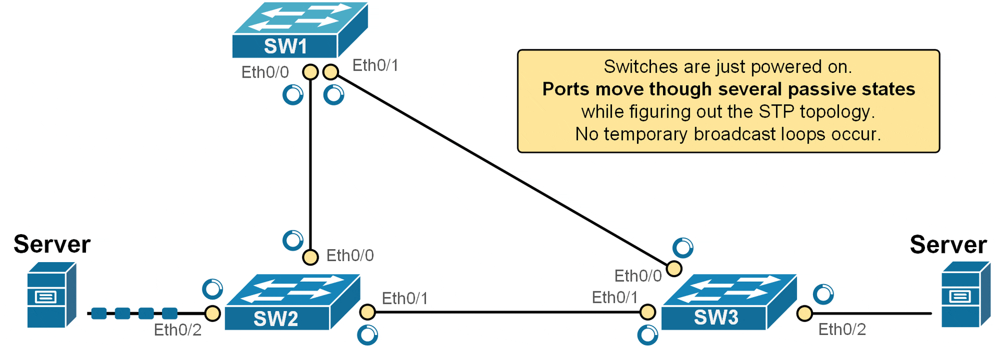
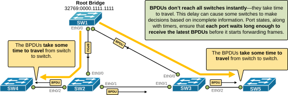
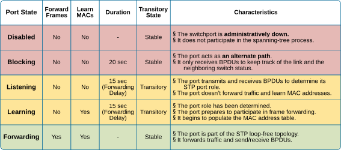

[STP Port States and Timers](https://www.networkacademy.io/ccna/spanning-tree/spanning-tree-states-and-timers)
==========

In the previous lesson, we discussed the Spanning Tree port roles. Let's make a quick recap:


Table 1. STP port roles.
| **STP Port Role** | **Description** 
| **Root Port (RP)** | The port on a non-root switch that has the best (lowest cost) path to the Root Bridge. There is only **one root port per switch**. The port receives configuration BPDUs from the root. 
| **Designated Port (DP)** | A port that is allowed to forward traffic on a segment and forward BPDUs. **One designated port is elected per link**. All ports on the root bridge are designated ports. Designated ports forward traffic away from the root bridge. 
| **Alternate port** | A port that offers an alternate path to the root bridge. It remains in a blocking state and can quickly transition to the forwarding state if the current root port fails. 
| **Disabled port** | A port that is administratively shut down and does not participate in the Spanning Tree Protocol.                                                                                                   

However, ports do not directly become one of the roles listed above. It must first progress through several states before the Spanning Tree process ensures that it is safe to transition the port to a particular role.


## Why does STP have port states?


The Spanning Tree protocol prevents network loops while keeping redundancy in place. However, building the loop-free tree is not instantaneous. It takes time to elect the root bridge, compare costs, elect root ports, select designated ports, and, in the end, temporarily block the redundant links. But what happens with the BUM traffic while the STP process creates the loop-free topology?


Let's imagine a fictitious scenario where the STP process forwards traffic while it builds the loop-free topology. What would have happened is that BUM traffic would have replicated and looped around, as shown in the diagram below. 




*Figure 1. STP Temporary loops.*


This could cause one or more devices to crash, leading to a vicious cycle of instabilities. Obviously, the protocol needs a mechanism **to control the frame forwarding during the spanning tree calculations**. That's where the port states come into the picture.


STP uses port states to help prevent network loops while the protocol builds the loop-free topology. When a switch is powered on or when the network topology changes, the switch needs time to figure out the STP role of each port. If the ports start forwarding traffic immediately, temporary loops could form before STP finishes its calculations.


Instead of letting each port immediately assume its final role, STP uses a series of port states **to safely transition a port into the determined STP role**. While each port goes through the states, it does not forward frames, as shown in the diagram below.




*Figure 2. STP Port States animation.*


For example, look at the animation shown above. The switches have just been powered on. Although the server on the left sends traffic to the server on the right, **the network does not forward the frames**. Every switchport transitions through the STP states until it reaches the Forwarding state and starts sending/receiving traffic or reaches a blocking state.


**KEY TOPIC:** The Spanning Tree port states are a way for the protocol to *safely *bring ports into the network. This prevents temporary loops and instabilities and ensures that switches have enough time to agree on the correct loop-free topology.


Another reason why STP uses port states is BPDUs travel time. STP works by having switches send BPDUs to each other to build a loop-free network. These messages take some time to travel from one switch to another. If there’s a change in the network, like a failed link or root bridge, it also takes time for all switches to learn about it. Because of these travel delays, STP waits before finalizing the network path so all switches can get the latest information first. The following diagram visualizes this concept.




*Figure 3. Why does STP use port states?*


Keep in mind that the protocol was invented in the 1980s, and the interface speeds were much slower then. Therefore, the travel times were way way longer. That's the reason the original version of the protocol uses timers such as 15 seconds between states (more on this later on).


## What are STP Port States?


- A switchport that is administratively shut down is in **the disabled state**. This means that it does not participate in the STP calculations at all.
- When a port is first initialized, it starts in** the blocking state**. In this state, it does not forward traffic and only listens for BPDUs. This allows the switch to learn the topology without causing loops.
- If the port is needed in the topology, it moves to **the listening state**. Here, it still does not forward frames, but it begins sending and receiving BPDUs. This helps the switchport announce its presence and prepare to join the STP topology.
- Next is **the learning state**. In this phase, the port begins to learn MAC addresses by watching incoming frames but still does not forward traffic. This prepares the switch to forward frames efficiently (not as BUM traffic) once it becomes active.
- Finally, if the switchort is selected to be part of the active loop-free topology, it enters **the forwarding state**. Now, it can send and receive both data frames and BPDUs.

Spanning Tree Protocol (STP) uses port states to manage how each switch port behaves during the process of building a loop-free network. These states help the switch decide whether a port should forward traffic, learn MAC addresses, or stay silent to prevent loops.


The following table summarizes all spanning tree port states. Notice that some states are permanent while others are transitory. Also pay attention to the duration of each state transition.




*Figure 4. STP Port Roles Table.*


These port states give the switch time to understand the network before it begins forwarding traffic. This process prevents loops and makes sure the network runs smoothly.


Now, to understand the concept better, let's look at some real-world examples.


## STP Timers


The STP process uses three timers that control the transition between port states:


Table 2. STP timers.
| **Timer** | **Default Value** | **Description** 
| Hello | 2 seconds | The time between Configuration BPDUs sent by the root switch.  
| MaxAge | 20 seconds (10x Hello timer) | The Max Age timer is how long a switch keeps a configuration BPDU before deleting it. If no new BPDUs are received in that time, the switch assumes there's a topology change. 
| Forward Delay | 15 seconds | The time a switchport stays in the Listening and Learning states. 

By default, the root bridge sends configuration BPDUs (called Hello BPDUs) every two seconds. Every other non-root switch receives these BPDUs at its root port and forwards them to its designated ports. If a switch misses a Hello BPDU, it waits and keeps working normally. But if no Hellos are received within the Max Age timer (default 20 seconds), the switch assumes something is wrong and recalculates the STP topology.


After Max Age expires, the switch reselects the root bridge, its root port, and checks if it should be the designated port on each link.


## STP port roles examples


Let's reload one non-root switch and see how the protocol goes through the different port states before it starts forwarding traffic. 


```
`SW2# **reload**
Proceed with reload? [confirm]`
```

After the switch boots up, we immediately execute the show command shown below to observe how the STP protocol transition the ports to their intended roles/states.


```
`SW3# **show spann**

VLAN0001
Spanning tree enabled protocol ieee
Root ID    Priority    1
Address     aabb.cc00.1000
Cost        100
Port        1 (Ethernet0/0)
Hello Time   2 sec  Max Age 20 sec  Forward Delay 15 sec
Bridge ID  Priority    32769  (priority 32768 sys-id-ext 1)
Address     aabb.cc00.3000
Hello Time   2 sec  Max Age 20 sec  Forward Delay 15 sec
Aging Time  300 sec
Interface           Role **Sts **Cost      Prio.Nbr Type
------------------- ---- --- --------- -------- --------------------------------
Et0/0               Root **LIS **100       128.1    P2p
Et0/1               Altn **BLK **100       128.2    P2p
Et0/2               Desg **LIS **100       128.3    P2p
Et0/3               Desg **LIS **100       128.4    P2p`
```

Notice two important things in the output above (highlighted):


- The port that is selected as the Alternate port is immediately transitioned to the blocking state. It does not go through any states. The idea is that simply moving a port to blocking **is safe** and cannot cause any broadcast storms (since the port does not forward neither frames nor BPDUs).
- However, the ports that are selected to actively participate in the frame forwarding (Root and Designated ports) are transitions immediately to the **Listening **state.

Notice another important aspect: in classic 802.1D STP, a port normally starts in the Blocking state. However, on Cisco switches, when a port becomes a Designated Port or Root Port, it transitions immediately to the Listening state. The Blocking state is skipped for ports that are chosen to become active in the topology. The goal is to bring up forwarding ports faster while still giving time to detect loops. Also, if you're using Rapid STP (RSTP, 802.1w), the transitions can be even faster, and the states work a bit differently (as we will see in the next sections of the course).


At this stage, none of the ports is allowed to learn MAC addresses. The ports in the Listening state **only send and receive BPDUs** but are not allowed to learn MAC addresses and forward frames.


```
`SW3# **show mac address-table**
Mac Address Table
-------------------------------------------
Vlan    Mac Address       Type        Ports
----    -----------       --------    -----`
```

If we execute the show command after 15 seconds (one forward delay interval), we can see that the ports transitioned to **the Learning state.**


```
`SW3# **show spanning-tree **

VLAN0001
Spanning tree enabled protocol ieee
Root ID    Priority    32769
Address     aabb.cc00.0100
Cost        100
Port        1 (Ethernet0/0)
Hello Time   2 sec  Max Age 20 sec  Forward Delay 15 sec
Bridge ID  Priority    32769  (priority 32768 sys-id-ext 1)
Address     aabb.cc00.3000
Hello Time   2 sec  Max Age 20 sec  Forward Delay 15 sec
Aging Time  300 sec
Interface           Role **Sts **Cost      Prio.Nbr Type
------------------- ---- --- --------- -------- --------------------------------
Et0/0               Root **LRN **100       128.1    P2p 
Et0/1               Altn **BLK **100       128.2    P2p
Et0/2               Desg **LRN **100       128.3    P2p 
Et0/3               Desg **LRN **100       128.4    P2p `
```

At this stage, we can see that the switch now learns and populates its MAC address table but is still not allowed to forward frames.


```
`SW3# **show mac address-table**
Mac Address Table
-------------------------------------------
Vlan    Mac Address       Type        Ports
----    -----------       --------    -----
1    aabb.cc00.1010    DYNAMIC     Et0/0
1    aabb.cc00.2000    DYNAMIC     Et0/0
1    aabb.cc00.4000    DYNAMIC     Et0/0
1    aabb.cc00.5000    DYNAMIC     Et0/0
1    aabb.cc00.5010    DYNAMIC     Et0/0`
```

If we execute the show command after an additional 15 seconds (one forward delay), we can see that the ports transitioned to the Forwarding state.


```
`SW3# **show spanning-tree **

VLAN0001
Spanning tree enabled protocol ieee
Root ID    Priority    32769
Address     aabb.cc00.0100
Cost        100
Port        1 (Ethernet0/0)
Hello Time   2 sec  Max Age 20 sec  Forward Delay 15 sec
Bridge ID  Priority    32769  (priority 32768 sys-id-ext 1)
Address     aabb.cc00.3000
Hello Time   2 sec  Max Age 20 sec  Forward Delay 15 sec
Aging Time  300 sec
Interface           Role **Sts **Cost      Prio.Nbr Type
------------------- ---- --- --------- -------- --------------------------------
Et0/0               Root **FWD **100       128.1    P2p 
Et0/1               Altn **BLK **100       128.2    P2p
Et0/2               Desg **FWD **100       128.3    P2p 
Et0/3               Desg **FWD **100       128.4    P2p `
```

You can see that the total time it takes for the switchport to start forwarding frames after an STP event is 30 seconds (15 seconds in Listening state and 15 seconds in Learning state).


## Book traversal links for 44

