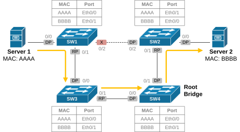
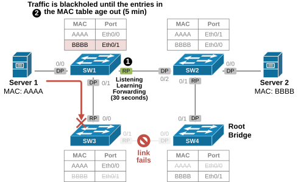
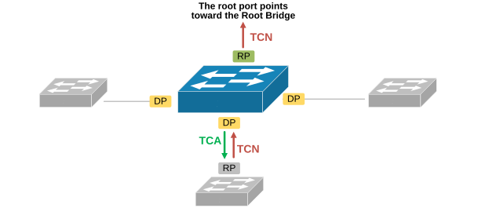
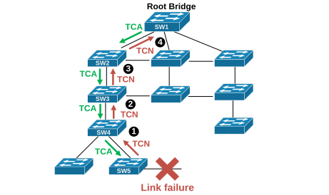
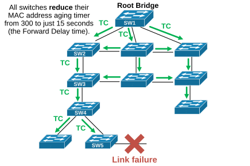
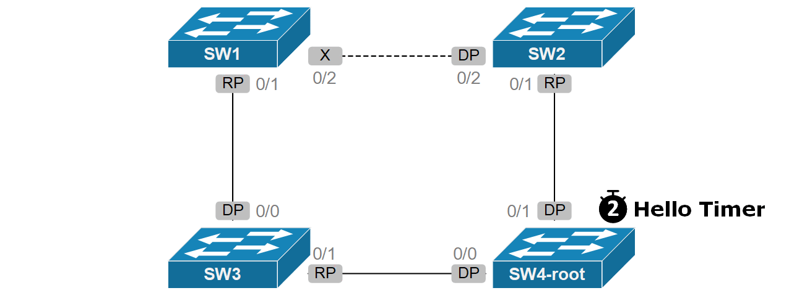

[STP Topology Changes (TCN)](https://www.networkacademy.io/ccna/spanning-tree/stp-topology-changes)
==========

In the previous several lessons, we discuesed how the spanning tree protocol calculates the loop-free topology and how it works in a normal, stable situation. In this lesson, we will examine how the protocol behaves when a topology change occurs and it must reconverge.

## Why switches need STP Topology Change Mechanism?

To understand the purpose of the STP topology change mechanism, let's examine a stable layer 2 network that forwrds frames. Two continuos processes take place:

- Switches learn MAC addresses.
- The root bridge sends configuration BPDUs.

### The MAC address table

Switches learn MAC addresses from incoming frames and build their MAC address tables. It links MAC addresses to the ports they were learned from. It helps switches forward frames intelligently, without using the flood and learng behaviour. By default, an entry stays in the table for 300 seconds (5 minutes). If a host doesn't send any traffic for 5 minutes, its MAC address is removed from the MAC table.

*Figure 1. STP TCN Initial Topology.*

In the diagram above, the STP topology is stable. SW4 is the root bridge. The link between switches SW1 and SW2 is blocked by spanning-tree. Each swtich's MAC address table shows that servers 1 and 2 are reachable through certain ports. Now let's see what happens when the link between SW3 and SW4 goes down.

When that happens, servers 1 and 2 lose connectivity to one another. Two problems prevent the servers **from communicating right away via the redundant path**, as shown in the diagram below. 

*Figure 2. STP reconvergence upon link failure.*

- **Problem 1**. SW1 needs to move its blocked port (Eth0/2) to forwarding mode. With default STP settings, this typically takes 30-50 seconds to transition the port from blocking to listening, then to learning, and finally to forwarding state. 
- **Problem 2**. Even after the port starts forwarding, SW1 still has MAC entry for server 2's address that points to SW3 (highlighted in red). Any frames sent to SW1 will be send to SW3 and be blackholed. The blackholing lasts until the MAC entries expire after 5 minutes.

This why the Spanning Tree protocol implements a topology change mechanism. After a change in the STP topology, **switches are notified to lower their MAC address aging time**. The new aging time is set to the Forward Delay value, which is 15 seconds by default. This allows switches to relearn the correct path quickly, without waitng for the default MAC table aging timer (5 minutes).

## How does the STP Topology Change porcess solve this problem?

To solve the problem with the aging MAC address table, switches use a special process when a failure in the network is detected. At a high level the process looks like this:

- When a change happens, the switch that detects it informs the root bridge. 
- The root bridge then broadcasts this information to the rest of the network.
- The switches react by lowering their MAC address aging timer to 15 seconds, which corresponds to the configured forwarding delay timer.

When something in the network changes, like a link going up or down, switches send a special message called **a Topology Change Notification (TCN) BPDU**. This message doesn’t carry details about what changed — it just tells other switches that something has changed.

A topology change occurs when a port becomes either active (up) or inactive (down). When that happens, the switch that detects the change sends a TCN BPDU out of its root port, as shown in the diagram below. 

*Figure 3. TCN iva the root port.*

The switch continues to send TCN BPDUs at each hello interval until it receives an acknowledgment from the next upstream switch. Each switch along the path sends its own acknowledgment and forwards the TCN out of its root port. Since each switch's root port points in the direction of the root bridge, **the TCN BPDU eventually reaches the root bridge**. The following diagram shows how the TCN reaches the root in a topology with 11 switches.

*Figure 4. STP TCN Process.*

Notice that this is an exagareted example. Layer 2 topologies with more than three or four switches are common in modern network designs. However, the example emphisezes the idea of how the TCN BPDU travels to the root bridge.

When the root bridge receives the topology change notification (TCN), it does not send back another TCN BPDU. Instead, **it sets a special flag** in its regular Configuration BPDU to notify all switches of the change, as shown in the diagram below.

*Figure 5. The root broadcasting topology changes.*

Once all switches know a change has happened,** they reduce their MAC address aging timer** from the usual 300 seconds to just 15 seconds (the Forward Delay time). This helps clear out outdated MAC address entries faster, reducing the chance of traffic going to the wrong place. Switches continue to use this shorter aging time for 35 seconds (15 seconds of Forward Delay plus 20 seconds of Max Age). Active devices that continue to send traffic remain in the MAC table. Ones that are silent for 15 seconds or more are removed form the MAC table.

While the concept of a topology change is straightforward, seeing how it works in a real network can be more complex. If a switch link fails or a new one is added, it is essential to understand how all switches respond and whether users experience any downtime. Let's walk through some examples of different types of topology changes and see how STP responds, using the same network diagram shown earlier.

## Topology Convergence Process

A direct topology change happens when a switch can **immediately detect a problem on one of its ports**. For example, if a trunk link between two switches goes down, both switches are immediately aware because the link is physically lost. This change in the network means other switches need to be informed.

We are going to use the following topology with four swtiches to go over the different topology change examples.

*Figure 6. STP TCN example topology (animated).*

Notice how the switches behave while the topology is stable: 

- The root bridge sends configuration BPDUs at regular interval of 2 seconds. 
- Non-root switches relay those BPDUs on their designated ports. 
- Root ports and blocked ports only receive BPDUs.

## What triggers a TCN?

A Topology Change Notification (TCN) is generated when:

1. **A link goes down or comes up** — A switch detects that a port has transitioned from Forwarding to Blocking (or vice versa). This is the most common trigger.
2. **A port transitions to Forwarding** — If a port starts forwarding (e.g., after the listening/learning states), the switch generates a TCN to inform the Root Bridge.
3. **A switch detects a BPDU on a blocked port** — In some cases, receiving a superior BPDU on a blocked port can trigger a topology change.

## The TCN process step-by-step

**Step 1: A switch detects a topology change.**

A non-root switch detects that one of its ports has changed state (e.g., a link went down). 

**Step 2: The switch sends a TCN BPDU.**

The switch sends a TCN BPDU out of its Root Port toward the Root Bridge. The TCN BPDU is a simple message — it just says "a topology change occurred," without any details about what changed.

**Step 3: The upstream switch receives and acknowledges the TCN.**

Each switch along the path to the Root Bridge receives the TCN on its Designated Port. It sends back a **TCN Acknowledgment** (by setting the TCA flag in the next configuration BPDU) and then forwards the TCN out of its own Root Port.

**Step 4: The TCN reaches the Root Bridge.**

The Root Bridge receives the TCN. Now it knows that the network topology has changed.

**Step 5: The Root Bridge broadcasts the change.**

The Root Bridge sets the **TC (Topology Change)** flag in its configuration BPDUs for the next `max age + forward delay` seconds (default 35 seconds: 20 + 15). All switches receiving these BPDUs know that the topology has changed.

**Step 6: Switches shorten their MAC address aging time.**

During a topology change, switches reduce the **MAC address aging timer** from the default 300 seconds to only **Forward Delay seconds** (default 15 seconds). This ensures that MAC addresses learned on now-invalid paths are quickly removed from the MAC address table.

## Impact of topology changes

Frequent topology changes can cause significant network disruption. Every time a TCN occurs, switches flush their MAC address tables, causing all frames to be flooded until the new topology is learned. This can lead to:

- Increased CPU utilization on switches.
- Higher broadcast and unknown unicast flooding.
- Temporary performance degradation.

This is why features like **PortFast** (which we'll cover in the PVST section) are important — they allow certain ports to skip the listening/learning states and prevent unnecessary TCNs when end devices connect or disconnect.

## STP Timers summary

| Timer | Default Value | Description |
|-------|---------------|-------------|
| Hello Time | 2 seconds | Interval between configuration BPDUs sent by the Root Bridge. |
| Forward Delay | 15 seconds | Time spent in Listening and Learning states (each). Total of 30 seconds before a port starts forwarding. |
| Max Age | 20 seconds | Time a switch waits without hearing BPDUs before attempting to reconverge. |

## Summary

- **TCN (Topology Change Notification)** is the mechanism STP uses to inform the Root Bridge when the network topology changes.
- Switches send TCN BPDUs out of their **Root Port** toward the Root Bridge.
- The Root Bridge propagates the change by setting the **TC flag** in configuration BPDUs.
- During a topology change, switches shorten the **MAC address aging timer** to 15 seconds to quickly remove stale MAC entries.
- The default STP convergence time can be up to **50 seconds** (Max Age 20s + Forward Delay 15s + Forward Delay 15s).
