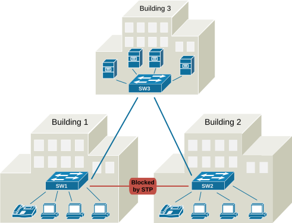
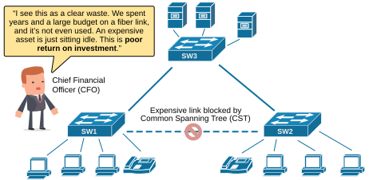
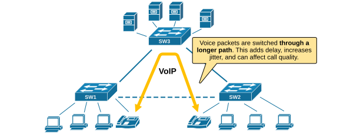
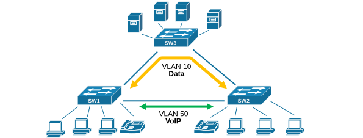

[Introduction to PVST](https://www.networkacademy.io/ccna/spanning-tree/introduction-to-pvst)
==========

This lesson begins our discussion on Cisco's PVST (Per-VLAN Spanning-Tree) and PVST+ protocols. First, we are going to examine the inefficiencies of the original STP, and then we are going to show what improvements PVST brings to the network.


## Inefficiencies of Common Spanning Tree (CST)


The original IEEE 802.1d spanning-tree protocol (commonly referred to as common spanning tree) was a significant breakthrough in networking. It solved the problem of loops in switched networks by creating a single loop-free path, making switched networks more reliable. It also allowed switched networks to scale and laid the foundation for modern data centers. However, with the increasing number of users and applications connected to the network, three major protocol inefficiencies started to uncover: 


- wasted bandwidth
- suboptimal traffic paths
- limited fault isolation

We are going to use the following diagram to start discussing each of the common STP inefficiencies. 




*Figure 1. Inefficiencies of Common Spanning-Tree (CST).*


There are three switches located in three different buildings. The links between the switches are expensive fiber cables.


### Wasted Bandwidth


Imagine the switched topology shown above. Notice that the switches run a common spanning tree and are connected in a triangular topology. Hence, the STP has blocked the link between SW1 and SW2 to prevent loops.


In a simple triangular network topology connecting three buildings, Common Spanning Tree (CST) creates only one loop-free tree for all VLANs. This means that to avoid loops, one of the links between the buildings is placed in a blocking state by STP for all traffic.


Imagine that this blocked link is a high-quality fiber optic line. It took years to plan and install, with high costs for digging, permits, and hardware. But due to CST’s limitation, the link is not used for any traffic—it just sits idle, waiting for a failure on the active path.




*Figure 2. CST Wasted Bandwidth.*


From an economic perspective, this is a clear inefficiency. A major investment in infrastructure is wasted because t**he protocol can’t take advantage of all available paths**. All VLANs follow the same loop-free tree, and STP blocks whatever link it sees as redundant, regardless of the actual value or cost of the connection.


This shows a major downside of CST in real-world networks. When expensive links are blocked, the network becomes both inefficient and wasteful. More advanced versions like PVST or RPVST solve this by allowing each VLAN to use different paths. But with CST, some links are turned into expensive backups.


### Suboptimal paths


Because CST blocks one of the links between the buildings, traffic cannot always take the shortest path. Instead, it may be forced to pass through the third building, even if there is a direct link available. This is especially problematic for time-sensitive applications like voice and video streams.


VoIP traffic doesn't need much bandwidth, but it does need low latency and minimal delay. When CST blocks the direct fiber link—often the fastest path—voice packets are rerouted through longer paths. This adds delay, increases jitter, and can affect call quality.




*Figure 3. CST Suboptimal paths.*


In this case, CST creates a suboptimal traffic path. The network physically has the ability to deliver better performance, but the protocol doesn’t allow it. For real-time services like VoIP or video, this can lead to poor user experience, even though the network has invested in high-end infrastructure. The problem is not the hardware—it's the limitations of CST.


In every network, there are multiple different types of traffic, usually separated in different VLANS. Engineers realized that it much more efficient to be able to define different loop-free topologies per VLAN so that different traffic takes different paths over the switched networks, as shown in the diagram below.




*Figure 4. Per-VLAN Spanning Tree.*


Notice that voice and video traffic goes directly between SW1 and SW2, while the data traffic goes via SW3.


### Limited Fault Isolation


Another key weakness of CST is its limited fault isolation. Since it creates only one spanning tree for the entire network, any topology change affects all VLANs at once. For example, if a link goes down or a switch reboots, CST recalculates the entire spanning tree. During this time, all VLANs experience disruption, even if they are not directly related to the affected part of the network.


This is inefficient and risky. A small issue in one VLAN or link can impact unrelated services across the whole network. In networks with many VLANs and critical services like VoIP, cameras, or control systems, this lack of isolation can cause wide outages and affect stability.


Modern STP versions like PVST and RPVST+ improve on this by keeping each VLAN in its own loop-free tree. That way, a failure in one VLAN doesn't impact the rest. But with CST, there is no separation, and one problem can ripple through the entire network.


## What is Per-VLAN Spanning-Tree (PVST)?


Cisco realized the inefficienceis of the original 802.1d STPand introduced the Per-VLAN Spanning-Tree protocol called PVST.

## What is Per-VLAN Spanning-Tree (PVST)?

Cisco realized the inefficiencies of the original 802.1d STP and introduced the Per-VLAN Spanning-Tree protocol called PVST.

PVST runs a separate instance of the STP algorithm for each VLAN. This means each VLAN can have its own Root Bridge, its own port roles, and its own active topology. The main advantage is **load balancing** — different VLANs can use different links, allowing you to utilize all available uplinks instead of leaving redundant links blocked.

**How PVST works:**

- An instance of STP runs per VLAN.
- Each VLAN has its own Root Bridge election.
- Ports can be Forwarding in one VLAN and Blocking in another.
- PVST uses Cisco's proprietary ISL trunking encapsulation (or 802.1Q with PVST+).

**PVST vs CST comparison:**

| Feature | CST (802.1D) | PVST (Cisco) |
|---------|-------------|--------------|
| Instances | One for all VLANs | One per VLAN |
| Load balancing | No — one blocking link for all VLANs | Yes — different VLANs use different links |
| Convergence | Single topology | Per-VLAN topology |
| Complexity | Simple | More complex |
| Scalability | Limited (one topology) | Better (up to 4096 VLANs) |
| Encapsulation | 802.1Q | ISL or 802.1Q (PVST+) |

### Load balancing example

Consider two switches connected by two trunk links. With CST, one link would be blocked for all VLANs. With PVST, you can configure:

- VLAN 10: Root Bridge = SW1, so SW1's port is Designated and SW2's port is Blocking for VLAN 10.
- VLAN 20: Root Bridge = SW2, so SW2's port is Designated and SW1's port is Blocking for VLAN 20.

Now both links are utilized — VLAN 10 traffic uses one link, VLAN 20 traffic uses the other. If one link fails, each VLAN's STP reconverges independently.

### PVST+ (Per-VLAN Spanning Tree Plus)

PVST+ is the enhanced version of PVST that works with 802.1Q trunks instead of Cisco's proprietary ISL. It is the default STP mode on modern Cisco switches (running Cisco IOS). PVST+ is backward compatible with CST (802.1D) switches.

To verify the STP mode on a Cisco switch:

```plaintext
Switch# show spanning-tree summary
Switch is in pvst mode
Root bridge for: none
EtherChannel misconfiguration guard is enabled
Extended system ID is enabled
```

## Why PVST matters for CCNA

Understanding PVST is essential because:

- It is the **default STP mode** on most Cisco switches.
- It enables **load balancing** across redundant links, which is a common design goal in campus networks.
- It provides **fault isolation** — a problem in one VLAN's topology doesn't affect other VLANs.
- PVST+ is the foundation for **Rapid PVST+** (RSTP per VLAN), which is the modern recommended mode.

## Summary

- **CST (802.1D)** runs a single spanning tree for all VLANs. Only one link can be used; redundant links are blocked.
- **PVST** (Cisco proprietary) runs a separate STP instance per VLAN, enabling load balancing and fault isolation.
- **PVST+** is the enhanced version that works with 802.1Q trunks.
- PVST is the default STP mode on most Cisco switches and is the foundation for Rapid PVST+.
