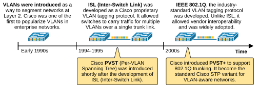
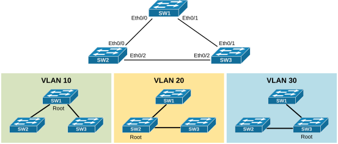
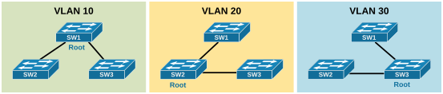
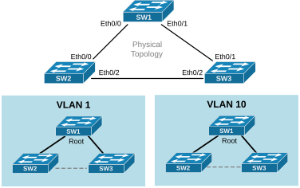

[Configuring Per-VLAN STP (PVST)](https://www.networkacademy.io/ccna/spanning-tree/configuring-pvst)
==========

In this lesson, we will go though the process of configuring different spanning-tree topologies per VLAN.


## Тhe difference between PVST and PVST+


When you start reading different documentations on per-VLAN Spanning Tree, you will eventually encounter two different terms: PVST and PVST+. Nowadays, they both mean the same thing, but that was not always the case. To understand the difference between the two, we must look back at the history of switching technologies, particularly the development and adoption of virtual LANs (VLANs) and VLAN tagging protocols.


In the early 1990s, VLANs were introduced as a way to segment layer 2 networks. It was a significant breakthrough in the industry. Cisco was one of the first vendors to really popularize VLANs in the enterprise. At that time, Cisco had developed **its own VLAN tagging method called ISL** (Inter-Switch Link). ISL allowed switches to carry VLANs over a single link called trunk. 


Since ISL could carry VLAN information, Cisco designed PVST to take advantage of it by running **a separate instance of the Spanning Tree Protocol (STP) for each VLAN**. This gave more control and flexibility in how traffic flowed through the layer 2 network. However, it only worked on Cisco equipment because both ISL and PVST were Cisco proprietary.




*Figure 1. PVST vs. PVST+.*


The industry followed along and, in the early 2000s, the IEEE introduced a standard VLAN tagging method called 802.1Q. It was accepted by many vendors and soon become the industry-standard. Cisco wanted to keep the benefits of PVST while also supporting this new VLAN tagging standard. So they created PVST+, an updated version of PVST **that could work over 802.1Q trunks**. PVST+ allowed Cisco switches to interoperate with other vendors using standard STP, while still maintaining one STP instance per VLAN inside Cisco’s network.


**Key Note**: PVST works only with ISL trunks, while PVST+ works with 802.1Q trunks (hence interoperable with other vendors).


Nowadays, wherever you encounter the term PVST it refers to the PVST+ implementation. For example, you can see the configuration command that changes the STP mode on a modern switch. Notice that it says PVST, even though it is actually PVST+.


```
`SW1(config)# **spanning-tree mode ?**
mst         Multiple spanning tree mode
pvst        Per-Vlan spanning tree mode
rapid-pvst  Per-Vlan rapid spanning tree mode`
```

All modern switches support only PVST+ and 802.1Q trunking. **ISL and PVST are phased out**. Although all official documentation and configuration lines use the term PVST, they actually mean PVST+.


## Configuring different STP topology per VLAN


Now let's see the PVST protocol in action. We are going to use the topology shown in the diagram below. 




*Figure 2. Per VLAN topologies.*


We have three switches connected via 802.1Q trunks and three VLANs 10, 20 and 30 alongside the default VLAN 1. Notice that all modern Cisco switches run the Rapid-PVST by default. However, since we are still discussing the PVST, we first need to change the STP protocol on each switch as shown in the output below. 


```
`// We configure this command on every swtich
SW1# **conf t**
Enter configuration commands, one per line.  End with CNTL/Z.
SW1(config)# **spanning-tree mode pvst**
Warning: Changing STP mode can disrupt the traffic and make system unstable
Recommend to change STP mode only during maintenance window`
```

Now, all switches run per-VLAN spanning tree (PVST). We can verify this on every switch using the show spanning-tree command. If the "*Spanning tree enabled protocol*" line says "*ieee*," the switch runs PVST, as shown in the output below. If it says "*rstp*," it means the switch runs Rapid-PVST. If it says "*mstp*," it means the switch runs Multiple Spanning-Tree.


```
`SW1# **show spanning-tree**
VLAN0001
Spanning tree enabled protocol ieee
<lines omitted for brevity>`
```

Let's now check the default topology of every VLAN. SW1 is the root bridge for each one because its MAC address is the lowest of the three switches, as you can see in the output below.


```
`SW1# **show spanning-tree**

**VLAN0001**
Spanning tree enabled protocol ieee
Root ID    Priority    32769
Address     aabb.cc00.1000
This bridge is the root
Hello Time   2 sec  Max Age 20 sec  Forward Delay 15 sec
<lines omitted for brevity>

**VLAN0010**
Spanning tree enabled protocol ieee
Root ID    Priority    32778
Address     aabb.cc00.1000
This bridge is the root
Hello Time   2 sec  Max Age 20 sec  Forward Delay 15 sec
<lines omitted for brevity>

**VLAN0020**
Spanning tree enabled protocol ieee
Root ID    Priority    32788
Address     aabb.cc00.1000
This bridge is the root
Hello Time   2 sec  Max Age 20 sec  Forward Delay 15 sec
<lines omitted for brevity>

**VLAN0030**
Spanning tree enabled protocol ieee
Root ID    Priority    32798
Address     aabb.cc00.1000
This bridge is the root
Hello Time   2 sec  Max Age 20 sec  Forward Delay 15 sec
<lines omitted for brevity>`
```

Notice that the priority of all switches is the default one 32768. Technically the priority is a combination of the priority value and the vlan number, as shown in yellow in the diagram below.


*Figure 3. Bridge ID components.*


For example, the default priority for VLAN 1 is 32768+1=32769. The default one for VLAN 10 is 32768+10=32778, for VLAN 20 is 32768+20=32788 and for VLAN 30 is 32768+30=32798. You can verify this on the CLI as shown in the output below.


```
`SW1# **show spanning-tree bridge detail**

VLAN0001
Bridge ID  Priority    32769  (priority 32768 sys-id-ext 1)
Address     aabb.cc00.1000
Hello Time   2 sec  Max Age 20 sec  Forward Delay 15 sec
VLAN0010
Bridge ID  Priority    32778  (priority 32768 sys-id-ext 10)
Address     aabb.cc00.1000
Hello Time   2 sec  Max Age 20 sec  Forward Delay 15 sec
VLAN0020
Bridge ID  Priority    32788  (priority 32768 sys-id-ext 20)
Address     aabb.cc00.1000
Hello Time   2 sec  Max Age 20 sec  Forward Delay 15 sec
VLAN0030
Bridge ID  Priority    32798  (priority 32768 sys-id-ext 30)
Address     aabb.cc00.1000
Hello Time   2 sec  Max Age 20 sec  Forward Delay 15 sec`
```

Since none of the switches is explicitly configured to be the root bridge for any of the VLANs, SW1 is elected based on lowest MAC address. However, this means that if another switch with lower MAC connects to the topology, it can immediately become the root bridge and initiate a recalculation of the entire topology. This is not desirable by any means. It is strongly recommended that **every layer 2 network has explicitly configured root bridge for every VLAN**.


### Configuring the root bridge for a VLAN


Let's now configure the VLAN topologies as shown in the diagram below. 




*Figure 4. Per-VLAN topologies.*


Cisco switches have two commands that can be used to configure a switch as the root bridge for a VLAN, as shown in the snippet below.


```
`SW2(config)# **spanning-tree vlan 20 ?**
forward-time  Set the forward delay for the spanning tree
hello-time    Set the hello interval for the spanning tree
max-age       Set the max age interval for the spanning tree
priority      Set the bridge priority for the spanning tree
root          Configure switch as root
<cr>          <cr>`
```

The command spanning-tree vlan [vlan-id] priority sets the bridge priority value **manually** for a specific VLAN. This value determines which switch becomes the root bridge. Lower priority means a higher chance of becoming root. Typically, in production environments, the network admin configures the switch that must be the root with priority 0.


The command spanning-tree vlan [vlan-id] root is a macro that **automatically **adjusts the switch’s priority to help it become the root bridge (or backup root). Cisco calculates a good priority value and applies it for you. It’s quicker and easier to use if you don’t want to set numbers manually. 


- When you configure a switch as root primary, the switch sets its priority to 24576 for the VLAN if that’s enough to become the root. 
- If another switch already has a lower priority, the switch sets its priority to 4096 less than the current lowest value so that it can become the new root.

In short, priority gives you full **manual **control. The root command is **a shortcut** that helps set the switch as root in more human-friendly way.

Configuring SW1 as root for VLAN 1 and 10
Let's configure SW1 as root bridge for VLAN 1 and for VLAN 10. Let's us the automatic macro command as shown in the output below.


```
`SW1# **conf t**
Enter configuration commands, one per line.  End with CNTL/Z.
SW1(config)# **spanning-tree vlan 1 root primary**
SW1(config)# **spanning-tree vlan 10 root primary**
SW1(config)# **end**
SW1#`
```

Now, let's verify the priority value that the switch configured. You can see that it sets the priority to 24576, as this is enough to make the switch the root bridge. If there were another switch with a lower priority (for example, 8192), it would have configured a value 4096 lower than that (i.e., 4096).


```
`SW1# **show spanning-tree**

**VLAN0001**
Spanning tree enabled protocol ieee
Root ID    Priority    24577
Address     aabb.cc00.1000
This bridge is the root
Hello Time   2 sec  Max Age 20 sec  Forward Delay 15 sec
Bridge ID  Priority    24577  (priority 24576 sys-id-ext 1)
Address     aabb.cc00.1000
Hello Time   2 sec  Max Age 20 sec  Forward Delay 15 sec
Aging Time  300 sec
Interface           Role Sts Cost      Prio.Nbr Type
------------------- ---- --- --------- -------- --------------------------------
Et0/0               Desg FWD 100       128.1    P2p
Et0/1               Desg FWD 100       128.2    P2p
Et0/2               Desg FWD 100       128.3    P2p

**VLAN0010**
Spanning tree enabled protocol ieee
Root ID    Priority    24586
Address     aabb.cc00.1000
This bridge is the root
Hello Time   2 sec  Max Age 20 sec  Forward Delay 15 sec
Bridge ID  Priority    24586  (priority 24576 sys-id-ext 10)
Address     aabb.cc00.1000
Hello Time   2 sec  Max Age 20 sec  Forward Delay 15 sec
Aging Time  300 sec
Interface           Role Sts Cost      Prio.Nbr Type
------------------- ---- --- --------- -------- --------------------------------
Et0/0               Desg FWD 100       128.1    P2p
Et0/1               Desg FWD 100       128.2    P2p
Et0/2               Desg FWD 100       128.3    P2p`
```

Now, SW1 is the root bridge for VLANs 1 and 10. The spanning-tree topology for these VLANs looks like follows:




*Figure 5. VLANs 1 and 10 PVST topology.*


Lastly, let's verify that the link between switches 2 and 3 is blocked.


```
`SW3# **show spanning-tree vlan 10**
**VLAN0010**
Spanning tree enabled protocol ieee
Root ID    Priority    24586
Address     aabb.cc00.1000
Cost        100
Port        2 (Ethernet0/1)
Hello Time   2 sec  Max Age 20 sec  Forward Delay 15 sec
Bridge ID  Priority    32778  (priority 32768 sys-id-ext 10)
Address     aabb.cc00.3000
Hello Time   2 sec  Max Age 20 sec  Forward Delay 15 sec
Aging Time  300 sec
Interface           Role Sts Cost      Prio.Nbr Type
------------------- ---- --- --------- -------- --------------------------------
Et0/0               Desg FWD 100       128.1    P2p
Et0/1               Root FWD 100       128.2    P2p
Et0/2               Altn BLK 100       128.3    P2p`
```
Configuring SW2 as root for VLAN 20
Now, let's make SW2 the root bridge for VLAN 20 using the other CLI command that **manually **sets the priority value.


### Full Content Access is for Subscribed Users Only...


- **Learn any CCNA, CCIE or Network Automation topic** with animated explanation.
- **We focus on simplicity.** Networking tutorials and examples written in simple, understandable language.

Sign up for free ►
