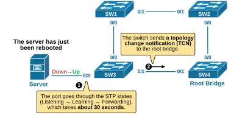
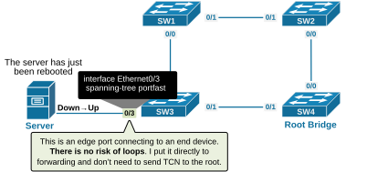
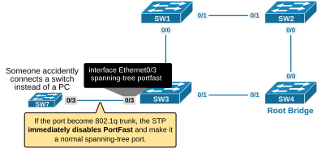
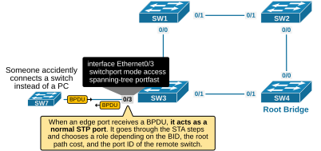
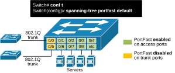

[STP Portfast](https://www.networkacademy.io/ccna/spanning-tree/portfast)
==========

In this lesson, we discuss a spanning-tree feature called PortFast. It is used to optimize the ports that connect to end-user devices by skipping the Listening and Learning state and directly putting the ports to Forwarding.


## Why do we need STP Portfast?


To understand why the Spanning Tree protocol has introduced the Portfast feature, let's examine the following example. Imagine a server connected to a switch port that is **not **configured with PortFast. When the server reboots, the switchport **goes down **and then **comes back up**. This triggers Spanning Tree to do the following:


- The Spanning-Tree protocol starts its normal process of putting the interface in a forwarding state. The port transitions to the Listening state (15 seconds), then to the Learning state (15 seconds), and finally, it moves to the Forwarding state. So, the port takes about 30 seconds before the server can send and receive data.
- The switch sees this link flap as a topology change and triggers the Topology Change Notification (TCN) process. It is explained in detail in this lesson. In short, when a topology change is detected, switches lower their MAC table aging timer (5 min) to the MaxAge time (20 sec). 
However, if a switchport connects only to one end-user device (like a server, computer, printer, etc.), there’s very little risk of a loop. Loops only occur when the device is bridging traffic back into the network, which end-user devices do not do.


Let's use the topology shown in the diagram below to demonstrate this STP behavior. We will power up the server and observe how STP reacts.




*Figure 1. Why do we need STP Portfast?*


The server connects to port Eth0/3, which is a standard port that is not configured with the PortFast feature. To simulate the server powering up, we enable the interface, as shown in the output below. Notice that we turned the debug spanning-tree events command on to see what happens.


```
`SW3# **conf t**
Enter configuration commands, one per line.  End with CNTL/Z.
SW3(config)# **int e0/3**
SW3(config-if)# **no shutdown **
SW3(config-if)#

*May  1 17:39:01.294: STP: VLAN0001 Et0/3 -> listening
*May  1 17:39:16.294: STP: VLAN0001 Et0/3 -> learning
*May  1 17:39:31.294: STP[1]: Generating TC trap for port Ethernet0/3
*May  1 17:39:31.294: STP: VLAN0001 sent Topology Change Notice on Et0/1
*May  1 17:39:31.294: STP: VLAN0001 Et0/3 -> forwarding`
```

Notice the times in the debug outputs. It took STP 30 seconds to put the port in the forwarding state. Nowadays, servers boot much faster than that. Additionally, servers attempt to assign IPv4/IPv6/DNS settings via DHCP during their boot-up process. Therefore, **servers need to access the network immediately **after they are powered on, and the spanning tree protocol** becomes a bottleneck**.


To fix this 30-second delay, the STP protocol has introduced the PortFast feature, which skips the Listening and Learning states and moves the port straight to Forwarding. 


## What is Portfast?


PortFast is a spanning-tree feature that optimizes the handling of edge ports. Edge ports are ones that connect to end-user devices such as computers, servers, and printers. PortFast is configured per port and provides two significant optimizations when enabled:


- When the port becomes up, STP puts it into a **Forwarding **state right away, skipping the **Listening **and **Learning **states.
- When the port status changes, STP does not generate a **Topology Change Notifications (TCNs)**.




*Figure 2. What is Spanning-Tree Portfast?*


Note: In the context of Spanning-Tree, an **edge port** is a switch port that is directly connected to an end-user device, such as a computer, printer, or server.


Portfast must be used only on edge ports. It should not be used on ports connected to other switches or hubs, as this can cause temporary loops.


## How does Portfast work?


PortFast was introduced to solve a problem where an end-user device couldn’t get a DHCP address because the switch port took 30 seconds to go through the STP states and start forwarding traffic. PortFast skips the Listening and Learning steps and puts the port directly into the Forwarding state so that the end device can immediately access the network.


The feature works per interface. There are two ways to enable it: **globally **on all interfaces at once or **locally **at one interface at a time. The following output shows how we configure the future on one interface only.


```
`SW3# **conf t**
Enter configuration commands, one per line.  End with CNTL/Z.
SW3(config)# **interface Ethernet0/3**
SW3(config-if)# **spanning-tree portfast**** **
!
%Warning: portfast should only be enabled on ports connected to a single
host. Connecting hubs, concentrators, switches, bridges, etc... to this
interface  when portfast is enabled, can cause temporary bridging loops.
Use with CAUTION
%Portfast has been configured on Ethernet0/3 but will only
have effect when the interface is in a non-trunking mode.
SW3(config-if)# **end**`
```

Now, if we change the port's state, we can see that it "*jumps directly from blocking to forwarding*," skipping the Listening and Learning states.


```
`SW3# **conf t**
Enter configuration commands, one per line.  End with CNTL/Z.
SW3(config)# **interface Ethernet0/3**
SW3(config-if)# **no shutdown**
** **
*May 1 18:17:10.952: STP:VLAN0001 Et0/3 ->jump to forwarding from blocking`
```

Notice that the interface is now listed as an **edge port**. It means that the spanning-tree protocol knows that this interface connects to an end-user device.


```
`SW3# **show spanning-tree **

VLAN0001
Spanning tree enabled protocol ieee
Root ID    Priority    24577
Address     aabb.cc00.1400
Cost        100
Port        2 (Ethernet0/1)
Hello Time   2 sec  Max Age 20 sec  Forward Delay 15 sec
Bridge ID  Priority    28673  (priority 28672 sys-id-ext 1)
Address     aabb.cc00.1300
Hello Time   2 sec  Max Age 20 sec  Forward Delay 15 sec
Aging Time  300 sec
Interface           Role Sts Cost      Prio.Nbr Type
------------------- ---- --- --------- -------- ---------------------
Et0/0               Desg FWD 100       128.1    P2p 
Et0/1               Root FWD 100       128.2    P2p 
Et0/2               Desg FWD 100       128.3    P2p 
Et0/3               Desg FWD 100       128.4    P2p Edge `
```

We can verify that the interface is configured with Portfast using the following show command. 


```
`SW1# **show spanning-tree interface Eth0/3 detail **
Port 4 (Ethernet0/3) of VLAN0001 is designated forwarding 
Port path cost 100, Port priority 128, Port Identifier 128.4.
Designated root has priority 24577, address aabb.cc00.1400
Designated bridge has priority 32769, address aabb.cc00.1000
Designated port id is 128.4, designated path cost 200
Timers: message age 0, forward delay 0, hold 0
Number of transitions to forwarding state: 1
The port is in the portfast mode
Link type is point-to-point by default
BPDU: sent 55, received 0`
```

### Connecting a switch to an edge port


Since we have repeatedly stated that the feature should only be used on ports that connect to end-user devices, some people might wonder: 


*"Okay, but what will happen if someone accidentally connects a switch to a Portfast interface?"*


It’s essential to understand the distinction between PortFast's administrative and operational states. The administrative state is what you’ve configured, while the operational state shows whether the feature is actually active on a given port. Let's see what happens when we connect a switch to the interface Eth0/3, as shown in the diagram below.




*Figure 3. Connecting a switch to an edge port.*


As soon as we connect a switch to interface Eth0/3, the port goes into the Listening and Learning states, as shown in the output below.


```
`*May  2 06:16:30.207: STP: VLAN0001 Et0/3 -> listening
*May  2 06:16:31.207: STP: VLAN0001 Topology Change rcvd on Et0/3
*May  2 06:16:31.207: STP: VLAN0001 sent Topology Change Notice on Et0/1
*May  2 06:16:45.209: STP: VLAN0001 Et0/3 -> learning
*May  2 06:17:00.210: STP[1]: Generating TC trap for port Ethernet0/3
*May  2 06:17:00.210: STP: VLAN0001 sent Topology Change Notice on Et0/1
*May  2 06:17:00.210: STP: VLAN0001 Et0/3 -> forwarding`
```

Essentially, the spanning-tree protocol reverts the port to a normal state to prevent potential loops. It also sends a topology change notification to the root bridge to inform it that the switch topology has changed (a new switch is added to the topology).


Now, if we check the interface's operational state, we can see that the feature is operationally disabled, even though the port is configured with Portfast. Also, notice that the interface is no longer considered an edge port by the spanning tree. 


```
`SW3# **show run interface Eth0/3**
interface Ethernet0/3
spanning-tree portfast
end`
```

```
`SW3# **show spanning-tree interface Eth0/3 portfast **
VLAN0001            disabled`
```

```
`SW3# **show spanning-tree **

VLAN0001
Spanning tree enabled protocol ieee
Root ID    Priority    24577
Address     aabb.cc00.1400
Cost        100
Port        2 (Ethernet0/1)
Hello Time   2 sec  Max Age 20 sec  Forward Delay 15 sec
Bridge ID  Priority    28673  (priority 28672 sys-id-ext 1)
Address     aabb.cc00.1300
Hello Time   2 sec  Max Age 20 sec  Forward Delay 15 sec
Aging Time  15  sec
Interface           Role Sts Cost      Prio.Nbr Type
------------------- ---- --- --------- -------- --------------------------------
Et0/0               Desg FWD 100       128.1    P2p 
Et0/1               Root FWD 100       128.2    P2p 
Et0/2               Desg FWD 100       128.3    P2p 
Et0/3               Desg FWD 100       128.4    P2p `
```

PortFast should only be used on ports that connect to end devices, like servers, PCs, or printers. Therefore, the switch only turns on the feature on access ports and automatically disables it on trunk ports, which connect to other switches.


Note: Portfast **only works on access ports**. If an interface becomes an 802.1Q trunk, the feature is automatically disabled.


### Portfast and BPDUs


There’s a lot of confusion online about how the feature works in the context of BPDUs. A common misunderstanding is that it disables STP and stops sending or receiving BPDUs. That’s not true. A PortFast-enabled port still sends and receives BPDUs as every designated STP port does. In fact, if a PortFast port receives a BPDU, **it acts as a normal STP port**. It goes through the Spanning-Tree Algorithm (STA) steps and chooses a role (Root, Desg, or Altn) depending on the BID, the root path cost, and the port ID of the remote switch. 




*Figure 4. Portfast and BPDUs.*


In our example, SW7 is a stub switch—it doesn't have any other inter-switch connections. Additionally, the link between the switches is not an 802.1q trunk. In that case, SW3's eth0/3 interface becomes a designated port and still works in a Portfast mode, as shown in the output below, even though it received a few BPDUs from SW7. 


```
`SW3# **show spanning-tree interface e0/3 detail **
Port 4 (Ethernet0/3) of VLAN0001 is designated forwarding 
Port path cost 100, Port priority 128, Port Identifier 128.4.
Designated root has priority 24577, address aabb.cc00.1400
Designated bridge has priority 28673, address aabb.cc00.1300
Designated port id is 128.4, designated path cost 100
Timers: message age 0, forward delay 0, hold 0
Number of transitions to forwarding state: 2
The port is in the portfast mode
Link type is point-to-point by default
BPDU: sent 48, received 4`
```

Notice two important points here:


- SW3's interface Eth0/3 still sends and receives BPDUs even though it is configured with Portfast.
- It acts as a normal STP port when processing remote BPDUs. If the remote switch sends superior BPDUs, the port can go into a blocking state to prevent loops.

Now, let's shift our focus to the different methods for enabling the feature on switchports.


## Configuring Portfast on Edge ports


The Portfast feature **is disabled by default** on all switchports. There are two methods you can use to configure it on one or many ports. You can enable it globally using the spanning-tree portfast default or per interface using spanning-tree portfast. In both cases, it only works on access ports.


### Option 1: Enable Portfast globally


You can set PortFast **as the default for all switch ports** with one global command, as shown in the diagram below. 




*Figure 5. Spanning-tree Portfast Default.*


This will automatically enable the feature on all ports that are in access mode (non-trunking) and will disable the feature on the ones that are 802.1Q trunks.


```
`SW3# **conf t**
Enter configuration commands, one per line.  End with CNTL/Z.
SW3(config)# **spanning-tree portfast default**** **
!
%Warning: this command enables portfast by default on all interfaces. You
should now disable portfast explicitly on switched ports leading to hubs,
switches and bridges as they may create temporary bridging loops.
SW3(config)# **end**`
```

We can verify if the command is configured on the switch using the following command. 


```
`SW3# **show spanning-tree summary **
Switch is in pvst mode
Root bridge for: none
EtherChannel misconfig guard            is enabled
Extended system ID                      is enabled
Portfast Default                        is enabled
PortFast BPDU Guard Default            is disabled
Portfast BPDU Filter Default           is disabled
Loopguard Default                      is disabled
UplinkFast                              is disabled
BackboneFast                            is disabled
Configured Pathcost method used is short
Name                   Blocking Listening Learning Forwarding STP Active
---------------------- -------- --------- -------- ---------- ----------
VLAN0001                     0         0        0          4          4
---------------------- -------- --------- -------- ---------- ----------
1 vlan                       0         0        0          4          4`
```

Note that this is now **the recommended approach** in all modern networks and is included in all validated design guides. If a switchport connects to a single device, such as a server, printer, or PC, there is absolutely no reason not to enable the Portfast feature.


### Option 2: Enable Portfast per-interface


The other, more granular way to enable the feature is to use the interface-level command, as shown in the output below. 


```
`interface Ethernet0/3
spanning-tree portfast
end`
```

This approach is useful in scenarios when you want to enable the feature only on specific interfaces.

Using the Switchport Host macro
You can also use a macro command switchport host that configures the port as access and configures Portfast, as you can see in the output below.


```
`SW3# **conf t**
Enter configuration commands, one per line.  End with CNTL/Z.
SW3(config)#** interface e0/3**     
SW3(config-if)# **switchport ?**
access         Set access mode characteristics of the interface
autostate      Include or exclude this port from vlan link up calculation
dot1q          Set interface dot1q properties
host           Set port host
mode           Set trunking mode of the interface
nonegotiate    Device will not engage in negotiation protocol on this
interface
port-security  Security related command 
private-vlan   Set the private VLAN configuration
protected      Configure an interface to be a protected port
trunk          Set trunking characteristics of the interface
voice          Voice appliance attributes
<cr>           <cr>
SW3(config-if)# **switchport host **
switchport mode will be set to access
spanning-tree portfast will be enabled
channel group will be disabled

SW3(config-if)# **end**`
```

In the output below, you can see that the macro command configured two individual commands that make the interface and edge port.


```
`SW3# **show run interface Ethernet0/3**
Building configuration...
Current configuration : 77 bytes
!
interface Ethernet0/3
switchport mode access
spanning-tree portfast
end`
```

The switchport host is typically not widely used, but it can be handy in exam environments, depending on the requirements.


## Portfast Design Considerations


Now let's shift our focus on the design point of view of the feature. When should you use it, and when not?


### Full Content Access is for Subscribed Users Only...


- **Learn any CCNA, CCIE or Network Automation topic** with animated explanation.
- **We focus on simplicity.** Networking tutorials and examples written in simple, understandable language.

Sign up for free ►
