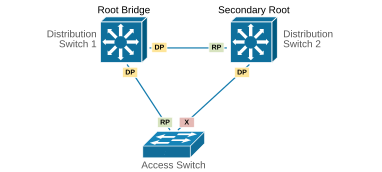
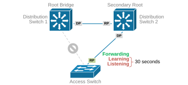
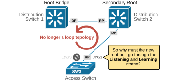
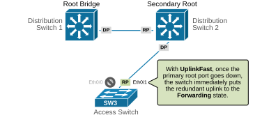

[STP Uplinkfast](https://www.networkacademy.io/ccna/spanning-tree/stp-uplinkfast)
==========

In the previous lesson, we saw what Portfast is and when we use it in modern networks. This lesson discusses another spanning-tree feature called Uplinkfast. Before we begin, let's examine the obvious:


- **Portfast **brings an edge port to the Forwarding state faster than a regular STP port by skipping the Listening and Learning states (hence the name PortFast).
- **Uplinkfast **brings an uplink port to the Forwarding state faster than a regular STP port (hence the name UplinkFast).

But what is an uplink in the context of STP, and in what scenarios do we use this feature? Let's zoom in.


## Why do we need UplinkFast?


Imagine an access layer switch connected to two separate distribution switches (DS1 and DS2) for redundancy, as shown in the diagram below. DS1 is the root bridge, and DS2 is the secondary root. The access switch has one root port (RP) toward DS1, and one blocked port toward DS2. **These are the two uplinks** of the access switch.




*Figure 1. Initial Topology.*


Now, let's examine what happens when the access switch's uplink to the root bridge goes down due to a direct failure (cable unplugged or link fails). 




*Figure 2. STP uplink failure.*


To simulate a failure, we shut down the access switch's root port (Ethernet 0/0) and enabled debug spanning-tree events to observe what happens.


```
`SW3# **conf t**
Enter configuration commands, one per line.  End with CNTL/Z.
SW3(config)# **interface Ethernet0/0**
SW3(config-if)# **shutdown **
SW3(config-if)# **end**

SW3#
*May  5 04:03:55.561: STP: VLAN0001 new root port Et0/1, cost 200
*May  5 04:03:55.561: STP: VLAN0001 Et0/1 -> listening
*May  5 04:04:10.563: STP: VLAN0001 Et0/1 -> learning
*May  5 04:04:25.564: STP: VLAN0001 Et0/1 -> forwarding`
```

Notice that once the root port (eth0/0) goes down, the switch immediately selects the other uplink (eth0/1) as the new root port (highlighted in green). However, it takes 30 seconds before the new root port starts forwarding traffic because it first goes through the Listening and Learning states (highlighted in red). During those 30 seconds, all end-user devices connected to the access switch **lose connection to the network**. 


Thirty seconds is a lot of time in the context of network access. Cisco soon realized something important: when the current root port experiences a direct failure and goes down, there is no longer any risk of loops because there is no longer a loop topology, as shown in the diagram below. 




*Figure 3. Why do we need UplinkFast?*


As soon as Cisco realized this, they introduced the spanning tree feature called UplinkFast, which takes advantage of this fact.


## What is UplinkFast?


The UplinkFast feature is designed for access layer switches—those at the edges of the spanning tree. It allows these switches to quickly switch to a backup uplink if the main (root port) uplink goes down, as shown in the diagram below.




*Figure 4. What is UplinkFast?*


Normally, one uplink is active (Forwarding), and the others stay in the Blocking state. If the main uplink fails, UplinkFast immediately activates one of the backup uplinks. This helps restore connectivity without waiting for the normal spanning-tree timers.


Let's see the same example as above but with Uplinkfast configured on the access switch. Eth0/0 is the main root port. Let's shut it down and see what happens.


```
`SW3(config)# **interface e0/0**
SW3(config-if)# **shutdown **
SW3(config-if)# **end**

SW3#
*May  5 04:08:23.735: STP: VLAN0001 new root port Et0/1, cost 3200
*May  5 04:08:23.735: %SPANTREE_FAST-7-PORT_FWD_UPLINK: 
VLAN0001 Ethernet0/1 moved to Forwarding (UplinkFast).`
```

Notice that the switch immediately moves the new root port Eth0/1 to Forwarding without going through the Listening and Learning states. 


## How does UplinkFast work?


Now, let's see how the feature works. We can break down the process into five steps, as follows:


- Enabling the feature globally
- Normal operation
- Failure detection
- Fast recovery
- MAC table update

### Step 1. Enabling the feature globally


Before we see how we enable the Uplinkfast feature on the access switch, let's first check the current status of the spanning protocol. Notice that **the access switch has a default priority** (32768). Eth0/0 is the main root port, and the other uplink, Eth0/1, is in a blocking state. Also, notice the port costs. All interfaces are 10 Mbps Ethernet links with an STP cost of 100. 


```
`AccessSwitch# **show spanning-tree**

VLAN0001
Spanning tree enabled protocol ieee
Root ID    Priority    24577
Address     aabb.cc00.1000
Cost        100
Port        1 (Ethernet0/0)
Hello Time   2 sec  Max Age 20 sec  Forward Delay 15 sec

Bridge ID  Priority    32769  (priority 32768 sys-id-ext 1)
Address     aabb.cc00.3000
Hello Time   2 sec  Max Age 20 sec  Forward Delay 15 sec
Aging Time  15  sec

Interface           Role Sts Cost      Prio.Nbr Type
------------------- ---- --- --------- -------- --------------------------------
Et0/0               Root FWD 100       128.1    P2p
Et0/1               Altn BLK 100       128.2    P2p
Et0/2               Desg FWD 100       128.3    P2p
Et0/3               Desg FWD 100       128.4    P2p`
```

We also verify that the feature is disabled at the moment.


```
`AccessSwitch# **show spanning-tree uplinkfast **
UplinkFast is disabled`
```

We enable the UplinkFast feature using the following command in global configuration mode. That's it, nothing more is required.


```
`AccessSwitch(config)# **spanning-tree uplinkfast**`
```

Once enabled, UplinkFast works **across the entire switch and all VLANs**. This is different from Portfast, which works on a per-interface basis.


### Step 2. Normal Operation


When we enable Uplinkfast on an access switch,** **the switch raises its bridge priority to 49,152, making it **unlikely to become the root**. Also, each local port’s cost is increased by 3000, so **other switches won’t prefer it as a path to the root**. 


```
`AccessSwitch# **show spanning-tree**

VLAN0001
Spanning tree enabled protocol ieee
Root ID    Priority    24577
Address     aabb.cc00.1000
Cost        3100
Port        1 (Ethernet0/0)
Hello Time   2 sec  Max Age 20 sec  Forward Delay 15 sec

Bridge ID  Priority    49153  (priority 49152 sys-id-ext 1)
Address     aabb.cc00.3000
Hello Time   2 sec  Max Age 20 sec  Forward Delay 15 sec
Aging Time  15  sec
Uplinkfast enabled

Interface           Role Sts Cost      Prio.Nbr Type
------------------- ---- --- --------- -------- --------------------------------
Et0/0               Root FWD 3100      128.1    P2p
Et0/1               Altn BLK 3100      128.2    P2p
Et0/2               Desg FWD 3100      128.3    P2p
Et0/3               Desg FWD 3100      128.4    P2p
`
```

That's because the feature is designed to work on access switches **at the edge of the spanning-tree topology**. It cannot be enabled on the root bridge and is not designed to work on backbone switches.


During normal operation, the primary uplink is active (Forwarding), and the other stays in the Blocking state. The following command verifies that the feature is enabled and lists the switch's uplinks. **An uplink is a port that actively receives BPDUs**.


```
`AccessSwitch# **show spanning-tree uplinkfast**
UplinkFast is enabled

Station update rate set to 150 packets/sec.

UplinkFast statistics
-----------------------
Number of transitions via uplinkFast (all VLANs)            : 0
Number of proxy multicast addresses transmitted (all VLANs) : 0

Name                 Interface List
-------------------- ------------------------------------
VLAN0001             Et0/0(fwd), Et0/1`
```

In our case, Eth0/0 is the access switch's primary uplink, and port Eth0/1 is the backup uplink, currently in a blocking state.


### Step 3. Failure detection


**UplinkFast only works with direct failures**, meaning the root port on the switch itself goes down (e.g., cable unplugged or link loss). UplinkFast detects this immediately and activates the backup uplink.


### Full Content Access is for Subscribed Users Only...


- **Learn any CCNA, CCIE or Network Automation topic** with animated explanation.
- **We focus on simplicity.** Networking tutorials and examples written in simple, understandable language.

Sign up for free ►
