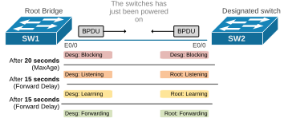
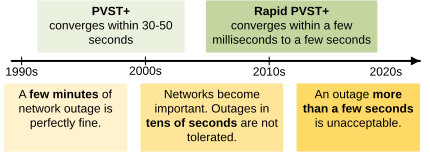
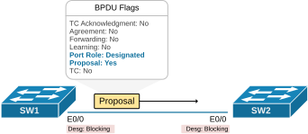
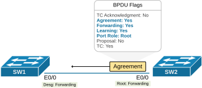
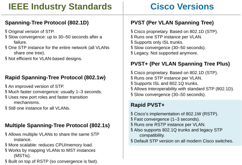
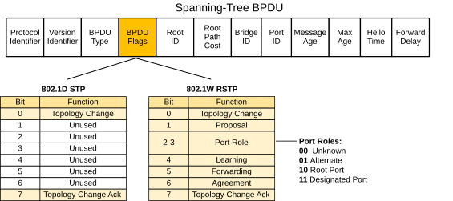
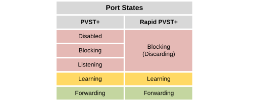

[Introduction to Rapid PVST+](https://www.networkacademy.io/ccna/spanning-tree/introduction-to-rapid-pvst)
==========

In the previous section of this course, we examined the classical per-VLAN spanning tree (PVST+), which is based on the original STP (IEEE 802.1D).


In this lesson, we begin our discussion on the modern Rapid per-VLAN spanning tree (Rapid PVST+), which is based on the RSTP protocol (IEEE 802.1W).


## Why do we need Rapid PVST+?


Let's look at the most basic switching topology possible - two switches connected via a single cable. The switches are just powered on. What happens if the switches run the classical PVST+? How much time would it take before clients connected to SW1 can communicate with clients connected to SW2?




*Figure 1. Classical PVST+ convergence time.*


First, the switchports go into a blocking state for 20 seconds while initializing (the MaxAge timer). Then, the STP protocol moves them into the Listening state for 15 seconds (the Forward Delay timer). Then, go into the Learning state for 15 seconds. Only then do the ports move to the forwarding state and can transmit and receive data. 


If any clients were connected to the two switches, they **would have waited 50 seconds** before they could communicate with each other. That's because the classical STP decision whether to put a port into the forwarding state is based on timers, such as the MaxAge (20 seconds) and Forward delay (15 seconds). If you want to speed up the convergence process of the classical spanning tree, you must lower the timers. But even then, you cannot get lower than tens of seconds.


The original 802.1D Spanning Tree Protocol (STP) was created in the 1990s when recovering from a network outage **within minutes** was considered acceptable. Most failure scenarios took STP around 30-50 seconds to reconverge, which was pretty Ok back then. 




*Figure 2. Cisco PVST Timeline (simplified).*


To improve STP’s performance, Cisco introduced proprietary enhancements to PVST+ like **UplinkFast**, **BackboneFast**, and **PortFast,** which we have seen in previous lessons. These features helped speed up network recovery, but they required extra setup, which was unscalable. The industry wanted a better loop-prevention protocol that works faster than STP out of the box.


## What is Rapid PVST+?


The solution was an enhanced protocol version called Rapid STP (IEEE 802.1W) that does not rely on timersto decide whether to put an interface in the forwarding state. Instead, RSTP uses an explicit handshake process to negotiate the port role and state. This is the mechanism that makes the protocol "*rapid*."


Rapid PVST+ is Cisco's version of the IEEE Rapid Spanning Tree (802.1w). It converges faster than the classical STP right out of the box—no special configuration is needed.


### RSTP Synchronization


Let's jump directly into the process that makes the protocol "*Rapid*." It is called the synchronization process and speeds up the convergence of RSTP compared to the classical STP, which relies on timers. Let's use the same topology as above. However, the switches now run Rapid PVST+. Let's see how much faster they will converge compared to the example above:


- **Step 1. **When a switchport first initializes (device boots up, cable is plugged, port is unshut, etc.), it starts as** a designated port in the blocking state** (now called discarding). It starts sending BPDUs with the proposal bit set, as shown in the diagram below. This signals that the switch wants to become the designated bridge for that segment. The proposal includes the switch's Bridge ID (BID) and the role of the port.




*Figure 3. Proposal.*


- **Step 2.** When the remote switch (SW2) receives the BPDU with the proposal flag set, it begins a synchronization process. A port is considered in sync if it's either in the Blocking state or is an Edge port (configured with PortFast). To achieve this, the switch temporarily moves all non-edge ports to the Blocking state and checks the received BPDU to confirm it doesn’t conflict with its own port roles (more details on this process in the next lesson).
- **Step 3**. Once this check is complete, SW2 selects a port role and moves the port into the Forwarding state. It then sends a BPDU back to SW1 with the agreement flag set, as shown in the diagram below.




*Figure 4. RSTP Agreement.*


- **Step 4.** When SW1 receives the BPDU with the agreement flag set, it knows the proposal has been accepted. It then **moves its designated port into the Forwarding state**, as shown in the diagram above.

The proposal-agreement process in RSTP is very fast because **it doesn’t depend on STP timers**. Let's enable debugging of spanning-tree events and check how much time it took SW1 and SW2 to negotiate the port roles and put their ports into the forwarding state. 


```
`SW1# **debug spanning-tree events**
*May  9 05:32:35.915: RSTP(1): Et0/0 Dispute!
*May  9 05:32:36.207: RSTP(1): transmitting a proposal on Et0/0
*May  9 05:32:36.209: RSTP(1): received an agreement on Et0/0
*May  9 05:32:36.209: RSTP[1]: Et0/0 dispute resolved`
```

Notice the times in the debug output. It took 0.3 seconds to start forwarding traffic. Compare this to the 30-50 seconds that the classical spanning tree requires to figure out the port roles and states using the MaxAge and Forward Delay timers. It is a massive improvement!


### RSTP vs. Rapid PVST+


Before we dive into the details of how the rapid PVST works, let's clarify the difference between some of the abbreviations because they might be confusing for some engineers. We need to look back in history to understand all terms. It all started with the original IEEE 802.1D Spanning Tree Protocol (STP), which was developed in the 1980s to prevent loops in Ethernet networks. Cisco adopted this standard early on and extended it by introducing the Per VLAN Spanning Tree (PVST). However, **it worked only with Cisco's proprietary ISL trunking protocol** and was incompatible with other vendors.


As industry standards moved toward 802.1Q trunking, Cisco responded with **PVST+**. It maintained the per-VLAN advantage but added support for 802.1Q trunks and backward compatibility with standard 802.1D STP. It became widely used in Cisco networks because it combined VLAN-level flexibility with vendor compatibility.


Later, the IEEE introduced 802.1W, known as Rapid Spanning Tree Protocol (RSTP), drastically reducing convergence times from tens of seconds to just a few. Cisco adapted this standard into **Rapid PVST+**, keeping the per-VLAN architecture but with the fast convergence benefits of the new RSTP algorithm. Rapid PVST+ has become the default spanning-tree mode in all modern Cisco switches to this day.




*Figure 5. STP protocols comparison.*


In the context of Cisco networks, when we say "classical STP," we typically mean PVST+, Cisco’s implementation of the standard 802.1D STP with support for per-VLAN instances. Similarly, when we say "RSTP," we are referring to Rapid PVST+, Cisco’s version of the 802.1w RSTP, also with per-VLAN support.


## How does Rapid PVST+ work?


The first important thing to understand is that Rapid PVST+ is not a completely new protocol. It is just an enchantment of the PVST+ protocol, which we have discussed in the previous section of the course. In essence, it is an evolution of the classical spanning-tree protocol. Most of the terms and mechanics are still the same, with little differences. Let's see the more significant enhancements.


### RSTP BPDU


RSTP uses the BPDU format to the original IEEE 802.1D standard. This ensures **backward compatibility** between RSTP and traditional STP. 


One of the most important differences is that the RSTP BPDU uses all bits of the BPDU Flags field, while the classical STP only uses the first (TC) and the last (TCA) bits. RSTP uses all 8 bits to encode the port’s role and state in the proposal agreement process, speeding up convergence. The updated format is shown in the diagram below.




*Figure 6. STP vs. RSTP BPDU.*


Another essential difference is that in classical STP (802.1D), only the Root Bridge generates and sends BPDUs. Other switches just forward those BPDUs they receive from the Root.


In RSTP (802.1w), every switch actively generates its own BPDUs. They don’t just forward the Root’s BPDUs. This allows faster detection of changes in the network and speeds up convergence.


### Understanding RSTP Port Roles


Rapid PVST+ picks the switch with the lowest bridge priority value as the root bridge and then assigns one of the following roles to each port:


- **Root port:** This is the lowest-cost path for the switch to reach the root bridge (every switch except the root itself has one).
- **Designated port**: This port connects to the switch, offering the best path from that specific LAN segment to the root bridge.
- **Alternate port:** Provides a backup path to the root bridge in case the current root port fails.
- **Backup port:** This port serves as a backup for a designated port. It’s used when there are two links from the same switch to the same LAN segment or loopback.
- **Disabled port:** This port does not participate in the spanning tree.

In a stable network, root and designated ports move immediately to the forwarding state using the proposal-agreement process. Alternate and backup ports remain in the blocking state.


Only root and designated ports are part of the active topology. Alternate and backup ports are kept on standby and excluded from normal traffic flow.


### Understanding RSTP Port States


We have already discussed the classical PVST's port states: Disabled, Blocking, Listening, Learning, and Forwarding. The rapid PVST takes a different approach to the port states. It defines port states based on how **the port handles incoming frames**. If a port drops or ignores incoming frames, it also doesn’t send any out. Each port role can be in one of these three states:


- **Discarding **– The port drops all incoming frames and doesn’t learn MAC addresses. This state combines the old 802.1D Disabled, Blocking, and Listening states since none of them allowed forwarding. RSTP doesn’t need a separate Listening state because it can quickly move to the next state without waiting for BPDUs.
- **Learning **– The port still drops incoming frames but starts learning MAC addresses.
- **Forwarding **– The port forwards incoming frames based on the MAC addresses it has already learned and continues to learn.




*Figure 7. Rapid PVST Port States Overview.*


RSTP works differently. It allows switches to communicate directly with each other through their ports, based on the port’s role rather than just BPDUs from the root. Once a role is chosen, the port is placed into a state that controls how it handles incoming traffic.

### The Proposal-Agreement Process

The key innovation in RSTP is the **proposal-agreement** handshake. This allows Rapid PVST+ to converge much faster than traditional STP. Instead of waiting for timers, switches negotiate port roles directly.

**How it works:**

1. A switch that wants to become the Designated port on a link sends a **Proposal** BPDU (with the Proposal flag set).
2. The downstream switch receives the Proposal and immediately blocks all non-edge ports (puts them into Discarding state) to prevent loops.
3. The downstream switch sends an **Agreement** BPDU (with the Agreement flag set) back to confirm.
4. The upstream switch transitions the port to Forwarding immediately.
5. The downstream switch then sends its own Proposals on its remaining ports, and the process cascades through the network.

This entire process happens in milliseconds, compared to the 30+ seconds required by classic STP.

### Edge Ports (RSTP PortFast)

RSTP introduces the concept of **edge ports** — ports that connect only to end hosts. These are equivalent to PortFast in PVST+. Edge ports skip the proposal-agreement process entirely and transition directly to Forwarding.

```plaintext
SW1(config)# interface Ethernet0/3
SW1(config-if)# spanning-tree portfast
```

Or in RSTP terminology:

```plaintext
SW1(config)# interface Ethernet0/3
SW1(config-if)# spanning-tree portfast edge
```

If an edge port receives a BPDU, it immediately loses its edge status and becomes a normal spanning-tree port. This is an improvement over classic STP PortFast, where BPDU Guard is needed to shut down the port.

### Link Types

RSTP defines three link types that determine how the proposal-agreement process works:

| Link Type | Description | Port Role |
|-----------|-------------|-----------|
| **Point-to-Point** | Full-duplex link between two switches | Can be Root, Designated, Alternate, or Backup |
| **Shared** | Half-duplex link (hub or repeater) | Uses classic STP timer-based convergence |
| **Edge** | Connects to end host only (PortFast) | Transitions immediately to Forwarding |

RSTP automatically detects the link type based on the duplex setting:
- **Full-duplex** → Point-to-Point
- **Half-duplex** → Shared

### RSTP BPDU Format

RSTP uses the same BPDU format as 802.1D but with all 8 flag bits now defined:

| Bit | Flag | Purpose |
|-----|------|---------|
| 1 | TC | Topology Change |
| 2 | Proposal | Proposal flag for proposal-agreement |
| 3-4 | Port Role | 00=Unknown, 01=Alternate/Backup, 10=Root, 11=Designated |
| 5 | Learning | Port is in Learning state |
| 6 | Forwarding | Port is in Forwarding state |
| 7 | Agreement | Agreement flag for proposal-agreement |
| 8 | TCA | Topology Change Acknowledgment |

RSTP also changes BPDU behavior:
- **BPDUs are sent every hello time (2 seconds)** from every switch, not just relayed from the Root Bridge.
- BPDUs serve as **keepalives** — if a switch misses 3 BPDUs (6 seconds), it assumes the neighbor is down.
- This allows RSTP to detect failures much faster than classic STP (which uses Max Age of 20 seconds).

### Configuring Rapid PVST+ on Cisco Switches

```plaintext
SW1(config)# spanning-tree mode rapid-pvst
```

Verify the mode:

```plaintext
SW1# show spanning-tree summary
Switch is in rapid-pvst mode
```

### Summary

- **Rapid PVST+** is Cisco's implementation of RSTP (802.1w) running per VLAN. It is the recommended STP mode on modern Cisco switches.
- It converges in **milliseconds to a few seconds**, compared to 30-50 seconds for classic STP.
- The **proposal-agreement** process enables rapid convergence by allowing switches to negotiate port roles directly rather than waiting for timers.
- **Edge ports** (equivalent to PortFast) transitition immediately to Forwarding and lose edge status if they ever receive a BPDU.
- **Link types** (Point-to-Point, Shared, Edge) determine how convergence works on each port.
- RSTP **reduces port states** from 5 to 3: Discarding, Learning, Forwarding.
- RSTP **adds port roles**: Alternate (backup for Root) and Backup (backup for Designated).
- Configuration is simple: `spanning-tree mode rapid-pvst` enables it globally.
