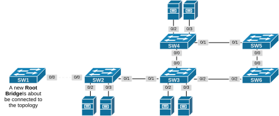
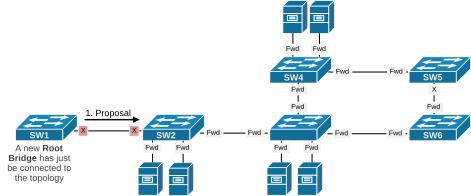
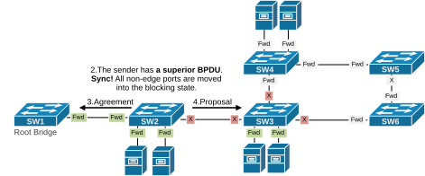
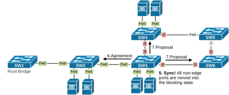
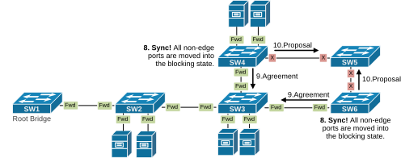
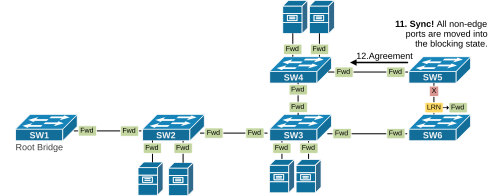
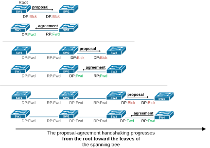

[Understanding RSTP Synchronization](https://www.networkacademy.io/ccna/spanning-tree/understanding-rstp-synchronization)
==========

Rapid Spanning Tree uses a synchronization process to negotiate port roles and states and speed up the convergence process. This lesson discusses the process in detail, using examples.


## Initial Topology


We are going to use the following topology to demonstrate the Sync process in action. It has five switches connected, as shown in the initial topology below.




*Figure 1. Initial Topology.*


Notice that SW1 is initially not connected to the topology. We are going to connect it and observe how RSTP will converge the port states.


## Understanding RSTP Synchronization


The synchronization process is the mechanism that makes the protocol "*Rapid*." Before participating in the active topology, each switch must determine the roles and states of its ports. All non-edge ports start in the **Designated**: **Discarding **state. When a port is designated and in a discarding or learning state, it sets the proposal flag in the BPDUs it sends out. On the receiving switch, the synchronization process is triggered if this BPDU is superior to the best BPDU the switch has stored. To understand it, let's walk through the example shown below. What happens when we connect a new switch (SW1) with a lower bridge ID to the topology? 


- **Step 1**. When SW1 connects to SW2, its port e0/0 becomes up and starts as Designated: Blocking. When a port is designated, and in the Blocking or Learning state, it sends BPDUs with the Proposal bit set, as shown in the diagram below.




*Figure 2. Synchronization Example, Step 1.*


- **Step 2**. When SW2 receives a superior BPDU with the proposal bit set, it starts the Synchronization process. It isolates itself from the topology by blocking its non-edge ports so that no temporary loops can occur. Notice that the edge ports (configured with PortFast) that connect to end devices remain in the Forwarding state.
- **Step 3**. SW2 realizes that SW1 has a superior BPDU and must be the designated switch for the segment. The switch sends back an **agreement **BPDU, confirming it agrees with the proposal and is synchronizing. At this point, both SW1 and SW2 transition the ports to Forwarding.
- **Step 4**. SW2 sends a proposal message out of each non-edge port currently in the Discarding state. This **extends the Synchronization process outwards** until it covers the entire topology. 




*Figure 3. Synchronization Example, Step 2.*


- **Step 5.** SW3 receives a superior BPDU with the **proposal **bit set. This triggers the synchronization process. It isolates itself from the topology by blocking all non-edge ports. Notice that all edge ports (with PortFast) remain in the forwarding state.
- **Step 6.** SW3 realizes that the port to SW2 must become root. It sends an **agreement **back and immediately puts the port forwarding. 
- **Step 7.** The switch then sends **proposal **messages to its other non-edge ports that are still in the discarding state.




*Figure 4. Synchronization Example, Step 3.*


- **Step 8**. Both SW4 and SW6 receive superior BPDUs with the **proposal **bit set. They start the synchronization process by blocking all non-edge ports.
- **Step 9**. Both switches realize the role of the port on which they receive the proposal. They send an **agreement **back and put their port on the segment to the forwarding state.
- **Step 10**. Both switches then send **proposal **messages to their other non-edge ports that are still in the discarding state.




*Figure 5. Synchronization Example, Step 4.*


- **Step 11.** SW5 receives a superior BPDU with the **proposal **bit set. This triggers the synchronization process. It isolates itself from the topology by blocking all non-edge ports.
- **Step 12**. It realizes the role of the port on which it receives the proposal and sends an **agreement **back. It puts its port on the segment to the forwarding state.




*Figure 6. Synchronization Example, Step 5.*


Let's now see the process through the output of debugging spanning-tree events. 


SW1 connects to the topology. It initializes its port Eth0/0 by putting it into a designated blocking state and starts sending proposals to SW2.


```
`SW1# debug spanning-tree events
*May 12 09:17:08.699: RSTP(1): initializing port Et0/0
*May 12 09:17:08.699: RSTP(1): Et0/0 is now designated
*May 12 09:17:08.701: RSTP(1): **transmitting a proposal** on Et0/0
*May 12 09:17:08.704: RSTP(1): **received an agreement** on Et0/0`
```

SW2 receives a superior BPDU from SW1. It says "*updt roles*", which means **it starts the synchronization process** to update its port roles and states. It sends an agreement upstream to SW1, puts the port to SW1 into forwarding, and sends a proposal downstream to SW3.


```
`SW2# debug spanning-tree events
*May 12 09:17:08.702: RSTP(1): updt roles, received superior bpdu on Et0/0
*May 12 09:17:08.702: RSTP(1): Et0/0 is now root port
*May 12 09:17:08.702: RSTP(1): syncing port Et0/1
*May 12 09:17:08.702: RSTP(1): synced Et0/0
*May 12 09:17:08.702: RSTP(1): Et0/0 agree (allSynced)
*May 12 09:17:08.702: RSTP(1): synced Et0/0
*May 12 09:17:08.704: RSTP(1): **transmitting an agreement** on Et0/0
*May 12 09:17:08.704: RSTP(1): **transmitting a proposal** on Et0/1
*May 12 09:17:08.705: RSTP(1): **received an agreement** on Et0/1`
```

SW3 receives a superior BPDU from SW2. It starts the synchronization process. It sends an agreement upstream to SW2, puts the port to SW2 into forwarding, and sends a proposal downstream to switches SW4 and SW6.


```
`SW3# debug spanning-tree events
*May 12 09:17:08.704: RSTP(1): updt roles, received superior bpdu on Et0/1
*May 12 09:17:08.704: RSTP(1): syncing port Et0/0
*May 12 09:17:08.704: RSTP(1): syncing port Et0/2
*May 12 09:17:08.704: RSTP(1): synced Et0/1
*May 12 09:17:08.704: RSTP(1): Et0/1 agree (allSynced)
*May 12 09:17:08.704: RSTP(1): synced Et0/1
*May 12 09:17:08.705: RSTP(1): **transmitting an agreement** on Et0/1
*May 12 09:17:08.705: RSTP(1): **transmitting a proposal** on Et0/0
*May 12 09:17:08.705: RSTP(1): **transmitting a proposal **on Et0/2
*May 12 09:17:08.706: RSTP(1): **received an agreement** on Et0/0
*May 12 09:17:08.708: RSTP(1): **received an agreement** on Et0/2`
```

Both SW4 and SW6 receive a superior BPDU. They start the sync process and go through the proposal-agreement negotiation.


```
`SW4# debug spanning-tree events
*May 12 09:17:08.705: RSTP(1): updt roles, received superior bpdu on Et0/0
*May 12 09:17:08.705: RSTP(1): syncing port Et0/1
*May 12 09:17:08.705: RSTP(1): synced Et0/0
*May 12 09:17:08.705: RSTP(1): Et0/0 agree (allSynced)
*May 12 09:17:08.705: RSTP(1): synced Et0/0
*May 12 09:17:08.706: RSTP(1): **transmitting an agreement** on Et0/0
*May 12 09:17:08.706: RSTP(1): **transmitting a proposal** on Et0/1
*May 12 09:17:08.708: RSTP(1): **received an agreement** on Et0/1`
```

```
`SW6# debug spanning-tree events
*May 12 09:17:08.706: RSTP(1): updt roles, received superior bpdu on Et0/2
*May 12 09:17:08.706: RSTP(1): syncing port Et0/0
*May 12 09:17:08.706: RSTP(1): synced Et0/2
*May 12 09:17:08.706: RSTP(1): Et0/2 agree (allSynced)
*May 12 09:17:08.706: RSTP(1): synced Et0/2
*May 12 09:17:08.707: RSTP(1): **transmitting an agreement** on Et0/2
*May 12 09:17:08.707: RSTP(1): **transmitting a proposal** on Et0/0`
```

Lastly, the superior BPDU reaches SW5. It starts the sync process by putting all non-edge ports into the designated discarding state. Then, it figures out the roles of its ports and sends an agreement back. 


```
`SW5# debug spanning-tree events
*May 12 09:17:08.706: RSTP(1): updt roles, received superior bpdu on Et0/1
*May 12 09:17:08.706: RSTP(1): synced Et0/1
*May 12 09:17:08.706: RSTP(1): Et0/0 is now designated
*May 12 09:17:08.706: RSTP(1): Et0/1 agree (allSynced)
*May 12 09:17:08.706: RSTP(1): synced Et0/1
*May 12 09:17:08.707: RSTP(1): updt roles, received superior bpdu on Et0/0
*May 12 09:17:08.707: RSTP(1): synced Et0/1
*May 12 09:17:08.707: RSTP(1): Et0/0 is now alternate
*May 12 09:17:08.708: RSTP(1): **transmitting an agreement** on Et0/1`
```

Notice the times. Notice how fast the process really is. It takes 0.1 seconds to update the port roles and states of all switchports in the topology. This is lightning fast compared to traditional spanning trees based on the 802.1d protocol.


This proposal-agreement process is very fast because it doesn’t rely on any STP timers. As a result, changes in the network topology are quickly communicated, and the network converges rapidly (hence the name).


Also, keep in mind that the receiving switch must agree to the proposal before the port can be placed in the Forwarding state. If it doesn't agree, it sends its own proposal, and the process starts again.


**Note**: If the switch doesn’t receive an agreement after sending a proposal, it slowly transitions the port to the Forwarding state using the traditional 802.1D method. This usually happens if the neighboring switch doesn’t support RSTP or if its port is still in the Blocking state.


Lastly, notice that only designated ports in blocking or learning states send proposals, and only root ports return an agreement. Alternate or Backup ports do not send agreements back, as shown in the table below.


| **Port Role** | **Sends Proposal** | **Sends Agreement** | **Description** 
| Root | No | **Yes** | Receives the best BPDU; sends agreement during sync. 
| Designated | **Yes** | No | Sends proposals to neighbors, waits for agreement. 
| Alternate | No | No | Backup path to root; does not participate in proposal/agreement. 
| Backup | No | No | Backup to a designated port on a segment; does not participate either. 
| Edge | No | No | Immediately goes to forwarding; not involved in negotiation. 

## Key Takeaways


- Original STP uses timers to determine port roles and states. Rapid STP uses an explicit handshake process based on a proposal-agreement handshake.
- When a **designated **port is in either the **discarding **or **learning **state, it sets the proposal bit in the BPDUs it sends. This signals that the switch wants to become the designated bridge for that segment.
- The receiving switch checks if **the sender’s BPDU is superior**. If it is, it blocks all non-edge ports to avoid loops.
- It then replies with a BPDU with the **agreement **flag, confirming it has synchronized.
- The original sender immediately transitions its port to the **Forwarding **state.
- The process continues on other links, creating a fast wave of synchronization going from the root toward the leaves of the spanning tree, as shown in the diagram below.




*Figure 7. Synchronization process goes from root to leaves.*


- Notice that the entire convergence process happens at the speed of the BPDU transition without using any timers. 
- Only edge and point-to-point links can use rapid transitions. A switch assumes that a port is point-to-point based on the duplex settings. Full duplex links are considered p2p, while half-duplex ones are considered shared links.

- Sometimes, switches fail to negotiate the duplex settings correctly and can end up half-duplex. Therefore, RSTP treats the port as shared and falls back to the original STP algorithm based on timers.

- Notice that when a switch receives a superior BPDU and starts the synchronization process, it blocks all non-edge ports to avoid loops. Meanwhile, edge ports keep forwarding traffic. In real-world networks, it is very important to configure ports that connect to end devices with **Portfast**, making them edge ports. Otherwise, whenever the switch synchronizes, those ports would go into a blocking state, creating temporary traffic outages.

## Book traversal links for 44

