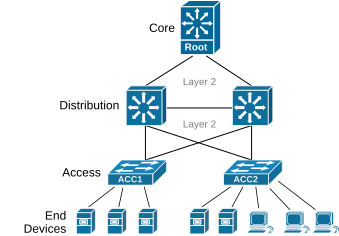
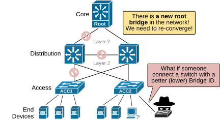
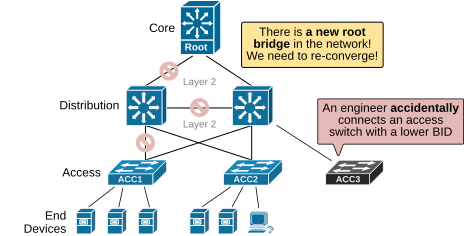
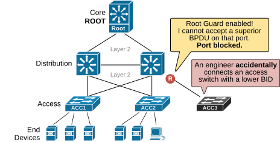
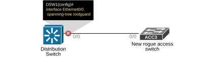

[Root Guard](https://www.networkacademy.io/ccna/spanning-tree/root-guard)
==========

Once an STP topology has fully converged and loops are eliminated, each switch port takes on a specific role, as follows:


- **Root Port**: The port with the best path (lowest cost) to the root bridge.
- **Designated Port**: The port on a segment that is closest to the root bridge. It sends BPDUs toward other switches.
- **Alternate Port**: A backup root port that’s also close to the root but currently blocked.
- **Edge Port**: Ports connected to end devices with no STP role—normal user-facing ports.

The root bridge **is always expected to be reachable through the root** and alternate ports since they have the best path to it.


## Why do we need Root Guard?


To understand the Root Guard feature, let's look at the example topology shown below. We have a three-tier switched network with core, distribution, and access switches. The core switch is the root bridge in the topology since it is the most powerful and reliable platform.




*Figure 1. Initial Topology.*


The spanning tree was developed back in the 1980s and 1990s when **security was not the primary focus** of network protocols. Therefore, the original STP and RSTP do not implement any security by default. There is no mechanism in place by default that protects the spanning-tree topology and the root bridge placement.


Let's see what happens if someone disconnects their end device from the access switch and connects a rogue switch configured with a lower Bridge ID. 




*Figure 2. Someone connects a rogue switch to the network.*


The rogue switch has a lower bridge ID and becomes the new root bridge, as shown in the diagram above. STP allows this since the switch with the lowest bridge ID **always wins the election**. This change is disruptive—it creates a completely new topology. As a result, some of the high-speed backbone links are blocked to prevent loops. The network is interrupted during re-convergence. If the person connecting this new switch has malicious intent, he can cause havoc in the network.


Another common use case when such a situation occurs is when a network engineer accidentally connects a new access switch to the network, and the switch is not brand new but has some existing configuration (probably used in the lab or on another network). If the new switch happens to have a lower BID than the rest of the switches, it becomes the root bridge, as shown in the diagram below.




*Figure 3. Accidentally connected access switch with lower BID.*


The result is that the network re-converges, causing temporary instability, and high-speed backbone links are blocked.


Obviously, the layer 2 network needs a mechanism to protect the root bridge and the topology selected by the network administrators. This is where the Root Guard feature comes into play.


## What is Root Guard?


Root Guard is designed to prevent an undesirable root bridge from appearing on the network and triggering re-convergence. **It works per port.** If a switch receives a superior BPDU (one with a better bridge ID) on a port with Root Guard enabled, that port is placed into a special root-inconsistent state. While in this state, the port stops sending and receiving regular data but continues to listen for BPDUs.




*Figure 4. What is Root Guard?*


Let's look at the diagram above. Root guard is enabled on the distribution switch's port where the new access is connected; it prevents the distribution from accepting a new root bridge on that port.


## How does Root Guard work?


Root Guard is enabled manually on each port where it’s needed. It’s disabled by default. We can enable it per interface with the following command in interface configuration mode:


```
`Switch(config-if)# **spanning-tree guard root**`
```

We check if any ports are in the root-inconsistent state using the following command:


```
`Switch# **show spanning-tree inconsistentports**`
```

Now, let's demonstrate how the feature works. Let's enable it on the distribution switch and then connect a new access switch, as shown in the diagram below.




*Figure 5. Configuration Topology.*


The access switch is configured with bridge priority 0, which is a lower value than the current root bridge (the core switch).


```
`ACC1# **conf t**
Enter configuration commands, one per line.  End with CNTL/Z.
ACC1(config)# **spanning-tree vlan 1 priority 0**`
```

Let's see what happens when we connect the new access switch. We enable debug spanning-tree events and observe what the distribution switch does.


```
`DSW1# **debug spanning-tree events **
*May 13 10:41:48.114: %SPANTREE-2-ROOTGUARD_BLOCK: 
Received a superior STP BPDU from bridge aabb.cc00.1900. 
Root guard blocking port Ethernet0/0 on VLAN0001.`
```

You can see that DSW1 received a superior BPDU and blocked port Etheret0/0. 


```
`DSW1# **show spanning-tree **

VLAN0001
Spanning tree enabled protocol rstp
Root ID    Priority    24577
Address     aabb.cc00.1800
This bridge is the root
Hello Time   2 sec  Max Age 20 sec  Forward Delay 15 sec
Bridge ID  Priority    24577  (priority 24576 sys-id-ext 1)
Address     aabb.cc00.1800
Hello Time   2 sec  Max Age 20 sec  Forward Delay 15 sec
Aging Time  300 sec
Interface           Role Sts Cost      Prio.Nbr Type
------------------- ---- --- --------- -------- ----------------------
Et0/0               Desg BKN*100       128.1    P2p *ROOT_Inc 
Et0/1               Desg FWD 100       128.2    P2p 
Et0/2               Desg FWD 100       128.3    P2p 
Et0/3               Desg FWD 100       128.4    P2p `
```

If we check the interface details, we can see that the port is labeled as "broken." Remember this term because it is a common question in the CCNA exam. The port is not "*blocked*," but it is "*broken*."


```
`DSW1# **show spanning-tree interface ethernet 0/0 detail **
Port 1 (Ethernet0/0) of VLAN0001 is broken  (Root Inconsistent)
Port path cost 100, Port priority 128, Port Identifier 128.1.
Designated root has priority 24577, address aabb.cc00.1800
Designated bridge has priority 24577, address aabb.cc00.1800
Designated port id is 128.1, designated path cost 0
Timers: message age 15, forward delay 0, hold 0
Number of transitions to forwarding state: 1
Link type is point-to-point by default
Root guard is enabled on the port
BPDU: sent 1127, received 80`
```

Lastly, let's check the special command used to check if ports are placed in an inconsistent state.


```
`DSW1# **show spanning-tree inconsistentports**
Name                 Interface                      Inconsistency
-------------------- ------------------------------ ------------------
VLAN0001             Ethernet0/0                    Root Inconsistent
Number of inconsistent ports (segments) in the system : 1`
```

Now that we have seen how the feature works let's discuss it from the design point of view. When and where do we use it in a real-world network topology?


## Root Guard Design Considerations


We use Root Guard on ports where **the root bridge should never appear**—usually downstream ports that are facing away from the primary and secondary roots. If a superior BPDU is received on such a port, the port is effectively shut down for all VLANs until the issue is resolved.

### Root Guard design use cases

**Where to use Root Guard:**
- **Access layer ports** facing end users — prevents a rogue switch from becoming Root Bridge if someone plugs it into the network.
- **Edge distribution ports** — on distribution switches facing away from the core, ensuring a downstream switch never becomes root.
- **Ports connecting to unknown or untrusted devices** — any port where you want to enforce that the Root Bridge is always in the expected direction.

**Where NOT to use Root Guard:**
- On ports facing the Root Bridge itself (the Root Bridge would be Root Inconsistent immediately).
- On ports connecting to other parts of the network infrastructure where the Root Bridge might legitimately appear.

### Root Guard vs BPDU Guard

| Feature | Root Guard | BPDU Guard |
|---------|------------|------------|
| Purpose | Prevents port from becoming Root Port | Prevents BPDUs on edge ports |
| Trigger | Receives superior BPDU (better bridge ID) | Receives any BPDU |
| Action | Port goes to Root Inconsistent (broken) state | Port goes to errdisable state |
| Recovery | Automatic when superior BPDUs stop | Manual or via errdisable recovery |
| Scope | Per-port | Per-port or global |
| Typical use | Trunk ports facing downstream | Access ports (with PortFast) |
| Works with | Any STP mode | PortFast only |

### Root Guard behavior summary

- **Enabled per port** — configure it on specific interfaces, not globally.
- **Breaks the port per VLAN** — Root Guard operates per-VLAN. If a superior BPDU arrives that would make this port the Root Port for a specific VLAN, that VLAN is placed in Root Inconsistent (broken) state on that port. Other VLANs on the same trunk continue working normally.
- **Automatic recovery** — Once the port stops receiving superior BPDUs (e.g., the rogue switch is disconnected), Root Guard automatically places the port back into normal operation after the Max Age timer expires (20 seconds by default).
- **Verification** — Use `show spanning-tree inconsistentports` to quickly find all ports in Root Inconsistent state.

### Configuration summary

```plaintext
! Enable Root Guard on a port
interface Ethernet0/0
 spanning-tree guard root

! Verify Root Guard status
show spanning-tree interface Ethernet0/0 detail
show spanning-tree inconsistentports
```

### Common CCNA exam questions about Root Guard

1. **What state does a port enter when Root Guard is triggered?**
   *Root Inconsistent* (also called "broken" state). The port is shown with `BKN*` in `show spanning-tree`.

2. **Does the port forward traffic in Root Inconsistent state?**
   No — the port is effectively blocked for that VLAN. It does not forward or receive user traffic.

3. **Does Root Guard require any specific STP mode?**
   No — it works with PVST, Rapid PVST+, and MST.

4. **How does Root Guard recover?**
   Automatically — once superior BPDUs stop arriving, the port returns to normal after the Max Age timer (20 seconds).

## Summary

- **Root Guard** prevents a port from becoming a Root Port by placing it in **Root Inconsistent** (broken) state if a superior BPDU is received.
- The port is labeled `BKN*` and shown as "Root Inconsistent" in verification commands.
- It is used on ports that should **never** face the Root Bridge — typically downstream access or distribution ports.
- Root Guard is automatic — it does not require a root bridge election change, just a configuration on the ports you want to protect.
- It's commonly tested in the CCNA exam in the context of STP security features.
