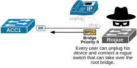
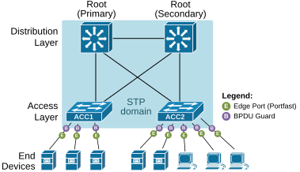
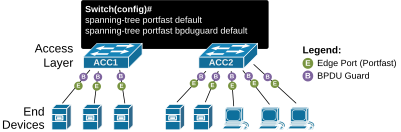

[BPDU Guard](https://www.networkacademy.io/ccna/spanning-tree/bpdu-guard)
==========

This lesson discusses another spanning-tree security feature called BPDU Guard. It is used to protect the STP topology and the root bridge from rogue switches.


## Why do we need a BPDU Guard?


Spanning-tree and most of the other layer 2 technologies were developed back in the 1980s and 1990s when security was not the main focus of network protocols. By default, switches allow you to connect whatever device you want. However, this creates a security vulnerabilityat the access layer. Anyone can simply **unplug its end device and connect a switch**, as shown in the diagram below.




*Figure 1. Why do we need BPDU Guard?*


By default, there is no protection in place for the spanning tree topology. If a rogue switch has a lower BID and sends a superior BPDU, it can become the network's root bridge. If it sends a fake Topology Change Notification to the root, it can flush the switches' MAC address tables. There is nothing stopping the rogue switch from causing instability of the spanning-tree topology.


## What is BPDU Guard?


BPDU Guard is a feature that is designed to protect the spanning-tree network from potential rogue switches (physical or virtual). The feature works per switchport. We enable it using the spanning-tree bpduguard enable command, as shown in the diagram below.


*Figure 2. Enabling BPDU Guard on a port.*


When a switchport with BPDU Guard configured receives a BPDU, the feature **immediately disables the port** by putting it into an err-disabled state. Hence the name "BPDU Guard".


*Figure 3. BPDU Guard disabling a port.*


The port then stays in an Err-disabled state until someone manually re-enables it, or it recovers automatically after a timeout.


```
`ACC1# **show interface e0/0**
Ethernet0/0 is down, line protocol is down (err-disabled) 
Hardware is Ethernet, address is aabb.cc00.2400 (bia aabb.cc00.2400)
MTU 1500 bytes, BW 10000 Kbit/sec, DLY 1000 usec, 
reliability 255/255, txload 1/255, rxload 1/255
Encapsulation ARPA, loopback not set
Keepalive set (10 sec)
Full-duplex, Auto-speed, media type is 10/100/1000BaseTX
input flow-control is off, output flow-control is unsupported 
ARP type: ARPA, ARP Timeout 04:00:00
Last input 00:00:01, output 00:09:54, output hang never
Last clearing of "show interface" counters never
Input queue: 0/2000/0/0 (size/max/drops/flushes); Total output drops: 0
Queueing strategy: fifo
Output queue: 0/40 (size/max)
5 minute input rate 0 bits/sec, 0 packets/sec
5 minute output rate 0 bits/sec, 0 packets/sec
350 packets input, 25851 bytes, 0 no buffer
Received 348 broadcasts (0 multicasts)
0 runts, 0 giants, 0 throttles 
0 input errors, 0 CRC, 0 frame, 0 overrun, 0 ignored
0 input packets with dribble condition detected
61 packets output, 7272 bytes, 0 underruns
Output 61 broadcasts (61 multicasts)
0 output errors, 0 collisions, 1 interface resets
0 unknown protocol drops
0 babbles, 0 late collision, 0 deferred
0 lost carrier, 0 no carrier
0 output buffer failures, 0 output buffers swapped out`
```

Notice that the output of the **show interface** command shows that the port is in an err-disabled state but does not tell the reason why. A port can be disabled for multiple reasons. To check why the port is disabled and verify that it is due to the BPDU Guard, we use the following command.


```
`ACC1# **show interface status err-disabled **
Port         Name         Status       Reason               Err-disabled Vlans
Et0/0                     err-disabled bpduguard`
```

To recover the port, we shut it down and brought it back up again, as shown below.


```
`ACC1# **conf t**
Enter configuration commands, one per line.  End with CNTL/Z.
ACC1(config)# **interface e0/0**
ACC1(config-if)# **shutdown **
ACC1(config-if)#
%LINK-5-CHANGED: Interface Ethernet0/0, changed state to administratively down
%LINEPROTO-5-UPDOWN: Line protocol on Interface Ethernet0/0, changed state to down
ACC1(config-if)# **no shutdown **
ACC1(config-if)#
%LINK-5-UPDOWN: Interface Ethernet0/0, changed state to up
%LINEPROTO-5-UPDOWN: Line protocol on Interface Ethernet0/0, changed state to up`
```

Now, if we check the interface's status, we can see it is up and running.


```
`ACC1# **show interface e0/0**
Ethernet0/0 is up, line protocol is up
Hardware is Ethernet, address is aabb.cc00.2400 (bia aabb.cc00.2400)`
```

However, if a BPDU arrives at the port again, it will go into an err-disabled state again.


## Configuring BPDU Guard


By default, BPDU Guard is turned off on all switch ports. There are two ways to enable the feature on a switch.


- You can enable it globally using the following command in global configuration mode. This way, the switch will enable the **BPDU Guard** automatically on each port configured with **PortFast**. 

```
`Switch(config)# **spanning-tree portfast bpduguard default**`
```


- You can also turn BPDU Guard on or off for specific switchports with the following command:

```
`Switch(config-if)# **[no] spanning-tree bpduguard enable**`
```

In a real-world environment, it is typically recommended that BPDU Guard be enabled using the global command. This enables the feature **on all access ports configured with Portfast**. Then, you can manually disable both features explicitly on access ports that you know are connected to remote switches. All trunk ports between switches automatically turn off both features. 


## BPDU Guard Design and Best Practices


Looking from a design perspective, BPDU Guard **defines the boundaries of the Spanning Tree domain** and keeps the active topology and Root Bridge location stable and predictable. In that context, it is a general rule of thumb to apply BPDU Guard on edge ports that should not receive BPDUs under normal conditions, as shown in the diagram below.




*Figure 4. BPDU Guard Design.*


Notice that the entire access layer is configured with PortFast plus BPDU Guard and will not accept a BPDU from an unauthorized switch that might be connected maliciously or accidentally by a user. 


Also, notice that the BPDU Guard and Portfast always work together. The logic is this: if you enable BPDU Guard on a port, no remote switch can be connected to that port. If no switch is connected, **there is no point in going through the STP states** before moving the port to Forwarding. Hence, the port should be configured with **Portfast**.


KEY NOTE: Edge ports with BPDU Guard **are the border of the organization's spanning tree domain**, as shown in the diagram above.


Also, there is a lot of confusion around PortFast. Many engineers wrongly assume that when you enable Portfast on a switchport, you disable the spanning tree. This is not true. Even with PortFast enabled, STP still runs on the port. If another switch is accidentally connected to a PortFast-enabled port, a loop might form. Worse, that new switch could try to become the root bridge by sending BPDUs. That is why the BPDU Guard is an important addition to PortFast.


### Automatic recovery from Err-disable


If a port is shut down by BPDU Guard, it won’t come back up on its own—even if BPDUs stop being received. However, Cisco switches provide **an automatic recovery mechanism** that can be configured to bring the port back up after a specified interval. For example, the following port has been blocked by the BPDU Guard.


```
`*May 19 08:33:12.058: %SPANTREE-2-BLOCK_BPDUGUARD: Received BPDU from bridge aabb.cc00.2000 on port Et0/0 with BPDU Guard enabled. Disabling port.
*May 19 08:33:12.058: %PM-4-ERR_DISABLE: bpduguard error detected on Et0/0, putting Et0/0 in err-disable state
*May 19 08:33:13.058: %LINEPROTO-5-UPDOWN: Line protocol on Interface Ethernet0/0, changed state to down
*May 19 08:33:14.058: %LINK-3-UPDOWN: Interface Ethernet0/0, changed state to down`
```

We use these steps to enable automatic recovery from an err-disabled state caused by the BPDU Guard. First, we enable the automatic recovery for the bpduguard feature.


```
`ACC1(config)#** errdisable recovery cause bpduguard**`
```

We then specify the recovery interval. After this period, the switch will attempt to re-enable the port. Depending on network policies and requirements, the interval can be adjusted between 30 and 86400 seconds (24 hours). The following command sets the recovery interval to 300 seconds (5 minutes).


```
`ACC1(config)# **errdisable recovery interval 300**`
```

We verify the current err-disable recovery settings using the following command. It shows which causes are enabled for automatic recovery and the configured interval.


```
`ACC1# **show errdisable recovery**
ErrDisable Reason            Timer Status
-----------------            --------------
arp-inspection               Disabled
bpduguard                    Enabled
<lines omitted for brevity>
Timer interval: 300 seconds
Interfaces that will be enabled at the next timeout:
Interface        Errdisable reason       Time left(sec)
---------        -----------------       --------------
Et0/0                    bpduguard          276`
```

Keep in mind that if the presence of BPDUs on an access port persists, the port will be placed into the err-disabled state again after recovery. This cycle will continue until the root cause is resolved.


Automatic recovery is useful in scenarios where immediate manual intervention is not feasible, such as in remote locations. However, in environments where security and stability are paramount, administrators might prefer to keep automatic recovery disabled to ensure that **issues are investigated** before re-enabling the port.


Always ensure that BPDU Guard is enabled only on ports where BPDUs are not expected. Misconfiguration can lead to unintended port shutdowns.


### Design Best Practices


Configuring both PortFast and BPDU Guard globally on access layer switches is widely regarded **as a best practice** in enterprise networks. 




*Figure 5. BPDU Guard Best Practices.*


We enable PortFast and BPDU Guard globally on all access ports using the following global configuration commands:


```
`spanning-tree portfast default
spanning-tree portfast bpduguard default`
```

This approach ensures that all **non-trunking interfaces** have PortFast and BPDU Guard enabled by default. For ports that connect to other switches or network devices where BPDUs are expected, you should manually disable these features using the interface level commands:


```
`interface GigabitEthernet0/1
description Link-to-another-Switch
**no spanning-tree portfast**
**no spanning-tree bpduguard**`
```

Access ports typically connect to end-user devices like computers and printers, which do not participate in the Spanning Tree Protocol (STP). Enabling PortFast on all access ports allows them to transition immediately to the forwarding state, reducing the time it takes for devices to connect to the network.


However, if a switch or other network device is inadvertently connected to a PortFast-enabled port, it could introduce BPDUs into the network, potentially causing STP topology changes or loops. BPDU Guard mitigates this risk by disabling the port upon receipt of a BPDU and placing it in an error-disabled state. This action helps protect the network from unintended or malicious topology changes.


## Key Takeaways


- Enabling BPDU Guard prevents users from accidentally or intentionally connecting rogue switches. 
- BPDU Guard is especially useful on Edge ports where only end devices should be connected.
- However, BPDU Guard won’t help if someone connects an Ethernet hub. Hubs don’t send BPDUs—they just repeat frames. If a hub connects two parts of the network, it can still create a loop that STP can’t detect.
- Never enable BPDU Guard on uplink ports that might receive BPDUs from the root bridge. If a switch has multiple uplinks, some of them may receive valid BPDUs even if they’re currently blocking. If the BPDU Guard is active on one of those ports, it will shut down the link and break network connectivity.

## Book traversal links for 44

