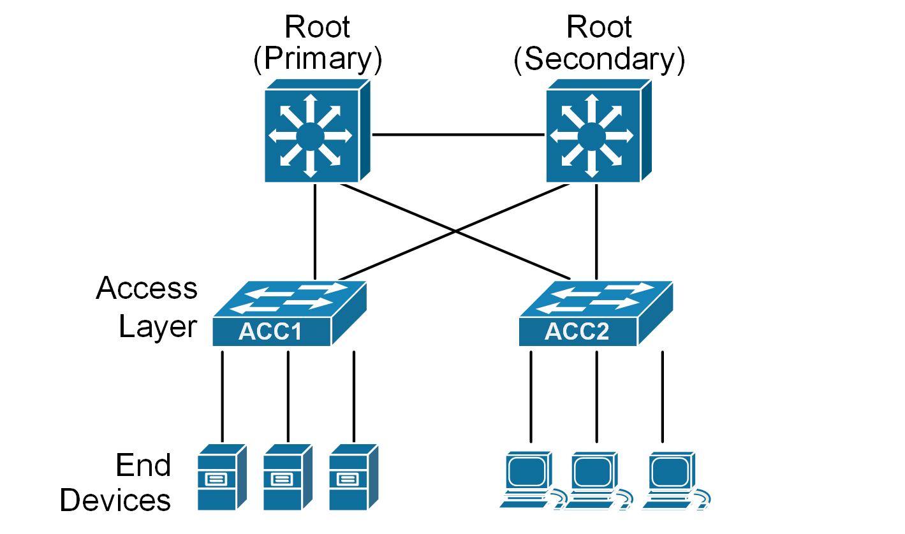
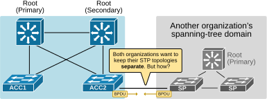
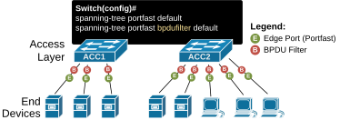
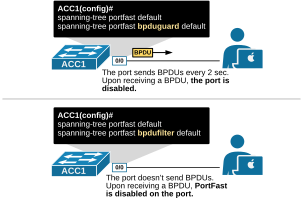
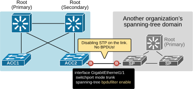

[BPDU Filter](https://www.networkacademy.io/ccna/spanning-tree/bpdu-filter)
==========

This lesson continues our examination of the spanning tree features designed to protect the loop-free tree and the root bridge placement.


## Why do we need BPDU Filter?


Let's examine two use cases to understand why the BPDU filter feature has been introduced and where it is typically used in the enterprise.


### Use case #1: Edge ports sending BPDUs


In a typical three-tier network design, end devices connect to the access layer switches on edge ports configured with PortFast. PortFast allows the port to transition to the designated role and forwarding state immediately.


Since edge ports are always in the designated state, they send BPDUs every two seconds, as shown in the diagram below. This is part of the spanning tree protocol (STP) 's normal behavior, which helps prevent loops by allowing switches to share topology information.




*Figure 1. Use case #1: Edge ports sending BPDUs (animation).*


However, sending spanning-tree BPDUs to end devices is unnecessary and can be considered a security vulnerability. End devices do not participate in the STP process. Hence, exposing topology information to end devices can be a risk in highly secure environments because of the following:


- Knowing BPDU contents reveals aspects of your network’s topology.
- If an attacker plugs in a rogue switch or device, it could send falsified BPDUs.
- Forged BPDUs might manipulate the spanning tree, create loops, or take over the root bridge.

To reduce this risk, highly secure organizations need a mechanism to disable STP on user‑facing ports. This is where the BPDU Filter comes into play.


### Use case #2: Inter-organization link.


Let's look at another use case. Imagine two different organizations needing to interconnect their Layer 2 networks. Each organization's network has a different STP domain with **its own designated root bridge**. What will happen if the organizations interconnect their networks via an Ethernet connection, as shown in the diagram below?




*Figure 2. Use case #2: Inter-organization link.*


The switches will exchange BPDUs and converge the two separate STP topologies **into one with a common root bridge**. In a single STP domain, only one switch can serve as the root bridge; it is not possible to have two active root bridges. However, this is not what either organization wants, right? Each organization’s root bridge and spanning‐tree logic **must remain confined to its own network**. How can this task be achieved? This is another scenario where the BPDU Filter comes in.


## What is BPDU Filter?


BPDU Filter is a spanning-tree feature that can **filter out BPDUs** in either transmitting or both transmitting and receiving directions. It functions in two slightly different ways depending on whether you enable it globally or per interface. Let's look at each one.


### Global Configuration: Preventing Edge ports from sending BPDUs 


We enable BpduFilter globally on a switch using the following command:


```
`ACC1(config)# **spanning-tree portfast bpdufilter default**`
```

As the command itself implies, it enables bpdufilter on PortFast-enabled ports (called edge ports), as shown in the diagram below.




*Figure 3. BPDU Filter Default.*


When the global BPDU Filter command is configured on a switch, each edge port behaves as follows:


- **Port Initialization:** When the port comes up, it behaves normally and sends 11 BPDUs out (one right after the port comes up and ten more at each Hello interval after that).
- **No BPDUs Received:** If the port doesn’t receive any BPDUs during that time, the BPDU Filter starts dropping outbound BPDUs. At this point, the port remains in PortFast mode.
- **BPDU Detection:** If BPDUs ever arrive on that port, the port starts sending and receiving BPDUs normally.

In short, a BpduFilter on a PortFast port only kicks in if it knows no BPDUs should arrive. As soon as BPDUs show up, the port goes back to regular STP, ensuring no loops can form.


The following command shows how we verify whether the Portfast default and BpduFilter default are configured globally on a switch.


```
`ACC1# **show spanning-tree summary **
Switch is in rapid-pvst mode
Root bridge for: VLAN0001
EtherChannel misconfig guard            is enabled
Extended system ID                      is enabled
Portfast Default                        is enabled
PortFast BPDU Guard Default            is disabled
Portfast BPDU Filter Default           is enabled
Loopguard Default                      is disabled
UplinkFast                              is disabled
BackboneFast                            is disabled
Configured Pathcost method used is short
Name                   Blocking Listening Learning Forwarding STP Active
---------------------- -------- --------- -------- ---------- ----------
VLAN0001                     0         0        0          4          4
---------------------- -------- --------- -------- ---------- ----------
1 vlan                       0         0        0          4          4`
```

The following command shows how we verify whether the features are enabled on a specific port.


```
`ACC1# **show spanning-tree interface e0/1 detail**
Port 2 (Ethernet0/1) of VLAN0001 is designated forwarding
Port path cost 100, Port priority 128, Port Identifier 128.2.
Designated root has priority 1, address aabb.cc00.1000
Designated bridge has priority 1, address aabb.cc00.1000
Designated port id is 128.2, designated path cost 0
Timers: message age 0, forward delay 0, hold 0
Number of transitions to forwarding state: 1
The port is in the portfast mode
Link type is point-to-point by default
Bpdu filter is enabled by default
BPDU: sent 26, received 0
`
```

Notice that the output says the feature is enabled "*by default."* This means BPDUFilter is enabled by the global configuration command, and the feature is automatically applied to this port because it is configured with Portfast.

BPDUGuard and BPDUFilter
Now, let's quickly discuss and compare the two features configured globally. 


- With **bpduguard default**, an edge port is put in an error-disable state if it receives a BPDU. This means the port goes down and must be re-enabled manually or with err-disable recovery. The feature is designed to protect the network by stopping a potential loop immediately.
- With **bpdufilter default**, an edge port stops transmitting BPDUs out (20 sec after initialization). If it receives a BPDU, it disables PortFast and becomes a regular STP port.




*Figure 2. BPDUFilter vs BPDUGuard.*


At this point, most people ask, "Can both features work together on a switch?" The answer is yes, they can. 


BPDU Guard can be used together with a global BPDU Filter. If both are enabled and the port receives a BPDU, the port will go into err-disabled state. However, don’t use interface-level BpduFilter with BPDU Guard. Since the port drops all BPDUs, the BPDU Guard will never detect them, so it won't trigger an err-disabled state.


### Interface Configuration: Disabling STP on a Port 


The second use of BPDU Filter is more drastic: it stops STP entirely on a specific port. We enable this behavior by configuring the following command under the interface itself.


```
`interface GigabitEthernet1/1
switchport mode trunk
spanning-tree bpdufilter enable`
```

This form of BPDU Filter **drops all BPDUs in both directions on a port**, effectively turning off STP for that interface.  Once configured this way, the port ignores both incoming and outgoing BPDUs.


This setup is often used **to create separate STP domains**. But keep in mind, if you have redundant links between these domains, STP won't protect against loops on these ports. It's up to the network administrator to ensure no physical loops exist, as shown in the example below.




*Figure x. Disabling STP on a port.*


The following command shows how we verify that BPDUFilter is enabled on a port. Notice that the output does not say “*by default*,” which indicates that BpduFilter was enabled by the interface command—fully disabling STP on that port:


```
`ACC2# **show spanning-tree vlan 1 interface Gi1/1 detail | begin Bpdu**
Bpdu filter is enabled
BPDU: sent 0, received 0`
```

The zero counters confirm that all BPDUs are being discarded on this interface.


**Warning**: This single command disables STP on that link. In a network with redundant paths, it can cause a forwarding loop and disrupt the entire LAN. Use with extreme caution only if you understand exactly why you need to do it.


## Key takeaways


- BpduFilter is a spanning-tree security feature that stops BPDU transmission and, optionally, reception on a switchport.
- The feature behaves in two different ways depending on how it is enabled.
- Global Configuration: **spanning-tree portfast bpdufilter default**

- Applies only to ports that are PortFast activated.
- Used to stop sending BPDUs toward end devices.
- An edge port with BpduFilter activated globally sends 11 BPDUs total when it comes up: 1 immediately after the port comes up and 10 more, one per Hello interval.
- If no BPDUs are received during that time, the port stops sending BPDUs.
- If a BPDU is received at any time, the port loses Edge status and becomes a normal STP port.

- Interface Configuration: **spanning-tree bpdufilter enable**

- The port never sends or receives BPDUs.
- STP is completely disabled on the port.
- Commonly used to isolate STP domains.
- Admin must prevent physical loops, as STP won't protect these ports.


## Book traversal links for 44

