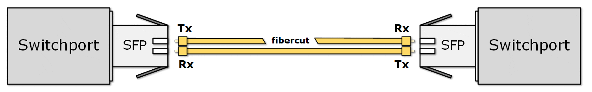
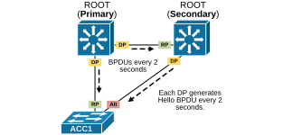
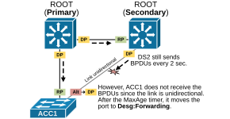
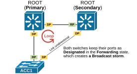
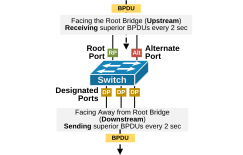
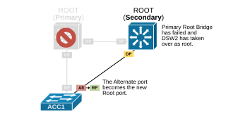
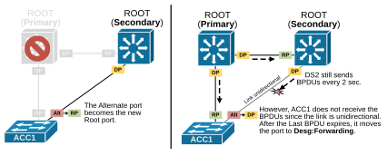
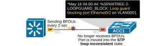
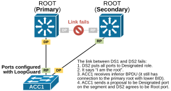
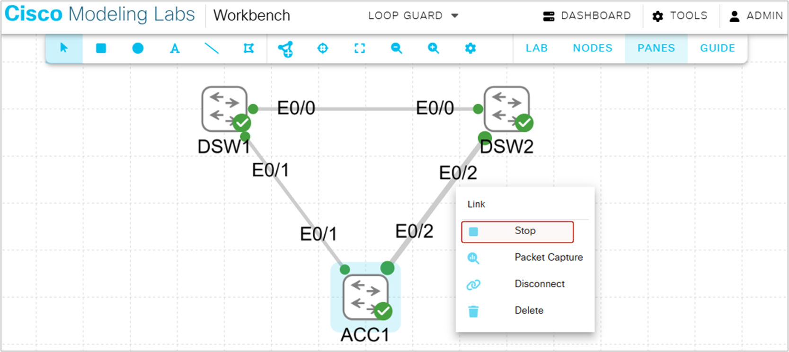

[Loop Guard](https://www.networkacademy.io/ccna/spanning-tree/loop-guard)
==========

In networking, fiber optic cables are typically made of a pair of fiber strands: one strand for **transmitting **(Tx) data and the other for **receiving **(Rx) data, as shown in the diagram below. This setup allows full-duplex communication—data can travel in both directions at the same time.


*Figure 1. Fiber Optic cable.*


Using two separate fiber strands for Tx and RX ensures high-speed, bidirectional communication with minimal interference and signal degradation. However, this duplex pair of fiber strands introduces a potential vulnerability: if one of the two strands becomes damaged or fails, the link can become unidirectional. In such cases, data may still travel in one direction but not the other. For example:


- The Tx on one end might still be sending data.
- But the Rx on the other end no longer receives it.
- However, the Rx end cannot know whether the Tx end isn't transmitting or the signal is lost in transit.

This creates a one-way communication issue. These problems **can be hard to detect** because the link may still appear "up" on one side, even though communication is broken in one direction. The receiving end has no way of knowing whether the sender is not transmitting anything at the moment or the fiber is broken, and the signal is lost. From the receiving point of view, both cases are the same. That's why the ports on both sides stay in an **up/up** state.




*Figure 2. Unidirectional Fiber cut.*


This situation is particularly problematic in protocols like the Spanning Tree Protocol (STP) or Rapid STP (RSTP), which rely on the exchange of BPDUs to maintain loop-free topologies. Let's see why.


## Why do we need Loop Guard?


Unidirectional links can cause network issues like routing flaps, loops, or failed data transfers. In the case of spanning tree operations, an unidirectional link can cause a broadcast storm. Let's examine such an example using the following topology. Imagine that all links are multimode fiber optics (MMF) cables.




*Figure 3. Every Designated port generate Hello BPDUs.*


Recall that every designated port sends "Hello" BPDUs every two seconds by default, as shown above. Therefore, the access switch ACC1 receives BPDUs on both its ports every two seconds. This mechanism keeps the topology stable. 


Now consider a case where one of the fiber strands in the link between the access switch and the secondary root fails—creating a unidirectional link. For example, ACC1 can no longer receive BPDUs from DS2, as shown in the diagram below. However, both interfaces remain "up" because only one direction is broken.


*Figure 4. Unidirectional link between DS2 and ACC1.*


What now happens is that ACC1 **no longer receives BPDUs** from DS2 on its Alternate port. It starts the BPDU timeout timer depending on the spanning tree mode (STP waits for the MaxAge timer to expire, while RSTP waits for three consecutive missed BPDUs). After the BPDU timer expires, ACC1 assumes there is a topology change and that it is now the only switch on the segment. It moves its port to a designated role and transitions it into the Forwarding state, as shown in the diagram below.




*Figure 5. Unidirectional link in the topology.*


The end result is a triangular topology with no blocked links. On the link between the secondary root (DS2) and the access switch (ACC1), there are two Designated ports, which should not happen in normal circumstances. This leads to a broadcast storm in the counterclockwise direction, as shown in the diagram below.




*Figure 6. Unidirectional link causing a broadcast storm.*


Take a step back for a moment and think about what we have just seen. A single broken fiber strand in one cable can trigger a broadcast storm and potentially take down the entire network. 


Wait, what?!? Does the whole network really rely on just one fiber strand?


This is where features like **Loop Guard** and **Unidirectional Link Detection (UDLD)** become crucial. They are designed to detect and prevent issues arising from unidirectional links, which can occur when one strand of a fiber pair fails.


## What is Loop Guard?


Loop Guard is an STP feature designed to prevent Layer 2 loops, particularly those caused by unidirectional link failures. It monitors BPDU activity on non-designated upstream ports (Root and Alternate). 


- As long as BPDUs are being received, the port operates normally. 
- But** if BPDUs stop arriving**, Loop Guard puts the port **into a loop-inconsistent state**. 

At that point, the port effectively blocks traffic to prevent a loop from forming while still maintaining its non-designated role.


The feature is simple and straightforward. However, some engineers struggle to understand it because they don't understand the STP port roles and states in detail. Let's look at the diagram shown below. Imagine this is an access switch in a three-tier design.




*Figure 7. Switchport STP roles.*


Notice the following essential facts:


- Non-designated ports such as the Root and Alternate ports **face upstream** (toward the Root Bridge). They **receive **superior BPDUs every 2 seconds.
- Designated ports **face downstream**. They **send **superior BPDUs every 2 seconds.

Now, think about what happens when the root port fails for whatever reason. The Alternate port becomes the new root port, as shown in the diagram below. 




*Figure 8. Primary Root fails.*


So, in normal failure scenarios shown on the left in the diagram below, the Alternate port becomes the new root port because it now **receives **the best BPDU on that link. However, if a link is unidirectional, as shown on the right, ACC1 **stopped **receiving BPDUs at all, which means there is no other switch on the link, and the port must be designated. This creates a loop because there is a loop topology without a blocked link.




*Figure 9. Direct vs. Unidirectional failure.*


That is where Loop Guard helps. When enabled on a port, it doesn't allow it to become a Designated port when it suddenly stops receiving superior BPDUs.


## How does Loop Guard work?


The LoopGuard feature is enabled per interface, as shown in the diagram below, and monitors the reception of BPDUs on non-resignated ports.


*Figure 10. How does Loop Guard work?*


If a non-designated port stops receiving BPDUs and wants to become a designated port, the feature places it into a loop-inconsistent state, effectively blocking data traffic on that port.




*Figure 11. Loop Guard blocks the port.*


The following output shows an example of an Alternate port that has been up into LOOP_Inc state due to not receiving BPDUs.


```
`ACC1# **show spanning-tree**

VLAN0001
Spanning tree enabled protocol ieee
Root ID    Priority    24577
Address     aabb.cc00.1c00
Cost        100
Port        2 (Ethernet0/1)
Hello Time   2 sec  Max Age 20 sec  Forward Delay 15 sec
Bridge ID  Priority    32769  (priority 32768 sys-id-ext 1)
Address     aabb.cc00.1e00
Hello Time   2 sec  Max Age 20 sec  Forward Delay 15 sec
Aging Time  300 sec
Interface           Role Sts Cost      Prio.Nbr Type
------------------- ---- --- --------- -------- --------------------------------
Et0/1               Root FWD 100       128.2    P2p 
Et0/2               Desg BKN*100       128.3    P2p *LOOP_Inc `
```

The same check can be made using the following command.


```
`ACC1# **show spanning-tree inconsistentports **

Name                 Interface                      Inconsistency
-------------------- ------------------------------ ------------------
VLAN0001             Ethernet0/2                    Loop Inconsistent
Number of inconsistent ports (segments) in the system : 1`
```

When the link recovers, and the port starts receiving BPDUs again, the LoopGuard feature unblocks the port, as shown in the output below.


```
`ACC1# **debug spanning-tree events**
*May 16 05:17:05.309: %SPANTREE-2-LOOPGUARD_UNBLOCK: Loop guard unblocking port Ethernet0/2 on VLAN0001.
*May 16 05:17:05.309: RSTP(1): initializing port Et0/2
*May 16 05:17:05.309: RSTP(1): updt roles, received superior bpdu on Et0/2 
*May 16 05:17:05.309: RSTP(1): Et0/2 is now alternate`
```

This is how LoopGuard works. However, some engineers are confused and wrongly assume that a port configured with LoopGuard can never become a Designated port. This is absolutely not true. 


KEYNOTE: Loop Guard prevents a port from becoming a Designated Port **ONLY when it stops receiving BPDUs**, and the BPDU timer on that port expires. In such cases, the port enters a loop-inconsistent state to avoid potential loops. However, if the port **actively negotiates** with the remote side, it can become a Designated Port even if Loop Guard is enabled. Loop Guard does not interfere with legitimate topology changes resulting from active negotiations.


For example, look at the diagram below, which illustrates what happens when the link between the two distribution switches fail.




*Figure 12. LoopGuard port becomes Designated.*


Even though the two uplink ports of the access switch ACC1 are configured with LoopGuard, the ALternate port negotiates with DS2 and becomes designated port for the segment.


### How can I test the feature at home?


LoopGuard is a feature that is not easy to test in lab environments because you cannot block BPDUs with an access list in one direction, for example. However, it is very easy to test in the Cisco Modeling Labs (CML Free) using the link tool, as shown in the screenshot below.




*Figure 12. How to test Loop Guard in CML.*


You can simply stop the link with the link tool. This effectively stops all traffic on the link but keeps the ports up/up. What happens is that ACC1 stops receiving BPDUs and LoopGuard kicks in and puts ACC1's alternate port in Loop_Inc state.


## Loop Guard Design Considerations


Now, let's discuss where it is appropriate to configure the LoopGuard feature in a traditional three-tier topology.


### Full Content Access is for Subscribed Users Only...


- **Learn any CCNA, CCIE or Network Automation topic** with animated explanation.
- **We focus on simplicity.** Networking tutorials and examples written in simple, understandable language.

Sign up for free ►
