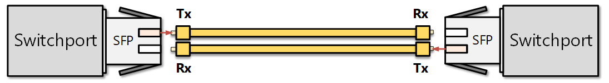
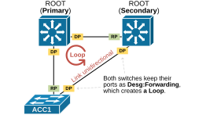
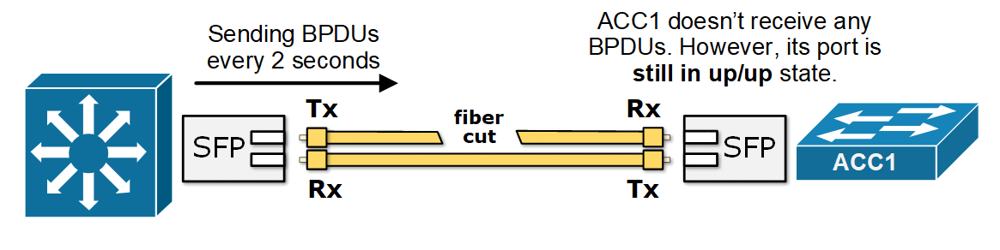
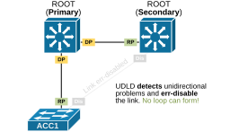
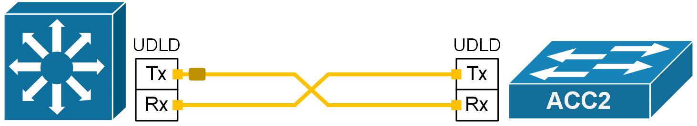
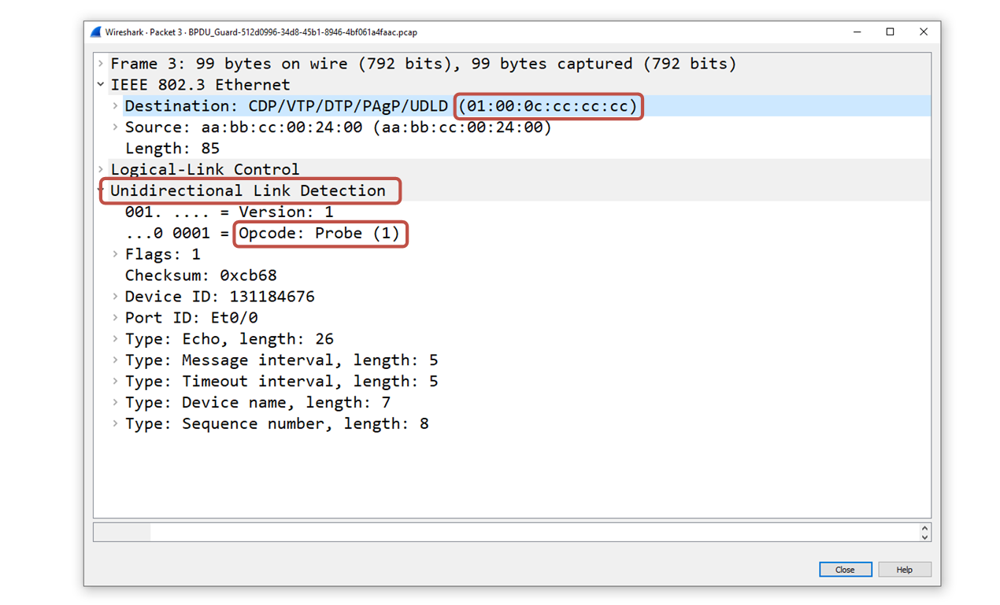
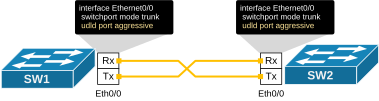
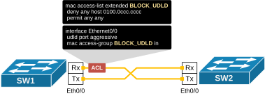

[Unidirectional Link Detection (UDLD)](https://www.networkacademy.io/ccna/spanning-tree/udld)
==========

Fiber patch cables usually come in pairs—one strand sends data (Tx), and the other receives it (Rx), as shown in the diagram below. This setup lets data flow **both ways at the same time**, which is called full-duplex communication.




*Figure 1. Fiber Optic cable.*


Notice that the Tx on one device connects to the Rx on the other and vice versa. Using two separate strands for sending and receiving provides less interference or signal loss. But there’s a catch: if one of those strands gets damaged, the link can turn into a one-way street—data goes in one direction but not the other. For example:


- One side might still be sending data.
- But the other side doesn’t receive anything.

Here’s the tricky part: the side that’s supposed to receive has no way of knowing whether the sender has stopped sending or if the fiber is broken and the signal never made it. From this point of view, both situations look the same. So, the port stays up/up—even though communication is only working in one direction.


This can cause serious problems with network protocols like Spanning Tree Protocol (STP). Let’s take a closer look at why that’s an issue.


## Why do we need Unidirectional Link Detection (UDLD)?


A unidirectional link occurs when one direction of a duplex fiber cable fails. This can happen due to miswiring, a cut fiber, a loose cable, a faulty SFP module, or other reasons. Unidirectional links can break communication in protocols that rely on two-way message exchange. Protocols that expect regular replies or depend on control messages being received (not just sent) are the most vulnerable to such problems. The Spanning-tree Protocol is one of them.


**STP relies on receiving BPDUs** to maintain the network topology. The designated switch for the segment sends BPDUs every two seconds while the remote end receives them. A unidirectional link can cause both switches on the link to think they are the designated switch for the segment, as shown in the diagram below.




*Figure 2. Spanning-tree loop due to a unidirectional link.*


In the example, the fiber link between the distribution switch (DS2) and the access switch (ACC1) is a duplex patch cable with two strands. If one of the fiber strands fails, DS2’s transmit path fails, and ACC1 stops receiving BPDUs (hello messages), as shown in the diagram below. 




*Figure 3. STP unidirectional issue.*


Since ACC1's port is still up but doesn't receive any BPDU, it assumes **it is the only switch on the segment** and is safe to transition to the Forwarding state. Now, all trunk ports in the network are Forwarding—even though one path is broken. This causes **a broadcast storm** that can bring down the entire network. The process is explained in more detail in our previous lesson on Loop Guard.


A few protocols have been introduced to prevent such unidirectional failures, and UDLD is one of them.


## What is UDLD?


UDLD (Unidirectional Link Detection) is a Cisco-proprietary Layer 2 protocol that detects **physical and logical one-way link problems**. This helps avoid unidirectional issues that could break other network protocols, as shown in the diagram below.




*Figure 4. UDLD err-disables a unidirectional link.*


The most important advantage of UDLD compared to other techniques for detecting unidirectional links is that it is a separate protocol that works independently. Therefore, it can be combined with any other network protocol, such as OSPF, EIGRP, LACP, etc. It is not bound to a spanning tree like the other methods that detect one-way links - Loop Guard and Bridge Assurance. 


## How does UDLD work?


UDLD works by **sending its own layer 2 frames** between two connected devices. For UDLD to function properly, both devices must support it and have it enabled on their ports.




*Figure 5. UDLD probing (animated).*


Each port using UDLD sends out frames that include its own ID and a list of any neighbor IDs it sees. When everything is working correctly, each side should see its own ID echoed back in the frames it receives. If a port **stops seeing its own ID in the incoming frames **for a certain amount of time, UDLD assumes the link is only working in one direction. This echo-check helps detect:


- Links that look fine but only work in one direction.
- Wiring mistakes—like when transmit and receive fibers are plugged into the wrong ports on the other side. For example, local Tx is plugged into remote Tx, and local Rx is plugged into remote Rx.

If UDLD finds a unidirectional link, it can automatically shut down the affected port and log a message like this:


```
`UDLD-3-DISABLE: Unidirectional link detected on port 1/2. Port disabled.`
```

The port will stay down until **someone manually re-enables it** or until the err-disable timeout (if configured) expires.


### Frame Format


UDLD frames are Layer 2 protocol data units that use a specific multicast MAC address: **01:00:0C:CC:CC:CC**. This is a well-known destination MAC address used by several other Cisco-proprietary protocols such as CDP, VTP, DTP and PAgP. 




*Figure 6. Frame format.*


Since the destination is a *multicast *MAC, it is received simultaneously by all connected devices on shared segments. Hence, the protocol works on point-to-point as well as on shared segments.


### UDLD Detection Mechanism


When UDLD is enabled on a port, it sends messages with **its own identity and port info**, as well as a list of neighbors it hears on that segment. Using this information, the protocol detects unidirectional links by checking for issues such as:


- A neighbor’s UDLD message doesn’t list the receiving switch and port correctly. This might mean the neighbor can’t hear this switch, or the transmit/receive **cables are mismatched**.
- A switch sees its own port listed in a neighbor’s message—indicating **a self-loop**.
- A switch hears from only one neighbor, but the message lists multiple switch/port pairs—suggesting **shared media problems**.
- Probes fail to arrive, indicating there is **a fiber cut** or a faulty SFP module.

When UDLD detects a problem, it takes an action depending on the configured operational mode. The protocol has two modes of operation as we will see next.


### UDLD Normal vs. Aggressive Mode


UDLD (Unidirectional Link Detection) can be configured to operate in two different modes: normal and aggressive.


- In **normal mode**, UDLD just monitors the link. If it doesn't hear echoed probes from the remote side for a while, it marks the link as "*undetermined*" but **doesn’t shut it down**. This can be useful on long-haul fiber links where one-way communication is still better than no communication. However, this mode is not appropriate for links that are part of the STP domain because the port stays up and continues to follow the Spanning Tree Protocol (STP) rules (which could lead to a loop).
- In **aggressive mode**, things work a bit differently. If UDLD stops receiving probes but the link still looks up, it tries several times to re-check the connection. If it can’t confirm the link is working both ways, it shuts down the port by putting it into an **err-disable state**. This immediately prevents all problems associated with a one-way link.

In summary, normal mode detects unidirectional links and logs an error without shutting down the port. Aggressive mode puts the link in err-disable mode when it detects a problem. Ninety-nine percent of the time, real-world environments run the protocol in aggressive mode.


## Configuring UDLD


UDLD can be enabled **globally **(for fiber ports only) or **per interface** (for any media). 


We enable the protocol globally on a Cisco device using the following command in global config mode:


```
`Switch(config)# **udld enable**`
```

By default, the global command enables unidirectional detection **only for fiber ports**. It does not activate the protocol on copper Ethernet ports unless you enable it manually on the interface.


We enable the unidirectional detection on an interface level using the following command:


```
`Switch(config)# **interface Ethernet0/0**
Switch(config-if)# **udld port aggressive**`
```

This command overrides the global configuration and enables the protocol on the port irrespective of the media type.


### Timers


As with every network protocol out there, UDLD depends on a few timers to operate.

Probing interval
The probing interval is the time between sending UDLD frames on an interface, which helps detect unidirectional links; shorter intervals allow faster detection. The default is 15 seconds. The detection time is about 3 times the message interval. So, with a 15-second interval:


```
`Detection Time ≈ 3 × 15 = 45 seconds`
```

We can change the probing interval from 7 to 90 seconds using the following command: 


```
`Switch(config)# **udld message time [interval]**`
```

In aggressive mode, once the timeout hits, UDLD **sends packets every second for 8 seconds** to try to re-check the link. If it still doesn’t hear back, it disables the port.


Aggressive mode helps catch more tricky issues, like:


- A port that’s stuck (not sending or receiving) but still looks "up."
- A fiber link where only one strand is unplugged. For example, the transmit side might be disconnected, so one side sees "up," and the other sees "down."

## Testing and Verifying UDLD


Now, let's see how we verify the protocol's operational status and how we can test it in a home lab environment. Let's use the basic topology shown below.




*Figure 7. Initial Topology.*


We have two switches directly connected to port Ethernet0/0. Both ports are configured with UDLD aggressive mode, as shown in the diagram. We check the protocol's status using the following command. 


```
`SW1# **show udld **

**Interface Et0/0**
---
Port enable administrative configuration setting: Enabled / in aggressive mode
Port enable operational state: Enabled / in aggressive mode
Current bidirectional state: Bidirectional
Current operational state: Advertisement - Single neighbor detected
Message interval: 15000 ms
Time out interval: 5000 ms
Port fast-hello configuration setting: Disabled
Port fast-hello interval: 0 ms
Port fast-hello operational state: Disabled
Neighbor fast-hello configuration setting: Disabled
Neighbor fast-hello interval: Unknown

Entry 1
---
Expiration time: 38300 ms
Cache Device index: 1
Current neighbor state: Bidirectional
Device ID: 131184678  
Port ID: Et0/0  
Neighbor echo 1 device: 131184676
Neighbor echo 1 port: Et0/0
TLV Message interval: 15 sec
No TLV fast-hello interval
TLV Time out interval: 5
TLV CDP Device name: SW2  `
```

Notice that the output shows the operational mode, the status, the timers and the number of neighbors on the segment.


Now, to test whether the protocol works and to observe what would happen if the link becomes unidirectional, we can use a MAC address access list, as shown in the diagram below.




*Figure 8. Testing setup.*


First, we configure a new mac access-list on switch SW1:


```
`SW1(config)#
mac access-list extended **BLOCK_UDLD**
deny any host 0100.0ccc.cccc
permit any any`
```

The access list blocks the well-known UDLD destination MAC address. This prevents SW1 from receiving the UDLD probes from SW2. Hence, SW1 thinks that the link is unidirectional.


Now, let's enable debug and observe what happens when the timeout timer expires.


```
`SW1# **debug udld events **
*May 24 07:31:31.770: Phase set to udld_advertisement from phase udld_link_up in aggressive mode after all neighbors aged out. (Et0/0)
*May 24 07:31:31.770: %UDLD-4-UDLD_PORT_DISABLED: UDLD disabled interface Et0/0, aggressive mode failure detected
*May 24 07:31:31.770: %PM-4-ERR_DISABLE: udld error detected on Et0/0, putting Et0/0 in err-disable state
SW1#
SW1#
*May 24 07:31:32.777: %LINEPROTO-5-UPDOWN: Line protocol on Interface Ethernet0/0, changed state to down
*May 24 07:31:33.773: %LINK-5-UPDOWN: Interface Ethernet0/0, changed state to down`
```

You can see that SW1 has put the port into an err-disabled state because it is configured with aggressive mode. 


If we check the status of SW1's Ethernet 0/0 port, we can see that it is currently down (err-disabled). 


```
`SW1# **show interfaces ethernet0/0**
Ethernet0/0 is down, line protocol is down (err-disabled) 
Hardware is Ethernet, address is aabb.cc00.2400 (bia aabb.cc00.2400)
MTU 1500 bytes, BW 10000 Kbit/sec, DLY 1000 usec, 
reliability 255/255, txload 1/255, rxload 1/255
Encapsulation ARPA, loopback not set
Keepalive set (10 sec)
Full-duplex, Auto-speed, media type is 10/100/1000BaseTX
input flow-control is off, output flow-control is unsupported 
ARP type: ARPA, ARP Timeout 04:00:00
Last input 00:13:46, output 00:13:41, output hang never
Last clearing of "show interface" counters never
Input queue: 0/2000/0/0 (size/max/drops/flushes); Total output drops: 0
Queueing strategy: fifo
Output queue: 0/40 (size/max)
5 minute input rate 0 bits/sec, 0 packets/sec
5 minute output rate 0 bits/sec, 0 packets/sec
<lines omiited>`
```

Notice that the port won't come up until someone manually shut/no shut it or until the err-disable timeout expires.


## Book traversal links for 44

