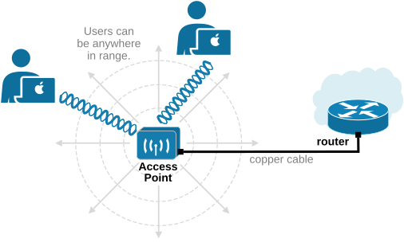
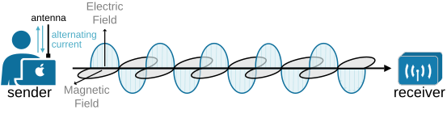
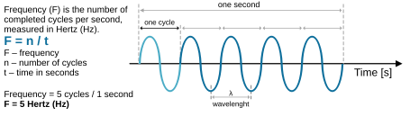
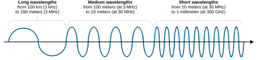
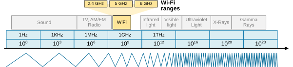
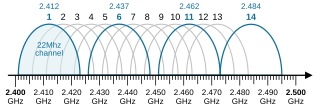
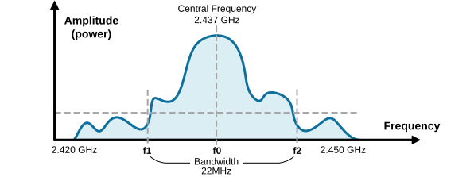
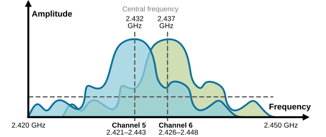
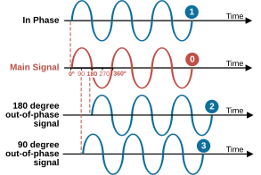
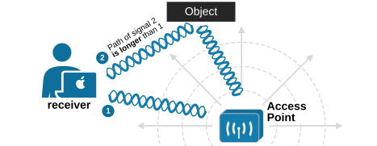

[Introduction to Radio Signals](https://www.networkacademy.io/ccna/wireless/introduction-to-radio-signals)
==========

We begin our journey into wireless technologies by walking through the basics of RF (radio frequency) signals. This lesson discusses the most common terms and concepts that you will encounter a lot when studying wireless technologies. The lesson will equip you with a fundamental understanding of the most important theory in the radio field.


## Wired vs Wireless networks


The most obvious property of wired networks is that **a wire must physically connect any two devices** that want to communicate. The wire must run continuously to both ends and must not be interrupted anywhere in between. Additionally, devices do not connect with ANY kind of wires. Physical cables used in networking follow strict standards (IEEE802.3) for length, quality, foil, connectors, fire resistance, and so on. Therefore, any two devices are connected via a standardized physical cable. This makes communication fast, reliable, and secure because each pair of connected devices uses one cable, which they don’t have to share with anyone else.


*Figure 1. Devices connected by wires.*


But everything in life is a trade-off. **A wired connection is fixed, **meaning users cannot easily move their devices around. They must stay within the limits of the cables already set up. This is not a problem for servers in the data center, as they typically don't move. However, users want to move, so the wired network becomes a constraint. For example, the users shown in the diagram above are fixed to their desks.


A wireless network eliminates the need for wires. **It uses radio frequency signals to connect devices,** allowing users to move freely while staying connected. Additionally, it allows users to easily connect multiple wireless devices to the network as there’s no limitation due to the number of cables or ports.




*Figure 2. Devices connected wirelessly.*


However, wireless data travels through open space, as illustrated in the diagram above. Wireless data lacks this security, unlike a wired connection, which provides a protected, dedicated link between two devices. This open environment brings various factors that can affect data transmission and delivery.


The following table compares the properties of wired to wireless networks. We will use it for context to discuss the important aspects of wireless ahead in the lesson.


|   | **Wired Networks** | **Wireless Networks** 
| **Medium** | Cables (copper, fiber). | Radio waves. 
| **Speed** | Faster (can reach up to 400Gbps) | Slower than wired networks (typically up to 1-6 Gbps in perfect conditions). 
| **Latency** | Lower. | Higher latency than wired networks. Prone to device congestion. 
| **Reliability** | More reliable. Less prone to interference. | Less reliable. Prone to signal interference. 
| **Mobility** | Limited to cable instalation and lenght. | High mobility, supports roaming. 
| **Installation** | Requires cabling and physical setup. | Easier, no cables required. 
| **Security** | More secure, physical access needed. | Less secure, vulnerable to hacking. 

Let’s focus on the key points highlighted in the table. These represent the main advantages and disadvantages of wireless networks compared to wired ones. It’s clear that people are willing to trade speed, reliability, and security for the convenience of mobility and roaming. The ability to move freely is fundamental to human nature and remains essential to daily life. This need for mobility is precisely why wireless networks were created: to use mobile devices everywhere. To connect at the local cafe. To connect at the office. To connect at home. **Mobility outweighs all other disadvantages**. 


As network engineers, we are responsible for ensuring that mobility and roaming work flawlessly in our organization's wireless network because this is what wireless is all about. At the same time, we must offset the disadvantages of wireless technology by making it more reliable and secure.


## Understanding radio waves


Okay, now let's examine the basics of wireless communications. In a wired network, data is converted to an electrical signal and applied to one end of a cable. The cable is conductive, so the signal travels to the other end at the speed of light. The same logic applies when data is transmitted over fiber cables. In contrast, a wireless connection doesn't use physical wires to carry the signal; instead, it uses radio waves to transmit data over free space. **But what are radio waves, and how do they propagate?**


I read the best analogy for explaining radio waves in one of David Hucaby's CCNA Wireless books. Imagine two people standing far apart, holding a long, loose rope. **The rope represents free space**. If one person (the sender) lifts the rope's end and waves it up and down regularly, the other person receives a wave (the receiver). Each wave represents one cycle of movement, and the receiver can see the signal clearly, as shown in the diagram below.


*Figure 3. A rope as a communication medium.*


In free space, something similar happens with radio waves. Look at the following diagram and imagine that the laptop's antenna is not hidden inside but is actually outside and visible. The laptop's wifi transmitter sends an alternating current through the antenna. **The current is changing directions** (continuously changing between a positive and negative voltage), similar to the person with the rope waving up and down. This creates an electric field similar to the waves on the loose rope, as shown in the diagram below.


*Figure 4. Understanding RF signal transmission.*


In our imaginary example, the antenna is outside the device. In reality, antennas are now built-in inside modern devices, and we cannot see them (but they are there, hidden inside).


The antenna **also creates a magnetic field** that is perpendicular to the electric field. These fields move together, always at right angles to each other, and spread outward in all directions, as shown in the diagram below. 




*Figure 5. Electric and Magnetic fields propagation.*


Notice that the antenna is vertically aligned. The electric field is aligned with the orientation of the antenna. The magnetic field is always perpendicular to the electric field. In this case, the magnetic field is horizontal. This alignment is why the polarization of the transmitted wave (which depends on the electric field's orientation) is vertical for a vertically aligned antenna.


At the receiver’s end, the antenna picks up these electromagnetic waves. As the waves hit the antenna, they create an electrical signal. If everything works properly, the receiver gets a signal similar to the one sent by the transmitter.


This is the foundation of electromagnetism and how wireless communication works—turning electric signals into radio waves and sending them through free space to a receiver.


### Understanding frequency


Radio waves have multiple properties, the most important of which is frequency. The frequency is **the number of times the wave completes a full up-and-down cycle in one second**. We measure frequency in Hertz (Hz). The following diagram shows how we measure and calculate the frequency of an electromagnetic wave. 




*Figure 6. What is Frequency?*


A cycle starts when the wave rises from the center line, falls below it, and rises back to the center line. In our example, the wave makes five cycles in one second. Hence, its frequency is 5 hertz (Hz). However, in nature, there are very high frequencies, which is why we use the following name abbreviations to denote very large numbers of Hertz. 


Table 1. Frequency Units.
| **Unit** | **Symbol** | **Meaning** 
| Hertz | Hz | 1 cycle per second 
| KiloHertz | KHz | 1,000 cycles per second 
| MegaHertz | MHz | 1,000,000 cycles per second 
| GigaHertz | GHz | 1,000,000,000 cycles per second 
| TeraHertz | THz | 1,000,000,000,000 cycles per second 

Over the years, humans have measured and studied frequencies ranging from 1 Hz to 10^23 Hertz (yes, 1 with 23 zeros!). This is currently the upper limit of frequencies observed in nature, as higher frequencies would require incredibly high-energy processes not yet observed. 

Wavelength
RF signals are often described by their frequency, but it can be hard to imagine their size as they move through space. Wavelength measures the physical distance a wave travels during one complete cycle. The Greek symbol for wavelength is lambda (λ).


*Figure 7. Wavelength.*


RF waves always travel at a constant speed. In a vacuum, they move at the speed of light, but in air, they are slightly slower. Notice that as the frequency increases, the wavelength gets shorter. Higher frequencies mean smaller waves that cover less distance.




*Figure 8. Wavelength ranges.*


To remember the relation between frequency and wavelength - you can try to calculate the wavelength of given frequencies. For example, calculate the wavelength of 6GHz. 


```
`**λ = c / f **
where **λ** is the wavelength in meters, 
**c** is the speed of light in a vacuum (3x10^8 meters), 
**f** is the frequency in hertz (6x10^9 Hz).
λ = 3x10^8 / 6x10^9 = 0.05 meters = 5 cm `
```

Wavelength is essential when designing antennas. Higher frequencies have shorter wavelengths, so they require a smaller antenna to produce them. On the other hand, lower frequencies have longer wavelengths, so they require large antennae to create the electromagnetic wave (as shown in Figure 4). 

Bands and Channels
We have seen what frequency is. However, we have not discussed its most essential aspect yet. In nature, there is a very wide range of frequencies—from 1 Hz to 1023 Hz. We call this the frequency spectrum. The diagram below visualizes it in a very simplified way. 




*Figure 9. The frequency spectrum (simplified).*


However, notice something fundamental - **the spectrum is finite**, and certain frequency ranges are more suitable for specific applications. 


**Important to understand:** The frequency spectrum has a finite capacity, and demand for its use is very high. Frequency is considered **a valuable national asset** because it is a limited resource essential for communication and technology development. That's why access to frequencies is strictly controlled by governments and regulating bodies like the FCC (USA), Ofcom (UK), or TRAI (India). 


Frequencies are crucial for defense, intelligence, and public safety systems. That's why governments issue spectrum licenses to organizations, often through auctions or direct allocation, defining specific terms of use.


Another important aspect of the frequency band is that certain ranges **are more suitable for specific applications**. For example, the frequencies between 88 MHz and 108 MHz are best suited for FM radio stations. A continuous range of frequencies used for the same purpose is called **a frequency band****.** For example, AM radio stations use frequencies from 530 kHz to about 1710 kHz. Terrestrial TV broadcasting uses a frequency range between 300 MHz and 700 MHz, and so on.


Wi-Fi has been allocated three bands that are typically the same worldwide (with slight variations in some regions):


- **2.4 GHz** band with a frequency range of 2.4 GHz to 2.4835 GHz.
- **5 GHz** band with a frequency range of 5.15 GHz to 5.825 GHz (which may vary slightly by region).
- **6 GHz** band with a frequency range of 5.925 GHz to 7.125 GHz (which may vary slightly by region).

Bands are divided into smaller parts called **channels**. Each channel has a number and is assigned a specific frequency. When channels are defined by national or international standards, they can be used the same way everywhere.


For example, the following diagram shows the channel of the 2.4-GHz band used for wireless LANs. It has 14 channels, each with its own specific frequency. It’s much easier to refer to channels by their numbers instead of their exact frequencies. The channels are spaced evenly, 0.005 GHz apart. This spacing is called channel separation.




*Figure 10. 2.4 GHz Wi-Fi channels.*


And here, some people may ask the following question: if the 2.4GHz Wi-Fi band is between 2.400GHz and 2.4835GHz, why don't we have 80 channels? Why do we need 0.005GHz channel spacing and only have 14 channels? Can a device just transmit on a specific frequency like 2.437Ghz, another one on 2.438Ghz, and another on 2.439Ghz, etc.?


Well, the problem is that **RF signals aren’t perfectly narrow**. They spill over into nearby frequencies, creating a range of frequencies around a central point called the signal bandwidth.

Bandwidth
An RF signal isn’t perfectly narrow; instead, it spreads slightly above and below its center frequency, taking up nearby frequencies. The center frequency determines where the channel is located within the frequency band. The range of frequencies a signal uses is called its **bandwidth **and is shown in the diagram below.




*Figure 11. Channel Bandwidth.*


Frequency bandwidth is the range of frequencies that a specific radio signal occupies. It measures how much "space" the signal takes up on the frequency spectrum. But why does every frequency spread across other frequencies (bandwidth)?  Can't we transmit on a single frequency, exactly 2.437 GHz? 


The short answer is yes, we can, but **every real-world signal needs some bandwidth to carry information**. A signal at an exact frequency (like 2.437 GHz) would be a pure sine wave, and pure sine waves carry no data. To transmit information, we need to modulate the signal (change its amplitude, frequency, or phase), and that spreads the signal across a small range of frequencies around the center frequency (more on this later).


For example, if you are transmitting on 2.4GHz Wi-Fi channel 6, the center frequency is 2.437 GHz, but the signal's bandwidth (22 MHz) spreads across nearby frequencies. This is true for all channels. When two wireless devices use adjacent overlapping channels (for example, 5 and 6), their signals interfere with each other, as shown in the diagram below.




*Figure 12. Overlapping channels.*


When devices on overlapping channels transmit data, their signals mix and interfere, making it harder for devices to "hear" their intended signals clearly. This is like multiple people talking loudly in a small room. 


Okay, but what does it mean that "two signals interfere"? Well, to understand, you need to understand what phase is first.


### Understanding phase


Phase is another important property of RF signals. However, it isn’t a property of a single RF signal; it describes **how two or more RF signals with the same frequency relate to each other**. Phase describes how the two waveforms' peaks (high points) and troughs (low points) line up. It is typically measured in degrees, where one wave cycle represents 360 degrees. The start of the cycle equals 0 degrees, while the end of the cycle equals 360 degrees, as shown in the diagram below.


*Figure 13. Phase measure.*


The following diagram will help you understand the concept. All four waves are RF signals on the same frequency. The wave (0) in red is the main signal. We will measure the phase of the other three waves (1-3) relative to the main signal (0).




*Figure 14. Understanding Phase.*


- **Wave 1** - When two signals are **in phase**, their peaks (high points) and troughs (low points) align perfectly at the same time. This means the two signals are synchronized, and their waveforms match. If represented in degrees, the phase difference between them is 0 degrees.
- **Wave 2** - When two signals are **180 degrees out of phase**, their peaks align with the troughs of the other signal, meaning they are completely opposite. When one signal reaches its maximum, the other is at its minimum. This creates a phase difference of 180 degrees, and the two signals effectively cancel each other out if they have the same amplitude.
- **Wave 3** - When two signals are **90 degrees out of phase**, one signal is shifted by a quarter of a wavelength compared to the other. This means the peak of one signal aligns with the midpoint (zero crossing) of the other. This creates a phase difference of 90 degrees between the two signals.

**Important to understand:** RF signals that are in phase **add together** and strengthen each other. RF signals that are 180 degrees out of phase **cancel each other out**.


At this point, you might be wondering why this is important. When two signals are produced at precisely the same time, they will always be in phase. But are they?




*Figure 15. Phase in the real world.*


Let's look at the diagram above. Two identical RF signals (1 and 2) are produced exactly at the same time by the access point. Signal 1 goes directly to the receiver. However, signal 2 is reflected by an object and takes longer paths than the direct one. Therefore, the receiver gets signal 2 with a delay (due to the longer path). This delay** shifts the phase** of signal 2 relative to signal 1. If the phase shift happens to be 180 degrees, they can completely cancel each other, so the receiver doesn't receive anything.


Depending on how much two signals are out of phase, the strength of the received signal can either increase or decrease. Understanding the phase difference between two signals is key to explaining an RF phenomenon called multipath.


### Key Takeaways


Let's stop here and summarize what we have discussed so far. The following table highlights the key takeaways of this lesson.


| **Topic** | **Takeaway** 
| Wired vs Wireless Networks | Wired networks provide speed, reliability, and security but limit mobility. Wireless networks allow user mobility and multiple device connections but are prone to interference, higher latency, and security risks. 
| RF Basics  | Wireless networks transmit data using radio waves, which are composed of electric and magnetic fields propagating perpendicularly. 
| Frequency | Frequency measures how many wave cycles occur per second, expressed in Hertz (Hz). Higher frequencies result in shorter wavelengths, requiring smaller antennas. 
| Wavelength | Wavelength is the physical distance a wave travels in one cycle, inversely related to frequency. Higher frequencies have shorter wavelengths. 
| RF Bands and Channels  | Wireless communication operates on specific frequency bands (e.g., 2.4 GHz, 5 GHz, 6 GHz). Bands are divided into channels, which can overlap, causing interference. 
| RF Bandwidth | Signals occupy a range of frequencies (bandwidth) around their center frequency. Overlapping bandwidths of adjacent channels can cause interference. 
| Phase | Phase describes the relationship between two signals of the same frequency. In-phase signals strengthen each other, while signals 180 degrees out of phase cancel each other.
