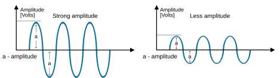
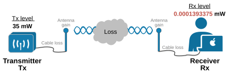
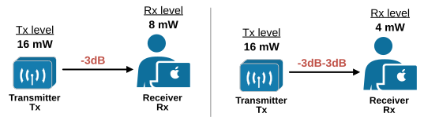

[Amplitude, Power, and dB](https://www.networkacademy.io/ccna/wireless/understanding-amplitude-power-and-db)
==========

The last lesson became larger than expected, so we continued exploring the fundamental RF terms in this lesson. It discusses how we measure and compare the power level of RF signals and explains *decibel[dB]* and *decibel-milliwatt[dBm]*—two very important units in the telecommunications field.


## Understanding Amplitude


The amplitude of an RF (Radio Frequency) signal refers to the strength of the oscillating wave that carries the signal. It is essentially the maximum height of the wave from its central baseline (zero point) to its peak (positive or negative), as shown in the diagram below. 




* Figure 1. RF Amplitude.*


You can see that the first signal on the left has a higher amplitude than the second signal on the right. **Amplitude determines the power of the RF signal**, which affects how far the signal can travel and how well it can be received. A higher amplitude generally means a stronger signal, while a lower amplitude indicates a weaker signal. Amplitude is measured in units like volts (V) or decibels (dB), depending on the context. Wait, but what is a *decibel*?


## What is decibel (dB)?


Decibel (dB) is a logarithmic unit used to measure the strength of a signal. It **represents ratios rather than absolute values**. A dB value shows how much stronger or weaker one signal is compared to another.


This makes it useful for efficiently comparing very large or very small values. Although it was initially invented to measure sound levels, people quickly realized that it also applies to power levels. It is a logarithmic scale, which means it compares values using powers of ten instead of simple addition.


### Why use decibels (dB)?


In radio communications, engineers must compare very large or very small numbers. Let's consider two imaginary examples that explain why people use decibels instead of absolute values.


**Scenario 1: **An antenna transmits with a power level of 35 mW, and a receiver receives a power level of 0.0001393375 mW. But there is a problem. The receiver complains of a bad-quality signal.




*Figure 2. Compare power levels - Scenario 1.*


**Scenario 2:** You decide to raise the power level to see if it fixes the problem. The antenna now transmits with a power level of 65 mW, and a receiver receives 0.0002055480 mW. 


*Figure 3. Compare power levels - Scenario 2.*


Is it better now? Is it better in Scenario 1 or in Scenario 2? Can you quickly tell whether raising the transmitting antenna's power level improves the strength of the receiving signal? If you spend some time calculating, you definitely can, but with decibels, **it is obvious instantly** whether the receiving signal is better in scenario 1 or 2. 


People realized that working with absolute values is not practical. It is hard for humans to compare very large numbers to very small numbers quickly and make sense of them. Let's see the same example with decibels:


- In scenario 1, the receiving power is degraded by **54dB** compared to the transmitting signal.
- In scenario 2, the receiving power degraded by **55dB** compared to the transmitting signal.

Well, with decibels, it is immediately obvious that in scenario 1, the receiver gets a better signal. Lower decibels mean a better signal because the signal degraded less. Decibels represent the ratio between very large and very small values with a simple, human-friendly number.


### Understanding decibel (dB)


Now, let's try to zoom in and explain how we calculate decibels. To understand the process, you need some very basic knowledge of logarithms.

The base-10 logarithm
A base-10 logarithm, also known as a common logarithm and denoted as log_10, is a way to express **how many times you need to multiply 10 to get a certain number**. Let's see a few examples: 


```
`log_10(100) is 2 because 10x10 is 100.`
```

```
`log_10(100000) is 5 because 10x10x10x10x10 is 100,000.`
```

The common logarithm is a useful tool in math and science for simplifying large numbers. It is the foundation of decibels.

Calculating decibels (dBs)
First, remember that a decibel is a way of describing the ratio between two values. Therefore, with dB, you will always compare two values.


There are two methods to compare two absolute power levels using decibels. The first method uses the following equation: 


```
`dB = 10.(log_10Power2 – log_10Power1)`
```

where Power2 is the receiving power level, and Power1 is the transmitting power level.


Power 2 is called the *source of interest.* We want to understand how much lower the receiving signal is than the original signal. Power 1 is usually called the *source of comparison* or the *reference value*.


Let's calculate the example shown in Figure 2 using the equation above. Notice that I am not doing it manually but am using a Python script to calculate it. The script can be found at the end of the lesson. 


```
`#Given power levels in mW
Power1 = 35
Power2 = 0.0001393375

**dB **= 10.(log_10(0.0001393375) - log10(35))
**dB **= 10.(-1.544068 - 3.855931)
**dB** = 10.(-5.399999)
**dB **= -54`
```

There is another simpler equation that can calculate the ratio even more easily. Instead of subtraction, it uses division of the two power levels, as shown below:


```
`dB = 10.log_10(Power2/Power1)`
```

Let's calculate the dB value of the powers shown in Figure 2. 


```
`#Given power levels in mW
Power1 = 65
Power2 = 0.0002055480

**dB **= 10.log10(Power2/Power1)
**dB **= 10.log10(0.0002055480/65)
**dB **= -55`
```

The equation with division is more commonly used in wireless technologies. However, keep in mind that you don't need to be able to calculate decibels without a calculator or computer assistance. You won't be required to do so at any Cisco exam. The point is to understand what *decibel *is and how it is calculated.

Common dB values to remember
There are three common dB values that you must know on top of your head when comparing power levels:


- **0dB****:** A value of 0 dB means** the two power values are equal**. If the power levels are the same, the ratio is 1, and log10(1) is 0.
- **3dB****:** A value of 3 dB means **the power value is double the reference value**; a value of -3 dB means the power value is half the reference. When receiving power is twice the transmitting power, the ratio is 2, so 10.log_10(2) = 3 dB. When the ratio is 1/2, 10.log_10(1/2) = -3 dB. This fact is not very intuitive, but it's easy to learn. This is a very common question in exams, especially ones with heavy wireless-related questions.
- **10dB****:** A value of 10 dB means the power value is **10 times the reference value**; a value of -10 dB means the power value is 1/10 of the reference.

Here's a handy rule: when power values multiply, the dB value is positive and can be added. When power values divide, the dB value is negative and can be subtracted.


| **Power Change** | **dB Value** 
| Signals are equal | 0dB 
| Double the power | +3dB 
| Half the power | -3dB 
| Ten times the power | +10dB 
| One-tenth the power | -10dB 

Using those three common dB values, you can easily calculate some more complex ratios using basic math. Let's see some examples.


The access point on the left side in the following diagram transmits with 16mW, and the receivers get 8mW. Using traditional math, we can clearly see that the receiver gets half the signal strength, so the signal strength is -3dB of the original power level. 




*Figure 4. Calculating power level ratio using common dB values.*


What about on the right side of the diagram? Tx is 16mW, and Rx is 4mW. One-half of 16mW is 8mW (-3dB), and one-half of 8mW is 4mW (-3dB). So the signal strength at the receiver is (-3dB-3dB), which is -6dB.


Let's look at another example. The access point on the left side of the following diagram transmits with 16mW, and the receivers receive 1.6mW. The received signal is 1/10th of the original Tx level, or -10dB. 


*Figure 5. Calculating power level ratio using common dB values - example 2.*


On the right side, we have Tx 16mW and Rx 0.8mW. Okay, 1/10th of 16mW is 1.6mW. We know that this is -10dB. Then 0.8mW is 1/2 of 1.6mW. This is -3dB. Therefore, the receiving signal is -13dB weaker than the original Tx signal.

Understanding dBm (decibel-milliwat)
Decibel is a very handy mathematical tool for comparing two values, typically a very large and a very small one and representing the ratio of those values with a simple, human-friendly number. However, it has one disadvantage: since it compares two values, if I give you only the ratio between them in dB, you can't reverse engineer the values. 


Consider the following example: What if I tell you, "*The Rx signal level is -45dB of the original Tx signal.*" Can you tell me what is the value of the Tx signal in Watts? Can you tell me what is the value of the received signal in Watts? No, you can't.


That's why telecommunication engineers introduced the decibel-milliwatt (dBm). dBm is a unit of measurement that expresses the power level in decibels **relative to one milliwatt**,** **as shown in the diagram below.


*Figure 6. Understanding dBm (decibel-milliwat).*


This small adjustment makes all the difference. Now, if I tell you: "*The access point transmits with 20dBm. My laptop receives -25dBm.*" you can immediately calculate that the access point transmits with 100mW, and my laptop receives 0.00316 mW. Don't worry; you don't need to know how to calculate this. Calculators and Python scripts do it in seconds. It is important to get the idea. You can find the formula at the end of the lesson in the Additional Resoruces section.


## Calculating the received signal power level


Most people falsely assume the transmitter and the antenna are one piece. That's because all modern wireless devices have built-in antennas that are inside the device and are not visible. In reality, a transmitter, its antenna, and the cable connecting them are separate parts, as shown in the diagram below.


*Figure 7. Tx power components.*


Each part affects the device's output power level as follows:


- **Transmitter**: The transmitter generates the RF signal with a certain power level that can be measured in dBm.
- **Cable**: Every cable introduces some signal loss. There is no perfect cable. Cable vendors provide the loss in dB per meter for each cable type they make.
- **Antenna**: The antenna adds some gain to the RF signal generated by the transmitter.
Keep in mind that an antenna doesn’t create absolute power by itself. If it is disconnected, it doesn't transmit anything. This makes measuring an antenna's gain in dBm impossible. Instead, we measure the antenna gains in dBi. dBi stands for "*decibels relative to an isotropic antenna*" and measures the gain of an antenna compared to an isotropic antenna. 


An isotropic antenna is **an ideal theoretical antenna** and doesn’t exist in reality. It radiates RF equally in all directions, which no physical antenna can do. dBi determines how much stronger the signal is in a specific direction than the isotropic antenna.


### What is EIRP (Effective Isotropic Radiated Power)?


EIRP (Effective Isotropic Radiated Power) is the total power a wireless antenna effectively radiates in a specific direction, considering both the transmitter power and the antenna gain. It helps measure how strong the transmitted signal appears at a distance.


*Figure 8. EIRP (Effective Isotropic Radiated Power).*


EIRP is important because **most government agencies set limits on it** in most countries. This means a system can't send signals stronger than the allowed EIRP. To determine a system's EIRP, we add the transmitter power to the antenna gain and subtract the cable loss, as shown below.


```
`EIRP(dBm) = TxPower(dBm) + AntennaGain(dBi) - CableLoss(dB)`
```

Notice that the formula uses three different units: dB, dBm, and dBi. However, we can safely combine them because they are all decibel ratios.


Let's go through an example. Imagine you have a transmitter set to a power level of 13 dBm (which is 20 mW). This transmitter is connected to an antenna through a cable that loses 5 dB of power. The antenna itself has a gain of 8 dBi. So, the system's Effective Isotropic Radiated Power (EIRP) is calculated as 13dBm - 5dB + 8dBi, which equals 16dBm.


The following table shows the limits of the most common Wi-Fi standards.


| **WiFi-Band** | **Regulatory Body** | **Max EIRP (mW)** 
| **2.4 GHz - 802.11b/g/n/ax** 
| USA | FCC | 4,000mW (4W) 
| Europe | ETSI | 100mW 
| **5 GHz -  802.11a/n/ac/ax** 
| USA | FCC | 200-4,000mW 
| Europe | ETSI | 200-1000mW 

Keep in mind that the table is very simplified just to provide context for understanding what EIRP is.


### Calculating the entire RF signal path


When considering power levels, we don't stop at EIRP. We also need to think about the entire path of the signal to ensure it has enough power to reach and be understood by the receiver. This is called the* link budget*. The following diagram shows the components that make up the link budget.


*Figure 9. Rx signal components.*


You can combine the dB values of gains and losses over any number of stages along the signal's path. For example, the received signal strength can be calculated as:

### Link Budget Calculation Example

Let's walk through a complete link budget. The received signal strength can be calculated as:

```
RxPower(dBm) = TxPower(dBm) + TxAntennaGain(dBi) - TxCableLoss(dB) - FSPL(dB) + RxAntennaGain(dBi) - RxCableLoss(dB)
```

Where **FSPL** is Free Space Path Loss (the signal loss over distance, which we cover in the next lesson).

**Example:**
- Transmitter: 20 dBm (100 mW)
- Transmitter cable loss: 3 dB
- Transmitter antenna gain: 6 dBi
- Free Space Path Loss: 80 dB (at a given distance)
- Receiver antenna gain: 4 dBi
- Receiver cable loss: 2 dB

```
RxPower = 20 dBm - 3 dB + 6 dBi - 80 dB + 4 dBi - 2 dB
RxPower = 20 - 3 + 6 - 80 + 4 - 2
RxPower = -55 dBm
```

A received signal strength of -55 dBm is excellent for Wi-Fi. Typical Wi-Fi receiver sensitivity thresholds:
- **-30 dBm** — Maximum achievable signal strength (too close, may cause distortion)
- **-50 dBm** — Excellent signal
- **-60 dBm** — Very good signal
- **-67 dBm** — Good signal (typical minimum for reliable VoIP and streaming)
- **-70 dBm** — Moderate signal (adequate for web browsing)
- **-80 dBm** — Weak signal (unreliable, may experience disconnections)
- **-90 dBm** — Very weak signal (likely no connection)

### Key dB formulas for CCNA

**Converting between dBm and mW:**

| Rule | Formula | Example |
|------|---------|---------|
| 0 dBm = 1 mW | Reference | 0 dBm = 1 mW |
| +3 dB = x2 power | dBm + 3 = mW x 2 | 3 dBm = 2 mW, 6 dBm = 4 mW |
| -3 dB = /2 power | dBm - 3 = mW / 2 | -3 dBm = 0.5 mW |
| +10 dB = x10 power | dBm + 10 = mW x 10 | 10 dBm = 10 mW, 20 dBm = 100 mW |
| -10 dB = /10 power | dBm - 10 = mW / 10 | -10 dBm = 0.1 mW |

**Rule of 10s and 3s:**
You can combine the rules above to convert any dBm value to mW (or vice versa). For example:

- **17 dBm:** 10 dBm (10 mW) + 7 dBm (10 ÷ 2 = 5 mW?) Wait, let's do it step by step:
  - 0 dBm = 1 mW
  - +10 dB → 10 dBm = 10 mW
  - +3 dB → 13 dBm = 20 mW
  - +3 dB → 16 dBm = 40 mW
  - +1 dB ≈ x1.26 (not a standard rule)
  - Actually: 17 dBm = 10 dBm + 7 dBm. 7 = 10 - 3, so: 1 mW × 10 ÷ 2 = 5 mW? No.
  - Let's use the known conversion: 17 dBm = **50 mW** (this is a known reference point to memorize).

**Common reference points to memorize:**
| dBm | mW |
|-----|-----|
| 0 dBm | 1 mW |
| 10 dBm | 10 mW |
| 13 dBm | 20 mW |
| 16 dBm | 40 mW |
| 17 dBm | 50 mW |
| 20 dBm | 100 mW |
| 23 dBm | 200 mW |
| 24 dBm | 250 mW |
| 27 dBm | 500 mW |
| 30 dBm | 1000 mW (1 W) |

### Why dB matters in the CCNA

- **EIRP limits** are specified by regulatory bodies (FCC, ETSI). You must understand EIRP = TxPower + AntennaGain - CableLoss.
- **Signal strength** (RSSI) is measured in dBm. Understanding dBm helps you interpret wireless survey data.
- **SNR** (Signal-to-Noise Ratio) is measured in dB. Higher SNR = better signal quality.
- **Antenna gain** is measured in dBi. Higher gain = more focused signal.
- **Cable loss** is measured in dB per unit length. Longer cables = more loss.

### Summary

- **Amplitude** is the strength of an RF signal. **Power** is the rate of energy transfer.
- **dB** is a relative ratio between two values. **dBm** is an absolute power level relative to 1 mW. **dBi** is antenna gain relative to an isotropic antenna.
- **EIRP** (Effective Isotropic Radiated Power) = TxPower + AntennaGain - CableLoss. It is limited by regulatory bodies.
- **Link budget** calculates the total received signal power, accounting for all gains and losses along the signal path.
- The **Rule of 10s and 3s** helps quickly convert between dBm and mW.
- Understanding dB concepts is essential for wireless design, troubleshooting, and the CCNA exam.
