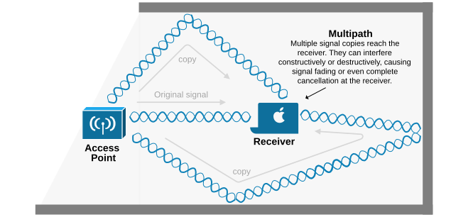
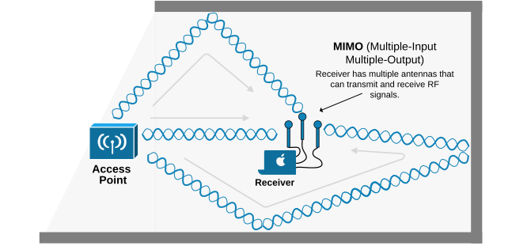
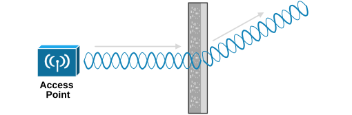
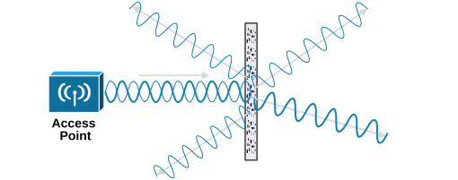
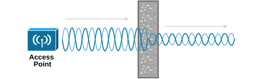
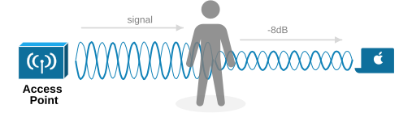
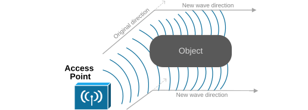
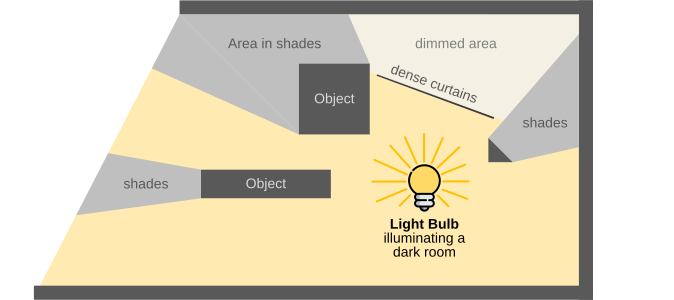
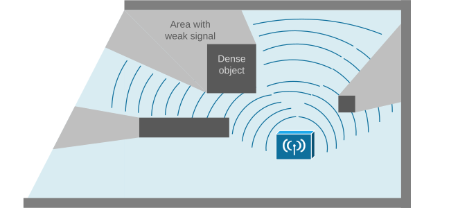

[RF effects in Real World](https://www.networkacademy.io/ccna/wireless/radio-signals-in-real-world-environments)
==========

This lesson explains the most common effects that RF signals experience in the real world. They are significant factors in signal loss and wireless range limitations.

## What is Reflection?

The visible light we can see with our eyes is an electromagnetic wave. It's part of the electromagnetic spectrum, which includes WiFi bands as well. People are very familiar with light reflection. When light hits a smooth surface, it is reflected at the same angle it hits. This allows us to see clear images in mirrors or on the surface of calm water.

Well, all electromagnetic waves can experience reflection. When an RF signal in the Wi-Fi band hits a dense material such as metal or water, it bounces off, as shown in the diagram below.

*Figure 1. RF Reflection.*

In practice, the signal from our indoor wireless access point reflects when it hits dense walls, water tanks, metal objects, and dense doors, as shown in the diagram below. On the outside, outdoor wireless signals reflect from buildings, metal construction, or even the ground. 

*Figur 2. RF Multipath due to Reflection.*

When there is a reflection, a receiver can receive **multiple reflected copies of the original signal.** Typically, the copies arrive out of phase because the reflected signal takes a longer path and arrives a bit later, causing what's known as multipath. When the receiver gets multiple signals, it mixes them into a weak and distorted version of the original signal, leading to degraded data.

However, reflection is not always a bad thing. People realized that they could take advantage of the fact that the receiver gets multiple signal copies by deploying multiple antennas. A technique called MIMO.

### What is MIMO?

MIMO (Multiple-Input Multiple-Output) means that a device has multiple antennas that can transmit and receive RF signals.

*Figure 3.MIMO (Multiple-Input Multiple-Output).*

Imagine WiFi signals bouncing off objects like walls and furniture, creating multiple reflected signals. With just one antenna, these reflections can mix together and cause interference. But with MIMO, multiple antennas are used to receive these different signals. **Each antenna captures a separate reflected signal**, allowing the WiFi system to process them individually. This means it can combine the best parts of each signal, improving the overall data quality and speed. Nowadays, all premium-class wireless devices, laptops, and phones use MIMO. We simply don't see it because the antennas are built-in inside devices (not as shown in the diagram above).

## What is Refraction?

When an RF signal passes through an object made of materials with different densities, it changes direction (bends), which is called refraction. If we compare it with reflection, reflection is bouncing off a surface, and refraction is bending while passing through a surface, as shown in the diagram below.

*Figure 4. RF Refraction.*

Refraction can also occur when an RF signal passes through layers of air with different humidity and density levels.

## What is Scattering?

When an RF signal goes through materials made up of different tiny particles, it can scatter in many different directions. Typically, it occurs when a wireless signal travels through a sandy or dusty environment, as shown in the diagram below.

*Figure 5. RF Scattering.*

Scattering can help or degrade signal reception. In some cases, it enables signals to reach areas that would otherwise be blocked (non-line-of-sight communication). However, excessive scattering can cause signal distortion and interference, reducing overall wireless performance.

The effect is more pronounced at higher frequencies (such as 5 GHz WiFi) because shorter wavelengths interact more with small obstacles like dust, rain, or foliage.

## What is Absorption?

When an RF signal passes through dense materials, it loses energy. The denser the material, the more the signal weakens. The following diagram shows how absorption affects a signal and how a receiver can be impacted by the lower signal strength.

*Figure 6. RF Absorption.*

Absorption is the most significant factor in **indoor signal loss** and **wireless range limitations**. A typical example is when a wireless signal passes through walls in a building or home. Different wall materials absorb different amounts of energy. For instance, drywall might weaken the signal by –4 dBm, while a solid concrete wall might weaken it by –12 dBm. The thicker or denser the wall, the greater the signal attenuation.

Another example of absorption is **the human body**, which is mostly water (yes, humans are 60% water on average). People usually hold their phones and laptops close to their bodies. Depending on how a person is positioned relative to the transmitter, their body might be between the transmitter and the receiver, weakening the signal. For example, covering a phone antenna with a hand can decrease the signal by –8 dB, and a person's body might weaken the signal by 15 dB. 

*Figure 7. RF absorpt by a human body.*

In an office building filled with people, each person's body can potentially weaken the signal from a transmitter. That's why **wireless access points (APs) are mounted in the ceiling** so that the signal does not interfere with furniture, metal objects, and human bodies and gets absorbed and degraded.

In practice, every obstacle the wireless signal passes through absorbs some of its energy. The following table gives some estimated attenuation values for reference.

Table 1. Atteniation values of most common obstacles.
| **Object** | **RF signal attenuation when passing through the object** 
| Window | 1-3 dB 
| Plasterboard wall | 3 dB 
| Cinderblock wall | 4 dB 
| Aluminium door | 6 dB 
| Brick wall | 8 dB 
| Concrete wall | 12 dB 
| Human body | 6-15 dB 

However, keep in mind that these values are just for general reference. In reality, the values may be completely different in different parts of the world. Different countries use different building methods. A brick wall may introduce 6 dB loss in one country, but it may introduce 14 dB in another because the bricks might be thicker, have extra isolating material, or include inner air chambers, and so on

## What is Diffraction?

Diffraction occurs when an RF signal bends around obstacles or spreads after passing through narrow openings. This allows the signal to reach areas not directly in the access point's line of sight. However, diffraction weakens the signal, reducing its strength and lowering data speeds. It is most noticeable when signals encounter the edges of walls, furniture, or buildings.

*Figure 8. Diffraction.*

Diffraction is easier to understand when you think of RF waves as expanding ripples. If ripples hit a round obstacle, like a rock, they bend around it and continue spreading.

## Light vs. Wireless signal

When I plan wireless coverage and want to account for all radio signal effects, such as reflection, refraction, absorption, diffraction, etc., I always think of the wireless signal as light. At the end of the day, both light and wireless signals are electromagnetic waves. They experience pretty much the same effects. 

Everybody understands how light propagates in free space. When it hits a smooth surface, it reflects. When it goes through translucent material, it loses energy. When it hits dense material, it is scattered or completely absorbed.

Thinking of wireless signals as light when planning the placement of access points and wireless routers is a good thought process. Of course, some materials are transparent for wi-fi frequencies but are opaque for light. Anyway, the RF effects are very similar so it is a good starting point. 

*Figure 9. Lightt bulb illuminating a room.*

Placing wireless access points (APs) in a room, house, or office is similar to positioning light bulbs for even illumination. Just as light spreads from a bulb to cover an area, a Wi-Fi signal radiates from an AP to provide signal coverage. Both light and Wi-Fi signals are forms of electromagnetic waves, meaning they experience similar effects, such as reflection, refraction, absorption, and interference.

*Figure 10. Access point covering a room*

For example, just as shadows form when objects block light, Wi-Fi dead zones appear when walls, furniture, or other obstacles obstruct the signal. Similarly, placing a light bulb too close to a wall may cause uneven lighting, just as an AP placed near obstructions may result in weak or inconsistent connectivity.

## Key Takeaways

Understanding how RF signals behave in the real world is essential for designing efficient wireless networks. Effects such as reflection, refraction, diffraction, absorption, scattering, and MIMO influence signal strength, coverage, and performance. By recognizing these behaviors, network engineers can optimize access point placement and improve connectivity. Below is a summary of the key RF effects discussed:

Table 2. Short explanation of every RF effect.
| **RF Effect** | **Short Explanation** 
| Reflection | Signal bounces off smooth surfaces. 
| Refraction | Signal changes direction when passing through different materials, affecting coverage. 
| Diffraction | Signal bends around obstacles or spreads after passing through narrow openings. 
| Absorption | Signal weakens as it is absorbed by materials like concrete or water. 
| Scattering | Signal disperses in multiple directions after hitting rough or uneven surfaces. 
| MIMO | A device uses multiple antennas to improve signal strength, speed, and reliability. 

## Book traversal links for 8

