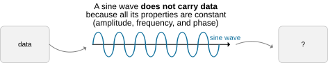
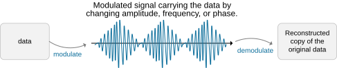
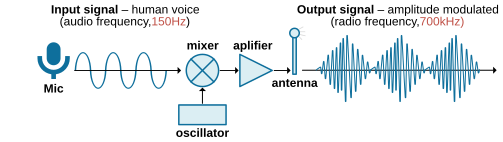
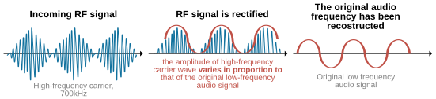
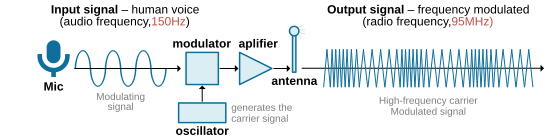
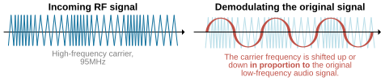
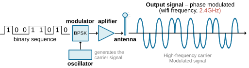
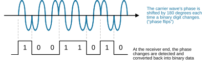
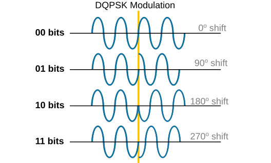

[Sending data over RF signals](https://www.networkacademy.io/ccna/wireless/sending-data-over-rf-signals)
==========

In this lesson, we will learn about *modulation*, a technique used to send data over radio waves by changing a signal’s amplitude, frequency, or phase. We will explore analog modulation methods like AM and FM, as well as digital modulation techniques like BPSK, QPSK, and QAM, to understand how they work and why they are essential in modern wireless communication.

## Why do we need modulation?

So far, in this section, we've only talked about the basic characteristics of wireless signals. These RF signals are simple waves called sine waves. **A sine wave does not carry any data **because its frequency, amplitude, and phase are steady and predictable, as shown in the diagram below.

*Figure 1. Why do we need modulation?*

To send any data over an RF signal, we must use a technique called *modulation*. Modulation is when **we ****dynamically ****change the properties of an RF signal to encode useful information**, as shown in the diagram below. There are three parts of a signal that we can change: amplitude, frequency, and phase. 

- **Amplitude **is the strength or power of the signal. 
- **Frequency **is how often the signal repeats.
- **Phase **is the point in the signal's cycle at a given time.

*Figure 2. What is modulation?*

To understand this lesson, you must have a basic understanding of those three properties of an RF signal. If you don't feel confident you understand them, you can review our lesson introducing RF signals.

## Analogue modulations

Analog modulation is a technique for sending a continuous signal with information (most commonly human voice or music) over a higher-frequency RF signal called a *carrier*. It is called analog because the input signal is not 0s and 1s but an analog signal.

### Amplitude modulation (AM)

Amplitude modulation (AM) is a technique for transmitting information by varying the strength (amplitude) of a carrier signal in proportion to the information signal, such as audio, as shown in the diagram below.

*Figure 3. Amplitude modulation (AM).*

Essentially, the carrier signal's amplitude changes to match the peaks and troughs of the audio signal, allowing the audio to be sent over long distances via radio waves. Then, at the receiving end, the incoming carrier signal can be demodulated using the same logic, and the original audio signal can be decoded, as shown in the diagram below.

*Figure 4. Amplitude demodulation (AM).*

This type of modulation is called amplitude modulation (AM) because the signal changes continuously to represent the audio information we want to send—in other words, it’s an analog signal.

You may ask, "*Okay, but why can't we just send the audio signal over free space? Audio signals are waves as well, aren't they?*"

The main reason we need to modulate is that **the original signal isn't suitable for radio transmission**. The sounds we hear on the radio are in the audio spectrum, ranging from about 20 Hz to 20 kHz. The antenna size needed to transmit radio waves is inversely proportional to the frequency of the waves. So, antennas for these frequencies can range from** a few kilometers to tens of kilometers long!** That's why we want to transmit the information with appropriate RF signals that require a reasonably small antenna and power level.

Amplitude modulation has one major disadvantage: AM signals are more susceptible to noise and interference because **the amplitude (signal strength) carries the information**. Any amplitude variation affects the quality of the received signal, and we have seen what happens when RF signals pass through different materials (in our lesson on amplitude and power). 

Although amplitude (AM) modulation is not as widely used anymore, it is still utilized in various applications today. Mainly in scenarios where the transmitter and receiver are not stationary but moving at speed. If the transmitter and receiver are moving toward each other, the received frequency increases. If they are moving away from each other, the received frequency decreases. The change in frequency (Δf) can be calculated using the Doppler formula. That's why frequency modulation (FM) and phase modulation (PM) are inappropriate in such cases, and amplitude modulation (AM) is still used in Aircraft communications.

### Frequency modulation (FM)

Frequency modulation (FM) is another technique for imposing data on a carrier frequency, as shown in the diagram below. An oscillator creates a carrier signal, which is then sent to the frequency modulator along with the audio signal. The modulator creates a frequency-modulated signal by changing the frequency of the carrier signal up or down based on the strength of the audio signal at any given moment.

*Figure 5. Frequency Modulation (FM).*

When an FM carrier wave is modulated by an information signal, its frequency changes based on the amplitude of the information signal at that moment. This change in frequency is called **frequency deviation** and is shown in the diagram below.

*Figure 6. Frequency deviation.*

At the receiving end, the incoming RF signal is demodulated using the same logic, and the original audio signal is extracted, as shown in the diagram below.

*Figure 7. Frequency Demodulation.*

One big advantage of FM over AM is that FM is better at handling noise and interference. This is because the strength (amplitude) of an FM signal doesn't matter in the modulation process. Even if the amplitude of an FM signal changes due to noise, it doesn't usually affect the receiver's ability to decode the signal since it only looks for frequency changes and ignores amplitude changes. Also, FM signals have a wide bandwidth, so interference at specific frequencies has less of an impact. However, the downside is that wideband FM channels use more bandwidth than AM channels, making them less efficient in using the available RF spectrum.

## Digital modulation

In analog modulation, the information that we want to carry to the remote end is continuous (e.g., voice or video signals). However, most information these days is discrete (binary 0s and 1s). That's why all modern wireless communications (Wi-Fi, LTE, 5G) use digital modulation.

Multiple digital modulations are in use today. However, to understand the general idea behind them, let's walk through one of the most common ones: Phase Shift Keying (PSK). It has multiple variations. We will start with the simplest one.

### PSK (Phase Shift Keying)

PSK (Phase Shift Keying) is the most straightforward digital modulation. It uses the RF signal's phase to encode the useful information (binary sequence).

BPSK (Binary Phase Shift Keying)
Binary Phase Shift Keying (BPSK) is a digital modulation technique where **the phase of a carrier wave is shifted by 180 degrees to represent binary data** (0s and 1s). It's one of the simplest forms of phase modulation and is highly effective in environments with low signal-to-noise ratios due to its robustness.

An oscillator creates a carrier signal, which is then sent to the PSK modulator along with the binary sequence. The modulator creates a phase-modulated signal by changing the phase of the carrier wave by 180^o every time the binary sequence changes from 0->1 or 1->0, as shown in the diagram below.

*Figure 8. BPSK modulation.*

When the data switches between 0 and 1, the phase of the carrier signal flips. This helps the receiver understand the transmitted message by detecting phase changes. Using this logic, the receiver can demodulate the binary sequence, as shown in the diagram below.

*Figure 9. BPSK demodulation.*

Notice one important aspect - one phase-shift change represents one bit. This is referred to as "*one bit per symbol.*" 

Quadrature phase-shift keying (QPSK)
BPSK encodes and interprets one bit per one-phase shift. However, there is no reason why one phase shift can't represent two or more bits. This is the logic behind Quadrature phase-shift keying (QPSK).

In QPSK, the signal can shift **to one of four different phase angles** (0°, 90°, 180°, or 270°), meaning each change represents two bits of data, as shown in the diagram below. This is referred to as "*two bits per symbol*."

*Figure 10. DQPSK modulation.*

The diagram above shows how phase changes happen at specific points in the signal. The phase can shift in four possible ways, each 90 degrees apart, based on the encoded binary sequence, as follows:

- 00 → No phase change
- 01 → Rotate phase 90°
- 11 → Rotate phase 180°
- 10 → Rotate phase 270°

The receiver detects these phase shifts and decodes the original data. This allows QPSK to transmit twice as much data as Binary Phase Shift Keying (BPSK) while maintaining the same bandwidth. It is widely used in satellite communication, Wi-Fi, and 4G networks because it balances speed and reliability.

### Quadrature Amplitude Modulation (QAM)

Quadrature Amplitude Modulation (QAM) modulates **both the amplitude and phase** of the carrier signal. It achieves a higher level of spectrum usage and higher transfer rates than PSK modulations.

Quadrature Amplitude Modulation (QAM) modulates **both the amplitude and phase** of the carrier signal. It achieves higher spectrum usage and data rates than PSK modulations.

**How QAM works:**
- Both amplitude and phase are varied simultaneously.
- Each combination of amplitude and phase represents a unique "symbol."
- Each symbol represents multiple bits (e.g., 64-QAM = 6 bits per symbol, 256-QAM = 8 bits per symbol).
- The number of possible states is the "QAM order" (e.g., 16-QAM, 64-QAM, 256-QAM, 1024-QAM).

**Constellation diagram:**
QAM is often visualized using a **constellation diagram**, where each dot represents a unique amplitude/phase combination:

- **16-QAM:** 16 dots (4x4 grid) — 4 bits per symbol
- **64-QAM:** 64 dots (8x8 grid) — 6 bits per symbol
- **256-QAM:** 256 dots (16x16 grid) — 8 bits per symbol
- **1024-QAM:** 1024 dots (32x32 grid) — 10 bits per symbol

**Higher QAM = more bits per second:**
- Higher QAM means more bits per symbol and faster data rates.
- However, higher QAM requires a better **Signal-to-Noise Ratio (SNR)** because the dots in the constellation are closer together. If the SNR is too low, the receiver cannot distinguish between adjacent symbols, causing errors.
- Wi-Fi adaptively selects the modulation based on SNR (a process called **Dynamic Rate Shifting** or **Adaptive Modulation**).

### Comparing modulation techniques

| Modulation | Bits per Symbol | Bandwidth Efficiency | SNR Requirement | Typical Use |
|-----------|----------------|---------------------|-----------------|-------------|
| BPSK | 1 | Low | Very low (robust) | Legacy Wi-Fi, long-range links |
| QPSK | 2 | Low-Medium | Low | Satellite, basic Wi-Fi |
| 16-QAM | 4 | Medium | Medium | Wi-Fi, LTE |
| 64-QAM | 6 | High | High | Wi-Fi 5 (802.11ac), LTE |
| 256-QAM | 8 | Very high | Very high | Wi-Fi 6 (802.11ax), 5G |
| 1024-QAM | 10 | Extremely high | Extremely high | Wi-Fi 7 (802.11be) |

### Dynamic Rate Shifting

Wi-Fi devices constantly monitor the link quality (SNR, retransmissions). When the link is good, the device uses higher-order modulation (e.g., 256-QAM) for maximum throughput. When the link degrades, the device "shifts down" to a more robust modulation (e.g., QPSK or BPSK).

This ensures reliable communication even in challenging RF conditions, though at lower data rates.

### OFDM (Orthogonal Frequency Division Multiplexing)

While not a modulation itself, OFDM is a transmission technique used in modern Wi-Fi (802.11a/g/n/ac/ax). It splits the available channel into many narrow **subcarriers**, each modulated independently (using BPSK, QPSK, or QAM).

**Advantages of OFDM:**
- Resistant to multipath interference (common in indoor environments).
- Efficient spectrum usage.
- Allows dynamic allocation — weaker subcarriers can use robust modulation while stronger ones use higher-order QAM.

### Summary

- **Modulation** is the process of encoding data onto an RF carrier signal by varying its amplitude, frequency, or phase.
- **Analog modulations** (AM, FM) are used for continuous signals like voice and music.
- **Digital modulations** (BPSK, QPSK, QAM) encode binary data onto RF signals.
- **BPSK** = 1 bit per symbol, **QPSK** = 2 bits per symbol, **QAM** = 4+ bits per symbol.
- **Higher-order QAM** (64, 256, 1024) provides higher data rates but requires better SNR.
- **Dynamic Rate Shifting** allows Wi-Fi devices to adapt the modulation based on real-time link quality.
- **OFDM** splits the channel into many subcarriers, each independently modulated, providing robustness against interference and multipath.
