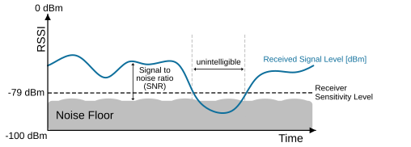
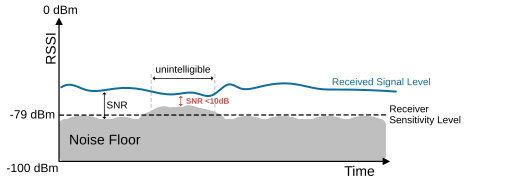
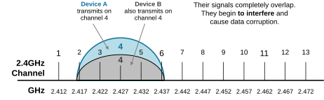
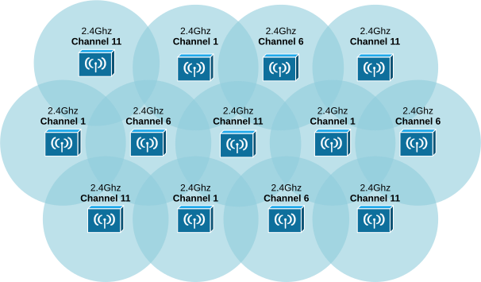
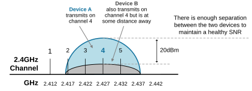
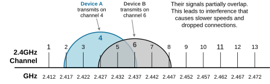
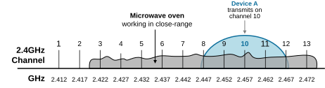
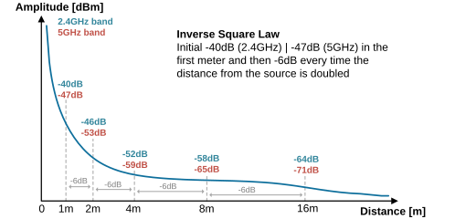
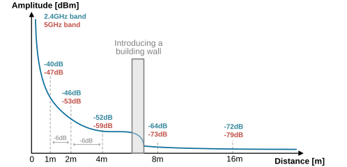
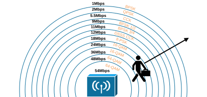

[Interference, RSSI, and SNR](https://www.networkacademy.io/ccna/wireless/interference-rssi-and-snr)
==========

This lesson discusses interference, RSSI, and SNR in Wi-Fi networks. It is designed to help you understand signal strength and noise and how to minimize disruptions for better connectivity.


## Understanding RSSI and SNR


In a wireless LAN, devices transmit at power levels between 100 mW (20 dBm) and 1 mW (0 dBm). This transmission power, known as EIRP, is regulated by regional authorities. As the RF signal travels to the receiver, its power drops significantly, usually falling to almost 0 mW.


When measured in dBm, the received signal strength typically ranges from 0 dBm to about -100 dBm. This measurement is known as the **Received Signal Strength Indicator (RSSI)**. RSSI values indicate signal strength, with 0 dBm being the strongest and -100 dBm being the weakest.


Each receiver has a sensitivity threshold. If the signal strength is above this threshold, the receiver can properly process the signal and extract useful information. However, if the signal strength falls below this level, the device cannot interpret the signal correctly. 




*Figure 1. Received signal drops.*


For example, a receiver may have a sensitivity threshold of -79 dBm. If the received signal power level falls below this threshold, the signal becomes unintelligible, and the receiver cannot detect and interpret it, as shown in the diagram above.


Additionally, every environment has a Noise Floor, which refers to the background level of unwanted signals or noise in that environment. These unwanted signals are always present at every frequency, even without active wireless transmission. They can come from various sources, such as other electronic devices, thermal noise, or external environmental factors. The noise floor is like **the background noise at a busy cafe**. You try to have a conversation with someone, but it is difficult to hear each other clearly because of the loud background chatter from other people.


The noise floor sets a limit on the minimum detectable signal level for a receiver. Any signal below this level **will be drowned out by the noise** and become difficult or impossible to detect and interpret. A lower noise floor means that the receiver can detect weaker signals. We measure the strength of the received signal against the noise floor using the** Signal-to-Noise Ratio (SNR)**. It is expressed in decibels (dB) and calculated as:


```
`**SNR **= ReceivedSignalPower(dBm) − NoisePower(dBm)`
```

For the signal to be clear, its strength must be higher than the noise floor by a good margin. A higher SNR means a clearer signal with less interference, while a lower SNR means more noise, making communication difficult or impossible.


- **Good SNR**: An SNR above 20 dB is usually considered good. In this range, the signal is much clearer than the noise, leading to better communication quality.
- **Moderate SNR**: An SNR between 10 dB and 20 dB is considered moderate. The signal is still stronger than the noise, but there might be some noticeable interference.
- **Poor SNR**: An SNR below 10 dB is considered poor. In this range, the noise is almost as strong as the signal, making it difficult to understand the transmitted information clearly.

For example, the diagram below shows an RF signal with an average RSSI of -57dBm. The noise floor averages at about -80dBm. Therefore, we can calculate the SNR as:


```
`SNR = -57dBm -80dBm = 23 dB`
```

This is a good SNR value and the received signal. The receiver can detect the signal and demodulate the useful data. 




*Figure 2. Noise Floor raises.*


However, notice that at some point, the noise floor rises, and the SNR value drops below 10dB. At this point, the receiver cannot detect and interpret the RF signal. Therefore, it cannot demodulate the useful information, and the user experiences data interruption.


## Understanding Wi-Fi Interference


Interference in wireless communications occurs when unwanted signals disrupt the transmission and reception of data. Think of it like trying to have a conversation in a noisy room—the noise makes it hard to hear and understand each other.


### Co-channel interference (CCI)


Co-channel interference (CCI) occurs **when multiple wireless devices use the same Wi-Fi channel** in the same place. For example, devices A and B transmit on the same channel 4 in the 2.4 GHz band. What happens is that their signals completely overlap throughout the entire 22-Mhz width of the channel, as shown in the diagram below.




*Figure 3. Same channel interference.*


Although co-channel interference is obviously harmful, it is unavoidable in most wireless deployments. Both the 2.4GHz and 5GHz bands have only a limited number of channels. Depending on the scale of the wireless LAN and the number of access points (AP), it may be impossible to use non-overlapping channels everywhere. Reducing the effects of co-channel interference always starts with **the proper network design**, as shown in the diagram below.




*Figure 4. Channel Planning.*


A good design takes advantage of wall attenuation. You configure an AP to use the same channel as another AP only if they are at least two walls away from each other. This provides enough separation so that the co-channel interference (CCI) is insignificant and both access points can maintain a healthy signal-to-noise ratio (SNR) in relation to each other, as shown in the diagram below.




*Figure 5. Minimizing CCI interference.*


However, wireless devices can interfere even if they are not transmitting on the same WiFi channel. This is called neighboring channel interference.


### Neighboring channel interference (NCI)


Neighboring Channel Interference (NCI) happens when two wireless signals **on nearby frequencies** interfere with each other. This usually occurs when Wi-Fi devices operate on channels that are too close together. Recall that a WiFi channel has a bandwidth of 22 MHz. This means that if a device transmits on channel 4, for example, it uses frequencies between 2.416 and 2.438 GHz and not only the central channel frequency of 2.427 GHz. Therefore, channels can interfere with each other, as shown in the diagram below.




*Figure 6. Neighboring channel interference.*


To avoid NCI, it's best to use non-overlapping channels. The best channels to use in the 2.4 GHz Wi-Fi band are 1, 6, and 11 because they do not overlap. More channels are available in the 5 GHz band, providing more flexibility in designing the wireless LAN so that NCI does not occur. However, a good design may require more access points (AP) configured to transmit at lower power levels.


### Non-WiFi interference


In the real world, even non-WiFi devices can cause interference on a particular channel or even the entire Wi-Fi band. For example, a microwave oven near an access point can cause signal disruption, slower speeds, and connection drops on all 2.4GHz channels, as shown in the diagram below.




*Figure 7. Non Wi-Fi interference.*


There could be many sources of non-Wi-Fi interference in every frequency band (2.4GHz, 5GHz, and 6GHz). The most common ones include:


- Microwaves
- Bluetooth devices
- Cordless phones
- Baby monitors
- Wireless cameras
- Radar systems (especially in 5 GHz)

This type of interference is more challenging to detect and avoid. In some situations when the 2.4GHz band has a lot of non-Wi-Fi signals, which causes the Noise Floor to be very high, it may be better** to reconfigure the entire wireless LAN to another band** (for instance, 5GHz) rather than trying to design around the external noise.


## Free Space Path loss (FSPL)


When a radio frequency (RF) signal is transmitted from an antenna, its strength decreases as it moves through open space. Even with no obstacles in the way, the signal still weakens. This effect is called *free space path loss (FSPL)*. It’s not caused by air, water molecules, or the Earth’s magnetic field— even signals traveling through the vacuum of space experience FSPL.


RF signals don’t move in a straight line; instead, they spread out in waves. Imagine the signal forming a sphere that expands as it travels. The energy remains the same, but **as the sphere grows, the signal gets weaker** because it’s spread over a larger area. This happens no matter what kind of antenna is used, even if it focuses energy in a tight beam.


The loss is relative to two RF signal components: Frequency and Distance. The free space path loss (in decibels) is calculated using the formula:


```
`**FSPL(dB) = 20.log10(d) + 20.log10(f) + 92.45**
Where: 
**d** = distance in kilometers (km)
**f** = frequency in gigahertz (GHz)
and **92.45** is a constant adjusted for GHz and km units.`
```

Of course, you don't need to remember the formula. You simply need to understand the phenomenon. The diagram below graphically illustrates how much energy a Wi-Fi signal loses moving farther from the access point (AP).




*Figure 8. Free Space Path loss.*


The key takeaway is that signal loss increases with distance and frequency. Higher frequencies, like 5 GHz, experience more loss than lower frequencies, like 2.4 GHz. That’s why 2.4 GHz Wi-Fi signals typically have a longer range than 5 GHz signals, assuming the same transmission power. For example, if a receiver moves away from a Wi-Fi transmitter, it might detect a strong signal at 40 meters on a 2.4 GHz band but only 20 meters on a 5 GHz band.


However, see what happens if we go through some obstacles in the signal path, as shown in the diagram below. 




*Figure 9 FSPL plus a wall.*


As expected, the wall will attenuate the signal. The FSPL will be applied to the signal as it travels to and away from the wall. The wall's attenuation amount will be added to the formula. Then, due to the combined effect of FPSL and the wall's attenuation, the range of the 5GHz signal could not be detected even at the 10th meter. Every wireless engineer who designs a wireless LAN's coverage must account for these two effects.


### How to Handle Free Space Path Loss


One way to compensate for the FSPL loss is to increase the transmitter’s power or use a higher-gain antenna. However, this can cause interference if multiple transmitters are nearby. A better approach is **to adjust how data is transmitted based on signal conditions**, as shown in the diagram below.




*Figure 10. Dynamic rate shifting.*


Wi-Fi devices **automatically adjust their modulation and coding based on signal strength**. If the signal is strong, they use complex methods to send more data at higher speeds. If the signal weakens, they switch to simpler methods to maintain a stable connection, even if it means slower speeds. This process is called *dynamic rate shifting (DRS)* and happens automatically without user intervention. Different manufacturers may use slightly different approaches, but the goal is the same—adjusting data transmission to match real-time signal conditions.


### Full Content Access is for Subscribed Users Only...


- **Learn any CCNA, CCIE or Network Automation topic** with animated explanation.
- **We focus on simplicity.** Networking tutorials and examples written in simple, understandable language.

Sign up for free ►
