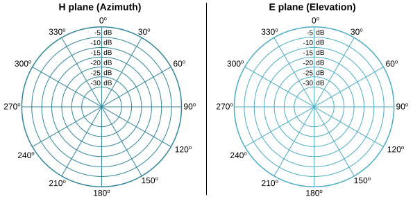
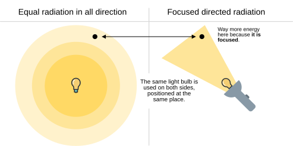
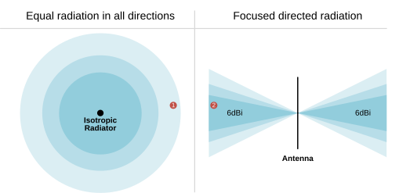
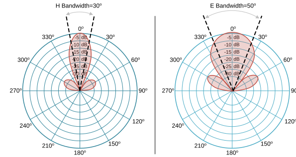

[Understanding Antennas](https://www.networkacademy.io/ccna/wireless/understanding-antennas)
==========

No single antenna works for every situation. Antennas come in different shapes and sizes, each designed for a specific use case and with a unique gain value. This lesson explains antenna features and characteristics in more detail.

## What is an Antenna?

In simple terms, an antenna is a device that sends and receives radio waves, allowing communication without wires. An antenna works by converting electrical signals into electromagnetic waves for transmission and vice versa for reception. It relies on the principles of electromagnetism, where an electric current flowing through a conductor generates a magnetic field, and a changing magnetic field induces an electric field. This process allows antennas to send and receive signals wirelessly.

To understand the concept, let's look at an example of a radio transmission (sending signals). A device like an access point (AP) generates an electrical signal containing information (voice, video, data, etc.). This signal is sent to the antenna as an alternating current that oscillates with a specific frequency. The alternating current creates an electromagnetic field that radiates away from the antenna in the form of radio waves. These waves travel through free space until they reach a receiving antenna, as shown in the diagram below.

*Figure 1. What is an antenna?*

At the reception side, the radio waves reach a receiving antenna. They cause the electrons inside the antenna to move, generating a weak electrical signal. The antenna passes this signal to a receiver, which processes and converts it back into its original form (voice, video, data, etc.). This is how you receive signals on devices like laptops, mobile phones, and Wi-Fi routers.

Notice that in the example shown in the diagram above, the antenna is outside the access point connected with a cable to the device. Well, this is a bit fictional. In reality, the antennas of all mobile devices are built-in inside the device and are not visible (they are just hidden inside). 

### The ideal antenna (Isotropic Radiator)

Antennas come in different sizes and have different features and characteristics. To understand them, we need a reference point to compare each antenna with. To do this, we use an idealized theoretical antenna called Isotropic Radiator.

An isotropic radiator is an ideal theoretical antenna that radiates electromagnetic waves **equally in all directions with perfect efficiency**. It is a point source that emits energy uniformly in a spherical pattern without any preference for a particular direction, as shown in the diagram below. 

*Figure 2. The ideal antenna (Isotropic Radiator).*

Well, such an antenna doesn't exist. It is a theoretical construct used as a reference point for real antennas. To understand the characteristics of a given antenna, we compare it with the Isotropic radiator. You will get a clearer picture of why and how when we get to the antenna gain section of the lesson.

## Radiation Patterns 

To illustrate how an antenna performs, a sphere is often drawn with a size proportional to the signal strength. This visual representation is called a radiation pattern. Since showing a 3D shape on a flat surface is difficult, two slices of the pattern are often taken at right angles. These slices help understand how the antenna radiates signals.

One slice, the H-plane (azimuth plane), shows a top-down view of the antenna's radiation pattern. The other slice, the E-plane (elevation plane), shows a side view. These two slices give a more practical way to visualize antenna behavior.

*Figure 3. E and H Polar Plots.*

The shape of each slice is usually recorded on a polar plot, which consists of concentric circles. The outer circle represents the strongest signal, while the inner circles show weaker signal levels. These plots do not always show exact power levels but give a relative measurement of signal strength. The circles are divided into 360-degree sections, making it easier to track signal strength at different angles.

*Figure 4. Azimuth and Elevation.*

Understanding these radiation patterns is important because most antenna manufacturers include them in their product specifications. When analyzing these plots, the antenna is always placed at the center. Some manufacturers, like Cisco, include a small picture of the antenna to help interpret the pattern.

If you become a wireless engineer, you will need to examine different antenna patterns to determine which one is best suited for your environment. Based on the provided plots, you will also need to visualize the 3D radiation pattern in your mind.

## Polarization

An antenna generates electromagnetic waves that have two parts: an electrical field wave and a magnetic field wave. The electrical part always **leaves the antenna in a specific orientation** with regard to the horizon. For instance, the diagram below shows an antenna that produces a wave that moves up and down vertically through space.

*Figure 5. Vertical Polarization.*

The direction in which the electrical field wave moves relative to the horizon is called antenna polarization. Antennas that create vertical waves are **vertically polarized**, like the one shown above. 

Antennas that are horizontally positioned and create horizontal waves are **horizontally polarized**, as shown in the diagram below.

*Figure 6. Horizontal Polarization.*

Antenna polarization isn't critically important on its own. However, the transmitting antenna's polarization must match the receiving antenna's polarization. If they're mismatched, the received signal is so weak it is practically unusable.

To understand polarization - imagine the example of two people holding the end of a loose rope. They’re trying to send waves along the rope to each other, similar to how antennas transmit and receive signals.

Now, imagine one person still moves her hand up and down vertically, but the other moves his hand side to side horizontally. The waves from one side don’t align with the other, so they get distorted. This is like having mismatched polarization, where one antenna is vertically polarized, and the other is horizontally polarized, leading to the degraded received signal.

*Figure 7. Mismatched polarization.*

Remember that even if an antenna is designed for vertical polarization, someone might accidentally change its orientation. For example, if you mount a transmitter's antennas pointing upward and someone later knocks them sideways, it changes both the radiation pattern and the polarization. If this happens indoors, where signals can bounce off multiple surfaces, MIMO technology can help correct the polarization mismatch by combining multiple versions of the received signal.

## Understanding Antenna Gain

Antenna Gain is one of the most misunderstood topics for beginners in the wireless field. People falsely assume that the antenna amplifies or increases the transmitting power. For example, you have a transmitter that transmits with 10dBm, and you connect it to an antenna that has 6dBi gain, and you now have 10+6=16 dBm power. Well, this is not how it works.

Antennas don't create or make energy out of nothing. They just **focus the energy in some direction at the expense of another direction****.** Let's look at an example that most people are familiar with. Imagine you have a light bulb, as shown on the left side of the diagram below. It spreads light in all directions equally. This is similar to an isotropic antenna, which radiates energy equally in all directions.

*Figure 8. Antenna gain example with a light bulb.*

Now, let's say you want to focus that light to see a specific spot more clearly. You put the light bulb into a flashlight. The flashlight **takes the same amount of light energy but focuses it on a narrower beam**, similar to how an antenna with gain focuses its energy. The spot shown on the diagram is at the same distance from the light bulb. However, when the light is concentrated in that direction, we have way more energy than when the light is not focused in that direction.

The flashlight doesn't produce more energy; it just concentrates the energy radiating from the light bulb.

Antennas work the same way. They don't create more energy out of nothing. They simply focus the transmitted energy to make it more concentrated in some directions at the examples of other directions (in the 3D space). This focusing effect is called gain. Essentially, the antenna directs the energy, giving us more signal strength, range, or distance.

*Figure 9. Antenna Gain.*

Now you can see why we use the Isotropic antenna. It radiates energy in all directions and has a gain of zero. However, real antennas have different characteristics and do not radiate energy in all directions perfectly. That's why we use the Isotropic Radiator to compare a specific antenna to the theoretical one and see where it focuses energy and where it doesn't. For example, look at the antenna on the right side of the diagram above. It focuses energy horizontally for the expense of vertically. Suppose a transmitter is connected to that antenna, and we measure the signal power at point 2. In that case, it will be 6dB higher than if the same transmitter is connected to an Isotropic Radiator, and we measure the power at point 1 (which is at the same distance from the antenna). Therefore, this antenna gains 6dBi (decibels compared to isotropic) in that direction.

Remember that **antenna gain is a relative measurement**, so we need a starting point for comparison, and that's why we use the isotropic radiator. We use the term dBi (decibels compared to isotropic) to express antenna gain figures.

## Beamwidth

Beamwidth refers to the width of the RF signal's main beam when it is transmitted or received. Imagine shining a flashlight in a dark room—the area that the light covers is like the signal's beamwidth.

- If the flashlight has a narrow beam (small beamwidth), the light will be more focused and travel farther.
- If the flashlight has a wide beam (large beamwidth), the light will cover a broader area but won't travel as far.

In wireless communication, a narrower beamwidth means **the signal is more focused in a particular direction**, which can increase the signal's strength and range. A wider beamwidth means the signal spreads out over a larger area, which can be useful for covering more ground, but the signal might be weaker and have a shorter range.

*Figure 10. Antenna Bandwidth.*

So, beamwidth is all about how concentrated or spread out a signal is when it travels from the antenna. We measure the beamwidth in degrees. For example, in the image below, the H plane beamwidth is 30 degrees, and the E plane beamwidth is 50 degrees.
