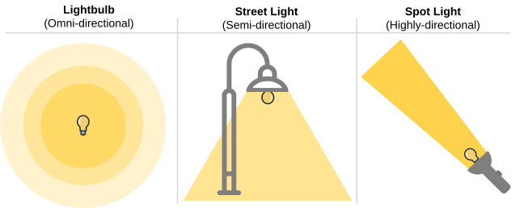
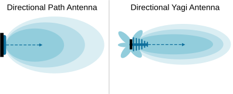
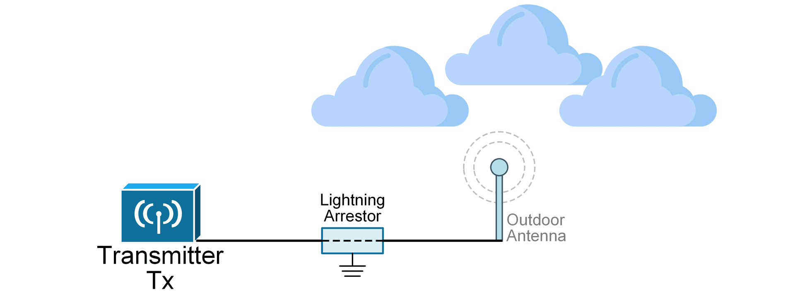

[Antenna Types](https://www.networkacademy.io/ccna/wireless/antenna-types)
==========

Every antenna has three key properties: **gain**, **direction**, and **polarization**. The three properties are closely related to each other. Gain measures how much the antenna focuses the signal power in a specific direction. Direction describes the shape of the signal’s coverage area. Polarization refers to the orientation of the electric field of the signal as it moves through space, which is related to how the antenna is positioned in relation to the horizon.

## Antenna types based on direction

Each antenna type has a different gain and direction. Higher-gain antennas usually reach farther, but only in a specific direction. Wireless antennas are classified according to the direction in which they radiate signals in 3D space. The three main types are:

- **Omni-Directional**** **- An omnidirectional antenna radiates RF signals uniformly in all directions, creating a 360-degree coverage pattern similar to a donut. It is commonly used in Wi-Fi access points to provide broad wireless coverage. Examples are dipole and ceiling-mounted AP antennas.
- **Semi-Directional**** **- A semi-directional antenna focuses RF signals in a specific direction (usually 30° to 180° beamwidth) while still covering a broad area, making it ideal for corridors, warehouses, and outdoor spaces. It provides better range and signal strength than an omnidirectional antenna but does not require precise alignment like a highly directional antenna. Examples are patch, panel, and Yagi antennas.
- **Highly Directional**** **- A highly directional antenna concentrates RF signals into a narrow beam (usually 5° to 20° beamwidth), allowing for long-distance communication with minimal interference. It is commonly used for point-to-point wireless links, such as connecting two buildings or establishing network backhaul connections. Examples are parabolic dish antennas and grid antennas.

For students who are just entering the field of wireless communications, it is easier to understand radiowaves and antenna types using analog with light and light sources. Let's make a few analogs that people are familiar with.

*Figure 1. Antenna Types compared to light.*

- An omnidirectional antenna is like **a bare lightbulb**, which radiates light evenly in all directions to illuminate an entire room.
- A semi-directional antenna is like **a street lamp**, which directs light mainly along a road while still covering a wide area.
- A highly directional antenna is like **a spotlight**, concentrating light into a narrow, intense beam to illuminate a specific target. It requires precise aiming to illuminate exactly the needed spot.

## Omnidirectional Antennas

An omnidirectional antenna is designed to provide 360-degree coverage similar to a bare lightbulb. It is typically shaped like a thin cylinder. It spreads the signal evenly in all directions around it but not along its length, creating a donut-shaped coverage pattern. This makes it ideal for broad coverage in a large room or across a floor when placed in the center. Since it distributes RF energy over a wide area, its gain is relatively low.

*Figure 2. Omnidirectional Antenna.*

Common types of omnidirectional antennas are the **monopole **and the **dipole**. Some dipole antennas can be adjusted by folding them up or down, while others are fixed in place. 

Omnidirectional antennas typically have a very low gain because their coverage area is evenly spread in all directions. Some small omnidirectional ones even have negative gains.

## Semi-Directional Antennas

Semi-directional antennas focus their RF signal in some general direction, as the name implies. They provide a balance between coverage distance and width. These antennas are great for connecting different areas of a building, covering long hallways, or linking nearby buildings. Common types include patch, panel and Yagi antennas, which send the signal forward while reducing coverage behind them.   
 

*Figure 3. Directional Antennas.*

The most common semi-directional antennas used in the enterprise wireless space are:

- **Patch Antennas** – These are flat, panel-like antennas that focus the signal in one direction. They are often used to cover specific areas, such as hallways, aisles, or sections of a warehouse.
- **Yagi Antennas** – These antennas provide more focused coverage than patch antennas and are used for connecting buildings or covering long outdoor spaces.
- **Sector Antennas** – These antennas cover a wide but focused area, usually in outdoor deployments like stadiums or large open spaces.

### Patch antenna

Patch antennas are flat, low-profile antennas. They are directional and radiate signals in a semi-directional pattern, **typically covering a 120-degree beamwidth**. The metal patch receives or transmits radio signals. When an electrical signal is applied, it creates an electromagnetic wave that radiates from the patch. The size and shape of the patch determine the frequency at which the antenna operates.

*Figure 4. Patch Antenna.*

These antennas are often mounted on walls or ceilings to focus RF energy in a specific direction, improving coverage and reducing interference. They are ideal for indoor and outdoor deployments, such as warehouses, stadiums, and point-to-point wireless links, where targeted signal distribution is needed.

### Yagi Antenna

A Yagi antenna is a type of directional antenna. Most people know the Yagi antenna from old television communication. It has a long metal rod called a boom, with several smaller rods attached to it. These rods help capture and focus signals in one direction, making the antenna more efficient.

*Figure 5. Yagi Antenna.*

Because it is directional, the Yagi antenna works best when pointed directly at the signal source. It is commonly used for television antennas, radio, and Wi-Fi signal boosting. It provides a strong and clear reception over long distances but must be carefully positioned for the best performance.

## Highly directional antennas

Highly directional antennas focus RF energy into **a narrow, concentrated beam**, allowing for long-distance wireless communication with minimal interference. These antennas, such as parabolic dish and horn antennas, are commonly used in **point-to-point links and backhaul connections**.

*Figure 6. Highly directional antenna.*

Their narrow beamwidth (typically under 10 degrees) provides high gain, improving signal strength and reducing signal loss over long distances. However, they require precise alignment to ensure effective communication between endpoints. For example, the point-to-point links between buildings inside the city used high directional antennas, as shown in the diagram below.

*Figure 7. A backhaul wireless link.*

They typically have a very high gain, ranging from 9dBi to 30dBi. Parabolic dish antennas offer the highest gain, typically between 20 dBi and 30 dBi, making them ideal for long-distance point-to-point links.

### Dish Antenna

When you say to a random person: "*Imagine an antenna."* He imagines a dish antenna. It is the most famous antenna type. It has a round, bowl-shaped structure that focuses signals on a single point. This shape is called a "parabolic reflector," making the antenna very powerful in capturing weak signals from far distances.

*Figure 8. Dish Antenna.*

The main parts of a dish antenna include the dish itself and a small receiver or transmitter placed at its focus point. When signals from a satellite or other sources hit the dish, they bounce off and get concentrated on the receiver. This improves signal strength and quality.

Dish antennas are commonly used in satellite television, radio telescopes, and radar systems. They work best when properly aligned with the signal source, such as a satellite in space. Weather conditions like heavy rain or storms can sometimes affect their performance, but overall, they are very effective for long-distance communication.

## Antenna Accessories

If you connect a transmitter or receiver to an outdoor antenna, **lightning can hit the antenna**, sending a large surge of energy. This surge can damage wireless LAN equipment, or worse, it can start a fire inside the building. To prevent this, always install a lightning arrestor between the outdoor antenna and the wireless LAN device, as shown in the diagram below.

*Figure 9. Antenna Lightning Arrestor (animated).*

A lightning arrestor has two connectors for coaxial cables and a grounding lug that should be attached to the nearest building or electrical ground. It allows the RF signal to pass through while directing sudden electricity spikes safely to the ground. However, it cannot stop damage from a direct lightning strike. It can, however, protect against static electricity discharges and voltage spikes during thunderstorms, as shown in the diagram above.

Understanding different types of antennas is crucial for a wireless engineer because **antennas directly impact signal coverage, performance, and network reliability**. The right antenna selection ensures optimal RF propagation, minimizes interference, and maximizes efficiency in various environments. Engineers must know when to use omnidirectional, semi-directional, or highly directional antennas to meet specific design needs, such as indoor Wi-Fi, outdoor point-to-point links, or high-density deployments. Proper antenna selection improves signal strength, reduces dead zones, and enhances overall wireless network performance.

## Book traversal links for 8

