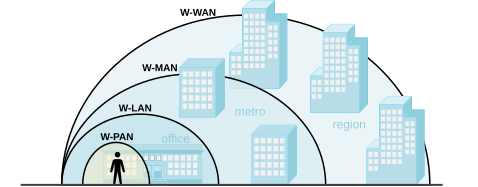
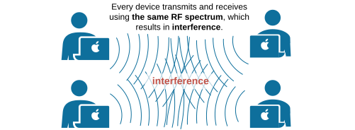
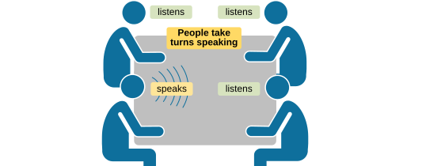
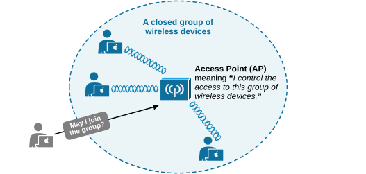
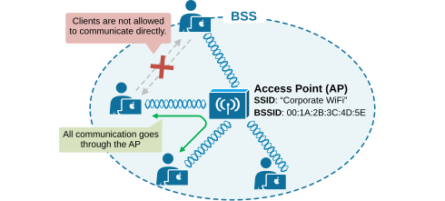
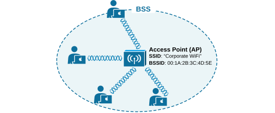
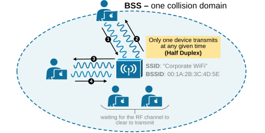

[Understanding Wireless LANs](https://www.networkacademy.io/ccna/wireless/understanding-wireless-lans)
==========

This lesson will clarify some concepts essential to understanding wireless LANs (WLAN). We will discuss how clients join a WLAN, communicate, exchange data, and share the medium (free space).

## The types of Wireless networks

There is a common misconception among some people (even engineers) that all wireless networks are Wi-Fi. In reality, **Wi-Fi is just one type of wireless network**. Technologies like Bluetooth, ZigBee, WiMAX, LTE, and 5G are other types, each using RF signals but differing in their specifications and uses. Wi-Fi, specifically, refers to the wireless protocols defined by the IEEE in the 802.11 specification.

Wireless networks are categorized into four main types based on **the geographic area they cover.** The following figure visualizes the different network types and their coverage areas:

*Figure 1. Types of Wireless Networks.*

The following table briefly describes each wireless network type according to the diagram above.

Table 1. Types of Wireless networks.
| **Name** | **IEEE Standard** | **Description** 
| **WPAN** (Wireless Personal-Area Network) | 802.15.1 | These are personal wireless networks that use very low-power transmitters for short-range connections. Common example is **Bluetooth **that people use to connect their earbuds, keyboards and mice. Typically within the range of a few meters. 
| **WLAN** (Wireless Local-Area Network) | 802.11 | The typical wireless network everybody knows - at home, in the office and at the local cafe. It is referred to as **Wi-Fi**. This is the type of wireless network that we are going to discuss throughout this course. Wi-Fi networks connect multiple devices over a medium range, usually up to 100 meters. They use the IEEE 802.11 standard and operate on unlicensed frequencies 2.4Ghz, 5Ghz and 6GHz.  
| **WMAN** (Wireless Metropolitan-Area Network) | 802.16 | These networks provide wireless service over a large area, such as part of a city. **WiMAX **is a common example, based on the IEEE 802.16 standard. They become less common these days because of the rapid adoption of LTE and 5G. 
| **WWAN** (Wireless Wide-Area Network) | LTE/5G | These networks offer wireless data services over very large areas, including regional, national, or even global coverage. They are provided by telecommunications carriers and mobile phone operators. 

In this course, when we use the term "*wireless*," we specifically refer to Wireless Local Area Networks (WLANs) based on the IEEE 802.11 standard. These are the Wi-Fi networks we encounter daily in homes, offices, cafes, and public spaces. While other technologies exist, we will focus on WLANs, their operation, components, and best practices for designing and troubleshooting them.

## The Wireless LAN

A wireless local area network (WLAN) can consist of only one device or connect thousands of devices. The most basic form of WLAN is an ad hoc network.

### AdHoc (peer-to-peer)

Ad-hoc is a type of wireless LAN where devices communicate directly with each other **without relying on a central access point (AP)** or a wireless router. These networks are typically used for temporary connections and are created on the fly, often called "peer-to-peer" networks, as shown in the diagram below.

*Figure 2. Ad-Hoc connection.*

In an ad hoc network, each node functions as both a client and a router. This setup is useful when wireless infrastructure is unavailable or impractical, such as in spontaneous gatherings outside.

Ad-hoc networks offer flexibility and ease of deployment, but they may face challenges such as limited range, lower data rates, and potential security vulnerabilities compared to traditional infrastructure-based WLANs.

Additionally, **ad-hoc networks don't scale to connecting multiple devices**. The reason is that if multiple signals are received at the same time, they interfere with each other, and this interference becomes more likely as more wireless devices are added. For example, the following diagram shows four devices on the same channel and what might happen if some or all of them transmit simultaneously.

*Figure 3. Multiple p2p connections resulting in interference.*

If you think about it, this is the same effect that happens in an Ethernet LAN that is a single collision domain. Recall that all devices connected to a hub are in the same collision domain. To use the media effectively, all hosts must operate in half-duplex mode, which means they can't send and receive data at the same time.

*Figure 4. A hub connecting four hosts.*

A refresher - a hub is a basic network device that operates at Layer 1 (Physical Layer) of the OSI model. It simply repeats incoming signals to all connected devices without any intelligence. Since all devices share the same collision domain, only one can transmit at a time. If two or more devices transmit simultaneously, a collision occurs.

To understand the concept, imagine four people trying to have a conversation. If everyone talks at the same time, it's complete chaos—nobody can understand what’s being said. This is similar to interference in a Wi-Fi network. When multiple devices transmit at the same time on the same frequency, their signals collide, making communication impossible.

*Figure 5. Talk interference.*

Now, imagine how people communicate in reality. One person talks while everyone else listens. When that person finishes, someone else speaks. This way, everyone gets a chance to hear and understand the message, as shown in the diagram below. This is how half-duplex communication works in wireless networks. A Wi-Fi device can either send or receive data at any given moment, but not both at the same time. It must wait for its turn, just like in a conversation.

*Figure 6. People take turns speaking.*

If multiple people try to speak at the same time despite the turn-taking rule, they will either have to repeat themselves or wait for a clear moment to talk. In Wi-Fi, this is managed **by collision avoidance mechanisms**, which help devices sense if the channel is clear before transmitting. So, just like in a conversation where people take turns speaking to avoid confusion, wireless devices must take turns transmitting data to avoid interference and ensure clear communication. We will talk more about this process later on in the course.

**KEY POINT:** In a wireless LAN, all devices share the same wireless medium—free space—much like people competing for airtime in a conversation. To prevent collisions, only one device can transmit data at a time. Hence, wi-fi communication is half-duplex.

### From peer-to-peer to WLAN

Now, knowing that all Wi-Fi clients share the same medium (free space), consider the security and privacy aspects of the communication. With peer-to-peer connections, no one can stop a rogue device from transmitting wherever it wants, causing collisions. However, at the very least, a wireless network must ensure that all devices on a channel follow the same basic settings, such as data rates, modulation types, and channel width. Additionally, measures should be taken to control which devices and users can access the network and how wireless transmissions are secured.

People realized that the solution was to create closed, controlled groups of wireless devices. A central device called an access point (AP) manages access to the group and the settings of all devices, as shown in the diagram below.

*Figure 7. A closed wireless group - BSS.*

Before joining the group, a device must announce its capabilities and receive permission from the centralized access point (AP). In the 802.11 standard, this type of network is called **a Basic Service Set (BSS)**. As shown in the diagram above, a wireless access point (AP) is at the core of every BSS.

What is BSS?
BSS (Basic Service Set) is the fundamental building block of a Wi-Fi network. It refers to a group of wireless devices that communicate with each other through a single Access Point (AP), as shown in the diagram below.

*Figure 8. Communication inside a BSS.*

Inside a BSS, all devices (clients) communicate through the AP, which ensures data is transmitted properly using the same frequency spectrum, modulation, channel, and so on. Each BSS is identified by a unique BSSID (Basic Service Set Identifier), which is typically the MAC address of the AP’s radio interface.

The Basic Service Area (BSA)
Since the AP is the hearth of a BSS, the BSS's network coverage is limited to the area where the AP’s signal is available. This area is called **a cell **or **the Basic Service Area (BSA)**. The diagram below represents the cell as a circular area. The coverage shape depends on the AP's antenna type. The cell area can be circular if the AP uses an omnidirectional antenna. However, there are APs with different antenna types, which change the shape of the coverage area.

*Figure 9. Basic Service Set (BSS).*

The AP is the primary contact point for all devices trying to join the network. It broadcasts the presence of the BSS so that devices can discover it and attempt to connect. The AP identifies itself using **a Basic Service Set Identifier (BSSID)** based on its radio MAC address. The AP also advertises **a Service Set Identifier (SSID)**, a human-readable name for the wireless network.

Think of the BSSID as a unique machine-readable identifier for the AP, while the SSID is a user-friendly name that helps people recognize the network.

Device Association
Before joining the BSS, a device must request permission from the AP, a process called *association*. Once accepted, the device becomes a client, also known as *an 802.11 station* (STA). After associating, most of the client’s communication must go through the AP. Data frames are sent or received using the BSSID as the source or destination address.

Communication inside the BSS
All communication between devices inside a Basic Service Set (BSS) must go through the Access Point (AP). The AP acts as the central hub that controls and manages all traffic. When a device wants to send data to another device in the same BSS, it first sends the data to the AP, as shown in the diagram below. The AP then forwards the data to the receiving device. 

*Figure 10. BSS as a collision domain*

You might wonder why two clients in the same BSS cannot just communicate directly. The reason is that routing all traffic through the AP helps maintain order and stability within the network. If clients were to bypass the AP, managing the BSS would become impossible.

Even though data is sent through the AP, any device in the same area tuned to the same channel can still receive the transmissions. Wireless frames are broadcasted openly, so anyone within range can read their contents if they are not encrypted. The only thing identifying the intended sender or receiver is the BSSID inside the frame.

### Full Content Access is for Subscribed Users Only...

- **Learn any CCNA, CCIE or Network Automation topic** with animated explanation.
- **We focus on simplicity.** Networking tutorials and examples written in simple, understandable language.

Sign up for free ►
