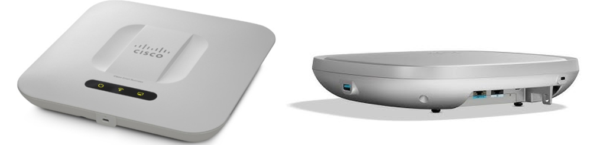
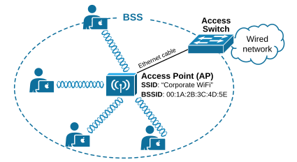
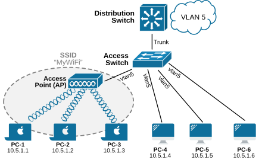
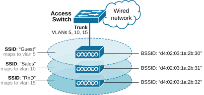
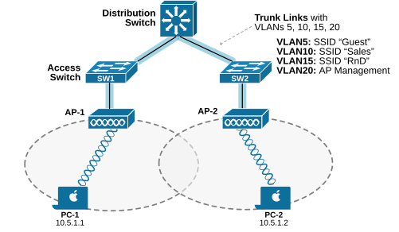
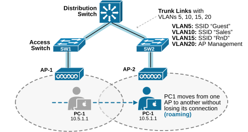
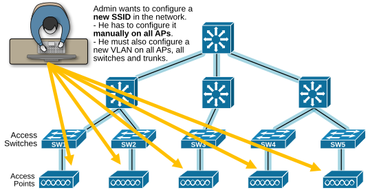
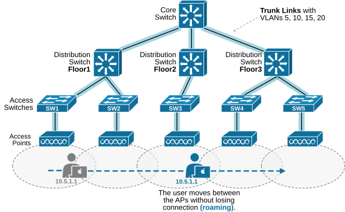

[Autonomous AP architecture](https://www.networkacademy.io/ccna/wireless/autonomous-ap-architecture)
==========

Cisco Wireless Access Points (called WAP or AP for short) can be used in one of two modes of operation:


- Autonomous AP mode
- Lightweight AP mode (called LAP)

Based on the size of the enterprise infrastructure and the operational mode of the access points (APs), the wireless network can be designed using three different architecture models:


- Autonomous AP Architecture
- Lightweight AP Architecture
- Cloud-based Architecture

Each architecture has its advantages and is chosen based on factors like network size, management needs, and budget. In this lesson, we will go through the autonomous AP mode and the underlying wireless architecture.


## What is an Access Point (AP)?


Let's start with the very basic question - What is an access point (AP)? An access point is a hardware device that creates a wireless network (SSID) and bridges wireless data to the wired network (VLAN). The following image shows a screenshot of a model of Cisco 500 Series Wireless Access Points.




*Figure 1. Cisco Wireless Access Point (AP).*


The access point (AP) allows wireless clients to connect to a wired network using radio signals, just as if they were connected via cables to the switched network. In other words, the AP provides and controls mobile clients' access to the wireless network (hence the name "access point").


The wireless network that AP creates is called **a Basic Service Set (BSS)**. It consists of an access point (AP) and the wireless devices connected to it, as shown in the diagram below. 




*Figure 2. An AP creating a wireless network.*


Each BSS operates within a specific coverage area (the dashed line) and is identified by a unique BSSID, usually the AP's MAC address. In a typical corporate network, multiple BSSs can be linked together to form a larger wireless network. This is called **an Extended Service Set (ESS)**. It consists of multiple BSSs connected through a common wired network. Each BSS has its own access point (AP), but all APs share the same Service Set Identifier (SSID), allowing seamless roaming for wireless devices.


## Autonomous AP mode


An Autonomous Access Point (AP) works as **a standalone device** that provides a fully functional wireless network (BSS). It basically extends the switched network via a wireless signal to mobile devices. It maps a wireless network (SSID) to a wired network (VLAN) at the access layer as shown in the diagram below.




*Figure 3. Autonomous AP design.*


Let's look at the diagram above, for example. The clients PC 1, 2, and 3 connect to the wireless SSID "*MyWiFI*", while the clients PC 4, 5, and 6 connect via cables to the access switch. However, from an IP connectivity point of view, all six hosts are in Vlan 5 and have IP addresses from the same subnet, 10.5.1.0/24. They can ping each other and can reach every other address in Vlan 5. From the local router point of view, they are all in the same Vlan/Subnet, as shown in the diagram below.


*Figure 4. Vlan-5 Routing view.*


In this context, the access point (AP) simply **maps SSID "MyWiFi" to Vlan 5** and allows hosts to connect to that subnet wirelessly. 


Additionally, an autonomous AP can broadcast and support multiple logical wireless networks - multiple SSIDs. Each SSID can then be mapped to a different VLAN, allowing different groups of users to connect to different segments of the wired network. The following diagram shows an AP that supports three SSIDs that map to different VLANs. If a client connects to SSID Guest, for example, it connects to an extension of the switched vlan 5.




*Figure 5. Multiple SSIDs on a single AP.*


Notice that for this setup to work, the VLANs must be trunked from the access switches to the AP. Pay attention to a common misunderstanding: having multiple SSIDs can create a false sense of scalability. Even if clients are spread across different SSIDs, they still rely on the same AP’s hardware and compete for airtime on the same channel. This approach is used for** logical segmentation of users**, not for scale.


## Аutonomous AP Architecture


We can build a sizeable wireless solution using access points working in autonomous mode. Let's take the following diagram, for example. We have two APs connected to two different access switches, which are interconnected through a distribution switch. Both APs broadcast and support the same SSIDs as shown on the right side of the diagram.




*Figure 6. Multiple Autonomous APs.*


Let's say that PC-1 connects to SSID "Guest" via AP-1, while PC-2 connects to the same SSID via AP-2. From an IP connectivity point of view, both hosts are connected to the same Vlan/Subnet. They can reach each other as though they are connected to two access switches in the same vlan.


### Client mobility (Roaming)


One of the primary advantages of using wireless communication instead of wired one is that clients can move around while staying connected. This capability is called **roaming**. Nowadays, people are so used to this capability they don't even think about it. However, roaming imposes some network requirements for working.  




*Figure 7. Roaming.*


When a client moves to a new access point (AP-2), the network must handle the transition. One important detail is the client’s IP address. Before roaming, PC-1 is connected to AP-1 and gets an IP address from VLAN5. In the diagram above, the SSID "Guest" is mapped to VLAN 5, so the client receives an IP from the 10.5.1.0/24 subnet.


When the client moves to AP-2, the SSID "Guest" is still mapped to VLAN 5 and the same subnet 10.5.1.0/24. Since the client remains on the same VLAN and subnet, it keeps the same IP address, and the transition happens very quickly, usually in less than 20ms. However, notice that this type of roaming requires that the VLAN mapped to the SSID must be trunked between the switches to ensure that the client stays on the same VLAN and can keep the same IP address.


### Inefficiencies of the Autonomous AP architecture


Like every other network design, the autonomous AP architecture has pros and cons. Let's review the inefficiencies first and then see when it is appropriate to be used.

No centralized management
Each autonomous AP is a standalone device. It has a management IP address for remote configuration. This allows you to configure parameters such as SSIDs, VLANs and wireless settings such as channel selection and transmit power. The management IP is usually separate from the data VLANs, so a dedicated management VLAN (VLAN 20 in our example above) is included in the trunk link to reach the AP. Since each AP operates independently, they must be configured one by one unless you use automation or a centralized management solution like the Cisco DNA Center.




*Figure 8. Manual Configuration.*


Imagine if an enterprise has hundreds of access points. Managing many autonomous APs can become a cumbersome and complex manual process. If the network administrator wants to configure a new SSID in the network - he has to configure it manually on all APs and then configure the corresponding VLAN (and its IP subnet) on all switches and trunks along the wired network.

Roaming at scale
The client mobility capability in the autonomous AP architecture requires layer 2 connectivity between all access points because a roaming client must remain on the same VLAN and subnet to keep the same IP address. The following diagram visualizes this requirement.




*Figure 9. Roaming at scale.*


Having the same VLAN stretched to all access points is **a big scaling limitation**. Most modern networks do not stretch layer 2 between different compartments of the network. For example, most modern designs use layer 3 routing between the distribution and the network's core. Additionally, what if you want to have the same SSID across multiple floors of an office building or even across multiple office buildings? You cannot simply stretch layer 2 across floors and buildings to allow the same SSID and provide roaming capability.

### Advantages of Autonomous AP Architecture

**Simple and self-contained:**
Each AP operates independently with all configuration stored locally. No external controller or management platform is required.

**Lower initial cost:**
Autonomous APs are generally less expensive than lightweight APs because there is no controller hardware to purchase.

**Well-suited for small deployments:**
For home networks, small offices, or branch offices with a handful of APs, autonomous mode is straightforward and cost-effective.

**No single point of failure:**
Since each AP operates independently, the failure of one AP does not affect others (no controller dependency).

### Disadvantages of Autonomous AP Architecture

**No centralized management:**
Configuration must be done on each AP individually. There is no single dashboard to push config changes, firmware updates, or security policies.

**Scaling challenges:**
As the number of APs grows, management becomes increasingly complex and error-prone.

**Layer 2 roaming limitation:**
Seamless roaming requires stretched VLANs (same subnet) across all APs, which violates modern network design best practices (layer 3 at the distribution layer).

**Limited visibility and troubleshooting:**
Without a centralized controller, monitoring RF conditions, client connections, and network health requires logging into each AP individually.

**No dynamic RF optimization:**
Autonomous APs cannot automatically adjust channel selection, transmit power, or other RF parameters based on real-time conditions.

### When to use Autonomous APs

| Use Case | Description |
|----------|-------------|
| **Home / SOHO** | Single AP or a few APs in a small office/home office environment |
| **Small retail / café** | One or two APs providing guest Wi-Fi |
| **Temporary deployments** | Pop-up offices, events, or construction sites where a controller is impractical |
| **Remote / branch offices** | Very small sites where deploying a WLC (Wireless LAN Controller) is not cost-effective |
| **Budget-constrained projects** | When minimizing hardware cost is the primary concern |

### How autonomous APs handle traffic

Traffic flow in an autonomous AP architecture:

1. A wireless client sends data to the AP.
2. The AP bridges the wireless frame to the wired Ethernet port.
3. The AP applies any configured QoS or security policies locally.
4. The frame is forwarded onto the wired VLAN that the AP port belongs to.
5. The wired network (switches/routers) handles the traffic normally.

The AP essentially functions as a **wireless-to-Ethernet bridge**, converting 802.11 frames to 802.3 Ethernet frames and vice versa.

### Configuration example

A typical autonomous AP configuration involves:

```plaintext
AP(config)# interface Dot11Radio0
AP(config-if)# ssid MyCorpNet
AP(config-if)# !
AP(config-if)# interface GigabitEthernet0
AP(config-if)# switchport access vlan 10
AP(config-if)# !
AP(config)# ssid MyCorpNet
AP(config-ssid)# authentication open
AP(config-ssid)# authentication key-management wpa
AP(config-ssid)# mbssid
AP(config-ssid)# !
AP(config)# interface Dot11Radio0
AP(config-if)# station-role root
AP(config-if)# ssid MyCorpNet
```

Each AP is configured independently with its own SSID, security settings, VLAN assignment, and RF parameters.

### Summary

- **Autonomous APs** operate independently with all configuration stored locally. They do not require a wireless controller.
- The **autonomous AP architecture** is best suited for small-scale deployments with a limited number of APs.
- **Advantages**: Simple, low cost, no single point of failure.
- **Disadvantages**: No centralized management, manual configuration per AP, layer 2 roaming limitation, poor scalability.
- The AP functions as a **wireless-to-Ethernet bridge**, converting between 802.11 and 802.3 frames.
- For larger enterprise deployments, lightweight AP architecture (with a WLC) is the preferred approach.
