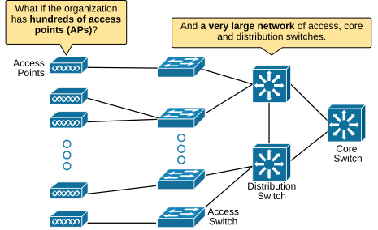
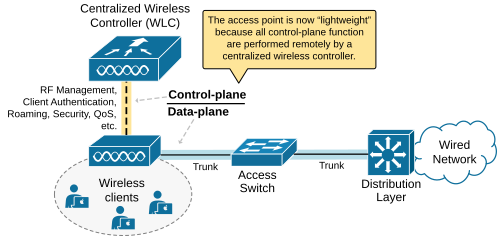
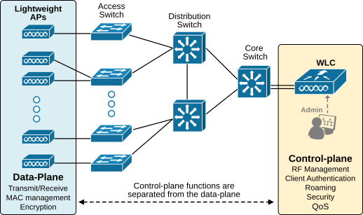
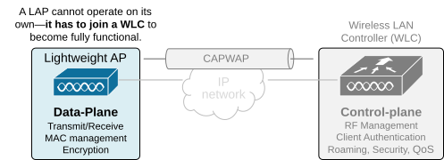
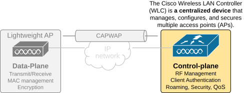
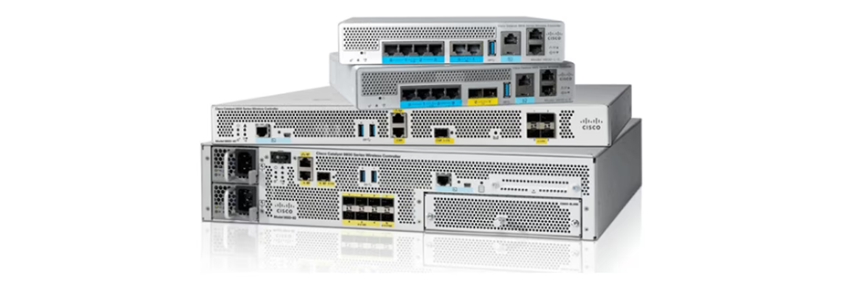
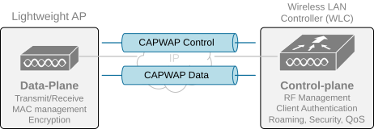
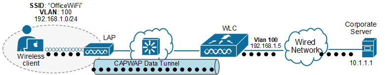

[Lightweight AP architecture](https://www.networkacademy.io/ccna/wireless/lightweight-ap-architecture)
==========

In this lesson, we will explore how lightweight APs operate, the role of the wireless controller (WLC), how CAPWAP tunnels function, and how client traffic flows through the network. Understanding this architecture is essential for understanding modern enterprise wireless networks.

## Why do we need a Lightweight AP?

In the previous lesson, we saw that an autonomous AP is managed as a standalone device. This means that every parameter is configured manually directly on the device. However, each AP has a wide range of configuration parameters: SSIDs, VLANs, IP addresses, Security mode, Encryption types, Channel settings, Transmit Power settings, QoS policies, ACLs, Failover settings, etc. It is obvious that in a large-scale network, manually setting up everything AP-per-AP is inefficient. What if an organization has hundreds of access points, as shown in the diagram below?

*Figure 1. Inefficiencies of Autonomous APs.*

Configuring a new SSID in the networks **will require hours of reconfiguration** by the network team, and the process will be prone to many errors. Additionally, it is difficult to collect information such as RF interference, channel usage, the number of devices, coverage, and so on. From a security point of view, it is hard to detect rouge APs and manage clients' authentication processes.

The industry has realized that in order to scale the wireless network, they must move away from the decentralized configuration model (manually configuring AP per AP) and move to a centralized model where all access points are managed and operated **from a centralized point in the network**. That's how lightweight access points were born.

## Separating Control and Data Planes

To address the scaling limitations of the autonomous AP architecture, the industry realized that they must separate the control-plane functions of the autonomous APs into a centralized management controller, as shown in the diagram below.

*Figure 2. Separating control and data planes of an autonomous AP.*

All control-plane functions are separated into a centralized wireless controller called WLC. It pushes the AP firmware and configuration and handles security policies, client authentication, RF management, and transmit power—making the access point fully dependent on it.

The access point is responsible for Layer 1 and Layer 2 tasks, moving 802.11 frames in and out of the radio frequency environment and sending beacons and probe requests. Because of this, the AP is now called "lightweight." It has minimal local intelligence compared to an autonomous AP.

This separation of functionalities allows for several significant scaling improvements. First, instead of configuring each AP individually, the WLC allows network administrators **to manage all lightweight APs from a single node**, as shown in the diagram below. This is a massive improvement in large-scale environments with hundreds of access points. Now, if an admin wants to configure a new SSID, it doesn't have to configure hundreds of APs manually one by one. 

*Figure 3. Centralized Lightweight AP architecture.*

Another big improvement is the **ease of deployment**. Any new lightweight AP automatically connects to the WLC (we will see how later on), downloads configurations, and starts operating without manual setup. This makes large-scale deployments much faster and more efficient.

Last but not least, the controller enforces security policies, including authentication, encryption, and rogue AP detection, ensuring consistent security across the entire wireless network.

KEY NOTE: This separation of functionalities between the "lightweight" access points (LAP) and wireless controller (WLC) is also known as **a Split-MAC architecture**. 

It is called the Split-MAC architecture because some of the Media Access Control (MAC) layer functionalities stay with the LAP while the controller performs others. The LAP handles real-time tasks related to wireless communication, such as beacons, probes, transmission, reception, fragmentation, and encryption of frames. These tasks must stay on the AP because they involve direct interaction with clients.

On the other hand, management tasks that do not require real-time handling of wireless frames can be managed centrally. These tasks are moved to the WLC, which controls multiple LAPs from a central location. The table below summarizes the MAC functions handled by the AP and WLC:

Table 1. The "split-mac" functionalities.
| **LAP MAC functions** | **WLC MAC functions** 
| Sending wireless beacons and responding to probe requests | Handling client authentication 
| Frames acknowledgments and retransmissions | Managing client association and roaming 
| Managing frame fragmentation, queueing and prioritization | Translating wireless frames to other network protocols 
| Encrypting and decrypting wireless data | Terminating wireless traffic on a wired network 

Now, let's zoom into each component of the lightweight AP architecture and see how it fits the big picture.

### Introducing the Lightweight AP (LAP)

A lightweight AP is designed **to work with a wireless controller (WLC) **rather than operate independently. It handles real-time tasks like 802.11 frame transmission and encryption. It only has a data plane, as shown in the diagram below. The control plane is separated into a remote centralized controller.

*Figure 4. What is a Lightweight AP (LAP)?*

Because they are "lightweight," LAPs rely entirely on a WLC for configuration and firmware management. They are deployed with a "zero-touch" approach, meaning they don’t require individual setup. LAPs focus only on real-time MAC functions, while all non-real-time MAC processes are offloaded to the WLC. This design is known as the "split MAC" architecture.

KEY NOTE: It is important to remember that **a lightweight AP cannot operate on its own**. It works exclusively with a wireless controller (WLC). This is because the WLC supplies all the necessary configuration settings and firmware during the LAP's registration process (which we will discuss in one of the next lessons).

Some people wonder whether AP and LAP are the same hardware devices. The answer is that they are often the same hardware devices but run different firmware depending on their mode of operation. The autonomous AP comes with fully functional firmware that has all control capabilities. On the other hand, a lightweight AP has minimal firmware that allows the AP to boot up, obtain an IP address, and communicate with a WLC to download the latest controller-based firmware. 

Additionally, APs and LAPs have different part numbers so that people can differentiate between the two during the ordering process.

### Introducing the Wireless LAN Controller (WLC)

The Wireless LAN controller (called WLC for short) is **a separate physical appliance** that manages all lightweight access points (LAP) in a centralized manner. It is typically deployed in the organization's data center or regional hub. It provides a single-pane-of-glass interface for configuring and operating everything related to the organization's wireless network.

*Figure 5. Introducing the WLC.*

Cisco has a portfolio of several different WLC models that can be used depending on the size of the wireless network. The latest generation of controllers (shown in the image below) are the Catalyst 9800 Series controllers that run on IOS XE. They replace the older AireOS-based models that are being phased out.

The new Cisco Catalyst 9800 Series controllers also have a virtual appliance for cloud deployments. It is available on the big cloud's marketplaces.

*Figure 6. Cisco Wireless Controllers (WLC).*

The Wireless LAN Controller (WLC) solves many of the scaling problems seen in the traditional autonomous WLAN architecture. The most significant improvements are as follows:

- **Automatic Channel Selection** – The WLC picks the best RF channel for each LAP based on nearby access points.
- **Transmit Power Control** – The controller adjusts each LAP’s transmit power to provide the right coverage.
- **Self-Healing Coverage** – If a LAP fails, the controller increases the power of nearby LAPs to cover the gap.
- **Fast Client Roaming** – Clients can move between LAPs smoothly, even across Layer 2 and Layer 3 networks.
- **Load Balancing** – It distributes clients among LAPs to avoid overloading one access point.
- **RF Monitoring** – It listens to different channels to detect interference, noise, rogue APs, and other signals.
- **Security Management** – It verifies client authentication and ensures they get an IP from a trusted DHCP server.
- **Intrusion Protection **– It scans client traffic to detect and prevent security threats.

This centralized wireless control makes the wireless network more scalable, efficient, and secure. Let's now zoom into the connectivity between access points and the WLC.

### Introducing CAPWAP

The centralized wireless architecture divides tasks between the Lightweight Access Point (LAP) and the Wireless LAN Controller (WLC). Each LAP must connect to a WLC to function and serve wireless clients. The WLC manages multiple LAPs across the network. But how does a LAP connect to the controller? Do they need to be on the same network? Do they need to have layer 2 connectivity in between (all VLANs spanned to the controller)? 

The answer is that the wireless controller can be anywhere on the organization's network, even in the public cloud. The only requirement is that the LAPs must have IP connectivity to the WLC. That's it.

To connect to the controller, the lightweight access points use a tunneling protocol called "**the Control and Provisioning of Wireless Access Points (CAPWAP) protocol**." It makes this connection possible by encapsulating data into new IP/UDP packets, allowing the communication between the LAPs and the WLC to be routed across the network.

*Figure 7. CAPWAP Tunnels.*

Since control and data planes are separated, CAPWAP creates not one but two tunnels as follows:

- **Control Tunnel (UDP 5246):** Used for configuring and managing the LAP. These messages are encrypted to ensure secure communication.
- **Data Tunnel (UDP 5247):** Used to transmit client data. By default, data is not encrypted, but encryption can be enabled using Datagram Transport Layer Security (DTLS).

Each LAP and WLC must authenticate using digital certificates. Every device comes with a preinstalled X.509 certificate. This ensures only authorized access points join the network and prevents the addition of rogue APs.

## Traffic Patterns with CAPWAP

Now, let's see how the CAPWAP tunnel changes the data traffic of the access point. Recall that autonomous access points directly bridge wireless clients's traffic to a wired VLAN at the upstream access switch. However, with the split-MAC architecture, the traffic pattern changes, as shown in the diagram below.

*Figure 8. CAPWAP Traffic Pattern.*

Unlike autonomous APs, **a lightweight AP sends the client's traffic to the WLC** by default**.** The controller is responsible for bridging the client's traffic into the wired network, as shown above. Let's zoom into that process in more detail.

### Full Content Access is for Subscribed Users Only...

- **Learn any CCNA, CCIE or Network Automation topic** with animated explanation.
- **We focus on simplicity.** Networking tutorials and examples written in simple, understandable language.

Sign up for free ►
