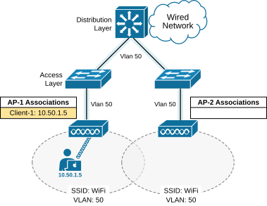
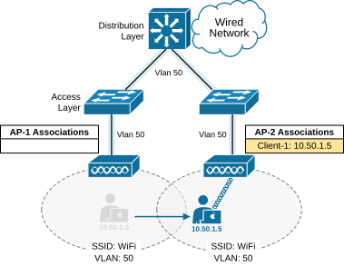
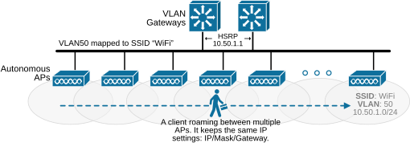
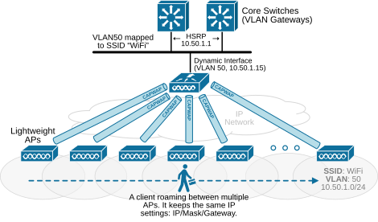

[Understanding Client Roaming](https://www.networkacademy.io/ccna/wireless/understanding-client-roaming)
==========

Wireless devices are designed to be mobile. They will naturally move from place to place. This lesson explains how mobility works from the perspective of access points (APs) and controllers (WLCs). Configuring roaming is simple, but the process behind it can be complex. The complexity depends on the number of APs and controllers in the network. Let's start with the most simple use cases and walk through the different scenarios.

## Roaming in the Autonomous AP architecture

First, recall what a Basic Service Set (BSS) is. It is the fundamental building block of a Wi-Fi network. It consists of the following components, as shown in the diagram below:

- **An Access Point (AP)** – Acts as the central hub.
- **A Unique BSSID** (Basic Service Set Identifier) – The MAC address of the AP’s radio interface, which identifies the BSS.
- **Wireless Clients** – Devices like laptops, phones, or tablets that connect to the AP.

When a wireless client moves around, it can switch from one BSS to another by roaming between access points (APs).

*Figure 1. A Basic Service Set (BSS).*

The first fundamental part of the roaming process is that a client constantly checks its signal quality. If the signal weakens, the client looks for a stronger one from a neighboring access point. How does the client know if there are other APs in the coverage area? The client passively listens for beacons and also actively sends probes to discover any available APs. If the client finds an AP with a stronger signal, it tries to re-associate with that access point. 

Let's look at a real example. The following diagram shows a simple topology with two access points and one wireless client. The client is associated with SSID "WiFi" via AP-1. The SSID maps to Vlan 50 upstream in the switched network. Since the access points operate in autonomous mode, each keeps a list of its connected clients. AP-1 currently has one client, while AP-2 has none.

*Figure 2. Client 1 moves between APs.*

Now, let's see what happens when the client moves from AP-1 toward AP-2’s coverage area. At some point, **it detects a weaker signal from AP-1 and decides to switch to AP-2**. The following diagram shows the updated scenario. Both APs adjust their client lists to reflect the change. If AP-1 still has data for the client, it forwards it to AP-2 over the wired network.

*Figure 3. Client 1 re-associates with another AP.*

Notice something important - when moving around, the client decides when to roam based on its roaming algorithm. Some people wrongly assume that the access point decides to transfer the client to another AP. This is not the case. It is a decision of the mobile client - phone, tablet, laptop, etc.

Additionally, keep in mind that roaming as a capability is vendor-agnostic. However, **each client's decision about when to roam is vendor-specific**. It is the *secret sauce* that makes the user experience during the roaming process and differentiates some vendors from others. Some vendors use the RSSI threshold as a trigger for roaming. Some compare the signal-to-noise (SNR) ratio. Some use packet loss and retransmissions to indicate that the client has to roam. Some use a combination of all, including roaming assistance from the AP.

Roaming is not limited to two access points. In larger wireless networks, many autonomous APs can overlap to provide a continuous coverage area where clients can move around while staying connected. The following diagram shows how a client moves through multiple different APs.

*Figure 4. Roaming between Autonomous APs.*

Notice that with the autonomous AP architecture, the VLAN that is mapped to the SSID that the client is associated with must be spanned to all APs to enable roaming. In practice, even though the clients connect to different access points, from a wired network's point of view, it stays connected to the same VLAN with the same IP settings. 

However, this design presents a scaling limitation because all large-scale networks do not span VLANs across different network compartments across many switches. Modern network design** keeps the layer 2 domains smal**l. That's why large-scale networks use the split-MAC wireless architecture.

## Roaming in the Split-MAC architecture

With the Split-MAC architecture, lightweight APs connect to a wireless controller using CAPWAP tunnels. Roaming works much like in autonomous APs—clients still need to reassociate with a new AP when moving. The key difference is that **the controller manages roaming** due to the split-MAC architecture. 

Let's first look at the overview high-level diagram below so that you can compare it with the autonomous architecture above. Then, we can zoom in on more details.

*Figure 5. Roaming between lightweight APs.*

From the client's perspective, the roaming process is the same regardless of the wireless architecture. When the client detects that the Wi-Fi signals weaken, it initiates roaming based on its algorithm.

The following diagram shows a simple setup with three lightweight APs linked to a single controller. Client-1 is connected to AP-1, which has a CAPWAP data tunnel to the wireless controller (WLC). The controller keeps a database with details about each client, including AP associations and SSID information. Notice the first big improvement, compared to the autonomous AP architecture - the VLAN (VLAN 50) that maps to the SSID ("WiFi") does not have to be spanned to all lightweight access points in the network to enable roaming. This is a significant improvement from a scalability point of view.

### Full Content Access is for Subscribed Users Only...

- **Learn any CCNA, CCIE or Network Automation topic** with animated explanation.
- **We focus on simplicity.** Networking tutorials and examples written in simple, understandable language.

Sign up for free ►
