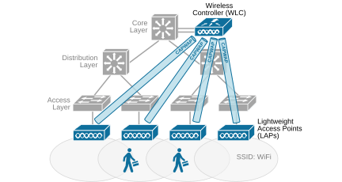
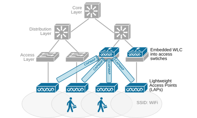
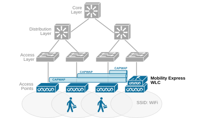

[Wireless Controller placement](https://www.networkacademy.io/ccna/wireless/wireless-controller-placement)
==========

Let's make a quick recap for context for the lesson: access points can work in two modes: autonomous or lightweight. In autonomous mode, the AP works on its own. In lightweight mode, the AP depends on a centralized wireless controller to function. This setup is called a **Split-MAC architecture**. The lightweight AP handles real-time functions like transmission and reception of frames, while the WLC manages everything else. Each lightweight AP communicates with the wireless controller using two CAPWAP tunnels: one for control and one for data traffic. The tunnels pass through the wired network encapsulated as UDP with a new IP header. The wireless controller supports multiple lightweight APs, allowing the network and the coverage area to scale. 

This lesson discusses how the placement of the wireless controller affects the performance and scale of the wifi network. There are four common placement points for connecting the WLC. We are going to discuss each one in detail and compare the advantages and disadvantages. 

## WLC at the Core Layer

The most common design is to connect the wireless controller to the Core layer of the organization's data center or regional hub, as shown in the diagram below. This design makes a lot of sense in large-scale deployments with hundreds or thousands of access points. In such cases, scalability and available bandwidth at the controller's connection point become important.

*Figure 1. WLC connected to the Core layer.*

Since each lightweight access point sends the clients' traffic through the CAPWAP data tunnel to the controller, the traffic volume at the WLC can become very significant. For example, if the organization has hundreds of APs, the client's traffic reaching the controller may be in the range of 10+Gbps. Since the access and distribution layer simply might not have 40/100Gbps ports to connect the controller, the only appropriate place is the Core of the network.

The main advantage of this design is that the WLC is connected to the high-speed backbone and can handle a lot of traffic. 

The main disadvantage is that the client's traffic gets further away from the client itself, and the traffic must transit the entire backbone network and back down in case of client-to-client traffic.

## WLC embedded at the Access Layer

If most of the organization's wireless traffic is between clients connected via different access points, it makes sense **to locate the wireless controller further down the network topology** and closer to the clients themselves. Cisco offers a network design where the WLC is built into an access switch, as shown in the diagram below. 

*Figure 2. WLC embedded at the access layer.*

With this design, the controller sits closer to the APs, **shortening the CAPWAP tunnel**. The CAPWAP encapsulation is only used between the AP and the upstream access switch, which is simply the LAN cable's length. 

This design can be cost-effective because the same switch handles both wired and wireless traffic, and the organization doesn't need to buy an expensive WLC appliance. It works well for branch offices and campuses. Since the WLC is local, APs do not rely on a distant WLC over a WAN connection. This improves reliability. Traffic between wireless users stays within the local network, while traffic to external resources is CAWAP decapsulated directly at the access layer.

The main advantage of this design is that it can be very cost-efficient for small to medium deployments of up to 200 access points.

The main disadvantage is scalability, so it is not ideal for large enterprise networks.

## Mobility Express WLC

The third design option we will discuss is Cisco Mobility Express. It is a lightweight wireless solution designed for small—to medium-sized organizations that don't have the staff and resources to manage the complexity of a dedicated controller. Instead of requiring a separate controller (WLC), one of the access points takes on the role of the controller while also functioning as a regular AP. This eliminates the need for additional hardware and simplifies network deployment, as shown in the diagram below.

*Figure 3. Mobility Express WLC.*

Once configured, the Mobility Express controller AP manages the rest of the APs in the network. Even if it fails, another AP can take over the role without disrupting the wifi network.

Mobility Express supports most of the advanced enterprise features that dedicated WLC does, such as fast roaming, VLAN segmentation, and RF management. However, it is limited in scalability compared to full WLC-based solutions, making it ideal for deployments with up to a hundred APs.

The main advantage of Mobility Express is that it offers a cost-effective alternative to traditional controller-based solutions. It provides the flexibility of an enterprise-grade wireless network while maintaining the simplicity of an autonomous AP deployment.

## WLC in the Cloud

The WLC placement designs that we have seen so far discuss the placement of a wireless controller on-prem. However, Cisco supports two cloud-based designs that we can briefly touch:

- The Catalyst wireless controller has a virtual image that can be deployed in a private or public cloud. The latest version is the Cisco Catalyst 9800-CL, which is a cloud-ready virtual WLC running on VMware ESXi, KVM, or public cloud providers like AWS and Azure.
- Additionally, Cisco has a fully cloud-managed Wi-Fi solution called Cisco Meraki that provides centralized control, security, and analytics for enterprise networks without requiring on-premises controllers. It is out of the scope of the wireless topics in the CCNA curriculum (for now), but we can briefly discuss it just for context.

### Virtual Catalyst Wireless Controller (vWLC)

The virtual Catalyst wireless controller (vWLC) offers several advantages over traditional hardware-based controllers. It provides flexibility by running in public cloud environments, allowing organizations to scale wireless networks without the need for physical WLC hardware. It also reduces capital expenditure (CapEx) since no dedicated hardware is required. Additionally, it supports high availability across multiple data centers, enabling fast failover and disaster recovery.

The following diagram shows a high-level of a cloud-based WLC design in Amazon AWS.

### Full Content Access is for Subscribed Users Only...

- **Learn any CCNA, CCIE or Network Automation topic** with animated explanation.
- **We focus on simplicity.** Networking tutorials and examples written in simple, understandable language.

Sign up for free ►
