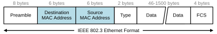
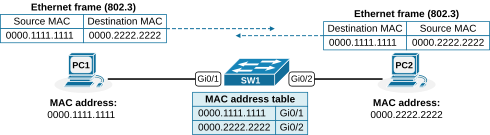
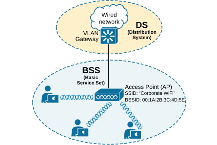
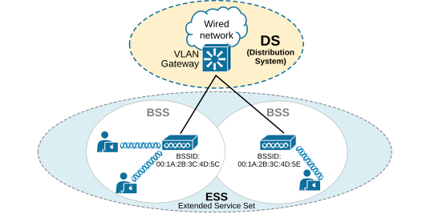
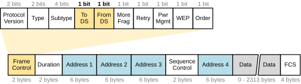
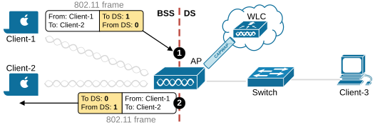
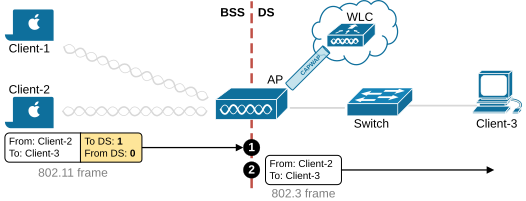
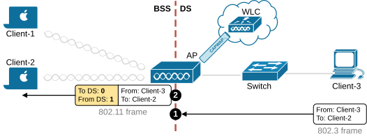
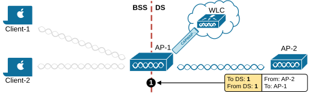

[802.11 Frame Format](https://www.networkacademy.io/ccna/wireless/802-11-frame-format)
==========

Network engineers are typically pretty familiar with the Ethernet (802.3) frame format. It is the foundation of switched networks. To provide context for this lesson, let's first recall how it works and then compare it to the wireless 802.11 frames. 

The following diagram shows a high-level overview of the structure of an Ethernet frame used in switched networks. Notice that it has two layer 2 addresses: Source MAC and Destination MAC. This is important because wireless frames have more than two MAC addresses!

*Figure 1. IEEE 802.3 frame format.*

In traditional Ethernet networks (IEEE 802.3), devices send and receive data in a structured frame format, as shown in the diagram below. Each frame contains two MAC addresses: a source MAC address and a destination MAC address. **The source address is not used for frame delivery** but tells the recipient where to send a reply. 

*Figure 2. IEEE 802.3 frames in action.*

When a device receives a frame with its own MAC address as the destination, it accepts and processes the frame. The process is pretty well-known by CCNA-level network engineers.

Now, let's see the process in action using the diagram above. Imagine a sender and receiver are connected through a network switch. The switch forwards frames between them based on MAC addresses but doesn't modify the addresses in the frames. Also, notice that the end devices aren't aware of the switch—they simply forward frames based on its routing/ARP table. They don't have visibility into the switched network and don't know whether they are connected to a switch, hub, router, or another network device.

Well, with wireless, the process is different, and the frame format is completely different. Let's dive in.

## The 802.11 Frame format

In an 802.11 wireless network, the access point (AP) plays **an active role** in managing the communication between clients, and clients are aware of the AP's presence. Wireless devices must first associate with an AP to join the network. 

The AP acts as a central hub. All data passes through it. Clients are not allowed to communicate directly without using the AP. The word "hub" is intentionally used because it indicates that all communication is half-duplex (similar to ethernet communication via a hub).

### A quick recap on BSS, ESS, and DS

To understand the structure of the 802.11 frame, we must recall a few more terms and concepts for context. In wireless networks, the Basic Service Set (BSS) is the smallest unit of a Wi-Fi network. It consists of an access point and the wireless clients connected to it. Each BSS has a unique identifier called the BSSID, which is the MAC address of the AP.

*Figure 3. BSS and DS in wireless networks.*

If we connect multiple BSS together to create a larger area with wifi coverage, we create the so-called Extended Service Set (ESS). ESS is a larger Wi-Fi network made up of multiple BSSs connected through a wired network. This allows clients to move between APs while staying on the same network, enabling roaming. The entire ESS is identified by a single SSID (the human-friendly network name).

*Figure 4. Extended Service Set (ESS).*

Lastly, let's recall what is the Distribution System (DS). The DS is the wired network that connects multiple APs in an ESS. It allows APs to communicate with each other and forward client traffic to other networks, such as the Internet or internal servers. The DS is usually the LAN side of the AP.

Now, let's look at the 802.11 frame and see how the concepts of Basis Service Set (BSS) and Distribution System (DS) are part of the frame's structure.

### 802.11 frame structure and direction

The following diagram shows the structure of an 802.11 frame. Notice that it starts with a Frame Control field (in yellow). It is essential and doesn't have an analog in Ethernet frames. It defines the frame type and its direction within the network.

*Figure 5. 802.11 Frame Format.*

In most cases, wireless frames travel between clients and the AP, which then forwards them to the distribution system (DS) and, most likely, to the Internet and back. The 802.11 frame header includes two direction bits, "**To DS**" and "**From DS**"(in yellow), to indicate whether the frame is being sent to or coming from the DS. At first glance, it may seem that frames can only move in one of two directions: 

- from a client to the DS
- from the DS to a client. 

However, there are additional cases where frames do not follow this simple pattern. 

To understand the concept, let's look at a few examples. The following diagram shows two clients communicating with each other via the access point. If you follow the lessons in order, you should already know that even though both clients are connected to the same AP, in the split-MAC architecture (which is most common in large organizations), **the traffic goes to the wireless controller and back** via the CAPWAP tunnels. Let's break the process into two steps in the context of the 802.11 frame. 

**Step 1. **When Client-1 sends wireless frames, it sets the "To DS" bit to 1 and the "From DS" bit to 0, as shown in step 1 in the diagram below (in yellow). This means that the frame is destined for the Distribution System for switching/routing to the correct destination. (Client-1 doesn't know where Client-2 is.)

*Figure 6. 802.11 frames between wireless clients.*

**Step 2. **If this is a split-MAC architecture, the frame from Client-1 reaches the AP and then the wireless controller via the CAPWAP tunnels. The controller switches the frame back to the access point. Before the AP sends the frame to Client-2, it changes the directions - it sets the "**To DS**" bit to 0 and the "**From DS**" bit to 1, as shown in step 2 in the diagram above (in yellow).

Let's look at another example. Client-2 sends data to Client-3, which is connected somewhere on the wired side of the network. Client-2 sets the directions as shown in step 1 in the diagram below (in yellow).  

*Figure 7. 802.11 frames between a wireless and a wired clients - reversed.*

When Client-3 responds, the AP changes direction in the 802.11 frame, as shown in step 2 in the diagram below (in yellow). It sets the "**To DS**" bit to 0 and the "**From DS**" bit to 1 to indicate that the traffic is coming from the Distribution System. 

*Figure 8. 802.11 frames between a wireless and a wired clients.*

At this point, you might ask: Okay, if there are only two possible directions in the network (to DS and from DS), why don't we use a single bit? For example, set to 0 for one direction and set to 1 for the reverse direction. Why does the frame header use two bits? 

The answer is that **there are special cases** where data is not just going between devices and the DS but somewhere else, leading to four possible direction types.

One special case occurs when **an AP sends a broadcast frame to all connected clients**, meaning the frame does not originate from the DS. Another example is when a client sends a management frame directly to the AP, making the AP itself the destination.

*Figure 9. From the AP to all clients.*

A different scenario arises in mesh networks, where APs communicate wirelessly with each other over backhaul links. Since these links are not part of a basic service set (BSS) or the DS, both direction bits in the frame header are set to 1, indicating that the frame is traveling between APs rather than between clients or the wired network, as shown in the diagram below.

*Figure 10. From AP-2 to AP-1.*

The following table summarizes the different combinations of frame direction. Most of the time, the wireless data moves from the BSS to the DS system or vice versa. That's why the most common combinations are highlighted in green.

| **Frame Control: To DS** | **Frame Control: From DS** | **Use case** 
| 0 | 0 | An AP itself, not the DS, is the source or destination of the frame. For example, an AP sends a control frame to all associated devices. 
| 0 | 1 | A 802.11 frame is sent from the DS to a client. 
| 1 | 0 | A 802.11 frame is sent from a client to the DS. 
| 1 | 1 | An AP relay a frame to anotehr AP over a wireless backhaul link. The link is neither in the BSS nor in the DS. 

The "From DS" and "To DS" bits in the 802.11 header are important because they indicate the direction of the wireless data within the wireless network. These bits help devices understand how to handle and forward frames properly. The process is crucial for directing traffic correctly, ensuring frames reach their intended destination, and supporting advanced wireless capabilities like roaming, mesh networks, and split-MAC deployments.

### 802.11 Address Fields

Unlike Ethernet frames which have only two MAC addresses (Source and Destination), 802.11 frames can have up to **four MAC address fields**. The number of addresses used depends on the To DS / From DS bits:

| To DS | From DS | Address 1 | Address 2 | Address 3 | Address 4 |
|-------|---------|-----------|-----------|-----------|-----------|
| 0 | 0 | Destination (RA) | Source (TA) | BSSID | N/A |
| 0 | 1 | Destination (RA) | BSSID | Source | N/A |
| 1 | 0 | BSSID | Source (TA) | Destination | N/A |
| 1 | 1 | RA | TA | Destination | Source |

Where:
- **RA (Receiver Address)** — The MAC address of the device that will receive the frame over the wireless medium.
- **TA (Transmitter Address)** — The MAC address of the device that transmitted the frame over the wireless medium.
- **DA (Destination Address)** — The ultimate destination MAC address (may be on the wired side).
- **SA (Source Address)** — The original source MAC address.
- **BSSID** — The MAC address of the AP's radio.

### 802.11 Frame Types

The Frame Control field also defines the **type** and **subtype** of the frame. There are three main frame types:

**1. Management Frames (Type = 00)**
Used for network discovery, association, and maintenance. These frames are not forwarded to the DS; they are processed locally by the AP or client.

| Subtype | Frame Name | Purpose |
|---------|-----------|---------|
| 0000 | Association Request | Client requests to join the BSS |
| 0001 | Association Response | AP responds to association request |
| 0010 | Reassociation Request | Client roams to a new AP |
| 0011 | Reassociation Response | AP responds to reassociation |
| 0100 | Probe Request | Client scans for APs |
| 0101 | Probe Response | AP responds to probe |
| 1000 | Beacon | AP advertises its presence |
| 1010 | Disassociation | Client leaves BSS |
| 1011 | Authentication | Authentication exchange |
| 1100 | Deauthentication | Client terminates authentication |
| 1101 | Action | 802.11 management action (e.g., 802.11k) |

**2. Control Frames (Type = 01)**
Used to manage access to the wireless medium. They assist with data delivery.

| Subtype | Frame Name | Purpose |
|---------|-----------|---------|
| 1011 | RTS (Request to Send) | Requests medium access |
| 1100 | CTS (Clear to Send) | Grants medium access |
| 1101 | ACK (Acknowledgment) | Confirms frame receipt |
| 1110 | CF-End | Ends contention-free period |

**3. Data Frames (Type = 10)**
Carry actual user data. The most common data frame subtype is **0000 (Data)**.

### 802.11 Frame Control field details

The Frame Control field is 2 bytes (16 bits) and contains:

| Bits | Field | Description |
|------|-------|-------------|
| 0-1 | Protocol Version | Always 0 (current 802.11) |
| 2-3 | Type | Frame type (00=Mgmt, 01=Control, 10=Data) |
| 4-7 | Subtype | Specific frame subtype |
| 8 | To DS | 1 = frame going to Distribution System |
| 9 | From DS | 1 = frame coming from Distribution System |
| 10 | More Fragments | 1 = more fragments follow |
| 11 | Retry | 1 = retransmitted frame |
| 12 | Power Management | 1 = client entering power-save mode |
| 13 | More Data | 1 = more buffered data for client |
| 14 | Protected Frame | 1 = frame is encrypted |
| 15 | Order | 1 = strictly ordered frames required |

### Key differences between 802.11 and 802.3 frames

| Feature | 802.3 (Ethernet) | 802.11 (Wi-Fi) |
|---------|-----------------|----------------|
| MAC addresses | 2 addresses (Src, Dst) | Up to 4 addresses (RA, TA, SA, DA + BSSID) |
| Direction bits | Not present | To DS / From DS (2 bits) |
| Frame Control | Minimal | Complex (type, subtype, flags) |
| ACK mechanism | No ACK at L2 | Every unicast frame is ACKed |
| Fragmentation | Not supported | Supported (More Fragments bit) |
| Retransmission | Handled by upper layers | Handled at L2 (Retry bit) |
| Power management | Not present | Power Management bit |
| Security | Not in frame header | Protected Frame bit |

### Summary

- The **802.11 frame format** is significantly more complex than Ethernet (802.3). It has up to 4 MAC addresses, direction bits, and a detailed Frame Control field.
- The **To DS / From DS** bits determine the direction of the frame: client to AP (10), AP to client (01), between APs (11), or within the same BSS (00).
- The **Frame Control field** defines the frame type (Management, Control, or Data), along with flags for retry, power management, encryption, and more.
- **Management frames** handle association, authentication, and beaconing.
- **Control frames** handle medium access (RTS/CTS/ACK).
- **Data frames** carry user traffic.
- Understanding the 802.11 frame format is essential for troubleshooting wireless issues and passing the CCNA exam.
