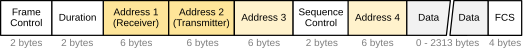
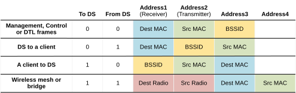
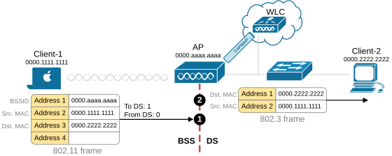

[802.11 Frame Addressing](https://www.networkacademy.io/ccna/wireless/802-11-frame-addressing)
==========

In this lesson, we will dive into the 802.11 frame addressing. It is essential to understand the differences between a standard 802.3 Ethernet frame and an 802.11 wireless one.

- 802.3 Ethernet frames have only two address fields: Source MAC and Destination MAC.
- 802.11 Wireless frames have four address fields that are used differently depending on the originator and the direction of the frame.

Let's start with the theory behind this concept and then walk through the different scenarios and values of each address field. 

## Understanding 802.11 Frame Addressing

The following diagram shows the 802.11 frame header. It contains four address fields highlighted in yellow. Notice that they have generic names: Address1, Address2, Address3 and Address4. They are not listed as "Source MAC" and "Destination MAC," as in the standard 802.3 Ethernet header. But why do you think the fields don't have pre-defined names and use generic ones instead?

*Figure 1. 802.11 frame header format.*

The reason is that the address fields are used differently in different situations. Their value depends on where the frame is going and who the originator is.

In wireless communications, 802.11 frames always travel** from a radio transmitter to a radio receiver**. That's why the first two addresses of every frame include the Transmitter Address (TA) and the Receiver Address (RA), as shown in the diagram above. 

- **Address_1 **always holds the RA (Receiver Address). 
- **Address_2 **always holds the TA (Transmitter Address).

Notice that those are not analogous to the source and destination Ethernet MAC addresses. The transmitter address is the MAC of the radio device that sends the RF signal into the air. The receiver address is the MAC of the radio device that should receive the radio signal (not the ultimate layer 2 destination). You should remember that Address1 (RA) and Address2 (TA) are always wireless devices. Usually, one is a wireless client, and the other is the access point.

**KEY POINT:** Address1 (receiver) and Address2 (transmitter) are always wireless devices.

To understand Address_3, we must focus on why Addresses 1 and 2 are insufficient. What happens in practice is that most of the wireless traffic goes from a client to the Internet. In that case, the Transmitter is the client, so Address_2 is the client's MAC address. The receiver of the radio signal is the access point (AP), so Address1 is the AP's MAC address, which is the BSSID. But **the frame is actually destined to the subnet's default gateway** because the traffic goes to the Internet. That's why the frame needs at least one more field for the ultimate layer 2 destination.

- **Address_3** holds the Destination Address (DA) if the receiver (usually the access point) is not the final layer 2 destination. For example, when a wireless client sends a frame to a device on the wired network (DS), the AP receives the frame and forwards it. **Address_3 **can also hold the Source Address (SA) if the transmitter (usually the access point) is not the original sender. For instance, when a wired device sends a frame to a wireless client, the AP transmits it over the air, but the frame originated from the wired device.

Sometimes, frames need to pass through an intermediate wireless device before reaching their final destination. In such cases:

- **Address_4 **is used only when one AP is forwarding a frame to another AP over a wireless link. In that case, Address4 carries the original SA and DA, while Address1 and Address2 remain the RA and TA for the APs relaying the frame.

Remembering when and how each of the four address fields is used is not an easy task. If you are not specializing in wireless networks, you don't need to memorize everything. It is enough to simply remember that there is a significant difference between 802.11 and 802.3 frames. However, the wireless 802.11 addressing may sometimes appear on the CCNA/CCNP/CCIE exams. 

*Table 1. 802.11 frame header direction and addressing.*

To understand the table, let's break it down. First, keep in mind that 99.9% of the traffic will be either row two (DS to client) or row three (client to DS). In that case, addresses 1 and 2 are the MAC addresses of the client and the AP because they are the wireless transmitter and receiver. But does the traffic stop at the AP? No, the AP forwards it toward the wired network. That's why Address 3 is required to store the ultimate layer 2 source/destination - typically the MAC address of the VLAN gateway.

Rows 1 and 4 in the table are used relatively rarely. Row 1 is for control/management frames. Row 4 is only used if a frame must be relayed from one AP to another AP over a wireless backhaul link or mesh, which is not very common in enterprise wireless networks.

## How 802.11 Frames Move

Let's now see some practical examples. The following diagram shows a simple topology where a wireless client sends data to a wired client in the same VLAN. 

*Figure 2. 802.11 addressing example.*

Cross-check the example using the table above. It matches the use case described in row three - a client to DS.

- **Address_1 **is the wireless receiver address. In this case, it is the AP's MAC, which is, in fact, the BSSID.
- **Address_2 **is the wireless transmitter address. In this case, it is the client's MAC address.
- **Address_3 **is the ultimate layer 2 destination, which is Client-2's MAC address.

Notice that once the frame goes out of the wireless network, the device that bridges it to the LAN converts it into an 802.3 Ethernet frame. Usually, this is the controller (WLC), but it may also be the access point if the organization uses FlexConnect or Autonomous APs.

Notice how the address field differs between the different header types. In 802.11 there are three addresses while in the 802.3 header there are only two (in yellow)

## Book traversal links for 8

