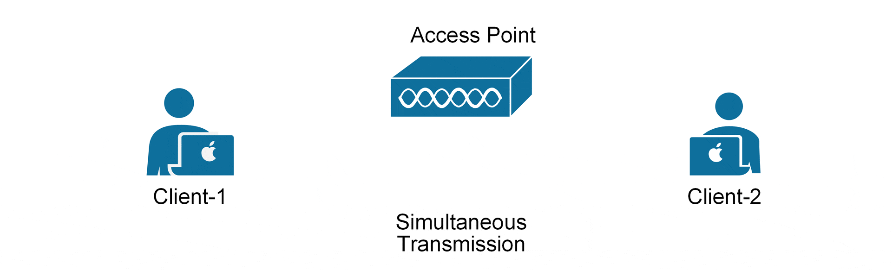
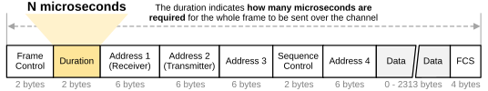
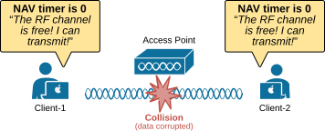
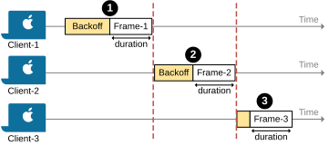

[Collision Avoidance (CSMA/CA)](https://www.networkacademy.io/ccna/wireless/collision-avoidance-csma-ca)
==========

In shared networks like wireless or wired Ethernet, multiple devices transmitting simultaneously can cause collisions. Collisions corrupt data, waste time, and require retransmission, which wastes even more time. 

In this lesson, we will discuss the algorithm that wireless devices use to do their best to prevent/reduce collisions from happening.

## Why does WiFi need Collision Avoidance (CSMA/CA)?

The answer to this question is actually pretty simple - because of interference. All wireless devices inside a BSS **share the same medium** - a single RF channel based on the WiFI standard they use. When multiple devices transmit at the same time, they interfere with each other, and this interference becomes more likely as more wireless devices are added. For example, the following diagram shows two devices transmitting simultaneously on the same channel. What happens is that the two RF signals cancel each other out, and the access point receives corrupted data.

*Figure 1. Simultaneous transmission resulting in a collision.*

It is basically the same effect that happens in an Ethernet LAN that is a single collision domain. Recall that all devices connected to a hub are in the same collision domain. To use the media effectively, all hosts must operate in half-duplex mode, which means they can't send and receive data at the same time.

*Figure 2. A hub connecting four hosts.*

A refresher: a hub is a basic network device that operates at Layer 1 (Physical Layer) of the OSI model. It simply repeats incoming signals to all connected devices without any intelligence. Since all devices share the same collision domain, only one can transmit at a time. If two or more devices transmit simultaneously, a collision occurs.

The same effect happens when multiple people try to speak at the same time, as shown in the diagram below. Since voice is also a wave, the voice waves of all people collide, creating noise instead of clear speech. Nobody understands what is being said.

*Figure 3. Four people speaking simultaneously.*

The solution is obvious. People at a table speak in turns. Only one person can talk at any given time while all others listen. The same logic applies to wireless networks. **Only one device can transmit information at a time**. That's where the mechanism for avoiding collisions (CSMA/CA) comes into the picture.

## What is CSMA/CA?

Carrier Sense Multiple Access with Collision Avoidance (CSMA/CA) is a protocol used in 802.11 wireless networks to reduce the chance of two devices transmitting data at the same time. First, let's break this complex name into understandable pieces:

- **Carrier Sense (CS): **Expresses the idea that a device may only transmit data if the transmission medium is free. Therefore, every device constantly monitors the RF spectrum to "*sense*" if someone is currently transmitting.
- **Multiple Access (MA):** The wireless medium is shared between all connected devices. Devices use the same frequency space. Therefore, they must follow a common set of rules to avoid interference.
- **Collision Avoidance (CA):** Devices use a backoff mechanism to reduce the chances of two devices transmitting simultaneously.

In other words, CSMA/CA is a MAC layer protocol that **helps wireless devices avoid collisions** by ensuring that only one device transmits at a time.

## How CSMA/CA Works?

CSMA/CA tells each device to listen to the transition medium and try to "sense" if the channel is free. If no other device is transmitting, it proceeds with the transmission. If the channel is busy, the device waits for a random amount of time—called **the back-off period**—before checking again. Once the backoff counter reaches zero and the channel is clear, the device sends its data. After receiving the transmission, the recipient sends back an acknowledgment (ACK) to confirm successful delivery.

To further reduce collisions, an optional Request to Send/Clear to Send (RTS/CTS) mechanism can be used. With RTS/CTS, a device first requests permission from the access point before sending data. If approved, it proceeds with transmission, ensuring no other device transmits at the same time.

## CSMA in Wired vs. Wireless Networks

Before diving deeper into how CSMA works, let's first provide a bit more context. CSMA works differently in wireless and wired networks. But why? Why wireless and wired devices don't use the same logic when dealing with collisions?

The answer is that the transmission medium is different and has different constraints. 

- In **wired **networks, devices can detect collisions because they can listen for electrical signals on the cable while transmitting. If a device detects an unexpected signal (caused by another device also transmitting), it recognizes a collision has occurred.
- In **wireless **networks, it is impossible to detect collisions because devices cannot listen and transmit simultaneously on the same frequency. When a device is transmitting, its own RF signal is much stronger than any incoming signal, making it impossible to "hear" other transmissions and detect a collision.

That's why there are two different CSMA algorithms: CSMA/CA (Collision Avoidance) and CSMA/CD (Collision Detection). The main difference between CSMA/CA and CSMA/CD is how they handle collisions:

- **CSMA/CA (Wireless) **tries **to prevent collisions** before they happen by making devices check if the channel is clear before transmitting.
- **CSMA/CD (Wired)** allows collisions to happen but **detects and resolves them** by making devices stop and resend their data.

## How does Carrier Sense work?

Wireless devices use two methods to check if the transmission medium (the wireless channel) is in use. 

- **Physical Carrier Sense (Clear Channel Assessment - CCA)** - The first method is physical carrier sense, also known as Clear Channel Assessment (CCA). When a wireless device is not transmitting, it listens to the channel for other transmissions. If it detects a signal, it assumes the channel is busy. High-bandwidth Wi-Fi devices, like those using 802.11n or 802.11ac, must check multiple channels at once. If a frame is overheard and contains the device’s MAC address, it processes the frame. If not, it still recognizes that the channel is in use.
- **Virtual Carrier Sense (Network Allocation Vector - NAV)** - The second method is virtual carrier sense, which relies on the Network Allocation Vector (NAV). Every transmitted frame includes a duration value that tells other devices how long the channel will be occupied. Devices that overhear the frame store this value in their NAV timer and wait until it reaches zero before attempting to transmit.

*Figure 4. 802.11 Frame Duration field.*

Basically, the duration value tells other devices how long it will take to transmit the frame and reserves the channel for that amount. When the device detects a frame on the channel, it reads the Duration value and updates its NAV timer. A device can only attempt to send data once its NAV timer reaches zero. However, this process is not as simple as it seems. If multiple devices **detect that the channel is free at the same time**, they may all try to transmit simultaneously, leading to collisions, as shown below. 

*Figure 5. Two devices detect that the channel is free at the same time.*

That's why the CSMA/CA algorithm includes one more technique called a random back-off timer.

## Collision Avoidance

We have discussed multiple times that wired and wireless networks handle collisions differently. Wired devices can detect collisions in real time and back off before retrying. Wireless devices, on the other hand, operate in half-duplex mode. They cannot detect a collision while transmitting, so they must **prevent collisions** instead.

Mobile clients avoid collisions by using **a back-off timer**. When a client wants to transmit, it selects a random number of timeslots between 0 and 31 as a back-off timer. This helps reduce the chance of multiple clients transmitting at the same time. Only when the NAV and the backoff timers expire to zero, the client can compete for airtime. The following diagram shows an example of this concept with three clients transmitting 802.11 frames on the same channel.

*Figure 6. Avoiding collisions with backoff time (simplified).*

Keep in mind that this is a simplified explanation of the backoff process. In reality, it involves more timers and processes. However, at this level, it is more important to know how the process works at a high level and to understand the idea and the concept behind it. If you decide to pursue a career in Wireless networks, you can go deeper into the rabbit hole.

## Frame Acknowledgements

Lastly, let's imagine that a client transmitted an 802.11 frame and assume that all collision avoidance methods worked correctly. Wireless uses collision *avoidance*, not collision *detection*. Therefore, how does a client know its transmitted frame was received correctly, and no data was corrupted in transit? 

Since a device cannot listen while transmitting, it relies on a simple feedback system. When a client receives a unicast frame, it must send back a unicast acknowledgment (ACK) to confirm successful delivery. **The 802.11 standard requires an ACK for each frame**, except in 802.11n and 802.11e (WMM), where one acknowledgment can confirm the receipt of multiple frames in a burst.

## Book traversal links for 8

