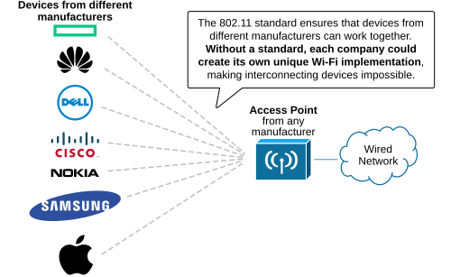
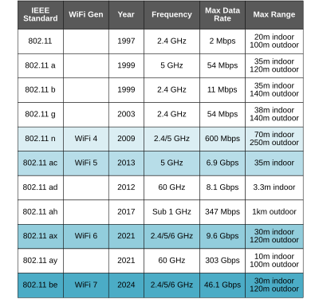

[IEEE WiFi Standards](https://www.networkacademy.io/ccna/wireless/ieee-wifi-standards)
==========

This lesson discusses why standards are essential in networking, why we need to have wireless regulatory bodies in different regions of the world, and the most common wireless standards.

## Why do we need Wi-Fi standards?

Let's start with the very basic question: What is a standard? A standard is a set of rules, guidelines, or specifications designed to ensure that things follow the same rules and work consistently. A common example that everybody understands is human language. Human language is a set of rules and specifications. People can use the same language to exchange information, even if it is not their native language and they are from different parts of the world.

In the same way, wireless devices use a common standard to exchange information, even if they are manufactured by different vendors in different parts of the world, as shown in the diagram below.   

*Figure 1. Why do we need Wi-Fi standards?*

Standards in networking are very important. They ensure that devices from different manufacturers can communicate and work together. Without standards, each company could create its own unique system, making it difficult or even impossible to connect devices.

## Regulatory Bodies

In one of the previous lessons, we discussed that the RF frequency spectrum is considered a valuable national resource, and the government of each country and region strictly controls its use. Since the frequency spectrum is limited, it holds economic value, generating revenue through licensing. It also supports **national security** by enabling military and emergency communications. Each government has a regulatory body that controls the proper allocation to boost technological growth, economic development, and public safety in each country.

*Figure 2. Regulatory bodies and standards.*

Since wireless communications use the RF spectrum as a transmission medium, the RF regulatory bodies also control the wireless spectrum usage. **They allocate frequency bands** for each Wi-Fi standard, set power and emission limits, and monitor vendors' compliance.

### FCC (United States) 

One key regulatory body in the United States is the Federal Communications Commission (FCC). The FCC oversees and regulates all wireless communication, including radio, TV, and cellular signals, to prevent interference and ensure fair use of frequencies. 

The FCC also defines limits on power output and frequency ranges for wireless technologies like Wi-Fi, Bluetooth, and cellular networks.

### ETSI (Europe)

Another important organization is the European Conference of Postal and Telecommunications Administrations (CEPT), which harmonizes spectrum usage across Europe. CEPT helps reduce interference and promotes consistent wireless policies within European countries. 

### ITU (Global)

Globally, the International Telecommunication Union (ITU), a specialized agency of the United Nations, manages international spectrum allocation and develops standards to ensure that wireless technologies work across borders. These bodies work together to ensure that wireless technologies are efficient, interoperable, and follow safety guidelines worldwide.

## IEEE 802.11 Wireless Standards

The regulatory bodies work parallel to another organization called the Institute of Electrical and Electronics Engineers (IEEE). IEEE is known for creating technical standards, such as the IEEE 802.11 standards used in Wi-Fi, as shown in the diagram below. 

*Figure 3. 802.11 IEEE wireless working group.*

The IEEE is a global organization of engineers. It has many smaller groups called “societies” that focus on different topics. For example, the IEEE Computer Society works on standards for networking, including Ethernet and Wireless LANs. They create standards through working groups. Each group has an open membership and is assigned a number. This number is added to the 802 family. For example, 802.11 is the group responsible for the wireless LAN standards used by all Wi-Fi vendors. Other working groups include:

- 802.1: Network bridging (includes Spanning Tree Protocol)
- 802.2: Link-layer control
- **802.3: Ethernet**
- **802.11: Wireless LANs**
- 802.15: Wireless personal-area networks (like Bluetooth and ZigBee)

When technology changes, study groups (SGs) explore whether updates are needed. If so, task groups (TGs) work on amendments to the 802.11 standard. Each amendment is given a suffix, like 802.11a, 802.11b, and so on. If more are needed, two-letter suffixes are used, such as 802.11aa and 802.11aq.

Sometimes, amendments take a long time to be approved. Manufacturers may release devices based on draft amendments. This happened with 802.11n, leading to some “Draft N-compliant” products that were not always compatible with others.

The 802.11 standards often include the year they were approved, like 802.11-1997 or 802.11a-1999. Every few years, the IEEE revises the 802.11 standard to combine all previous amendments into one document. This keeps everything in one place. Even after amendments are combined, their names remain common references for the features they added. The following table lists all 802.11 standard amendments made so far. 

*Table 1. Wi-Fi Standards.*

Notice that the most common 802.11 amendments often appear in CCNA/CCNP exams. CCNA candidates must be familiar

Lastly, try to understand and remember the difference between the regulatory bodies and the IEEE. Can you tell what it is?

IEEE provides the technical framework for how wireless communication should work, while regulatory bodies manage the spectrum and enforce rules to ensure that these technologies can operate without causing interference. In short, IEEE is on the technical side of things, while the regulatory bodies are on the governing side of things.
