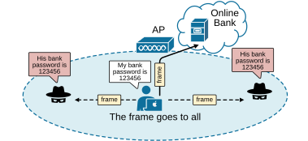
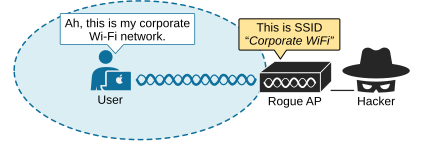
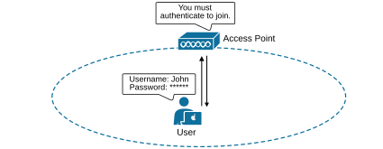
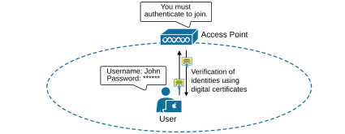
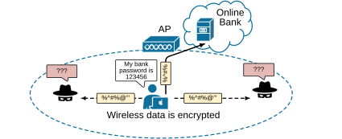
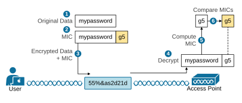
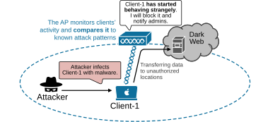
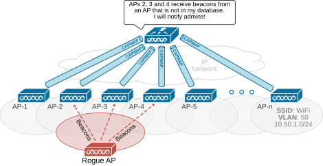

[Wireless Security Fundamentals](https://www.networkacademy.io/ccna/wireless/wireless-security-fundamentals)
==========

Wired networks have an inherited level of security because data travels over physical wires, reducing the risk of eavesdropping. Wireless networks are different. They send data through the air, where **anyone within range can potentially listen in**. That’s why securing a Wi-Fi network is just as important as any other part of the technology.

## Why do we need strong wireless security?

Let's explore some of the most common security attacks that target Wi-Fi networks. Then, we will discuss how Cisco's wireless solution secures the network against them.

### Eavesdropping

In Wi-Fi networks, clients share the same channel and coexist in the same coverage area. However, not all wireless devices are secure or trustworthy. Unlike wired networks, where data travels directly between sender and receiver, wireless signals spread in all directions, reaching any device within range.

In the scenario shown in the diagram below, a user connects to his remote banking provider and shares his credentials. Due to the nature of Wi-Fi communication, the signal goes to the access point and also to two untrusted users nearby, who capture the user's confidential password. 

*Figure 1. Wireless frames reach unintended recipients.*

The ease of wireless communication also makes it **vulnerable to eavesdropping** and attacks. Therefore, strong encryption and integrity protection are paramount for this type of communication.

### Evil Twin (Rogue AP)

When you join a Wi-Fi network, you usually focus on logging in, assuming the access point (AP) is trustworthy. For example, at the office, you see your corporate Wi-Fi name and connect without hesitation. The same happens at home, in a hotel, or at an airport. But how do you know the AP is trustworthy?

The only clue you have is the SSID name being broadcast. If it looks familiar, you might connect automatically. Your device may even join without asking if it's set to remember the network. But what if an attacker is faking that SSID?

*Figure 2. Wireless man in the middle attack.*

As shown in the diagram above, one of the most common wireless security concerns involves **an attacker setting up a fake access point (AP)** with the same SSID as a legitimate corporate network. The rogue AP sends beacons, responds to probes, and accepts client connections just like a legitimate AP. Users unknowingly connect, allowing the attacker to steal data. A fake AP can even send spoofed management frames to disconnect users from the real network and connect them to the fake SSID.

## What security does a modern wireless network have?

Now, let's explore the most fundamental security measures that every wireless network has. (or at least should have)

### Authentication

We all use Wi-Fi, and we know that clients must first find an SSID in range and request to join. Before they can connect, they need to be authenticated. But have you ever wondered why authentication is so important? 

If your network connects to sensitive company resources, only trusted devices should be allowed in. Guest users, if permitted, should connect to a separate guest network with limited access. Rogue clients—unknown or unwanted devices—should be blocked completely.

To control access, wireless networks authenticate devices before allowing them to connect. Clients must provide credentials to the access point (AP). The following diagram shows a simple authentication process between a user and an AP:

*Figure 3. Authentication*

Many different authentication methods exist today. Some use a shared password stored on all trusted devices. But if a device is lost or stolen, anyone could use it to connect. More secure methods check credentials against a company database, requiring a valid username and password that thieves wouldn’t know.

I think this part of the authentication process is clear to anyone. But have you ever wondered: when you join a Wi-Fi network, you authenticate yourself, but do you verify the AP?

Most of the time, **you assume** that the AP belongs to the location, whether it's your office, a hotel, or an airport. But how do you know for sure?

APs broadcast SSIDs, and if the name looks familiar, you might connect automatically. Some devices even auto-connect to known SSIDs without asking. This can be risky. Attackers can set up fake APs that mimic real ones, tricking devices into connecting. Once a client joins, the attacker can intercept data or disrupt connections by sending spoofed management frames.

To prevent such attacks, clients should verify APs before connecting. The following diagram show how this works:

*Figure 4. Mutual verification using certificates.*

Clients should also authenticate management frames to ensure they come from a trusted AP.

### Message Privacy

If a client must authenticate before joining a Wi-Fi network, it can also verify the AP and its management frames. This builds trust, but data is still exposed to eavesdroppers on the same channel.

To keep data private, wireless networks use encryption. The data in each frame is encrypted before transmission and decrypted upon arrival. Both the sender and receiver must use the same encryption method.

Each WLAN supports only one authentication and encryption scheme, so all clients must use the same encryption method. However,** this doesn’t mean every client can see others' data**. The AP securely assigns a unique encryption key to each client.

*Figure 5. Message Privacy.*

Ideally, only the AP and the client share the encryption key, preventing others from eavesdropping. In the diagram above, a client’s password is encrypted before transmission. The AP decrypts it before sending it to the wired network, while other devices cannot read it.

The AP also has a group key for sending encrypted data to all connected clients. Each client uses this key to decrypt broadcast messages from the AP.

### Message Integrity

Encryption hides data while it travels over an untrusted network. The recipient can decrypt it, but what **if the data is altered along the way**? Detecting changes would be difficult.

A Message Integrity Check (MIC) helps prevent tampering. Think of it as a secret stamp added inside the encrypted data frame. The stamp is based on the data itself. When the recipient decrypts the frame, it calculates its own stamp and compares it to the original. The following diagram shows a simplified overview of the process.

*Figure 6. Message Integrity.*

If both stamps match at step six, it is mathematically proven that the data is intact and has not been altered along the way. If not, the data was changed in transit.

### Intrusion Protection

Most wireless security measures focus on blocking attackers from joining the network, serving as perimeter security. However, what if a client who has already joined the network gets infected with malware and starts engaging in malicious activities?

Cisco access points monitor clients' activity and compare it to known attack patterns. APs can detect some threats and alert their controllers and network admins, as shown in the diagram below.

*Figure 7. Intrusion Protection (IPS).*

From a larger perspective, the wireless controller has a better and more accurate view of the Wi-Fi domain.  It can analyze data from multiple APs, better detect malicious activities, and apply IPS policies to clients.

## Controller-assisted Security

Keep in mind that no matter how well you secure your Wi-Fi network, **someone could still bring their own access point to the office** and connect it to your wired network or just start broadcasting your corporate SSID. Despite all efforts to secure your Wi-Fi domain, someone else's wireless router is not part of your network. However, it can cause interference or perform malicious activities. Any devices that connect illegally to your network or broadcast your SSID are called rogue APs.  All clients that connect to a rogue AP are called rogue clients. Cisco controllers can identify both.

The WLC controller has a high-level view of the Wi-Fi network. It can listen for beacon signals from APs. It uses detection algorithms to check if an AP is in the network’s database. If not, it is classified as rogue, as shown in the diagram below. As an administrator, you can manually mark an AP as friendly or rogue.

*Figure 8. Controller-assisted Security.*

The controller can also send special test frames to check if a rogue AP is connected to your wired network. If the rogue AP receives these frames wirelessly and then forwards them through the wired network, it confirms that the rogue AP is connected to the wired network, and you can take appropriate actions.

The controller can also block rogue APs to prevent security risks. It monitors wireless clients that connect to a rogue AP. The controller then sends fake de-authentication signals to disconnect them, making them believe the rogue AP has removed them.

**The wireless controller can detect many types of attacks**. Some are passive like attackers secretly capturing wireless data. Others are active and try to disrupt the network. One example is an attacker flooding an AP with fake connection requests, causing it to crash. Another attack is similar to rogue containment, where an attacker sends fake de-authentication signals to kick real users off the network repeatedly.

Security is a huge topic in the wireless industry (logically). If you decide to dive deep into the field, you can continue exploring the topic further. For the CCNA exam, this high-level overview is enough to give you the right context for the next lessons, where we explore the authentication methods in more detail.

## Book traversal links for 8

