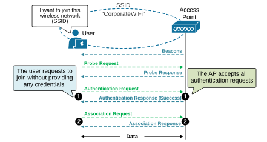
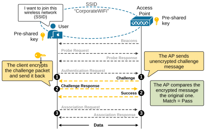
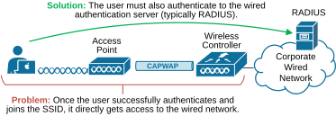
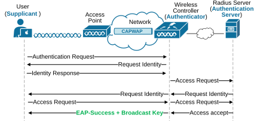
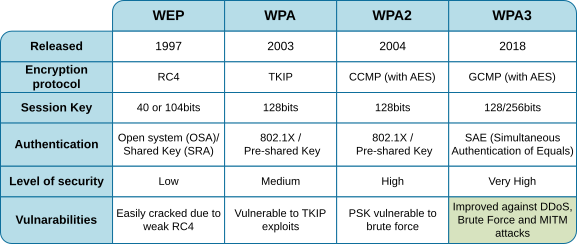

[Client Authentication Methods](https://www.networkacademy.io/ccna/wireless/client-authentication-methods)
==========

Wireless security can be tricky because it introduces **a lot of short acronyms and terms**. For example, this lesson covers the most common wireless client authentication methods and technologies. It includes terms like WEP, OSA, SKA, PSK, TKIP, EAP, WPA, WPA2, and WPA3. Without understanding each term, it is practically impossible to remember them all. However, when you understand the concept behind an acronym, you will easily remember it. 

## What is Authentication?

Authentication is the process of **verifying the identity of a device **before allowing it to connect to the network. It ensures that only authorized users and devices can access the network and its resources.

*Figure 1. Wireless authentication.*

Authentication is important because, unlike wired networks, wireless networks send data through the open air. This makes them more vulnerable to unauthorized access if there is no proper verification system in place.

## Authentication in the original 802.11

The original 802.11 Wi-FI standard (released back in 1997) defined two basic authentication methods: 

- Open System Authentication (OSA)
- Shared Key Authentication (SKA)

Let's examine each one and see where it fits in today's wireless authentication methods.

### Open System Authentication (OSA)

Open authentication allows unrestricted access to a wireless network. It basically means **no authentication is required**. Any device can connect. This is usually found in public Wi-Fi networks. The only step required is for the client to send an 802.11 authentication request before associating with an access point (step 1 in the diagram below). No password or credentials are needed.

*Figure 2. Open System Authentication (OSA).*

Open authentication is not secure because any client can connect** **without being challenged. This method is mostly used in public places with wireless hotspots. Sometimes, **open web authentication is added for basic screening**. In this case, clients can connect to the WLAN but must open a browser, accept the terms, and enter email before gaining full access.

You have likely seen open authentication when visiting public places like airports and shopping malls. Most operating systems warn users that open networks are not secure and that you should not access sensible information while connected to public Wi-Fi.

### Shared Key Authentication (SKA)

The Open System Authentication (OSA) method is basically a technique to force users to access the terms of service of a public SSID. It offers no protection against unauthorized access to the wireless network. 

To improve security, the 802.11 standard introduced the **Wireless Equivalent Privacy (WEP)**, which aimed to make wireless connections as secure as wired ones (hence the name).

WEP uses a static, shared key that must be manually configured on both the AP and the wireless client. Basically, the key (the password) must be shared with the user ahead of time (hence the name shared key). 

*Figure 3. Shared Key Authentication (SKA).*

The diagram above shows how Shared Key Authentication (SKA) works at a high level. Notice that both the client and the AP know the pre-shared key beforehand. It has been redistributed manually by users/admins.

- **Step 0: **After discovering the AP (via beacons and probes), the client sends an authentication request to join the network.
- **Step 1:** The access point responds with a challenge. The challenge message is unencrypted.
- **Step 2:** The client encrypts the message using the pre-shared key and transmits it wirelessly back to the AP.
- **Success:** The AP receives the challenge response, uses the same shared key, decrypts the message, and compares it to the original one. If both match, the AP grants access to the client.

Once the user is authenticated and joins the network, WEP uses the RC4 cipher to encrypt and decrypt data, preventing eavesdropping. Both sender and receiver use the same key, called a WEP key, to generate unique encryption keys for each data frame. As long as both devices have the same WEP key, they can encrypt and decrypt each other’s data.

### Why WEP is Insecure?

WEP keys can be 104 bits long. In theory, longer keys provide stronger encryption. However, WEP has known weaknesses. It was introduced in 1999 as part of the original 802.11 standard. By 2001, security flaws were discovered, and by 2004, **WEP was deprecated** when the improved 802.11i amendment was adopted.

Even though WEP is outdated and insecure, it remained in use for many years. This is because new security methods required new hardware, and organizations weren't willing to spend. As a result, WEP continued to be supported for **backward compatibility** and can still be found in some devices today. WEP worked well for a few years, but then several vulnerabilities and exploits appeared:

- Weak encryption algorithm (RC4).
- Predictable Initialization Vectors (IVs), making it easy for attackers to crack the key.
- Replay attacks and eavesdropping risks.

Because of these issues, WEP has been deprecated, and more secure authentication methods like WPA2 and WPA3 are recommended instead. In modern Cisco wireless networks, WEP is rarely used and is generally considered obsolete.

## 802.1x/EAP

The original 802.11 standard only offered open system authentication and WEP (shared key authentication), which were not very secure. **A better way to handle authentication was needed**. Client authentication usually involves a challenge, a response, and then a decision to allow or deny access. In the background, the process may also exchange encryption keys and other settings needed for the client to connect. 

The industry realized that the standard authentication methods have one major inefficiency - once a user authenticates successfully with the AP, it can directly access the wired network, as shown below.

*Figure 4. 802.1X-EAP Security Imrpovement.*

To address this, the Extensible Authentication Protocol (EAP) was introduced, adding an additional layer of security to the authentication process. EAP works with the IEEE 802.1x standard, which controls network access. When 802.1x is used, even if a client successfully authenticates to the wireless network, **it still cannot access the wired network** until it successfully authenticates with the wired authentication server (typically RADIUS).

The following diagram shows a very simplified example of 802.1x-EAP authentication. Notice that with 802.1x, there are three key roles as follows:

- **Supplicant **– The client device that asks for network access.
- **Authenticator **– A network device, like a wireless LAN controller (WLC), that manages access.
- **Authentication Server (AS)** – A server (usually a RADIUS server) that checks the client’s login details and allows or blocks access based on stored user data and policies.

*Figure 5. 802.1x EAP (simplified workflow).*

The diagram above is very simplified. The idea is not to dive deep into how the process works but to make sense of the bigger picture. The wireless controller and the Radius server work together to authenticate the user against the organization's user database. The WLC acts as a bridge between the client and the authentication server, using EAP to manage user authentication and access control.

## Wi-Fi Protected Access (WPA, WPA2, WPA3)

EAP introduced a great additional layer of security by incorporating 802.1x. Still, it did not include robust encryption by itself and had to rely on WEP (Wired Equivalent Privacy), which later proved to be insecure due to known vulnerabilities.

To address these security weaknesses, **the Wi-Fi Alliance introduced Wi-Fi Protected Access (WPA) in 2003**. The first version of WPA used a key management protocol called TKIP (Temporal Key Integrity Protocol). It relied on the weaker RC4 encryption algorithm and was quickly proven to be insecure.

In 2004, the Wi-Fi Alliance introduced WPA2 as the next generation of wireless security. WPA2 replaced TKIP with the stronger AES (Advanced Encryption Standard) using the CCMP algorithm for encryption. Like WPA, WPA2 supported 802.1x-EAP for enterprise-grade security while also offering a simpler "Personal Mode" using a pre-shared key (PSK) for smaller SOHO deployments.

The following diagram shows the timeline of the major Wireless security protocols. 

*Figure 6. WEP-WPA-WPA2-WPA3.*

It is important to understand that every Wi-Fi Protected Access (WPA) protocol offers two types of authentication:

- **Personal Mode**: Uses a pre-shared key (PSK) to authenticate clients.
- **Enterprise Mode**: Uses 802.1x and EAP-based authentication for better security.

The personal mode uses a shared password, which can be a single passphrase easily shared with users. **It is ideal for small deployments**. 

The enterprise mode relies on an organizational RADIUS server for authentication. **It is designed for large-scale organizations** that have a centralized sure database and to authenticate the clients against the user's DB.

We won't get into great detail about the WPA security protocols. They use complex encryption and session key algorithms that are outside of the scope of the CCNA exam. However, the following table compares each of the major WiFi security protocols and introduces the primary facts that you should remember.

*Figure 7. WPA vs. WPA2 vs. WPA3.*

You can see from the table that WPA3 is currently the most secure wireless protocol. However, keep in mind that wireless security isn’t a one-time task that is single-dimensional. Every organization must constantly follow the best practices like regular updates, enforcing strong passwords, and continuous monitoring. 

## Book traversal links for 8

Wireless Security Fundamentals
